# 用吉特拉小鱿鱼

> 原文：<https://www.freecodecamp.org/news/pulling-the-little-squid-with-git-bc074476433b/>

伊阿古·罗德里格斯

# 用 Git 拉小鱿鱼

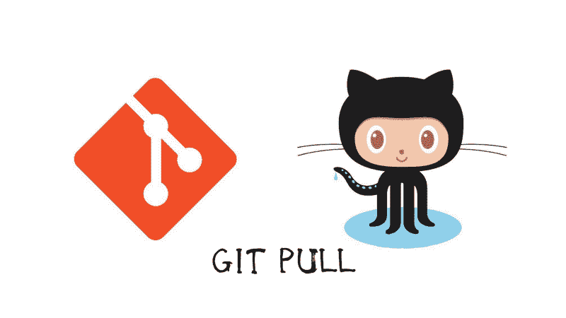

你曾经直接在你的项目库中改变过什么吗？有没有把一个分支合并成 master 的？然后想要将更改提取到您的本地存储库中，但遇到了一些问题？

如果你不知道“拉库”是什么意思，那你就来对地方了。想喝杯咖啡吗？

### 简短的介绍

在这篇文章中，我们将讨论在本地提交之前进行提交时可能发生的不同事件。

我所说的“在您的之前”，是指存在于您的远程存储库(GitHub 服务器上的那个)上的提交。这些提交不存在于您的本地存储库中(您机器上的存储库)。

所以，让我们来点热咖啡——我给过你一杯——让我们把这些事情搞清楚。

为了便于学习，让我们在 GitHub 上创建一个没有添加文件的存储库——我们将在后面介绍。你想叫它什么都可以。

现在，我们可以转到机器中的一个目录来克隆我们的项目。如果我们还没有创建一个目录作为我们的中心，我们可以创建一个，这样我们就可以从 GitHub 存储我们的项目。选择赔率或偶数来决定。

如果你不知道我在说什么，请查看这篇文章。

现在，让我们来看看当我们需要`git pull`时可能发生的事件。

### 当我们没有局部变化时拉动

那是最简单的情况。当我们创建了远程回购并添加了一些本地还没有的文件时，就会发生这种情况。我们在本地回购上也没有变化。

好的。首先，让我们转到克隆项目时创建的文件夹。它有相同的名字。

是时候在 GitHub 上创建一些文件了。在我们项目的页面上，创建一个自述文件。很简单！

在我们的电脑上，让我们打开 CMD 或任何终端应用程序(如 cmder ),输入`git pull origin master.`,你会看到神奇的事情发生了。

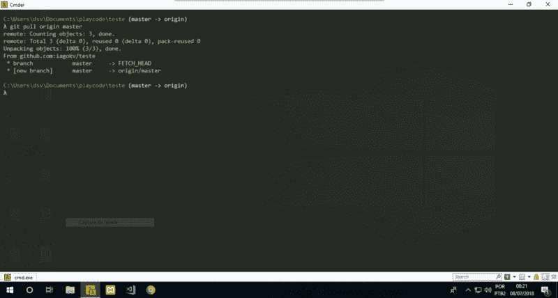

Pulling without local changes.

现在我们在本地也有这些变化。很酷，对吧？

### 当我们有尚未提交的本地更改时，进行拉取

太棒了。让我们创建一些文件。您可以在您喜欢的代码编辑器中打开本地项目文件夹。不过我推荐使用 [VSCode](https://code.visualstudio.com/) 。

这样，创建一个.`gitignore`文件并在其中添加一些东西。

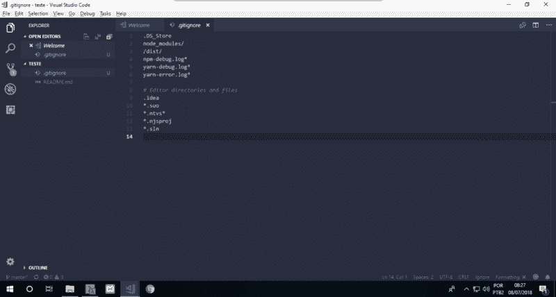

Creating a local .gitignore file.

现在我们有了局部更改，但是我们没有提交这些更改。我们还不打算这么做。

让我们前往我们的远程存储库。在那里创建另一个文件。它可以是 LICENSE.md。执行以下操作:


1.  在输入处输入许可证。
2.  点击**选择一个许可模板**。

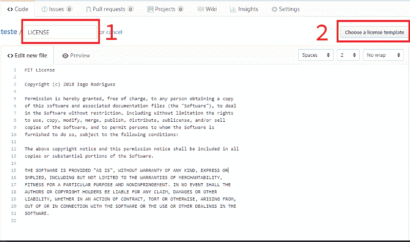

Creating a LICENSE file.

在下一页，选择**麻省理工学院许可证**，点击**审核并提交**。如果你愿意，请随意阅读许可证。

您的文件现在应该看起来像图片中的文件，当然，带有您的 GitHub 名称。

现在我们可以提交了。向下翻页，点击**提交新文件**。确保选择了第一个选项。

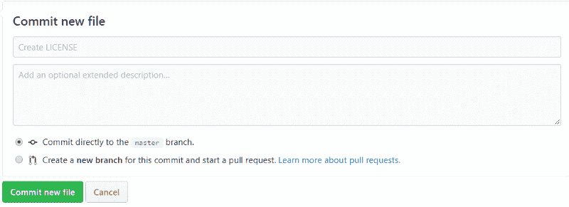

如果需要，您可以将栏留空(它使用占位符的相同文本)或键入其他内容。

到目前为止，我们在远程和本地都有所改变。但是，我们还没有提交我们的本地更改。让它保持原样。

让我们看看会发生什么变化？

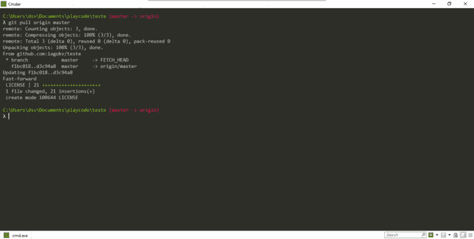

Pulling remote changes when we also have uncommitted local changes.

酷！我们可以顺利完成。这是因为我们更改了不同的文件。接下来，我们将看到当我们修改同一个文件时会发生什么。坚持住。

### 当我们有尚未推送的本地提交时进行拉取

好的。现在，让我们提交这些局部更改。如果你输入`git status`，你会看到我们有一个**未跟踪的**文件。这意味着我们没有添加文件，Git 也没有跟踪它。

因此，让我们添加并提交文件。暂时不要！

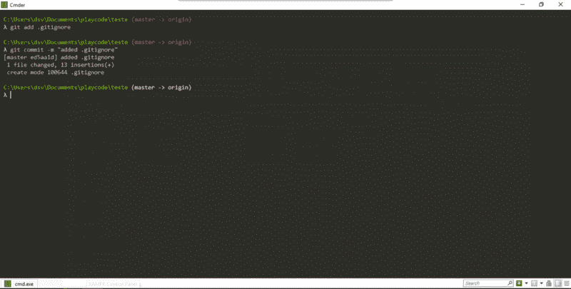

Committing local changes.

让我们向远程 repo 添加另一个更改，并提交它。它可能是一个`index.html`文件。

如果你输入`git status`，你会看到我们的本地和远程回购已经分化。它们都有一个不同的提交。

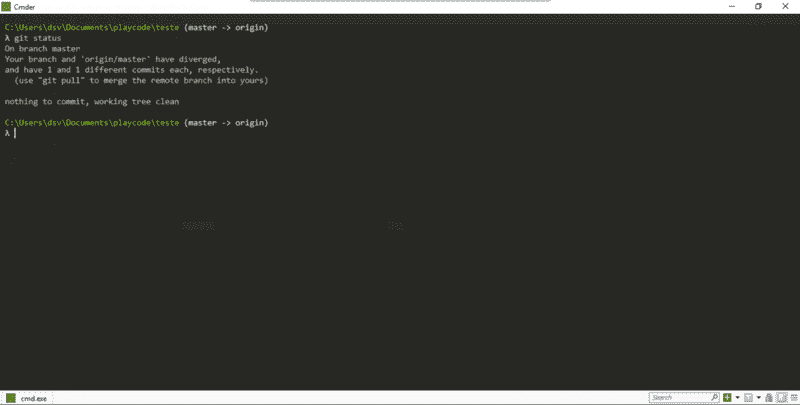

Diverged commits on both repos.

现在，让我们尝试进行这些更改，并查看状态。

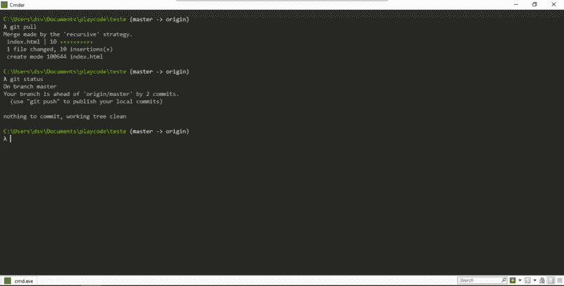

看那个！Git 递归地从远程存储库中提取变更，并将它们自动合并到我们的本地提交堆栈中。因此，我们也可以安全地以这种方式进行更改。

#### 如果我们对同一个文件进行了修改，那该怎么办？

很好。我们看到，当我们改变不同的文件时，我们可以使用`git pull`没有问题。

然而，当我们在两个存储库上更改同一个文件时会发生什么呢？

在我们继续之前，我们应该对之前所做的局部修改进行`git push origin master`。这样我们没有任何修改，和远程的是平等的。

我们现在可以修改一些东西。比方说，在本地修改自述文件并提交更改。先别着急。

转到远程自述文件，并对其进行修改。提交它。

我们和以前处于“相同”的情况，每一端都有一个不同的提交。

如果你试着`git pull`遥控，这就是我们看到的:

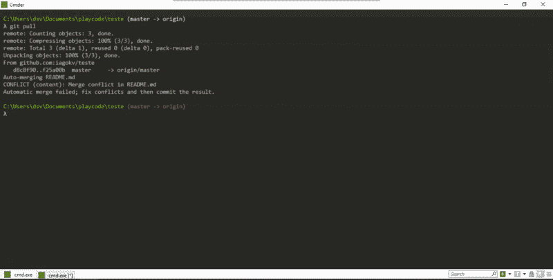

Pulling diverged commits on the same file.


Git 将尝试自动合并更改，但是由于我们对同一个文件有不同的更改，所以它会失败。

我们必须手动将远程提交合并到本地提交中，这样我们才能继续工作。

首先，我们必须解决文件中的冲突。如果您正在使用 VSCode，我们可以转到**源代码控制**选项卡并在那里处理它。

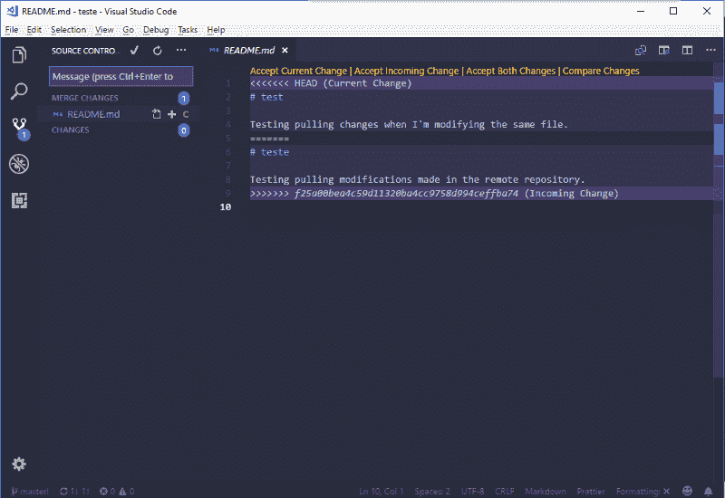

Handling conflicts on VScode

这里很简单。**接受当前更改**表示我们只接受远程更改。**接受引入的变更**意味着我们只接受我们的局部变更。我们也可以通过**接受两个变更**选项接受两个变更。

这样，我们就可以添加并提交文件了。如果我们现在检查状态，我们会发现我们比远程存储库提前了 2 次提交。这意味着我们成功地**合并了**文件。

我们现在可以推送它，并在 GitHub 上检查修改后的文件。

唷！呃？！这个给了我们一些工作。但这不是火箭科学，对吗？

赞美☀️my 的朋友孙。现在我们要去工作了。

### 如果我们已经有一个要发送到 GitHub 的项目和一个包含内容的远程 repo 呢？

好吧！这个问题很长。但这很重要。这是我们需要调查的另一种情况。

假设我们已经安装了一个带有一些代码的模板。开发世界中的[模板](https://github.com/vuejs-templates)是一套预制的代码，我们可以用它来启动我们的项目，并按照我们的方式塑造它。

所以，现在我们有了一个包含一些代码的目录，我们将`git init`这个文件夹，这样 Git 就可以开始监听我们的更改。

酷毙了。现在，我们想把这个项目发给 GitHub。很简单，对吧？只需要创建一个远程存储库。但是，假设我们创建了这个回购，并添加了一个自述文件、许可证、index.html 和一个. gitignore 文件。

嗯……我们没有注意到我们的模板已经把那些相同的文件放在了我们的本地存储库中。

所以如果我们试着拉，我们会遇到和以前一样的问题——两边不同的变化。

出于文章的考虑，假设我们无论如何都要进行这些更改。但是在我们处理这个之前，我们应该将我们的本地项目链接到 GitHub 上的项目。

运行下面的代码:`git remote add origin <github's project li` nk >

GitHub 的项目链接就是我们用来克隆资源库的链接。如果你不知道那是什么，请阅读[这篇文章](https://medium.freecodecamp.org/how-you-can-learn-git-and-github-while-youre-learning-to-code-7a592ea287ba?source=activity---post_recommended)。

好的。既然我们做到了这一点，我们可以开始拉和推一些东西。但是如果我们现在试图改变，你知道会发生什么，对吗？

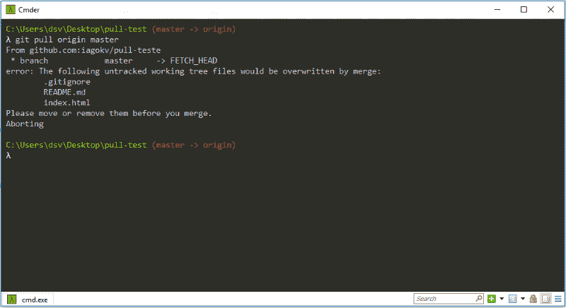

这很容易解决。只需添加并提交我们的本地更改。由于这是我们的第一次本地提交，我们可以这样做:

```
git add --allgit commit -m "first commit"
```

有了这个，我们可以试着再拉一次。请记住，我们应该使用`git pull origin master`,因为这是我们对这个存储库进行的第一次拉取。

我们应该得到以下消息:

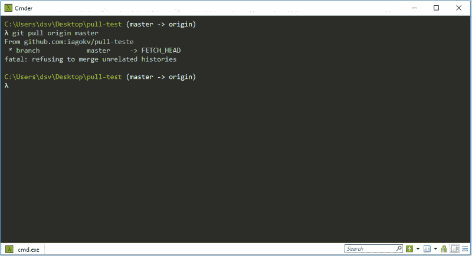

我们不能拉改变，因为 Git 不愿意。？？太好了！谢谢你，饭桶！！！？

为了解决这个问题，我们需要合并文件。但是我们有更有效的方法。运行代码`git rebase origin/master`。

我们收到以下消息:

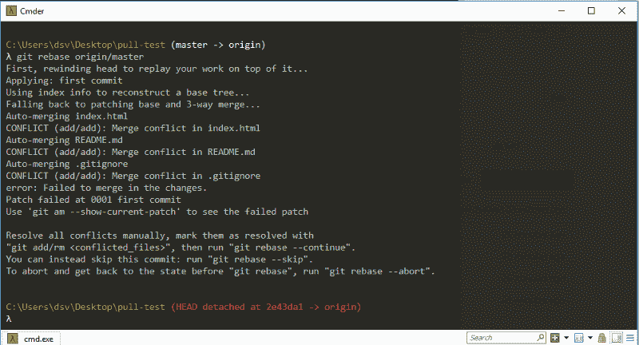

Running git rebase.

重置基础非常棒。这是比`git merge`更好的选择。它做同样的事情，但方式更好。你可以在这里找到更多关于它的[，但是不要太担心。在后面的文章中，我会解释这一点。](https://git-scm.com/book/pt-br/v1/Ramifica%C3%A7%C3%A3o-Branching-no-Git-Rebasing)

我们必须现在就解决冲突。我们可以使用 VSCode 来实现这一点。

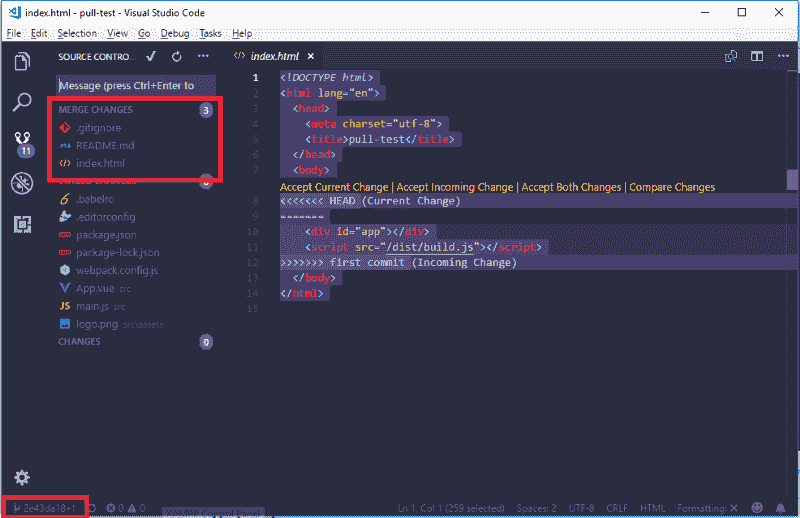

注意这里的一些事情。

首先，有冲突的文件是在**合并更改**选项卡下的文件。

第二，当我们运行`git rebase`时，它再次将我们所有的文件添加到暂存阶段——与我们在运行`git add`后所处的阶段相同——但是有冲突的文件。

第三，在 VSCode 的左下栏，我们可以看到一系列的数字。嗯， **git rebase** 创建了这个分支。不过，别担心。我们马上就会回到**主人**身上。

好的。既然我们已经解决了冲突，我们可以添加文件了。如果你想避免冲突，你可以删除文件，但我不认为这是解决这个问题的好方法。除非你不需要它们。

我们可以用这个命令添加多个文件:`git add .gitignore index.html README.md`。

之后，我们将使用本地提交来重置远程提交。我们可以用命令`git rebase --continue`来完成这个任务。

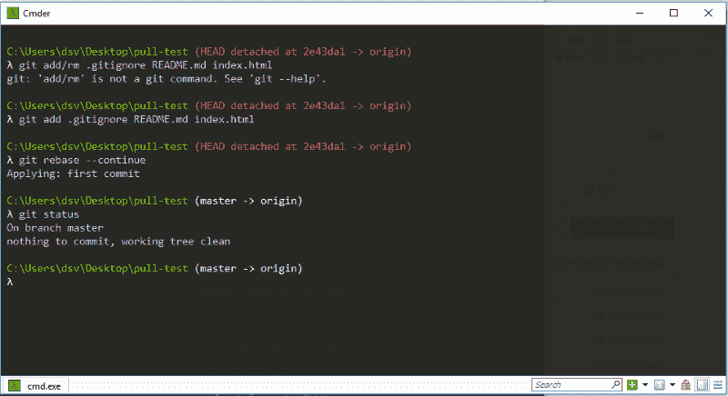

Adding the resolved conflicts and rebasing the commits.

现在，远程存储库上的所有提交都与我们的本地提交进行了合并或重组。我们也回到了主分支。

我们可以用`git log`来检查提交。

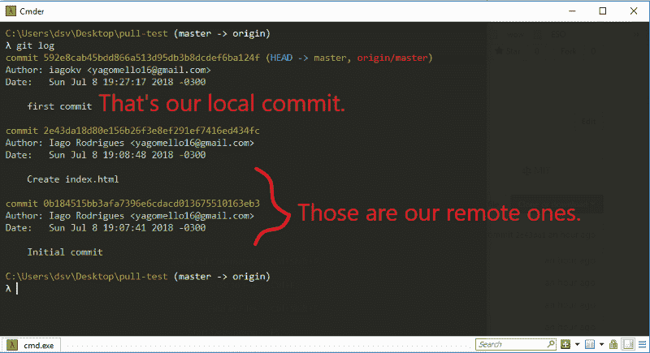

Checking the log with all the commits rebased.

很酷，对吧？这些是我们从 GitHub 上的远程存储库中提取变更时可能遇到的事件。

好了，就这样吧，伙计们。希望这篇文章对你有所帮助。

我计划为初学者写一系列关于 Git 和 GitHub 的文章。请继续关注更多内容。

下次见。和平！和平！✌️ ✌️ ✌️

我是 Iago Rodrigues，来自贝伦的巴西人。我是信息系统专业的学生，软件开发实习生，自由职业者。我正处于职业生涯的开端，只是想与你分享我获得的一些知识。

你可以在社交媒体上关注我。我很乐意尽我所能帮忙。

[**Iago Rodrigues-estágio Analista de Software-W3 Automa ao e Sistemas | LinkedIn**](https://www.linkedin.com/in/iago-rodrigues/)
[*在全球最大的职业社区 LinkedIn 上查看 Iago Rodrigues 的个人资料。伊阿古有 3 份工作列在他们的…*www.linkedin.com](https://www.linkedin.com/in/iago-rodrigues/)[**伊阿古罗德里格斯(@伊阿古科夫)|推特**](https://twitter.com/iagokv)
[*伊阿古罗德里格斯的最新推文(@伊阿古科夫)。前端开发者| Vue.js 学徒| Noob on life。巴西贝伦*twitter.com](https://twitter.com/iagokv)

耶！我知道。我的推特照片有点…