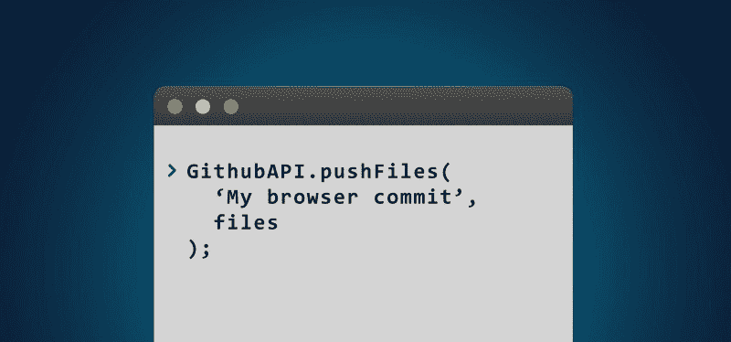
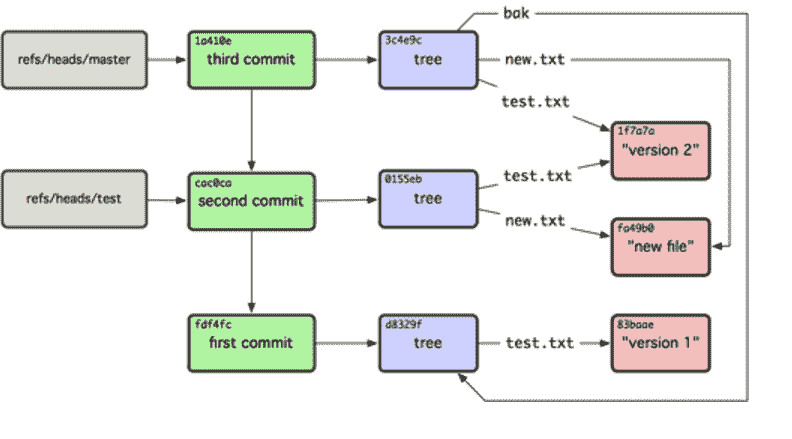

# 如何使用 GitHub.js 从浏览器直接将整个目录提交给 GitHub

> 原文：<https://www.freecodecamp.org/news/pushing-a-list-of-files-to-the-github-with-javascript-b724c8c09b66/>

伊利亚·科洛迪亚日尼

# 如何使用 GitHub.js 从浏览器直接将整个目录提交给 GitHub



你知道吗，你可以解析一个电影数据库网站，然后将它的数据存储在你自己的 GitHub 存储库中——甚至不用离开你的浏览器。

你还可以做一些事情，比如使用浏览器的开发工具更改网页，然后将更新后的代码连同所有图像和其他资源一起提交。

[GitHub 的 HTTP API](https://developer.github.com/v3/) 让你可以使用几乎所有的 GitHub 基础设施。在大多数情况下，它是透明的，易于掌握。但是有一件事乍看起来并不容易做到——同时提交大量文件，就像从终端运行`git push`一样。

但是不用担心。当您读完本文时，您将能够使用一组低级调用来实现这一点。

### 正在设置

您将实现一个函数，该函数将从文件中获取数据，并提交给 GitHub，如下所示:

```
pushFiles(    'Making a commit with my adorable files',    [        {content: 'You are a Wizard, Harry', path: 'harry.txt'},        {content: 'May the Force be with you', path: 'jedi.txt'}    ]);
```

不过，有一些重要的事情需要注意:

*   我将使用 [Github-JS](https://github.com/github-tools/github) 库来简化事情。这是一个方便的 API 调用包装器。
*   虽然只有一个函数来完成这项工作，但它会在幕后提出许多请求。这是由于 GitHub API 的构建方式——它必须对每个提交的文件发出至少一个请求，然后是几个额外的请求。
*   提交二进制文件(如图像)需要更多的设置。我在下面有一个专门的章节来介绍这一点。

### 成功的算法

看看 GitHub 存储库的内部结构:



Repository structure example ([source](https://developer.github.com/v3/git/))

下面简单解释一下这是如何工作的:每个分支的顶部指针指向一个特定的提交，它指向一棵树，它指向一个文件的版本。这些基本上是你应该关心的对象类型:*提交*、*树*和*斑点*(一个文件的内容)。

每个都包含一个名为 SHA 的哈希字符串，它实际上是对象的校验和哈希。因此对象使用这些 SHA 值指向彼此。

在 API 的 [Git 数据页面](https://developer.github.com/v3/git/)上，你可以找到算法的描述，以准确实现你的目标。但是下面是它的详细工作原理:

1.  检索当前最新的*提交*并记住其 SHA。稍后需要在旧的提交之上放置一个新的*提交*。
2.  检索当前*提交*的*树*，并记住它的 SHA。这将是创建新的*树*所需要的，以旧的为基础。
3.  为每个文件创建新的*斑点*，然后保存它们的 sha。
4.  创建一个新的*树*并传递关于它在步骤 3 中创建的*斑点*和在步骤 2 中检索的旧*树*的 SHA 的信息。这将在旧的*提交*和新的提交之间创建一个关系。
5.  使用以下内容创建新的*提交*:在步骤 1 中检索的旧*提交*的 SHA，在步骤 4 中创建的*树*的 SHA，以及新*提交*的提交消息。
6.  最后，更新分支的指针以指向新创建的*提交*。

除此之外，请注意还有一个认证步骤，GitHub 会在这个步骤中设置您想要推送的存储库和分支。

现在，您已经从概念上了解了这是如何工作的，让我们开始有趣的部分——用代码完成事情！

### 神圣的法典！

让我们保持简单，使用包装函数来存储功能。这公开了一个对 [Github API 包装库](https://github.com/github-tools/github)实例的引用，以及几个用于完成工作的函数:

```
function GithubAPI(auth) {    let repo;    let filesToCommit = [];    let currentBranch = {};    let newCommit = {};
```

```
 this.gh = new GitHub(auth);
```

```
 this.setRepo = function() {}    this.setBranch = function() {}    this.pushFiles = function() {}
```

```
 function getCurrentCommitSHA() {}    function getCurrentTreeSHA() {}    function createFiles() {}    function createFile() {}    function createTree() {}    function createCommit() {}    function updateHead() {}};
```

`setRepo()`只是将参数传递给底层库，并保存*存储库*对象:

```
this.setRepo = function(userName, repoName) {    repo = this.gh.getRepo(userName, repoName);}
```

`setBranch()`在逻辑上有点复杂:

```
this.setBranch = function(branchName) {    return repo.listBranches()        .then((branches) => {            let branchExists = branches.data                .find( branch => branch.name === branchName );            if (!branchExists) {                return repo.createBranch('master', branchName)                    .then(() => {                        currentBranch.name = branchName;                    });            } else {                currentBranch.name = branchName;            }        });}
```

在这里，您可以获得*库*的所有分支，并尝试找到您想要提交的分支。如果没有找到，则基于`master`创建新的分支。

当您使用`pushFiles()`函数时，它会经历我们上面讨论的所有步骤:

```
this.pushFiles = function(message, files) {    return getCurrentCommitSHA()        .then(getCurrentTreeSHA)        .then( () => createFiles(files) )        .then(createTree)        .then( () => createCommit(message) )        .then(updateHead)        .catch((e) => {            console.error(e);        });}
```

它使用了承诺链，因为每一步都会向 GitHub API 发出实际请求。

算法的第一步和第二步不是很有趣。它们只是调用 API 方法并保存当前*提交*和*树*的 sha:

```
function getCurrentCommitSHA() {    return repo.getRef('heads/' + currentBranch.name)        .then((ref) => {            currentBranch.commitSHA = ref.data.object.sha;        });}
```

```
function getCurrentTreeSHA() {    return repo.getCommit(currentBranch.commitSHA)        .then((commit) => {            currentBranch.treeSHA = commit.data.tree.sha;        });}
```

现在在第 3 步，您需要为每个文件创建 *Blob* 对象:

```
function createFiles(files) {    let promises = [];    let length = filesInfo.length;
```

```
 for (let i = 0; i < length; i++) {        promises.push(createFile(files[i]));    }
```

```
 return Promise.all(promises);}
```

```
function createFile(file) {    return repo.createBlob(file.content)        .then((blob) => {            filesToCommit.push({                sha: blob.data.sha,                path: fileInfo.path,                mode: '100644',                type: 'blob'            });        });}
```

这里需要注意两点:

1.  你需要等待所有的*斑点*被创建——因此有了`Promise.all`表达式
2.  文件模式必须设置为`100644`以指定一个简单文件。GitHub 允许[其他类型的](https://developer.github.com/v3/git/trees/#create-a-tree)，但是你在这里并不真正需要它们。

第 4 步和第 5 步是用文件(*斑点*)创建一个新的*树*，并用那个*树*创建一个*提交*:

```
function createTree() {    return repo.createTree(filesToCommit, currentBranch.treeSHA)        .then((tree) => {            newCommit.treeSHA = tree.data.sha;        });}
```

```
function createCommit(message) {    return repo.commit(currentBranch.commitSHA, newCommit.treeSHA, message)        .then((commit) => {            newCommit.sha = commit.data.sha;        });}
```

唯一剩下的事情是步骤 6——更新分支以指向新的*提交*:

```
function updateHead() {    return repo.updateHead(        'heads/' + currentBranch.name,        newCommit.sha    );}
```

就是这样！现在，您可以利用这一优势来推送您的文件:

```
let api = new GithubAPI({token: 'API_TOKEN'});api.setRepo('GITHUB_USER', 'REPOSITORY');api.setBranch('AWESOME_BRANCH')    .then( () => api.pushFiles(        'Making a commit with my adorable files',        [            {content: 'You are a Wizard, Harry', path: 'harry.txt'},            {content: 'May the Force be with you', path: 'jedi.txt'}        ])    )    .then(function() {        console.log('Files committed!');    });
```

您可以在这个[要点](https://gist.github.com/iktash/31ccc1d8582bd9dcb15ee468c7326f2d)中找到现成的最终实现。

### **二进制文件呢？**

不幸的是，在撰写本文时(2017 年 1 月)，这里内部使用的库无法向 GitHub 发送二进制数据。

我和他们一起创建了一个[问题](https://github.com/github-tools/github/issues/417)，试图解决这个问题。但是在这个问题解决之前，我们必须找到一个解决方法。

困境在于`createBlob()`函数，它应该用适当的请求结构发送 Base64 格式的内容。但是相反，库像处理普通字符串一样处理它。

因此，我想到的临时解决方法包括分叉库，并将[这一行](https://github.com/github-tools/github/blob/master/lib/Repository.js#L253)更改为以下内容:

```
if (typeof content === 'object') {    postBody = content;} else {    postBody = this._getContentObject(content);}
```

基本上，您会希望库允许您自己指定适当的对象。

使用这个经过调整的库版本，您现在可以通过以下方式推送二进制文件:

```
createBlob({content: base64Content, encoding: 'base64'})
```

其中`base64Content`是这样生成的:

```
let fileReader = new FileReader();fileReader.onload = function(e) {    let content = e.target.result;    //remove the header and leave only the Base64 content itself    base64Content = content.replace(/^(.+,)/, '');}fileReader.readAsDataURL(file);
```

我承认这很奇怪，但这可能是实现必要行为的最简单的方法。

### 现在前进并提交代码

GitHub 让你能够在几乎任何环境下流畅地使用他们的服务。我希望这篇文章有助于澄清一些与在使用 JavaScript 的浏览器中使用 GitHub API 相关的重要概念。

祝大家好运！请在评论中告诉我你对此的看法。