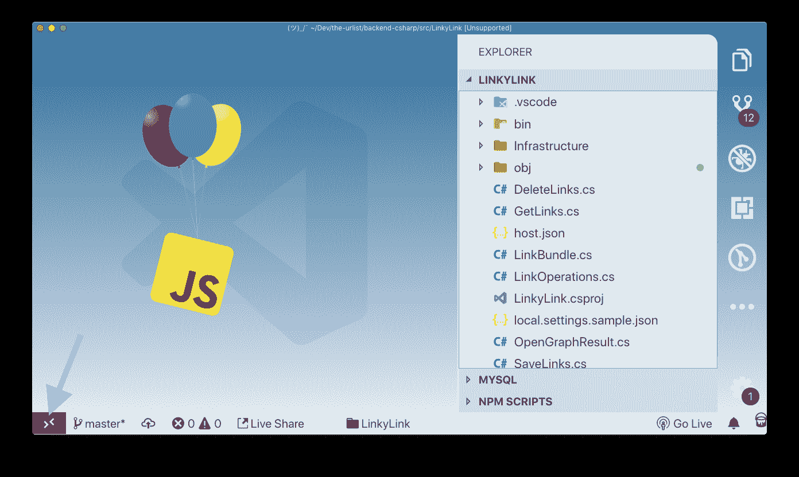
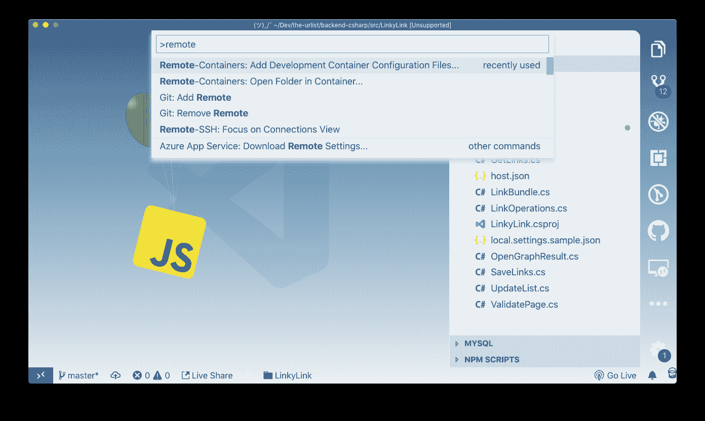
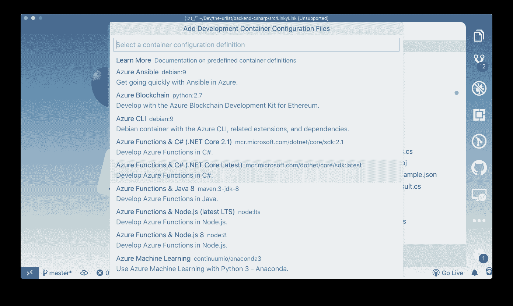
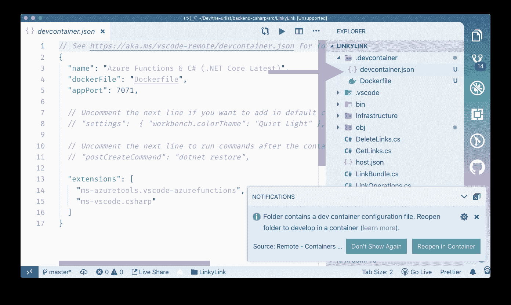
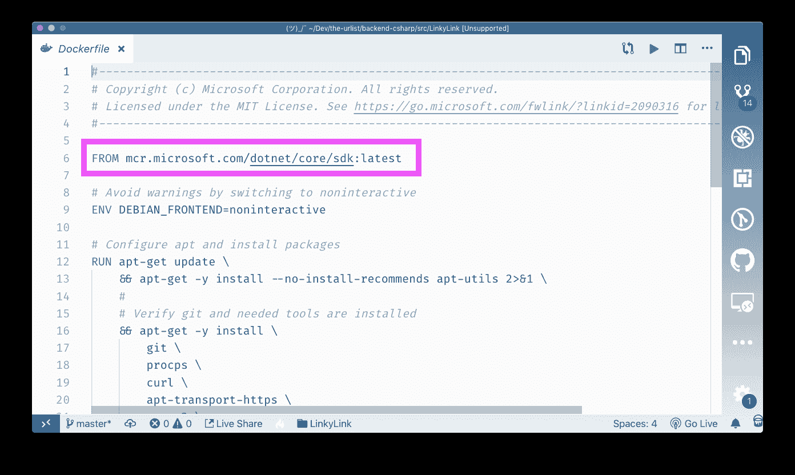
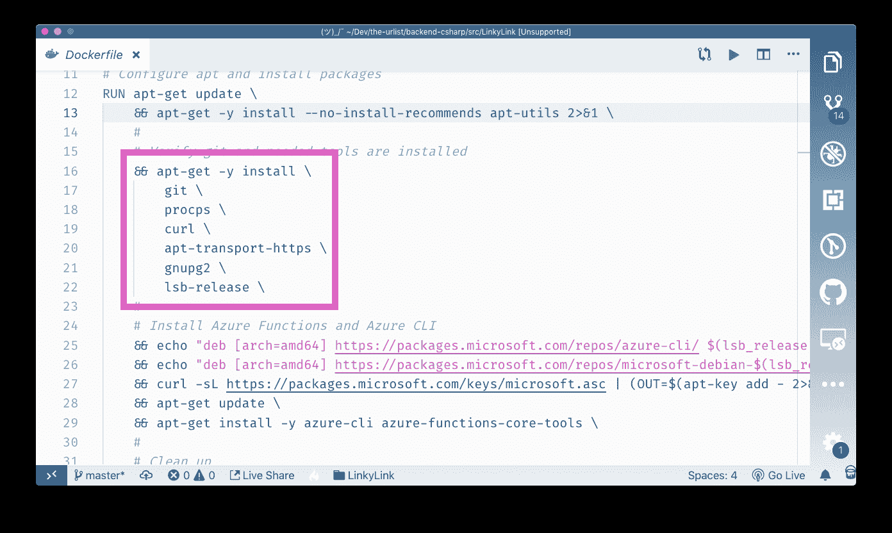
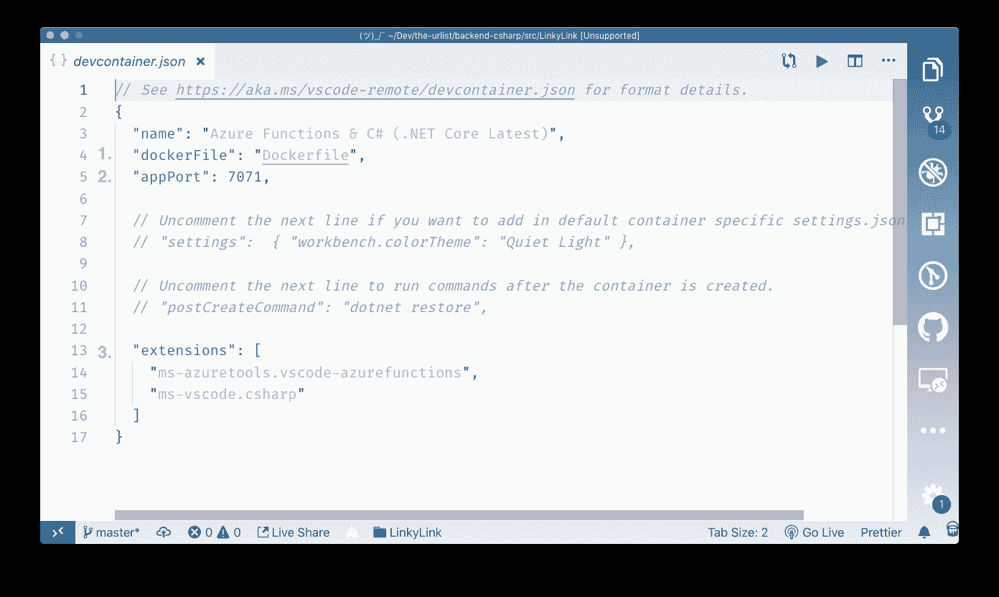
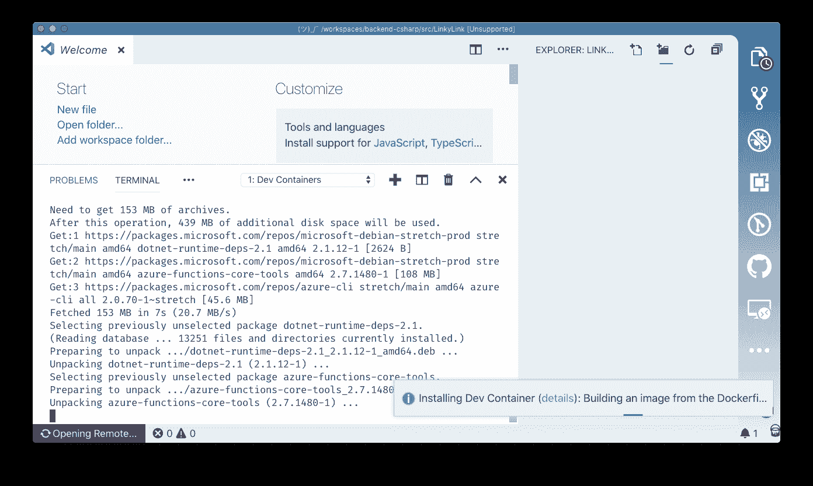
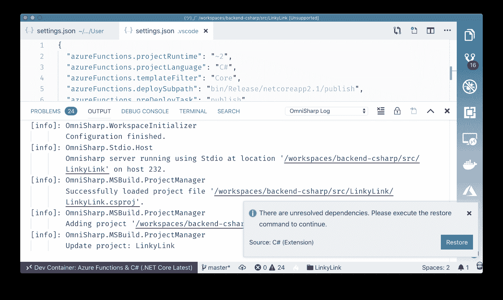
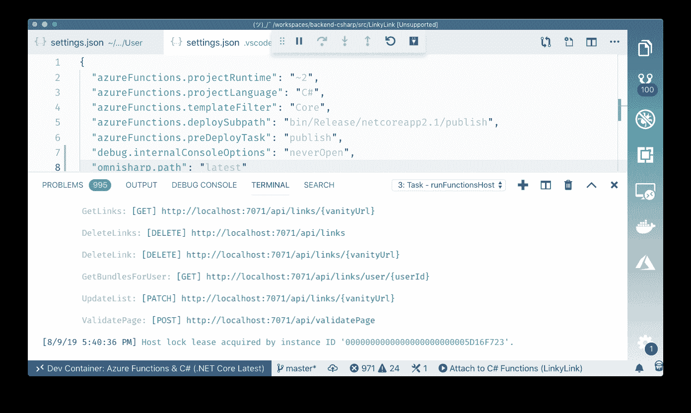

# 请大家将自己的整个开发环境放在 Github 中

> 原文：<https://www.freecodecamp.org/news/put-your-dev-env-in-github/>

如果这听起来很熟悉，请打断我...

你想开始一个新的框架/运行时。所以你安装了这个框架/运行时。

然后你打开终端....找不到命令。沉重的叹息。

您重新访问的文档表明您已经对您的个人资料设置进行了一些更改。你不知道该怎么做，所以你去了 StackOverflow，在那里你找到了一个来自“user92902399”的答案，这个答案*看起来*像是合法的(谁知道呢)，所以你把它复制并粘贴到你的终端上，希望它不会删除你的硬盘，并把你的互联网历史通过电子邮件发给总统。

现在运行时命令工作了。但是失败了。这个错误是神秘的。

回到谷歌。

这次在 StackOverflow 上没有明确的答案，尽管有几个人有类似的问题。你发现一个 Github 问题，看起来可能有关联。在一大群人中间的某个地方，他们在说“谢谢，这个有用！”以及“这个根本不行！”有人用了“Python”这个词。

你检查你的 Python 版本，果然，这个框架/运行时不支持你已经安装的版本。当你意识到上一次你查看 Python 安装的大致方向时，你花了一天时间让它再次工作，而你仍然不确定你是如何做到的，你正准备降级它。

你知道吗，这个新的框架/运行时可能没那么好。绝对不值得这么大费周章。哦看哪！一篇关于永远不要使用三元语句的博文。你以前在做什么？谁在乎。

离家太近了点？这就是尝试建立一个新项目、框架或运行时的感觉。每次都是。这也是为什么每个开发人员都曾在 Cheeto 中途茫然地抬头看着某人说，“它在我的机器上工作”。

## 适用于所有机器

根本问题在于，为了让代码工作，整个环境也必须正确配置。这是一个很难解决的问题。我们需要的是一种隔离开发环境的方法，然后将它与代码一起发布，以便它可以在所有机器上工作。我们需要在不发布整个操作系统的情况下做到这一点。

关键在于“隔离”二字。事实证明，我们确实有办法隔离和运输整个环境。它叫“码头工人”。您可以创建一个具有任何配置的容器，然后将其发送给其他任何人。您现在需要的是一种在该容器中开发的方法，就像它是您的本地机器一样。

你可以。

在本文中，我将向您展示如何使用几个配置文件来打包并交付您的整个开发环境，而不是您在 dubstep 中的糟糕体验。

这都要归功于 VS 代码的新[开发容器扩展。](https://marketplace.visualstudio.com/items?itemName=ms-vscode-remote.remote-containers&WT.mc_id=freecodecamp-blog-buhollan)

注意:Dev Containers 扩展以前被命名为 Remote-Containers。虽然下面的截图显示了旧的远程容器扩展名称，但是所有的指令都应该以同样的方式使用新的 Dev 容器名称。

## VS 代码和开发容器

[Dev Containers](https://marketplace.visualstudio.com/items?itemName=ms-vscode-remote.remote-containers&WT.mc_id=freecodecamp-blog-buhollan) 背后的基本概念是指定 Dockerfile，docker file 反过来指定所有必要的依赖项和配置步骤，以获得正确的开发环境设置。然后，VS 代码将启动该容器，在其中安装一个小服务器，然后连接回 VS 代码实例。这意味着您现在正在一个预先配置好的环境中进行开发。但对你来说，只是 VS 代码。

为了向您展示这是如何工作的，我将创建一个容器，在其中开发我参与的项目“theurlist.com”的后端 API。这个项目的后端是用 C#写的，运行在 [Azure Functions](https://code.visualstudio.com/tutorials/functions-extension/getting-started?WT.mc_id=freecodecamp-blog-buhollan) 上。为了在本地运行它，您必须安装[。NET 核心运行时](https://dotnet.microsoft.com/download?WT.mc_id=freecodecamp-blog-buhollan)、 [Azure 函数 CLI](https://github.com/Azure/azure-functions-core-tools) 和 [Azure 函数 VS 代码扩展](https://marketplace.visualstudio.com/items?itemName=ms-azuretools.vscode-azurefunctions&WT.mc_id=freecodecamp-blog-buhollan)。

第一步是安装[开发容器扩展](https://marketplace.visualstudio.com/items?itemName=ms-vscode-remote.remote-containers&WT.mc_id=freecodecamp-blog-buhollan)。这将在你的 VS 代码的左下角添加一个小图标。

你还需要安装 Docker。如果没有 Docker，Docker 容器不会运行得很好。你可以在这里下载社区版[。](https://docs.docker.com/install/)

安装了扩展之后，我需要向这个项目添加适当的配置文件。即“Dockerfile ”,它指定项目将被加载到的容器。该扩展附带了一系列预配置的环境。要添加一个到项目中，打开命令面板并选择“开发容器:添加开发容器配置文件”

这个项目使用 Azure 函数和 C#，所以我将选择那个容器定义。

我一这么做，VS 代码就要加一个“.”。deployment”文件夹，其中包含“Dockerfile”和一个“devcontainer.json”文件。它还会立即询问我是否要在容器中重新打开项目。我会说不，让 VS 代码冷静一会儿，我们看看这些文件。

首先让我们看看“Dockerfile”文件。文件文件文件。

### Dockerfile 文件配置

“Dockerfile”指定容器中会有什么。如果我打开它，你可以看到里面有很多。有点冗长。但是我们可以解析出重要的部分。

它做的第一件事是拉入最新版本的。NET Core SDK。

然后，它在容器中安装一些实用程序。具体来说，它安装...

*   源代码管理
*   过程检验实用程序
*   curl (HTTP 实用程序)
*   apt-transport-https (HTTPS 实用程序)
*   gnupg2(一种加密工具)
*   lsb-release(打印特定的 Linux 信息)

所有这些都是为了创建一个环境，它拥有开发人员运行这个项目可能需要的所有模糊工具，并且能够将其签入和签出源代码控制。

然后安装 Azure Functions 核心工具。它在安装之前配置所有必需的存储库位置。这些都是开发人员在运行这个项目之前必须自己做的事情。

”中的另一个文件。devcontainer”文件夹是“devcontainer.json”文件。

### devcontainer.json 文件

该文件为远程开发环境指定了一些附加设置。明确地....

1.  它指定应该使用“Dockerfile”来构建容器

2.它确保端口“7071”是从容器转发的，因此可以在“localhost:7071”访问它。这是 Azure Functions 在本地运行的端口。

3.它指定了应该安装在容器中的任何扩展。因为您并没有真正在本地使用 VS 代码，所以您的扩展并不是自动安装的。在这个文件中指定它们可以确保项目打开时它们在那里。

这样，我们可以打开命令面板并选择“开发容器:在容器中重新打开文件夹”。

VS 代码将重新加载并开始为这个项目构建容器。

第一次这样做时，需要一两分钟，因为必须提取和构建基础映像。第一次加载完成后，后续加载会快得多，因为映像已经存在于您的机器上。

在这个项目中，一旦构建了容器，VS 代码就开始恢复 C#依赖项，这是通过包含在“devcontainer.json”配置文件中的 C#扩展完成的。

当一切完成后，我只需按 F5 就可以运行这个项目。就这样，应用程序启动并运行。

想一想，要在本地安装这个系统，我们需要做些什么...

1.  安装。网络核心
2.  安装功能核心工具
3.  安装 VS 代码功能扩展
4.  安装 VS 代码 C#扩展

使用 Dev 容器，这些都不是必需的。我们可以在两个文本文件中配置和发布整个开发环境。

### 请将您的开发环境放在 Github 中

所以我有一个小小的请求:与其在 Github 自述文件中列出配置项目运行的 15 个步骤，**不如将整个开发环境放在 Github** 中。这意味着检查”。devcontainers”文件夹。如果使用您的项目的开发人员没有 VS 代码或 Dev Containers 扩展，什么都不会发生。你不会输的。

我很兴奋，因为我觉得配置地狱的日子即将结束。此外，想想我们将从关于三元语句的教条文章中拯救的所有人。

### 关于容器开发的更多信息

*   [在容器内显影](https://code.visualstudio.com/docs/remote/containers?WT.mc_id=freecodecamp-blog-buhollan)
*   [VS 代码开发容器扩展](https://marketplace.visualstudio.com/items?itemName=ms-vscode-remote.remote-containers&WT.mc_id=freecodecamp-blog-buhollan)
*   [高级容器配置](https://code.visualstudio.com/docs/remote/containers-advanced?WT.mc_id=freecodecamp-blog-buhollan)