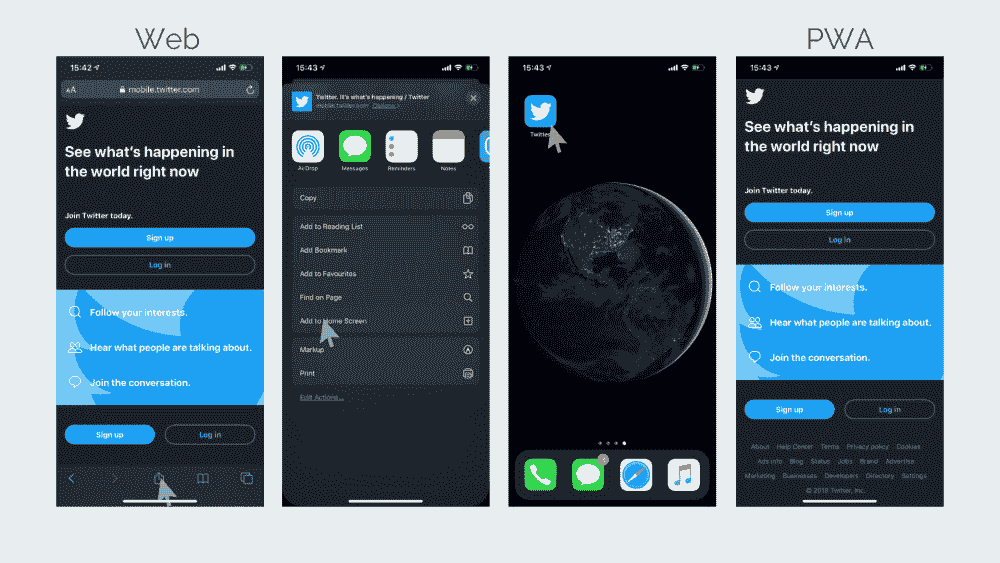

# 渐进式网络应用与加速移动页面:有什么区别，哪个最适合你？

> 原文：<https://www.freecodecamp.org/news/pwa-vs-amp-what-is-the-difference-and-how-do-you-choose/>

你知道什么是 pwa 和 AMPs 吗，哪个对你更好？让我们来看看，找出答案。

如今很多人都拥有智能手机。这为商业带来了无限的机会——然而，这些机会立即受到移动软件市场上众多竞争者的挑战。

手机应用肯定比网络或桌面平台更方便。然而，它们并不是该行业提供的最舒适的选择。

为了达到最高水平的用户满意度并超越竞争对手，有创造力的人会选择渐进式网络应用(PWAs)或加速移动页面(AMPs)。

这些东西是什么，你应该如何选择最佳选项？让我们通过这些简单的问题来逐一考虑每一个问题:

1.  什么是 PWA？
2.  什么是放大器？
3.  它们有什么相似之处？
4.  它们有什么不同？
5.  为什么 PWAs 比网页更好
6.  为什么 pwa 比原生手机更好
7.  为什么 AMPs 比网页好
8.  为什么 AMPs 不比原生移动好

## 1.什么是 PWA？

渐进式网络应用程序(PWA)将网络和移动应用程序的优势结合到一个软件产品中。正如谷歌 宣称的那样，pwa 是“具有网络影响力的用户体验，可靠、快速、吸引人”。这是一种让你像使用本地应用程序一样使用网站的技术。

[Twitter](https://twitter.com/?lang=en) 是使用 PWAs 的主要公司之一。要安装该应用程序，你需要在手机上打开网页版，并将其添加到主屏幕上。当你从主屏幕图标打开 Twitter 时，你将打开一个渐进式网络应用程序。

### 基本原则

PWAs 是一种高度响应且易于共享的解决方案，可以脱机工作。他们将 HTML 和 CSS 文件存储在浏览器缓存中，并与服务人员一起存档。这使得离线使用网页成为可能。服务工作者是 PWA 的三个基本组成部分之一，另外两个是清单文件和安全协议 HTTPS。

**服务工作者**是 JavaScript 代码组件，在网络和浏览器之间扮演代理的角色。

当您第一次打开网页时，服务人员会将必要的数据存储在浏览器缓存中。当您第二次打开它时，服务人员甚至在应用程序检查网络可用性之前就从缓存中检索这些数据。

它们不仅提供了离线工作的能力，而且大大提高了响应时间。服务人员还管理推送通知。

**清单文件**是一个 JSON 文件，包含你的应用程序的所有信息。例如，它包含关于 PWA 的主屏幕图标、它的简称、调色板或主题的数据。

如果您在 Android 手机上使用 Chrome 浏览器，清单文件将触发 PWA 自动安装到您的手机上。

如果你开发一个渐进式网络应用程序，安全的 HTTPS 协议是绝对必要的。虽然服务人员使 PWA 的概念成为可能，但他们容易受到网络错误或破坏的影响。服务人员可以拦截网络请求并修改响应。为了保证数据安全和网络安全，需要使用安全协议。

### 成功案例

Twitter 并不是唯一受益于 PWAs 的公司。看看谷歌发布的这些[案例研究](https://developers.google.com/web/showcase/)，看看这项技术如何帮助受欢迎的企业取得成功。这些公司中有 [Pinterest](https://www.pinterest.com/) 、[阿里巴巴](https://www.alibaba.com/)、[天气频道](https://weather.com/)、[兰蔻](https://www.lancome.com/)和[家得宝。](https://www.homedepot.com/)

## 2.什么是放大器？

AMP 代表加速移动页面。这是一个手机友好的网页，被设计成即时加载。这是一个快速和平稳加载的解决方案，开发时考虑了用户体验。AMP 技术作为开源项目推出，于 2016 年 2 月由谷歌整合。

2016 年，[《卫报》宣布](https://www.theguardian.com/membership/2016/feb/24/todays-release-of-accelerated-mobile-pages-amp)他们的平台现在可以作为放大器使用。为了帮助读者了解它是如何工作的，他们展示了同一篇文章，分别是[的网页版](https://www.theguardian.com/us-news/commentisfree/2016/feb/16/thomas-piketty-bernie-sanders-us-election-2016)和[的放大版](https://amp.theguardian.com/us-news/commentisfree/2016/feb/16/thomas-piketty-bernie-sanders-us-election-2016)。

有一些差异，但它们是微不足道的。但是你马上会注意到 AMP 文章的加载速度比普通的网络文章要快得多。

*By comparing this illustration with the one I included earlier, you could notice an interesting point. A PWA needs to be installed. In turn, you do not need to install AMP. It is accessed via a different like.

### 基本原则

AMPs 的想法是减少不必要的内容和功能，以便应用程序立即显示重要的内容。数据可以减少到原来的十分之一。AMPs 的三个基本组件是 AMP HTML、AMP 组件和 AMP 缓存。

**AMP HTML** 是普通 HTML 的简化版。AMP HTML 不允许 HTML 的某些标签和元素(例如表单)。为了更好地理解 AMP HTML 应该是什么样子，查看一下[要求的标记](https://amp.dev/documentation/guides-and-tutorials/start/create/basic_markup/?referrer=ampproject.org)。

**AMP 组件**是脚本，使您无需 JavaScript 就能完成任务。AMP 的想法是去掉所有的 JavaScript 脚本，使页面加载更慢。

但这并不意味着你的页面应该没有动画、修改过的布局、分析数据、自动完成建议或广告。有一个扩展的[组件库](https://amp.dev/documentation/components/?referrer=ampproject.org)，使你能够实现这些和许多其他特性。

**AMP 缓存**是一个基于代理的内容交付网络，用于获取和缓存页面内容。AMP Cache 使您作为应用程序所有者能够轻松引入页面更新。它可以优化放大器，并在需要时修改放大器。

### 成功案例

与 pwa 一样，公司通常对 AMPs 提供的业务优势感到非常自豪。这里收集了使用 AMPs 并从中受益的公司的成功案例和案例研究。[RCS media group](http://www.rcsmediagroup.it/)[美国消费者新闻与商业频道](https://www.cnbc.com/)[华盛顿邮报](https://www.washingtonpost.com/) 都是已经实施或计划实施 AMPs 的公司。

## 3.pwa 和 amp 有何相似之处？

PWAs 和 AMPs 都是在移动设备上显示网页的方法。它们都是为了增强用户体验而创建的。

AMPs 和 pwa 都有助于减少页面加载时间。虽然就加载速度而言，AMPs 可能比 PWA 更有效，但 AMP 和 PWA 加载时间之间的差异几乎不明显。

这两项技术都得到谷歌的积极支持。在谷歌开发者上有一个 PWA 页面，在谷歌开发者上也有一个 AMP 页面。

其他的相似之处并不多，但是这种主要的相似之处是必不可少的。

现在让我们看看有什么不同。

## 4.pwa 和 amp 有什么不同？

### 出现

通过使用 PWA，你不会觉得你在使用一个网页。PWAs 的外观和感觉就像一个移动应用程序。

通过使用 AMPs，你很清楚你正在使用一个网页，因为它看起来是一样的。

### 发展

在 PWAs 的情况下，应用程序代码要么从头开始编写，要么使用现有代码的某些部分编写。

在 AMPs 的情况下，网页的现有代码被去除了不必要的 CSS 和 JS，以便网页加载更快。

### 用户体验

PWAs 提供了更好的用户体验。它们有推送通知，一个主屏幕图标，没有浏览器标签。此外，它们比普通的移动应用程序更容易下载，体积也更小。pwa 加载速度比普通网页版快，因为它们嵌入了 App Shell。当网络连接中断时，可以使用 PWAs。

AMPs 稍微改善了用户体验，因为页面加载速度比普通页面快。然而，这是他们提供的唯一的 UX 优势。与 pwa 不同，amp 不能离线工作。

### 表演

从搜索引擎优化的角度来看，AMP 赢得了竞争。谷歌青睐这些页面，并将其列在热门故事的传送带中，这可以提高你的点击率。

反过来，PWAs 对 SEO 没有直接优势。然而，更好的用户体验转化为更高的留存率，这有助于你赢得搜索引擎优化。

### 支持

并非所有设备都同等支持 pwa，因此当它们显示在 iOS 上时，您可能会发现一些不便。此外，它们不支持所有硬件功能，如蓝牙、NFC、GPS 或加速度计。

所有设备上的所有主流浏览器都支持 AMPs。

### 他们最适合的应用程序

PWAs 非常适合需要用户交互的应用。电子商务网站、社交媒体或在线学习平台的应用程序需要快速响应并不断更新，可以利用这项技术。例如，这就是 Twitter 使用 PWA 的原因。

AMPs 更适合有内容墙的平台，比如在线杂志或者报纸。AMPs 即时加载内容，但互动机会有限。这就是《卫报》决定使用 AMPs 的原因。

## 5.为什么 PWAs 比网页更好

如果你在手机上访问网页，你将不得不面对浏览器标签、缓慢的加载时间和烦人的弹出窗口。如果你的设备屏幕相对较小或者网络连接速度较慢，在上面上网就会变得难以忍受。

这个问题被进步的网络应用解决了。只需点击几下，你就可以在手机上安装应用程序，并开始使用它。无需键入链接，没有浏览器标签，也没有弹出屏幕。这款应用运行速度很快，即使在网络连接中断的情况下也能正常工作。

好吧，这种解决方案的好处是显而易见的，但似乎原生移动应用程序可以替代完美的工作。不，他们不会。让我们看看为什么 PWAs 比原生移动应用更好。

## 6.为什么 pwa 比原生移动应用更好

要使用原生移动应用，你必须在 App Store 或 Google Play 目录中找到它。然后，你要等一段时间才能下载。您的设备上可能没有足够的可用空间，因此您需要找到一些空间。

接下来，pwa 在几秒钟内安装完毕并准备就绪。文件很小(尽管在您使用应用程序并进行缓存时，它肯定会增加)。不过，缓存数据的大小取决于设备上的可用存储量。

如你所见，PWAs 似乎比 web 或原生移动应用更好。但是你要明白，这个解决方案并不是万能的。查看我最近的一篇关于 [PWA vs Native](https://keenethics.com/blog/progressive-web-apps-vs-native-which-to-choose-and-when) 的文章，了解什么时候本地应用比 PWA 更好。

## 7.为什么 AMPs 比网页好

如上所述，网络应用程序速度慢且不方便，尤其是在屏幕尺寸小或硬件不足的移动设备上访问时。

通过去除所有对良好用户体验不必要的 web 组件，加速移动页面解决了这个问题。AMPs 的运行速度比普通网页快 4 倍，使用的数据少 10 倍。

## 8.为什么 AMPs 不比原生移动好

不幸的是，AMPs 不能完全替代本地移动应用。它们不能安装在主屏幕上，它们仍然包括浏览器标签，它们的功能仅限于一些基本的东西。

但对于一份在线报纸或一个信息网站，如 [WebMD](https://www.webmd.com/) ，最好使用 AMPs，而不是原生移动应用程序。这些不需要任何额外的功能来显示页面内容。

## 总结

AMPs 和 pwa 都是强大的技术。总结我们最初问题的结果- PWAs 与 AMPs:

*   AMPs 将更容易、更快、更便宜地供您开发
*   PWA 将提供更多的好处。

请记住，它们都不是万能的解决方案，也不是万灵药。即使同时使用 amp 和 pwa 也可能无法满足您的所有需求。有时你可能需要选择更传统类型的软件。

如果你还不确定选择什么，我们的专家分享 [四个问题来了解你是否需要 PWA](https://www.freecodecamp.org/news/four-questions-to-understand-if-you-need-pwa/) 。简而言之: **我们相信进步的网络应用是未来。加速移动网页太简单，功能有限，无法与之竞争。**

## 你对一个项目有想法吗？

我的公司 KeenEthics 在 AMP 和[渐进式 web 应用程序开发](https://keenethics.com/tech-apps-progressive-web-apps)方面经验丰富。如果你准备好改变游戏，开始你的项目，请随时[联系](https://keenethics.com/contacts)********。********

## 附言

发布在 KeenEthics 博客上的文章原文可以在这里找到: [PWA vs AMP:有什么区别，你如何选择？](https://keenethics.com/blog/pwa-vs-amp)