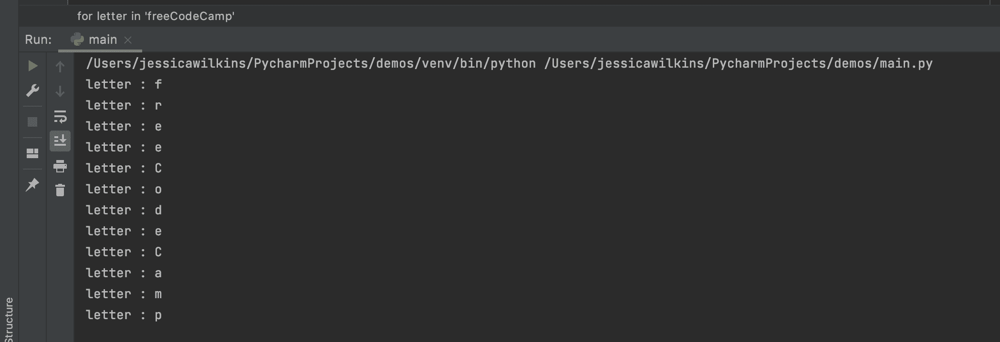
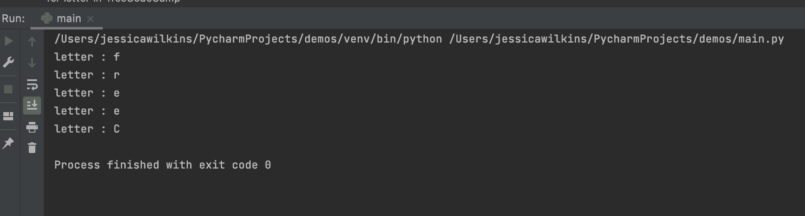
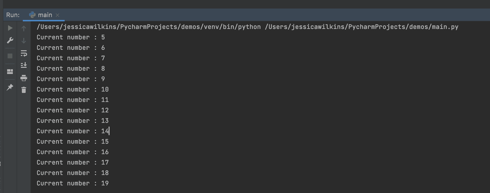
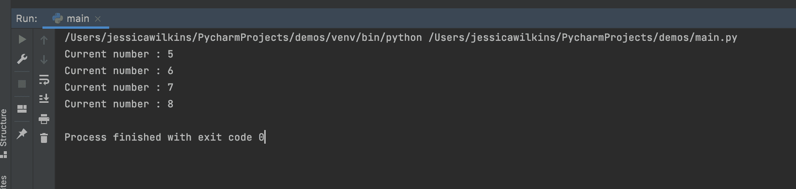
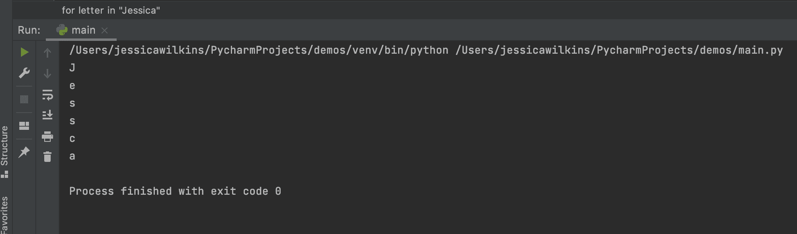
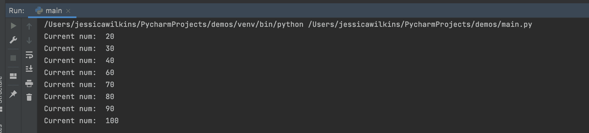

# Python Break 和 Python Continue–如何跳到下一个函数

> 原文：<https://www.freecodecamp.org/news/python-break-and-python-continue-how-to-skip-to-the-next-function/>

如果你需要跳过当前循环的一部分或者完全跳出循环，那么你可以使用`break`和`continue`语句。

在本文中，我将介绍如何在 Python 代码中使用`break`和`continue`语句。

## 如何在 Python 中使用 break 语句

如果你需要跳出一个`for`或者`while`循环，进入下一段代码，你可以使用`break`语句。

在第一个例子中，我们有一个 for 循环，它遍历 freeCodeCamp 的每个字母。

```
for letter in 'freeCodeCamp':
    print('letter :', letter)
```

这是打印到控制台的内容:



如果我们想在字母“o”处停止循环，那么我们可以使用一个`if`语句，后跟一个`break`语句。

```
for letter in 'freeCodeCamp':
    if letter == "o":
        break
    print('letter :', letter)
```

这是打印到控制台的内容:



在下一个例子中，只要`num`小于 20，我们就使用一个`while`循环来增加`num`。

```
num = 5
while num < 20:
    print('Current number :', num)
    num = num + 1
```

这是打印到控制台的内容:



我们可以在我们的`while`循环中添加一个条件，如果`num`是 9，那么就退出循环。

```
num = 5
while num < 20:
    print('Current number :', num)
    num = num + 1
    if num == 9:
        break
```

这是打印到控制台的内容:



## 如何在 Python 中使用 continue 语句

如果需要跳过`for`或`while`循环的当前迭代并进入下一次迭代，可以使用`continue`语句。

在这个例子中，我们循环了一串我的名字。

```
for letter in "Jessica":
```

在`for`循环中，我们有一个条件，如果字母是“I ”,那么跳过这个迭代，进入下一个迭代。

```
 if letter == "i":
        continue
```

这是所有代码的外观:

```
for letter in "Jessica":
    if letter == "i":
        continue
    print(letter)
```

这是打印到控制台的内容:



您应该注意到字母“I”没有被打印到控制台，并且`continue`语句跳过了那个迭代。

在下一个例子中，我们将使用一个`while`循环以 10 为增量打印数字。我们将在循环中添加一个条件，如果数字为 50，则跳过该迭代，进入下一个迭代。

```
num = 10
while num < 100:
    num = num + 10
    if num == 50:
        continue
    print("Current num: ", num)
```

这是打印到控制台的内容:



正如您所看到的，数字 50 没有被打印到控制台，因为在`if`语句中有`continue`语句。

## 结论

Python 中的`break`和`continue`语句用于跳过当前循环的部分或者完全跳出循环。

如果你需要跳出一个`for`或`while`循环并进入下一段代码，可以使用`break`语句。

如果您需要跳过`for`或`while`循环的当前迭代并进入下一个迭代，可以使用`continue`语句。

我希望您喜欢这篇文章，并祝您的 Python 之旅好运。