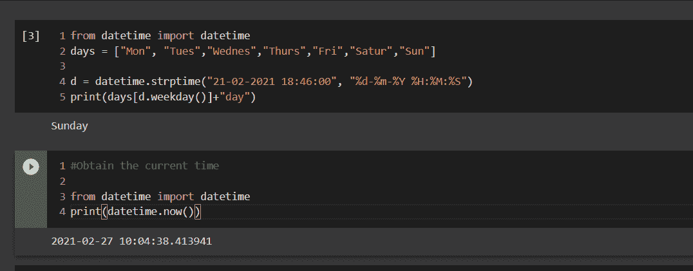
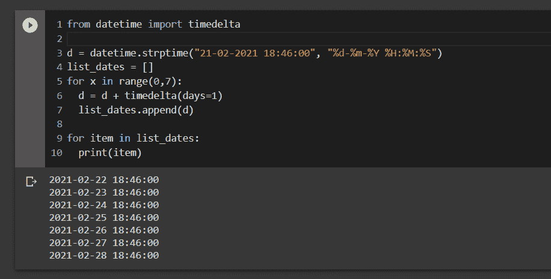
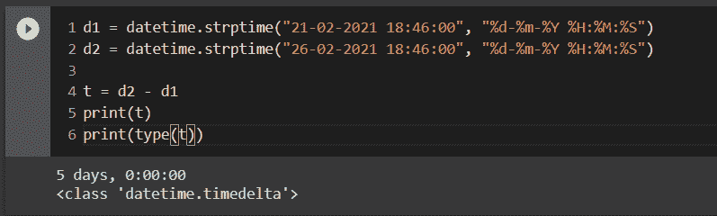
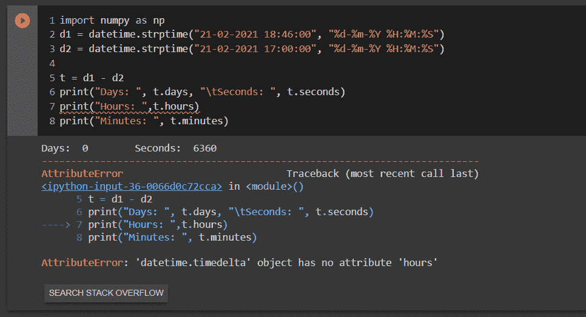
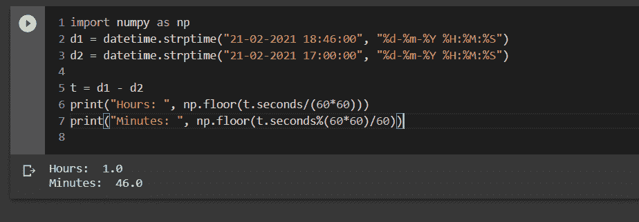
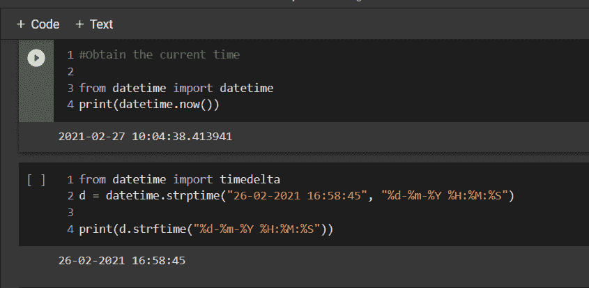

# Python 的日期时间模块——如何在 Python 中处理日期

> 原文：<https://www.freecodecamp.org/news/python-datetime-module/>

在 Python 的`datetime`模块的快速指南中，您将学习如何解析日期、从日期中提取有意义的信息、处理`timedelta`对象等等。

所以事不宜迟，让我们开始用 Python 计算时间吧！

大多数编程语言都提供了方便处理日期的库。Python 提供了强大的`datetime`模块，它有许多函数和清晰的文档，使得解析日期变得容易。

本文列出了这个模块中一些最重要的函数，如何将它应用到现实世界中，以及使用它时需要注意的一些技巧。

## 如何使用`strptime()`将时间戳转换为`datetime`对象

日期可以给我们很多信息，比如月、年、日、工作日以及是否是假日。`strptime()`将一个字符串形式的时间戳转换成一个`datetime`对象，这给了我们很多额外的功能。这个函数需要一个字符串和时间戳的格式。

```
from datetime import datetime

d = datetime.strptime("21-02-2021 18:46:00", "%d-%m-%Y %H:%M:%S")
```

使用指定的格式将字符串 21-02-2021 18:46:00 转换为合适的`datetime`。一些最有用的指令是:

*   `%d`表示一个月中的某一天，如 01，02，03
*   `%m`以零填充的十进制数表示月份
*   `%Y`以世纪为小数的年份
*   `%H`对于带有零填充小时值的 24 小时时钟
*   `%M`对于零填充分钟，以及
*   `%S`补零秒。

这个格式说明符集合足以让您入门。要了解更多选项，您可以浏览链接到此处的[文档。](https://docs.python.org/3/library/datetime.html#strftime-strptime-behavior)

### 如何获得当前的时间戳值

假设您想将数据存储到一个数据库中，并将当前时间戳作为一个键。要获得当前时间戳，您只需要一行代码:

```
#Obtain the current timestamp

from datetime import datetime
print(datetime.now())
```

### 如何知道今天是什么日子

假设我们需要知道星期几。我们可以使用`weekday()`函数返回一个数字代码，从 0 到 6，其中 0 代表星期一，1 代表星期二，依此类推。

输出可以与 switch 语句一起使用，将数字代码转换为所需的日期名称，或者可以使用如下列表:



### 如何从给定日期生成日期列表

假设我们知道到今天为止人们订购了多少比萨饼，并且我们对预测下周的比萨饼销售量感兴趣。

因此，给定今天的日期，我们需要下周的所有日期来进行所需的分析。但是我们不想担心闰年、世纪年等等。这里有一种方法。



### 如何使用`timedelta`对象

顾名思义，`timedelta`对象表示两个日期之间的持续时间。假设我们有两次约会，我们需要知道两次约会之间过去了多长时间。



对象需要几个参数，如日、秒、微秒、毫秒、分钟、小时和周。所有的默认值为零。让我们找出两次约会的时间差异。



哪里出了问题？`timedelta`除了日、秒和微秒之外，不在内部存储任何东西，所以我们需要如下所示转换它们:



### 如何使用`strftime`从`datetime`或日期对象获得日期的字符串表示



如果我们打印`datetime`对象本身，日期是以 ISO 格式打印的。使用`strftime`，我们传递一个格式字符串来控制日期的字符串表示。

## 结论

如果您已经读到这里，那么恭喜您——您已经学会了如何根据指定的格式解析日期、获取当前时间戳值、获取星期几、获取日期列表、使用 timedelta 对象，以及从对象中获取字符串形式的日期。咻！

这是一个基于我自己的大量互联网搜索和对官方文件的无止境的细读的汇编。

感谢您在百忙之中抽出时间阅读本文。希望你喜欢读它，就像我喜欢写它一样。祝您在 Python 中解析日期愉快！