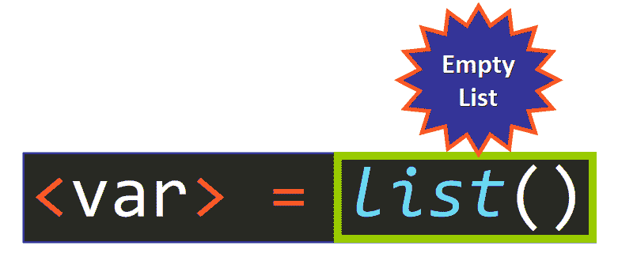
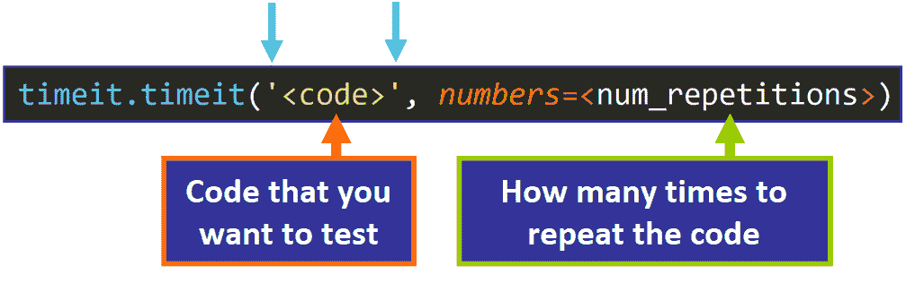

# Python 空列表教程–如何用 Python 创建空列表

> 原文：<https://www.freecodecamp.org/news/python-empty-list-tutorial-how-to-create-an-empty-list-in-python/>

如果您想学习如何在 Python 中高效地创建空列表，那么这篇文章就是为您准备的。

**您将了解到:**

*   如何使用方括号`[]`创建空列表？
*   如何使用`list()`创建空列表？
*   他们的用例。
*   他们的效率有多高(一个比另一个快！).我们将使用`timeit`模块来比较它们。

让我们开始吧！✨

## 🔹使用方括号

您可以创建一个带有一对空方括号的空列表，如下所示:


**💡提示:**我们将空列表赋给一个变量，以便稍后在程序中使用。

例如:

```
num = []
```

空列表的长度为`0`，正如您在这里看到的:

```
>>> num = []
>>> len(num)
0
```

空列表是 **falsy** 值，这意味着它们在布尔上下文中计算为`False`:

```
>>> num = []
>>> bool(num)
False
```

### 向空列表中添加元素

您可以使用方法`append()`和`insert()`向空列表添加元素:

*   将元素添加到列表的末尾。
*   将元素添加到您选择的列表的特定索引处。

由于列表可以是真值，也可以是假值，这取决于它们在计算时是否为空，因此可以在如下条件中使用它们:

```
if num:
	print("This list is not empty")
else:
	print("This list is empty")
```

这段代码的输出是:

```
This list is empty
```

因为列表是空的，所以它的值为 False。

总的来说:

*   如果列表不为空，则计算结果为`True`，因此执行 If 子句。
*   如果列表为空，则计算结果为`False`，因此执行 else 子句。

### 示例:

在下面的例子中，我们创建一个空列表，并将其赋给变量`num`。然后，使用 for 循环，我们将一系列元素(整数)添加到最初为空的列表中:

```
>>> num = []
>>> for i in range(3, 15, 2):
	num.append(i)
```

我们检查变量的值以查看项目是否被成功追加，并确认列表不再为空:

```
>>> num
[3, 5, 7, 9, 11, 13]
```

**💡提示:**我们通常使用`append()`将第一个元素添加到空列表中，但是您也可以使用索引`0`调用`insert()`方法来添加这个元素:

```
>>> num = []
>>> num.insert(0, 1.5) # add the float 1.5 at index 0
>>> num
[1.5]
```

## 🔸使用 list()构造函数

或者，您可以使用类型构造函数`list()`创建一个空列表，这将创建一个新的列表对象。

根据 [Python 文档](https://docs.python.org/3/library/stdtypes.html#list):

> 如果没有给定参数，构造函数创建一个新的空列表`[]`。



💡**提示:**这会在内存中创建一个新的列表对象，因为我们没有传递任何参数给`list()`，所以会创建一个空列表。

例如:

```
num = list()
```

这个空列表的长度为`0`，正如您在这里看到的:

```
>>> num = list()
>>> len(num)
0
```

并且当它为空时，它是一个 **falsy** 值(在布尔上下文中，它计算为`False`):

```
>>> num = list()
>>> bool(num)
False
```

### 示例:

这是一个功能齐全的列表，因此我们可以向其中添加元素:

```
>>> num = list()
>>> for i in range(3, 15, 2):
	num.append(i)
```

结果将是一个非空列表，正如您在这里看到的:

```
>>> num
[3, 5, 7, 9, 11, 13]
```

## 🔹用例

*   我们通常使用`list()`从现有的可重复项(比如字符串、字典或元组)中创建列表。
*   在 Python 中，您通常会看到方括号`[]`被用来创建空列表，因为这种语法更简洁、更快速。

## 🔸效率

等等！我刚刚告诉你`[]`比`list()`快...

但是要快多少呢？

让我们使用 [**timeit**](https://docs.python.org/3/library/timeit.html#module-timeit) 模块来检查他们的时间效率。

要在 Python 程序中使用该模块，您需要导入它:

```
>>> import timeit
```

具体来说，我们将使用该模块中的 [timeit 函数](https://docs.python.org/3/library/timeit.html#timeit.timeit)，您可以使用以下语法调用它:



💡**提示:**代码被重复多次，以减少可能由外部因素引起的时间差，例如在特定时刻可能正在运行的其他进程。这使得比较结果更加可靠。

**🚦各就各位...预备开始...准备好了。**下面是代码和输出:

首先，我们导入模块。

```
>>> import timeit
```

然后，我们开始测试每种语法。

### 测试`[]`:

```
>>> timeit.timeit('[]', number=10**4)
0.0008467000000109692
```

### 测试`list()`:

```
>>> timeit.timeit('list()', number=10**4)
0.002867799999989984
```

**💡提示:**请注意，您想要计时的代码必须用单引号`''`或双引号`""`括起来。`timeit`函数返回的时间以秒为单位。

比较这些结果:

*   `[]` : `0.0008467000000109692`
*   `list()` : `0.002867799999989984`

可以看到`[]`比`list()`快很多。在这次测试中有大约`0.002`秒的时间差:

```
>>> 0.002867799999989984 - 0.0008467000000109692
0.0020210999999790147
```

**我相信你现在一定在问这个问题:**如果做完全相同的事情，为什么`list()`不如`[]`有效率？

良好的...`list()`比较慢，因为它需要查找函数名，调用它，然后在内存中创建 list 对象。相比之下，`[]`就像一条“捷径”，不需要那么多中间步骤就可以在内存中创建列表。

这个时间差不会对你的程序的性能产生很大的影响，但是知道哪一个更有效率以及它们在幕后是如何工作的还是很好的。

## 🔹概括起来

您可以使用一对空方括号`[]`或类型构造函数`list()`来创建一个空列表，类型构造函数是一个内置函数，它在没有参数传递时创建一个空列表。

方括号`[]`在 Python 中常用来创建空列表，因为它更快更简洁。

我真的希望你喜欢我的文章，并觉得它很有帮助。现在您可以在 Python 项目中创建空列表。[查看我的在线课程](https://www.udemy.com/user/estefania-cn/)。在[推特](https://twitter.com/EstefaniaCassN)上关注我。⭐️

如果你想更深入地了解列表，你可能会喜欢阅读:

*   [Python List Append——如何向数组中添加元素，举例说明](https://www.freecodecamp.org/news/python-list-append-how-to-add-an-element-to-an-array-explained-with-examples/)
*   [Python 排序列表数组方法——升序和降序举例说明](https://www.freecodecamp.org/news/the-python-sort-list-array-method-ascending-and-descending-explained-with-examples/)
*   [Python List Append VS Python List Extend——用数组方法示例解释差异](https://www.freecodecamp.org/news/python-list-append-vs-python-list-extend/)