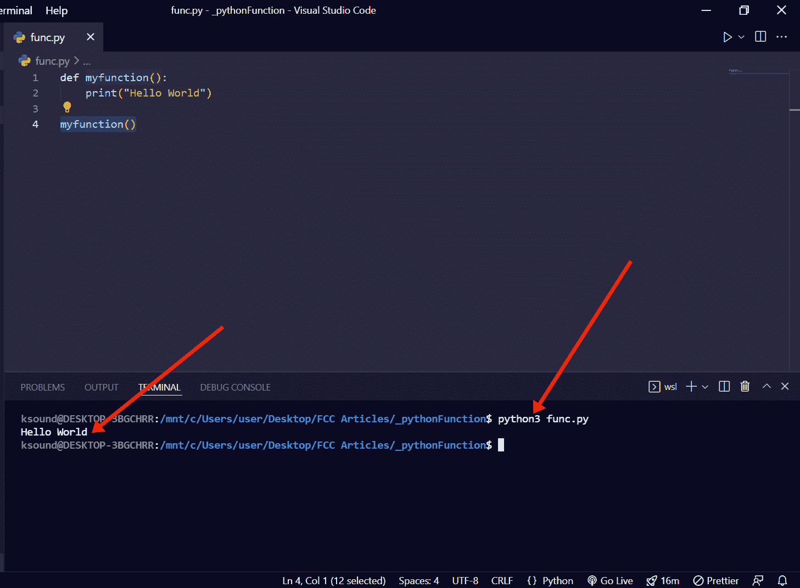

# Python 函数——如何定义和调用函数

> 原文：<https://www.freecodecamp.org/news/python-functions-define-and-call-a-function/>

在编程中，函数是一个可重用的代码块，它在被调用时执行特定的功能。

函数是每种编程语言不可或缺的一部分，因为它们有助于使代码更加模块化和可重用。

在本文中，我将向您展示如何在 Python 中定义并调用一个函数，这样您就可以将 Python 应用程序的代码分解成更小的块。

我还将向您展示 Python 函数中的参数和 return 关键字是如何工作的。

## 用 Python 定义函数的基本语法

在 Python 中，用`def`关键字定义一个函数，然后编写函数标识符(名称),后跟括号和冒号。

接下来你要做的是确保你缩进了一个制表符或者四个空格，然后指定你想要这个函数为你做什么。

```
def functionName():
    # What to make the function do 
```

## Python 中函数的基本示例

按照上面的基本语法，一个基本 Python 函数将“Hello World”打印到终端的示例如下所示:

```
def myfunction():
    print("Hello World") 
```

**要调用此函数**，请写下函数名，后跟括号:

```
myfunction() 
```

接下来，通过键入`python filename.py`在终端中运行您的代码，以显示您希望该函数做什么:



减法 2 数的另一个基本示例如下:

```
def subtractNum():
    print(34 - 4)

subtractNum()
# Output: 30 
```

## Python 函数中的参数

在 Python 中定义函数时，可以通过将参数放在括号中来将参数传递给函数。

执行此操作的基本语法如下所示:

```
def functionName(arg1, arg2):
    # What to do with function 
```

当调用该函数时，您需要为参数指定一个值:

```
functionName(valueForArg1, valueForArg2) 
```

以下是 Python 函数中的参数示例:

```
def addNum(num1, num2):
    print(num1 + num2)
addNum(2, 4)

# Output: 6 
```

在上面的例子中:

*   我向名为`addNum`的函数传递了两个参数
*   我告诉它将两个参数的总和打印到终端
*   然后我用指定的两个参数的值调用它

**N.B.** :您可以指定任意数量的参数。

## 如何在 Python 中使用 Return 关键字

在 Python 中，你可以使用`return`关键字来退出一个函数，这样它就可以回到它被调用的地方。也就是把一些东西送出函数。

return 语句可以包含调用函数后要执行的表达式。

以下示例演示了 return 关键字在 Python 中的工作方式:

```
def multiplyNum(num1):
    return num1 * 8

result = multiplyNum(8)
print(result)

# Output: 64 
```

**上面的代码在做什么？**

*   我定义了一个名为`multiplyNum`的函数，并把它作为参数传递给了`num1`
*   在函数内部，我使用 return 关键字来指定我想让`num1`乘以 8
*   之后，我调用函数，将`8`作为`num1`参数的值传递给它，并将函数调用赋给一个名为`result`的变量
*   有了 result 变量，我就可以在终端上打印出我想用这个函数做的事情

## 结论

在本文中，您学习了如何在 Python 中定义和调用函数。您还了解了如何将参数传递到函数中以及如何使用 return 关键字，这样您就可以更有创造性地使用自己编写的函数。

如果你觉得这篇文章有帮助，不要犹豫，与你的朋友和家人分享。