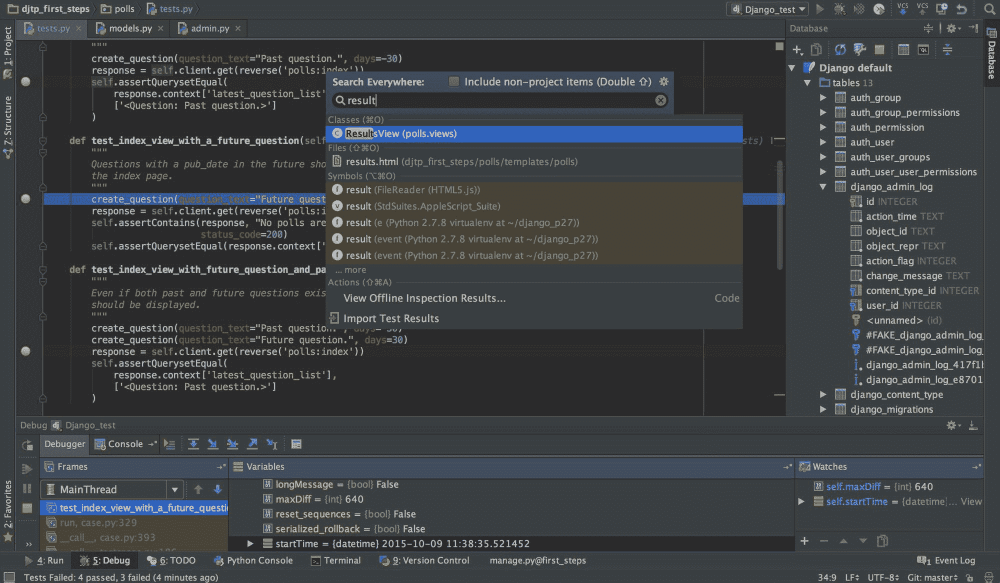
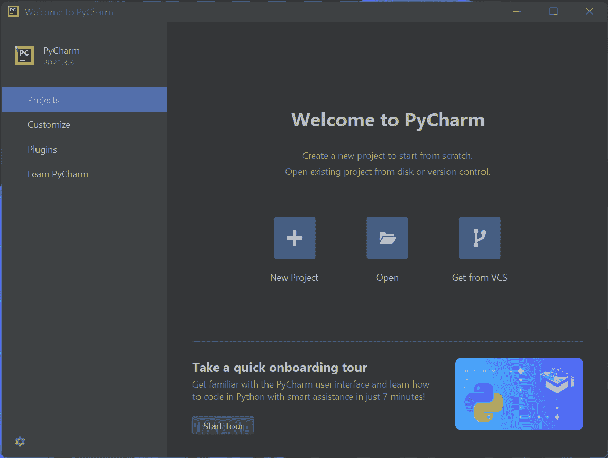
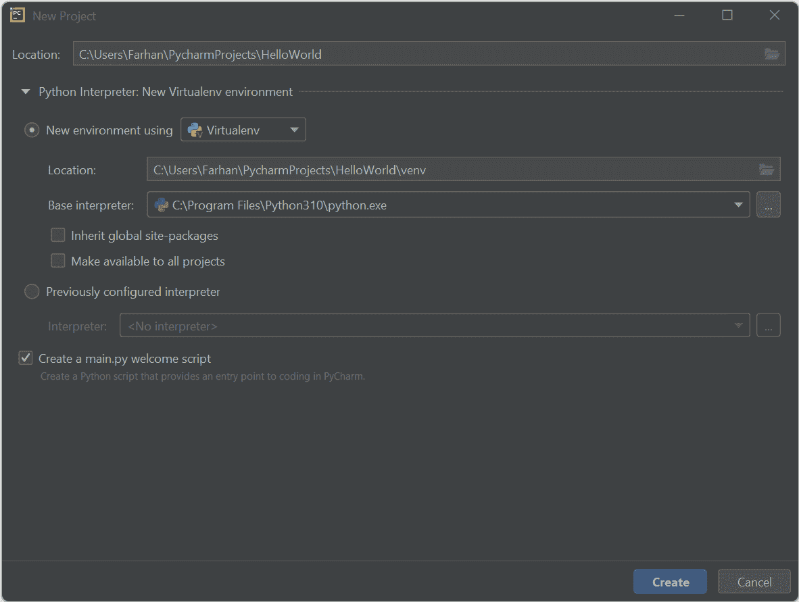
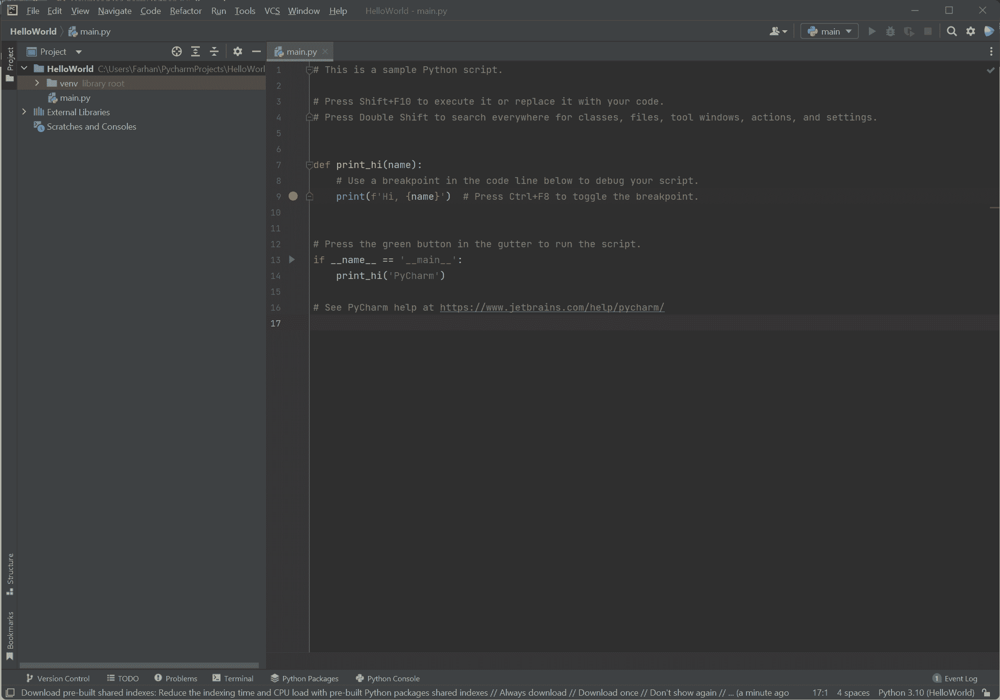
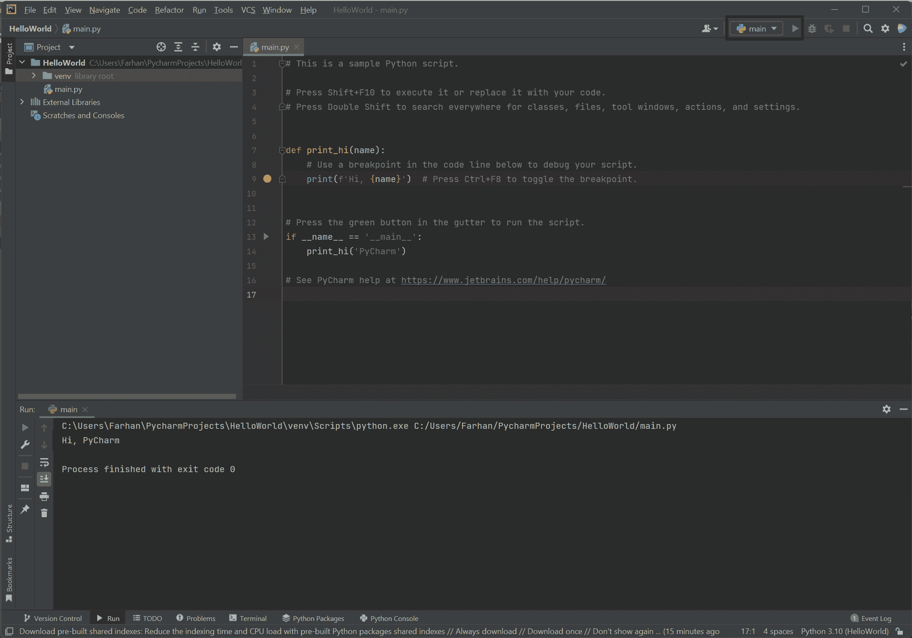
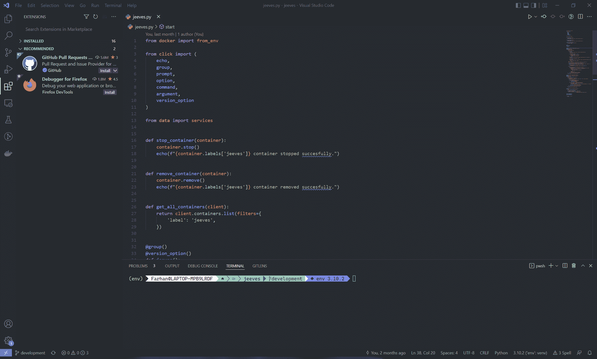
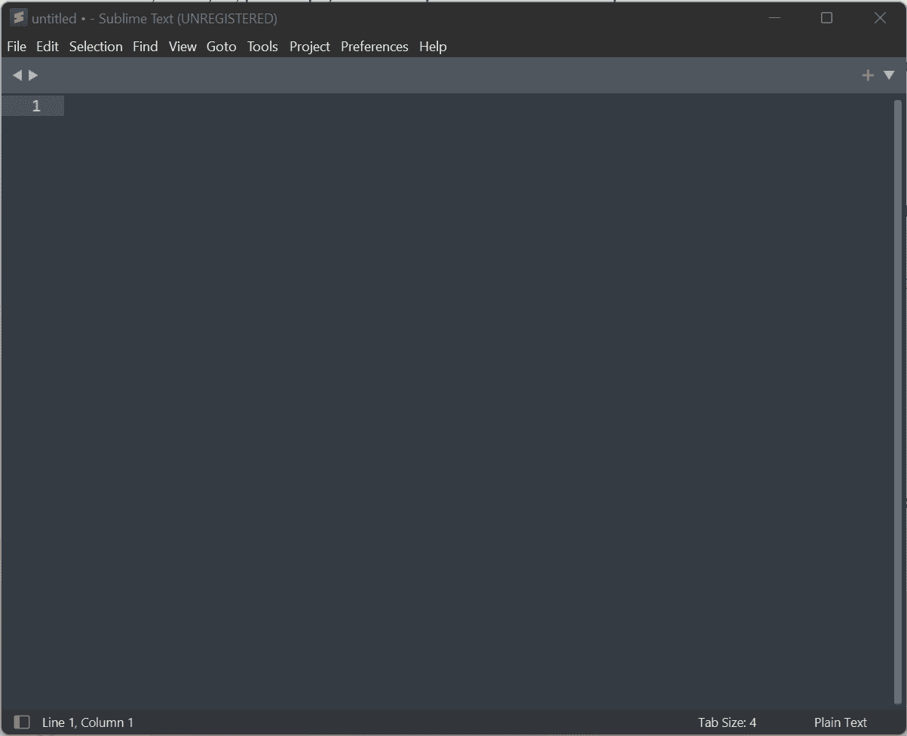
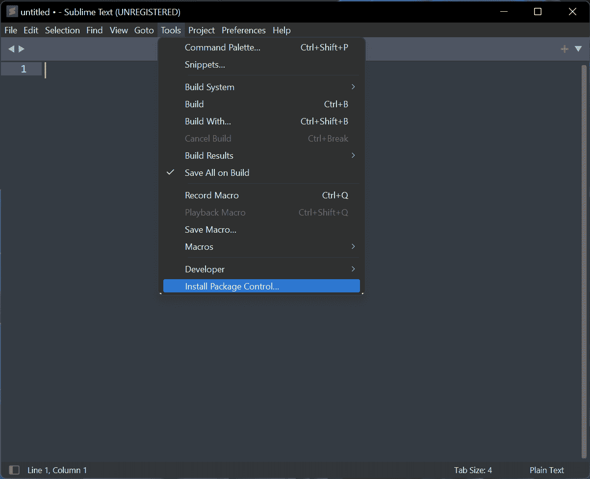
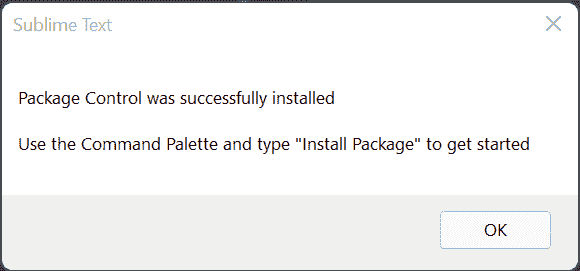
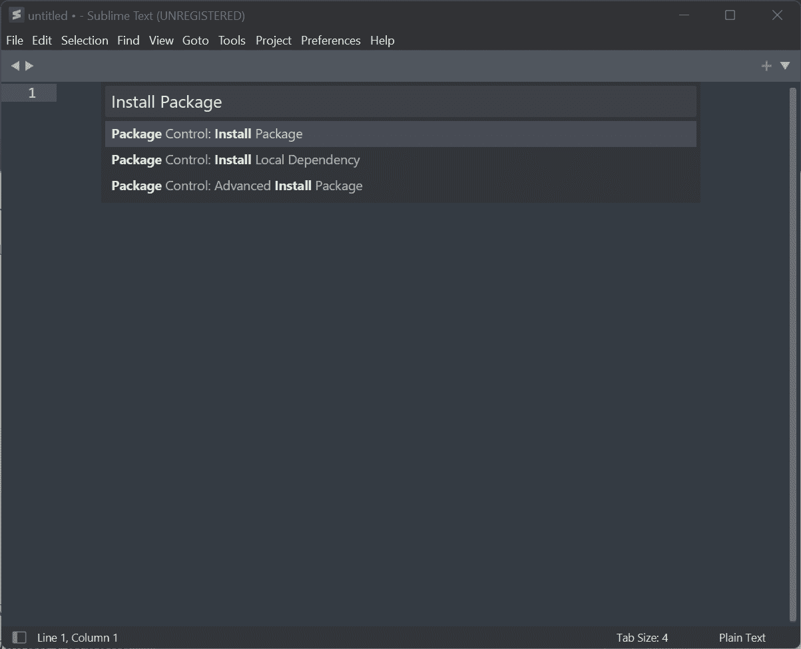

# Python IDE——Python 的最佳 IDE 和编辑器

> 原文：<https://www.freecodecamp.org/news/python-ide-best-ides-and-editors-for-python/>

作为一名开发人员，您的许多经验将取决于您选择用什么程序来编写代码。一个好的集成开发环境(IDE)或代码编辑器真的可以提高你的生产力。

像 Python 这样的流行语言的问题是，世界上所有的 IDE 或代码编辑器似乎都很好地支持这种语言。虽然这可能很棒，但选择最好的一个变得有点棘手。

在本文中，我将向您介绍三个 ide 和代码编辑器，它们可以让您的 Python 之旅更加顺畅。

但在我开始之前，我想澄清一个事实，这不是一个详尽的清单。如我所说，Python 是最流行的编程语言之一，因此它受到大量代码编辑器和 ide 的支持。

我本可以尽可能多地包括它们，但是我选择了包括那些我在生活中的某个时刻使用过的，并且不介意回头使用的。因为我觉得这样会更有帮助。

事不宜迟，让我们开始吧！

## 目录

*   IDE 与代码编辑器有什么不同？
*   [PyCharm](#pycharm)
*   [微软 Visual Studio 代码](#microsoft-visual-studio-code)
*   [崇高的文字](#sublime-text)
*   [结论](#conclusion)

## IDE 与代码编辑器的区别是什么？

在您开始阅读我为您准备的 IDE 和代码编辑器之前，让我们澄清一下 IDE 和代码编辑器的定义。

您可能已经知道，源代码文件只是附加了某些扩展名的文本文件。任何具有一些特殊功能(如语法突出显示、自动代码缩进等)以使编辑代码文件更容易的文本编辑器都被称为代码编辑器。

流行的代码编辑器包括 Visual Studio 代码、Sublime Text、Atom、Notepad++等等。

另一方面，IDE 或集成开发环境是一套复杂得多的软件，它将多种工具(如代码编辑器、文件浏览器、终端仿真器、数据库浏览器等)组合在一个包中。

流行的 ide 包括 PyCharm、IntelliJ Idea、Microsoft Visual Studio 等。

但是由于现代高度可扩展的代码编辑器，如微软 Visual Studio 代码，IDE 和代码编辑器之间的界限已经开始消失。

现在您对编辑器与成熟的 IDE 相比有了更好的了解，让我们来看看 Python 编码的一些最佳选择。

## 皮查姆

我们列表中的第一个是来自 JetBrains 的 IDE。PyCharm 是最常用的 Python IDEs 之一(如果不是最常用的话)。

https://www.jetbrains.com/pycharm/

IDE 有两个版本。专业版每月收费 8.90 美元，如果按年计费，每年收费 89 美元。还有社区版，完全免费，基于开源软件。在本文中，我将讨论社区版。

这两个版本都适用于 Windows、macOS 和 Linux。你可以从官方[下载页面](https://www.jetbrains.com/pycharm/download/)下载专业版或社区版的 30 天试用版。

无论您使用什么平台，安装过程都非常简单。一旦您在计算机上下载并安装了 PyCharm，您就应该能够启动 IDE 了。您可以使用 Windows 上的开始菜单快捷方式、macOS 上的应用程序目录或 Linux 上的应用程序启动器。

您可以通过点击*新建项目*按钮来创建一个新的 Python 项目。

在下一步中，选择您想要存储项目的位置。您可以创建一个新的虚拟环境，也可以使用之前配置的解释器。在这种情况下，我正在创建一个新的环境。

如果您选中了*Create a main . py welcome script*选项，那么在您的项目中将会创建一个包含一些样板代码的新 Python 文件。一旦你对所有的选择都满意了，点击*创建*按钮。

这是项目创建后代码编辑器的样子。在左边你可以浏览你所有的源文件，你可以点击窗口右上角的 play 按钮来运行下拉列表中选择的脚本。

正如你所看到的，PyCharm 自带了一个内置在窗口底部的终端，你不用离开 PyCharm 就可以看到程序的输出。

社区版相当完整，你可以在专业版上做或多或少的事情。专业版对像 Django 和其他一些附加功能的 web 框架有更好的支持。

如果你是学生，你可以在他们的网站上申请免费获得 PyCharm 专业版和所有其他 JetBrains 的东西。如果你是开源维护者，你还可以获得所有 JetBrains 产品的免费许可。

## Microsoft Visual Studio 代码

我的最爱列表中的下一个是 Microsoft Visual Studio Code，简称 VSCode。这是微软的一款开源、电子化、跨平台的代码编辑器，提供了大量的定制选项和扩展。

通过安装正确的扩展集，您可以将 Visual Studio 代码变成几乎全功能的 Python IDE。您可以从 Windows、macOS 和 Linux 的官方下载网站免费下载 VSCode。

一旦你在你的系统上安装了 VSCode，打开软件，点击 *Ctrl + Shift + X* 组合键进入扩展选项卡。

使用搜索栏搜索并安装下列扩展:

*   [Python](https://marketplace.visualstudio.com/items?itemName=ms-python.python)–提供智能感知(Pylance)、林挺、调试、代码导航、代码格式化、重构、变量浏览器、测试浏览器等功能！
*   [PyLance](https://marketplace.visualstudio.com/items?itemName=ms-python.vscode-pylance)–在 Visual Studio 代码中与 Python 一起工作，提供性能语言支持。
*   [Visual Studio intelli Code](https://marketplace.visualstudio.com/items?itemName=VisualStudioExptTeam.vscodeintellicode)——在 Visual Studio 代码中为 Python、TypeScript/JavaScript 和 Java 开发者提供 AI 辅助开发功能。

一旦你安装了这三个，你就可以开始了。在机器上的任意位置创建一个目录，并使用 VSCode 打开该文件夹。您可以使用集成终端来运行您的代码或执行任何一般命令。

您可以通过单击任意行号的左侧来设置断点。然后你可以点击 *F5* 开始调试或者 *Ctrl + F5* 不调试运行程序。VSCode 还有很多技巧，您会在不断使用它的过程中发现。

## 崇高的文本

Sublime Text 是 OG 代码编辑器之一，已经被开发人员使用了很多年。这是一个非常高性能、强大的代码编辑器，对包有丰富的支持。

你可以从他们的官方下载页面下载崇高的文本。一旦你安装了它，像其他软件一样启动 Sublime Text。

现在点击*工具>安装包控制...*

这将安装 Sublime 包管理器。等待成功消息出现。

现在使用 *Ctrl + Shift + P* 组合键进入命令面板，输入*安装包*:

选择第一个选项并搜索 [Anaconda](https://packagecontrol.io/packages/Anaconda) 包。这是一个最终的 Python 包，它将 Sublime 文本转换成一个 Python IDE，具有自动完成、代码林挺、IDE 特性、autopep8 格式化、McCabe 复杂性检查器、vagger 和 Docker 支持等功能。

还有更具体的包比如 Django 支持的 [Djaneiro](https://packagecontrol.io/packages/Djaneiro) 和 Sublime Text 上 requirements.txt 支持的 [requirementstxt](https://packagecontrol.io/packages/requirementstxt) 。只要看看软件包控制[网站](https://packagecontrol.io/browse)，你可能会发现一些非常有用的软件包。

## 结论

正如我已经说过的，这并不是所有流行的 Python IDEs 和代码编辑器的详尽列表。在我人生的某个阶段，我也使用过 [Spyder](https://www.spyder-ide.org/) ,但决定不再使用它，因为它是针对科学家和工程师的。

我也曾短暂地使用过 [IDLE](https://docs.python.org/3/library/idle.html) ，但对于大型项目来说，这似乎不是一个足够强大的选项。

如果你认为我漏掉了任何其他好的，请通过推特或 T2 的 LinkedIn 告诉我。此外，如果你的母语是孟加拉语，可以看看 freeCodeCamp 的[孟加拉语出版物](https://www.freecodecamp.org/bengali/news/)和 [YouTube 频道](https://www.youtube.com/channel/UCYl5XjGuTM1gbXUuxH1e0jA)。直到下一个，保持安全，继续学习。