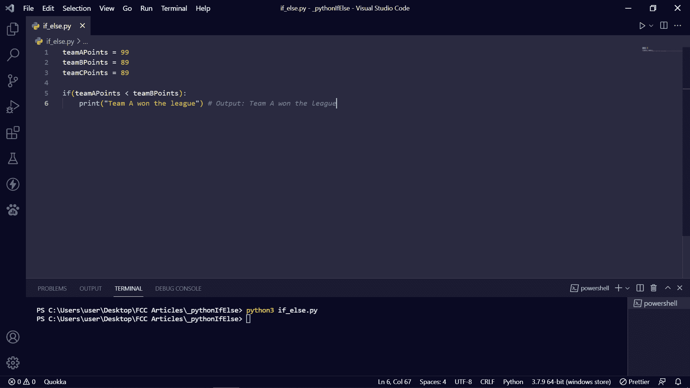

# Python If-Else–Python 条件语法示例

> 原文：<https://www.freecodecamp.org/news/python-if-else-python-conditional-syntax-example/>

在您的应用程序和 web 项目中，如果满足特定条件，有时用户可能需要执行某个操作。

如果不满足条件，也可能需要让用户执行另一个操作。

在 Python 中要做到这一点，可以使用`if`和`else`关键字。这两个关键词叫做条件句。

在本文中，我将向您展示如何在您的应用程序中使用`if`和`else`关键字实现决策。我还将向您展示`elif`关键字是如何工作的。

我将使用 Python 比较运算符，如`>`(大于)、`<`(小于)和(`==` ) equals 来比较`if`和`elif`块中的变量，这样我们就可以做出决定。

## 如何在 Python 中使用`if`关键字

在 Python 中，单个`if`语句的语法如下所示:

```
if(condition):
    indented block of decision to make if condition is true 
```

与其他一些使用大括号来确定块或范围的编程语言不同，Python 使用冒号(`:`)和缩进(`4 whitespaces or a tab`)。

因此，如果在关键字`if`前面的大括号中指定的条件为真，冒号后的缩进代码行将被执行。

在下面的例子中，我记录了 3 支足球队在 3 个变量中的得分，并使用`if`语句做出决定。

```
teamAPoints = 99
teamBPoints = 89
teamCPoints = 89

if(teamAPoints > teamBPoints):
    print("Team A won the league") # Output: Team A won the league 
```

您可以看到，代码运行是因为满足了条件`teamAPoints > teamBPoints`。也就是说，A 队赢得了联赛，因为与 B 队和 c 队相比，他们有 99 分。

Python 有一个`and`关键字，可以帮助我们将 C 团队纳入比较:

```
teamAPoints = 99
teamBPoints = 89
teamCPoints = 89

if(teamAPoints > teamBPoints and teamCPoints):
    print("Team A won the league against Team B and Team C") # Output: Team A won the league against Team B and Team C 
```

代码再次运行，因为满足了条件`teamAPoints > teamBPoints and teamCPoints`。

如果你只有一个代码块要用`if`语句执行，你可以把它放在一行中，一切都没问题，如下所示:

```
teamAPoints = 99
teamBPoints = 89
teamCPoints = 89

if(teamAPoints > teamBPoints): print("Team A won the league") # Output: Team A won the league 
```

这不是规定，只是惯例。

如果不满足`if`语句中的条件，则什么都不会发生。

在下面的屏幕截图中，没有发生任何事情，因为 if 语句中指定的条件不为真。甲队得分(99)比乙队(89)多。


顺便说一下，您可以在终端中运行 Python 代码，方法是键入 Python 或 Python3，后跟文件名。py 扩展名，然后按键盘上的`ENTER`。比如`python3 if_else.py`。

## 如何在 Python 中使用`else`关键字

因为如果不满足`if`语句中的条件，什么都不会发生，所以可以用 else 语句来捕捉它。

使用`else`，如果`if`语句中的条件不为真，或者如果您想要添加更多选项，您可以让用户执行一个操作。

`if...else`的语法是对`if`语法的扩展:

```
if(condition):
    indented block of decision to make if condition is true
else:
    indented block of decision to make if condition is not true 
```

在下面的代码片段中，`else`范围内的代码块运行，因为指定的条件不为真——团队 C 没有比团队 a 多的分数。

```
teamAPoints = 99
teamBPoints = 89
teamCPoints = 89

if(teamCPoints > teamAPoints):
    print("Team C won the league") 
else:
    print("Team A won the league") # Output: Team A won the league 
```

如果你只有一个代码块用`if`执行，一个代码块用`else`执行，你可以把它放在一行中，一切都没问题:

```
teamAPoints = 99
teamBPoints = 89
teamCPoints = 89

if(teamCPoints > teamAPoints): print("Team C won the league") 
else: print("Team A won the league") # Output: Team A won the league 
```

## Python 中的嵌套`if`

您可以将`if...else`所做的事情合并成一个单独的`if`语句。这在编程语言中被称为嵌套。

嵌套 2 个或更多 if 语句的语法如下所示:

```
if(condition):
    if(condition):
        if(condition)
            indented block of decision to make 
```

在嵌套的`if`中，所有条件必须为真，代码才能运行。

```
teamAPoints = 99
teamBPoints = 89
teamCPoints = 88

if (teamAPoints > teamBPoints):
    if (teamAPoints >= teamBPoints):
        if (teamAPoints >= teamCPoints):
            print("Team A won the league") # Team A won the league 
```

## 如何在 Python 中使用`elif`关键字

Python 中的另一个条件关键字是`elif`，可以放在`if`和 else 之间。

在下面的代码片段中，您可以看到`elif`关键字是如何工作的:

```
teamAPoints = 99
teamBPoints = 89
teamCPoints = 88

if (teamAPoints == 89):
    print("Team B did not win the league")
elif(teamAPoints == 99):
    print("Team A won the league")
else:
    print("Team C won the league") # Result: Team A won the league 
```

if 语句中的条件不成立，因为 A 队有 99 分

`elif`中的条件为真并运行，因为 A 队有 99 分，所以`else`块被忽略。

## 结论

在本文中，您了解了 Python 中的`if…else`，因此您可以在项目中实现条件。

感谢您的阅读，祝您编码愉快。