# 如何在 Power BI 中使用 Python

> 原文：<https://www.freecodecamp.org/news/python-in-powerbi/>

Microsoft Power BI 是一个商业分析工具，允许用户从他们的数据中获得洞察力。

只需将数据列拖放到可视化平面中，就可以轻松创建交互式仪表板。

在本文中，我将向您展示如何使用 Python 来帮助您利用 Power BI 的功能。

## 为什么要一起用 Python 和 Power BI？

许多数据分析师和数据科学家已经熟悉 Python 编程。因此，他们可以轻松获得用于 EDA(探索性数据分析)过程的功率 BI。数据分析师还可以使用 Power BI 创建的仪表板讲述数据故事。

我喜欢 Power BI，因为它很容易挖掘数据并找到见解。当我过滤可视化中的特征/列时，也会影响其他可视化。然后，我可以专注于一个类别，然后再转向其他类别。

微软 Power BI 已经支持两种不同的语言:M 语言和 DAX(数据分析表达式)。但是有时使用 Python 进行数据准备过程会更方便。这是因为它让您可以访问各种 Python 库，这是一组有用的函数，无需从头开始编写代码。

通过在 Power BI 中实现 Python，您可以同时受益于 Python 和 Power BI。您可以使用 Power BI 的交互式仪表盘轻松执行 EDA 和创建演示。您还可以灵活地为仪表板编写 Python 代码。

### 我们将涵盖的内容:

*   如何安装 Python
*   如何在 Power BI 中设置 Python
*   如何使用 Python 获取数据
*   如何使用 Python 转换数据
*   如何使用 Python 可视化数据

## 如何安装 Python📥

在 Power BI 中使用 Python 之前，必须先安装 Python。我推荐安装 Anaconda，因为它是管理 Python 库和环境的有用工具。

### 步骤 1:安装 Anaconda


去[https://www.anaconda.com/products/distribution](https://www.anaconda.com/products/distribution)下载并在你的电脑上安装 Anaconda。

### 步骤 2:打开 Anaconda 提示符

搜索 Anaconda 提示符，然后单击打开。


你会看到一个黑屏弹出。确保标题栏是 Anaconda 提示符。

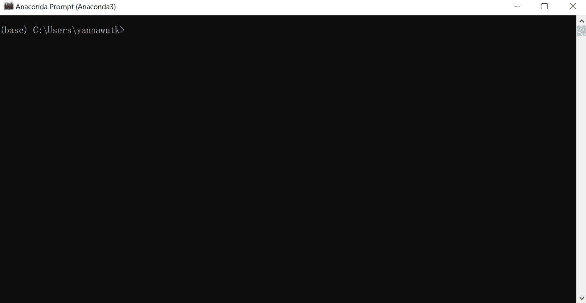

### 步骤 3:创建 Python 3.6 环境

Power BI 在使用高版本 Python 时可能会有问题(在撰写本文时，最新的 Python 版本是 3.9)。为了避免技术问题，我创建了一个新的 Python 3.6 环境，并且没有遇到任何问题。

您可以直接降级您的 Python 版本，但不建议这样做，因为它可能会影响其他项目。您可以将 Anaconda 环境想象成一个包含特定 Python 包集合的工作箱。在这种环境下工作，不会影响其他项目。

在 Anaconda 提示符下，通过键入下面的代码
创建一个新环境(只需将 **< env_name >** 替换为您的环境名，比如 python36):

```
conda create --name <env_name> python=3.6
```

然后，当您看到 Proceed ([y]/n)？，键入 y 并回车。

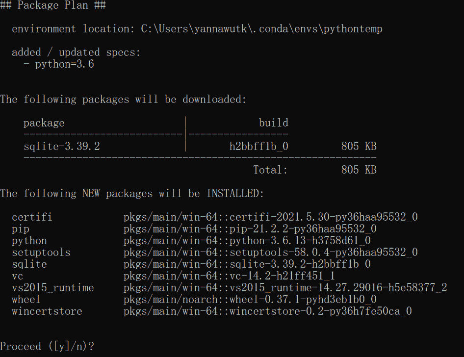

等到它运行完毕。

通过键入以下命令，检查是否成功创建了新环境:

```
conda env list
```

您将看到 Anaconda 环境的列表。如果你看到一个新的环境，你就可以进入下一步了。

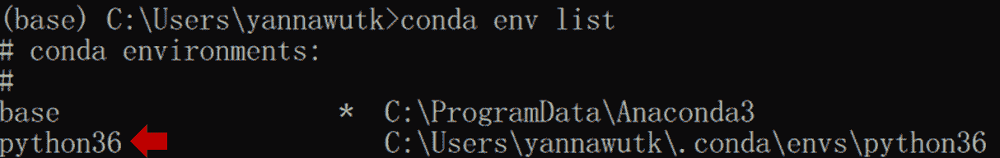

### 步骤 4:安装有用的 Python 库

在安装任何 Python 包之前，请确保您处于刚刚创建的环境中，方法是在 Anaconda 提示符下键入以下命令:

```
conda activate <env_name>
```

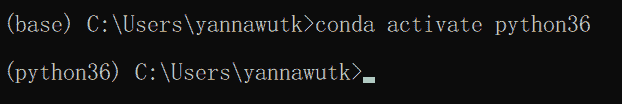

然后，您将在括号中观察到环境名称的变化。

您可以通过键入以下命令来安装您将要在 Power BI 中使用的 Python 库/包(只需将 **< package_name >** 替换为您想要安装的包的名称，例如 pandas、numpy、matplotlib 等等):

```
pip install <package_name>
```

## 如何在 Power BI ⚙️中设置 Python

在你完成 Python 的安装之后，就是 Power BI 的时候了！

### 步骤 1:安装 Power BI

去 https://www.microsoft.com/en-us/download/details.aspx?id=58494 。
在电脑上下载并安装 Power BI。

然后开电源 BI。

### 第二步:点击左上角的“文件”。

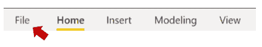

### 第三步:点击“选项和设置”。点击“选项”。

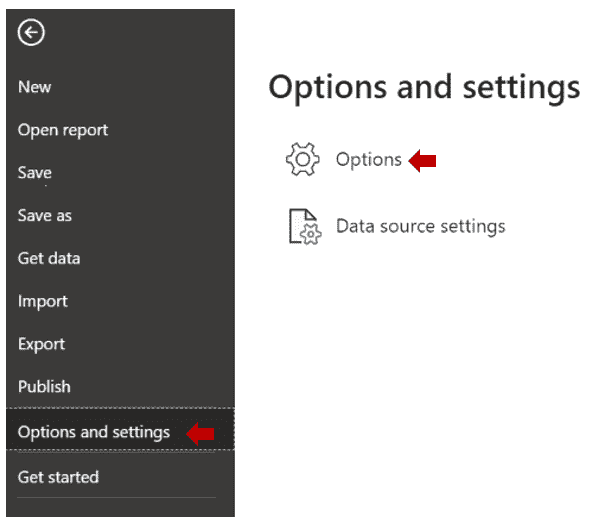

### 第 4 步:点击“Python 脚本”

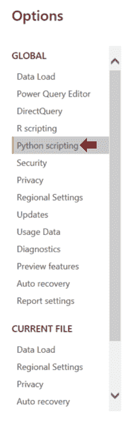

### 步骤 5:更改目录并导航到您的 Python 环境

将检测到的 Python 主目录更改为“Other ”,并浏览上一步中创建的 Python 环境。

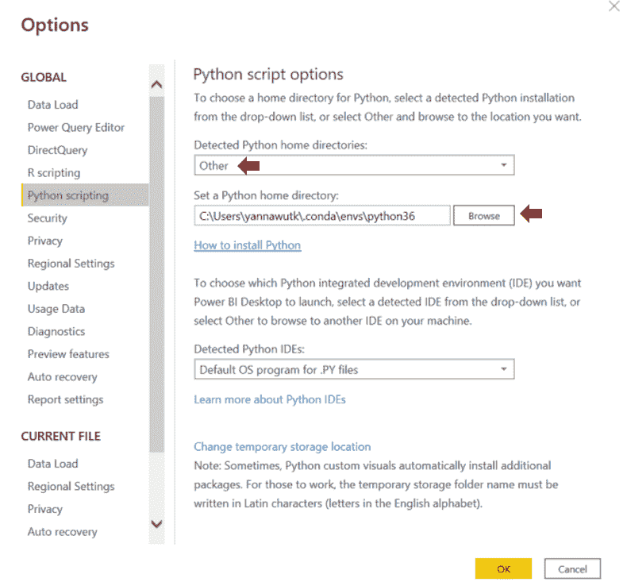

**提示**如何找到 Python 环境目录:

打开 Anaconda 提示符并键入以下代码:

```
conda env list
```

您将看到 Anaconda 环境的列表。

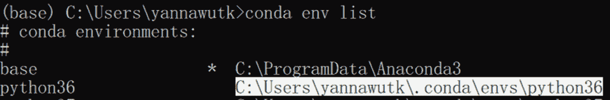

复制环境名称后的路径，例如 C:\Users\yannawutk\。conda\envs\python36

现在，您已经准备好在 Power BI 中使用 Python 了。

您可以通过三种重要方式使用 Python:获取数据、转换数据和可视化数据。

如果您想遵循本文中的代码，您可以从这个 Kaggle 数据集下载示例数据。

## 如何使用 Python 获取数据🧺

你可以用 Python 来获取数据。这有助于网络抓取(从网站获取数据)和从 API(应用程序接口)中提取数据。例如，如果你想从 Twitter 或 Trello 收集数据。

如果没有 Python，这些数据获取方法在 Power BI 中不一定可用。

在这个例子中，我将创建一个 Python 文件来从两个源获取数据:一个 CSV 文件(从上面提供的链接下载)和一个创建的 dataframe(一个包含行和列的表)。

### 第一步:点击获取数据


### 第二步:搜索 Python 脚本，点击打开新的编码窗口。

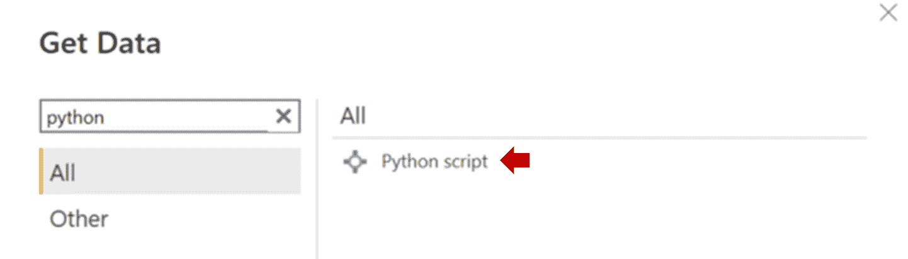

### 第三步:输入下面的代码，然后点击确定

df1 是来自 CSV 文件的数据，而 df2 是创建的具有 A 和 b 两列的数据帧。您必须将 df1 的目录更改为下载的 CSV 文件的位置。

```
import pandas as pd

df1 = pd.read_csv("C:/Corona_NLP_train.csv", encoding = "ISO-8859-1")
df2 = pd.DataFrame({'A': [1, 3, 6, 8],'B': [10, 30, 50, 90]})
```

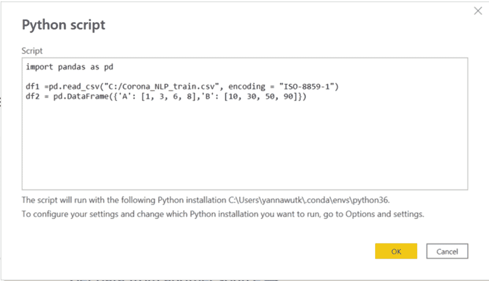

### 步骤 4:加载数据

您将看到一个显示数据的导航器平面(像在其他数据获取方法中一样)。).单击您要加载的数据的复选框，然后单击“加载”。

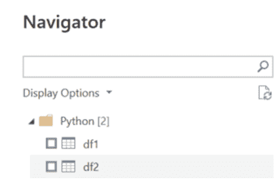

现在你知道了！现在让我们看看如何转换数据。

## 如何使用 Python 转换数据🔄

您还可以使用 Python 来转换数据。大多数情况下，我将它与正则表达式一起使用。例如，您可以使用它从另一列中提取与定义的模式匹配的子字符串(比如从 Twitter 文本中获取 hashtags)。

在这个例子中，我将使用 Python 中的`len()`函数来查找文本长度。

### 步骤 1:单击转换数据

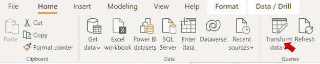

### 步骤 2:选择要转换的查询


### 步骤 3:在变换选项卡中，单击运行 Python 脚本


您将看到一个新的运行 Python 脚本窗口。在此处编写代码，然后单击“确定”。

```
dataset['Count'] = dataset['OriginalTweet'].str.len()
```

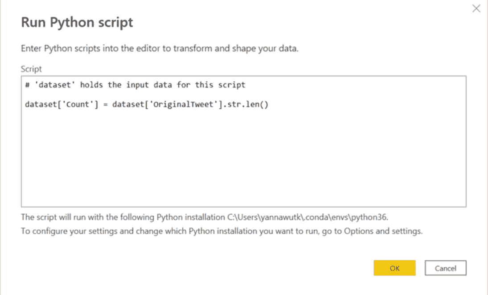

**关键概念**:数据将是一个“数据集”数据帧，所以你可以用 Pandas 函数来操作它。

### 步骤 4:展开表格

结果将是一个表格。单击以展开表格。确保未选中“使用原始列名作为前缀”。

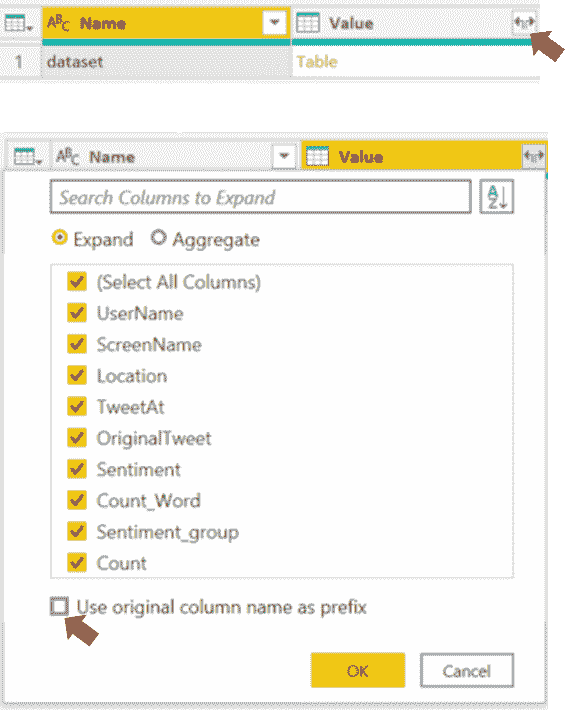

您将看到数据转换的结果，并且步骤被添加到应用的步骤平面中。

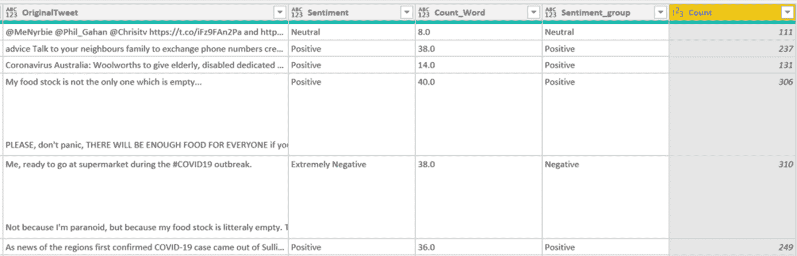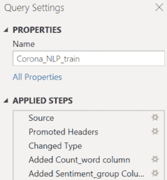

## 如何使用 Python 可视化数据📊

仅使用 Power BI 的可视化功能创建图可能会有一些限制，有些图在 Power BI 中可能不可用。

Python 很方便，因为 Python 中有许多库可以生成您想要的任何可视化。

目前常用的数据可视化 Python 库包括 Matplotlib、Plotly、Seaborn 和 ggplot。

虽然用 Python 编写代码来创建一个情节可能比 Power BI 的拖放概念更困难，但还有更多情节定制和代码示例(用作参考)。

现在让我们一步一步来看看它是如何工作的。

### 步骤 1:在可视化平面中，单击 Py 图标(Python 的缩写)


您将看到一个空的 Python 脚本编辑器区域。

### 步骤 2:选择要可视化的列。

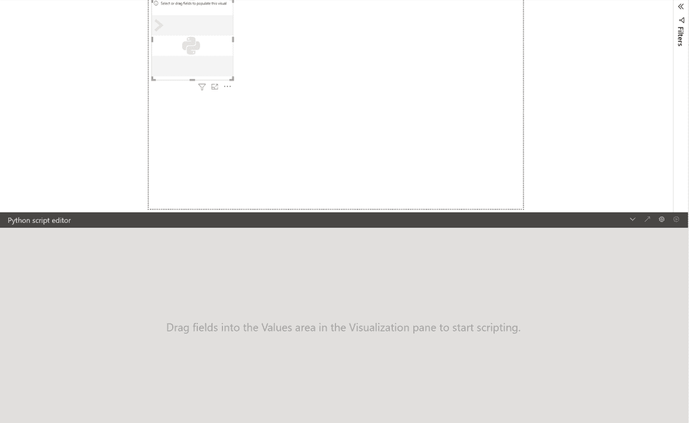

你会看到一个空的编码区。

### 第三步:编写代码

现在是时候写你的代码了。不要忘记添加`plt.show()`来显示图表。单击运行图标，等待结果。你完了！

```
import seaborn as sns
import matplotlib.pyplot as plt
import re

def find_hash(text):
	line=re.findall(r'(?<=#)\w+',text)
	return " ".join(line)

dataset['hash'] = dataset['OriginalTweet'].apply(lambda x:find_hash(x))
temp = dataset['hash'].value_counts()[:][1:11]
temp = temp.to_frame().reset_index().rename(columns={'index':'Hashtag','hash':'count'})

plt.figure(figsize=(20, 15))
sns.barplot(x="Hashtag",y="count", data = temp)
plt.show()
```

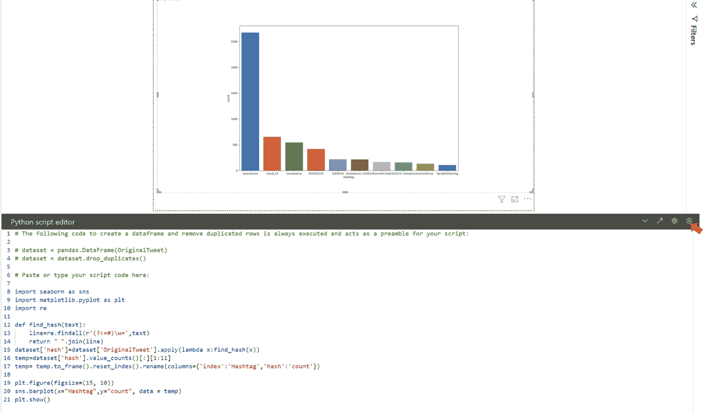

**注意:**如果运行代码后显示错误，深呼吸，阅读错误信息。:)

## 结论

本文逐步向您展示了如何在 Power BI 中使用 Python，因此您可以同时获得 Power BI 交互式仪表板和 Python 灵活性的优点。

您可以以多种方式应用 Python 代码，包括数据获取、转换和可视化。