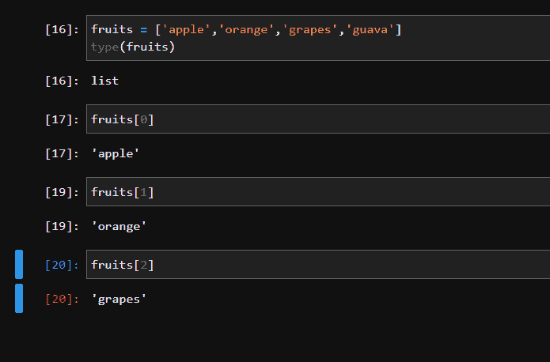
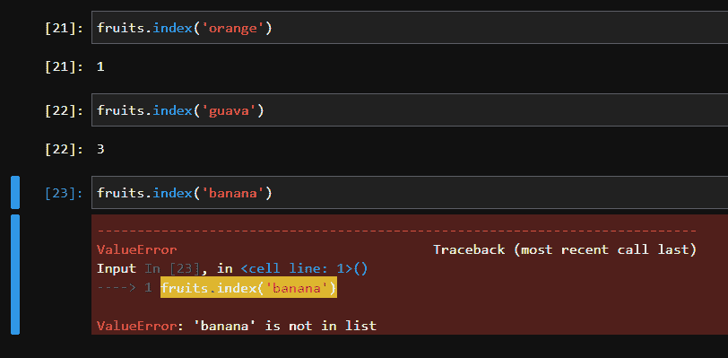
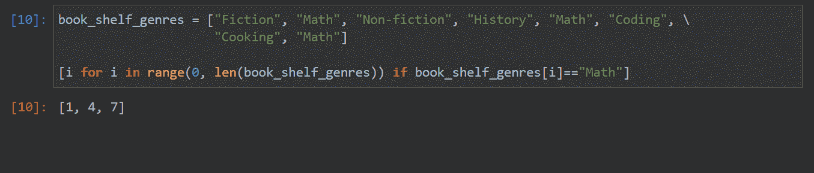
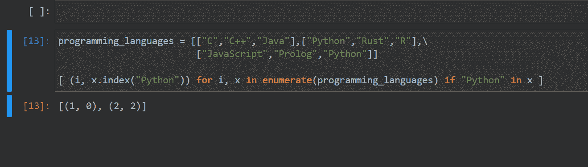
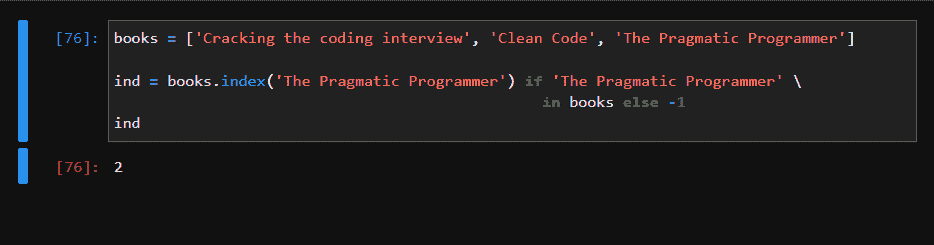
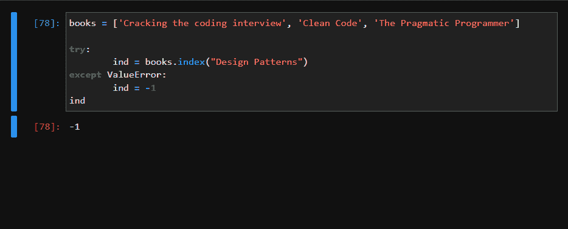

# python Index——如何在列表中找到元素的索引

> 原文：<https://www.freecodecamp.org/news/python-index-find-index-of-element-in-list/>

当你学习编码时，你最终会了解列表和你可以对它们执行的不同操作。

在本文中，我们将介绍如何找到存储在 Python 列表中的特定元素的索引。

## Python 中的列表是什么？

Python 中的列表是一种内置的数据类型，它允许我们存储一系列不同的值，比如数字、字符串、日期时间对象等等。

列表是有序的，这意味着我们存储值的顺序很重要。

列表索引从零开始，到列表长度减一结束。有关列表数据类型的更多详细信息，请查看本综合指南。

让我们来看一个列表的例子:



```
fruits = ["apple", "orange","grapes","guava"]
type(fruits)
print(fruits[0])
print(fruits[1])
print(fruits[2]) 
```

这里我们创建了一个 4 项的列表，我们看到列表中的第一项位于索引 0，第二项位于索引 1，第三项位于索引 2，依此类推。

对于水果列表，有效的列表索引是 0、1、2 和 3。

## 如何在 Python 中找到列表中项目的索引

让我们反过来。也就是说，给定一个列表项，让我们找出该项在列表中的索引或位置。

```
index = fruits.index('orange')
#The value of index is 1

index = fruits.index('guava')
#The value of index is 3

index = fruits.index('banana')
#This raises a ValueError as banana is not present in list 
```



Python 列表为我们提供了 index 方法，它允许我们获取列表项第一次出现的索引，如上所示。

我们还可以看到，如果我们试图查找一个列表中不存在的项目的索引，index 方法将引发一个 VauleError。

关于指数法的更多细节，请查看官方文件[这里](https://docs.python.org/3/tutorial/datastructures.html)。

index 方法的基本语法如下:

```
list_var.index(item)
```

我们还可以指定要搜索的子列表，语法如下:

```
list_var.index(item, start_index_of_sublist, end_index_of_sublist)
```

为了进一步说明这一点，让我们看一个例子。

假设我们有一个**book _ shelf _ genders**列表，其中的索引表示书架号。我们有许多放有数学书的书架。货架号也从零开始。我们想知道 4 号书架后面的哪个书架有数学书。

```
book_shelf_genres = ["Fiction", "Math", "Non-fiction", "History", "Math", "Coding", "Cooking", "Math"]
index = book_shelf_genres.index("Math")
#The value of index is 1
```

我们可以在这里看到问题:仅使用`index()`将给出列表中第一个出现的条目——但是我们想知道第 4 层之后“Math”的索引。

为此，我们使用 index 方法并指定要搜索的子列表。子列表从索引 5 开始，直到**book _ shelf _ genders**列表的末尾，如下面的代码片段所示

```
index = book_shelf_genres.index("Math", 5)
#The value of index is 7
```

注意，给出子列表的结束索引是可选的。要查找 1 号货架之后和 5 号货架之前的“数学”索引，我们只需这样做:

```
index = book_shelf_genres.index("Math", 2, 5)
#The value of index is 4
```

## 如何在 Python 中找到多次出现的列表项的索引

如果我们需要知道在列表中多次出现的列表项的索引，该怎么办？索引方法不会给出所有事件。

在这种情况下，我们可以使用列表理解找到多次出现，如下所示:

```
book_shelf_genres = ["Fiction", "Math", "Non-fiction", "History", "Math", "Coding", \
                     "Cooking", "Math"]

[i for i in range(0, len(book_shelf_genres)) if book_shelf_genres[i]=="Math"]
```



如代码片段所示，我们循环遍历列表的索引。在每个索引处，我们检查该索引处的项是否是数学。如果是数学，那么我们将索引值存储在一个列表中。

我们使用 list comprehension 来完成整个过程，list comprehension 只是一种语法糖，它允许我们遍历一个列表并执行一些操作。在我们的例子中，我们是基于列表项的价值来做决策的。然后我们创建一个新的列表。

通过这个过程，我们现在知道了所有上面有数学书的书架号。

## 如何在 Python 中找到列表列表中列表项的索引

```
programming_languages = [["C","C++","Java"],["Python","Rust","R"],\
                         ["JavaScript","Prolog","Python"]]

[ (i, x.index("Python")) for i, x in enumerate(programming_languages) if "Python" in x ]
```



这里我们使用 list comprehension 和 index 方法在每个子列表中查找“Python”的索引。

我们将 programming_languages 列表传递给 enumerate 方法，该方法检查列表中的每一项，并返回一个包含索引和该索引处的列表项的元组。

programming_languages 列表中的每一项也是一个列表。然后，in 操作符检查“Python”是否出现在这个列表中。如果存在，我们将子列表索引和子列表中“Python”的索引存储为一个元组。

输出是一个元组列表。元组中的第一项指定子列表索引，第二个数指定子列表中的索引。

所以(1，0)意味着 programming_languages 列表索引 1 处的子列表在索引 0 处有“Python”项。

## 如何在 Python 中找到列表中可能不存在的列表项的索引

在许多情况下，我们最终会试图获取一个条目的索引，但我们不确定该条目是否存在于列表中。

如果我们有一段代码试图获取一个不在列表中的项目的索引，index()方法将引发一个 ValueError。在没有异常处理的情况下，这个 ValueError 会导致程序异常终止。

这里有两种方法可以避免或处理这种情况:

```
books = ["Cracking the Coding Interview", "Clean Code", "The Pragmatic Programmer"]
ind = books.index("The Pragmatic Programmer") if "The Pragmatic Programmer" in books else -1 
```



一种方法是使用“in”操作符检查列表中是否存在该项目。in 运算符的基本语法如下

```
var in iterable
```

其中 iterable 可以是列表、元组、集合、字符串或字典。如果 var 作为 iterable 中的一项存在，则 in 运算符返回 True。否则它返回 False。

这对我们的情况来说是理想的。我们将简单地检查一个条目是否存在于列表中，只有当它存在时，我们才会调用 index()方法。这确保 index()方法不会引发 ValueError。

如果我们不想花时间检查列表中是否存在某个项目，特别是对于大型列表，我们可以像这样处理 ValueError:

```
books = ["Cracking the Coding Interview", "Clean Code", "The Pragmatic Programmer"]
try:
    ind = books.index("Design Patterns")
except ValueError:
    ind = -1
ind
```



## 包扎

今天我们学习了如何使用`index()`方法在列表中找到一个条目的索引。

我们还看到了如何在子列表上使用 index 方法，如何在列表中找到条目的索引，如何找到条目在列表中的每一次出现，以及如何检查列表中可能不存在的条目。

我希望这篇文章对你有用，并且值得一读。编码快乐！