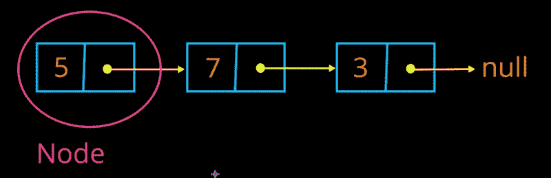
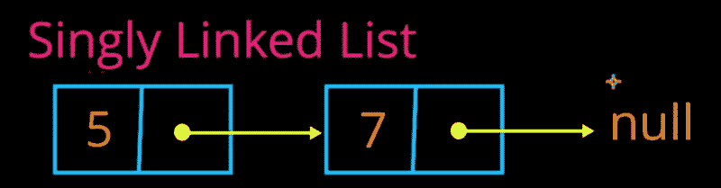
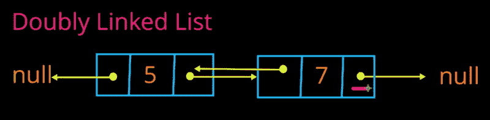
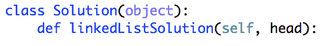

# Python 面试问题指南:如何编写链表

> 原文：<https://www.freecodecamp.org/news/python-interview-question-guide-how-to-code-a-linked-list-fd77cbbd367d/>

安东尼·西斯蒂利

# Python 面试问题指南:如何编写链表


Photo by [Mike Alonzo](https://unsplash.com/photos/Xe7za0JtTeM?utm_source=unsplash&utm_medium=referral&utm_content=creditCopyText) on [Unsplash](https://unsplash.com/search/photos/link?utm_source=unsplash&utm_medium=referral&utm_content=creditCopyText)

我一直理解链表的核心概念，但从来没有付诸实践。

直到几年前我第一次接受亚马逊的采访时，我才意识到我根本不知道链表的概念是如何转化成代码的。


*My face during my first ever Amazon interview*

这就是我写这篇指南的原因！

我的目标是帮助你找到一份软件工程师的工作。

我想涵盖很多链表面试问题，这篇文章是这个过程的第一步。所以让我们开始吧。

### 什么是链表？

链表是一种数据结构，由许多称为“节点”的小型数据结构组成这些节点链接在一起形成一个列表。



An entire Linked List, made up of 3 Nodes linked together.

#### 每个节点包含 2 个属性

1.  它的价值。这可以是任何东西:整数、字符、字符串、对象等等。
2.  指向序列中下一个节点的指针。

#### 一些定义

**“头节点”:**头节点只是链表中的第一个节点。从上面的例子中我们可以看到，包含“5”的节点是第一个节点，因此是头节点。

**“尾节点”:**尾节点是序列中的最后一个节点。因为它是最后一个节点，所以它指向 null，因为序列中没有下一个节点。在上面的例子中，包含“3”的节点是尾节点。

### 单键与双键

说到链表，主要有两种。

那些“单”连接的，和那些“双”连接的。

**单链表**是指每个节点最多只指向 1 个其他节点，即它前面的节点。上面的例子展示了这一点。



An example of a singly linked list.

**双重链接**是指每个节点可以指向另外 2 个节点，它前面的节点**和后面的节点。**从下面的例子可以看出，由于头节点(5)之前没有节点，所以它的一个指针指向 null。



An example of a doubly linked list.

### 好吧，我都明白。但是代码是如何工作的呢？

编码链表可以是一个 **4 行的问题，也可以是一个 400 行的问题。**看你想怎么接近了。

在最简单的层面上，就像我们讨论过的，一个链表只是一堆连接的节点。

因此，创建这个结构真正需要的是一个节点对象。

```
class linkedListNode:    def __init__(self, value, nextNode=None):        self.value = value        self.nextNode = nextNode
```

在这里，我们可以看到我们简单地创建了一个具有 value 和 nextNode 属性的类。

要创建一个节点，我们只需传入一个值。

```
node1 = linkedListNode("3") # "3"node2 = linkedListNode("7") # "7"node3 = linkedListNode("10") # "10"
```

这里，我们创建了 3 个单独的节点。

下一步只是将它们连接在一起。

```
node1.nextNode = node2 node2.nextNode = node3 
```

上面的第一行使 node1 指向 node2:

"3" →"7"

上面的第二行使 node2 指向 node3:

"7"→"10"

总的来说，我们剩下一个如下所示的链表:

“3”→”7"→”10"→Null

**注意:“10”指向 null，因为 node3 没有分配 nextNode，默认 nextNode 为 Null。**

就像我之前提到的，有很多不同的方法可以做到这一点。这只是最简单的。

如果你想创建一个完整的 LinkedList 类，[这段视频](https://www.youtube.com/watch?v=6sBsF13n5ig)将深入探讨如何去做。

### 遍历链表

如果你正在做一个编程面试，你被问到一个链表问题，你不会得到所有的节点。

你得到的只是头节点。



All that’s being passed in here is the head node.

从头部节点，您必须获得列表其余部分。

首先让我们了解如何从 Python 中的一个节点获取值和 nextNode。

假设我们有一个简单命名为“节点”的节点。

获取节点的值:

```
node.value
```

获取节点的下一个节点:

```
node.nextNode
```

#### **遍历**

我们要做的第一件事是创建一个名为“currentNode”的变量来跟踪我们所在的节点。我们想首先将它分配给我们的头节点。

```
currentNode = head
```

现在我们要做的就是简单地检查当前节点是否为空。如果不是，我们使我们的“当前节点”等于“当前节点”的“下一个节点”。

```
currentNode = node1while currentNode is not None:    currentNode = currentNode.nextNode
```

假设我们有下面这个链表:“3”→“7”→“10”。

我们的头和第一个“当前节点”是“3”。

当我们做的时候

```
currentNode = currentNode.nextNode
```

我们将“currentNode”重新分配给当前节点的邻居，在本例中是“7”。

这一直持续到 currentNode 指向 None，在这种情况下循环停止。

这是 Python 中遍历链表的基本方法。

[链接到 Github 上的代码。](https://github.com/AtotheY/YoutubeTutorials/blob/master/Introductions/linkedListOnlyNodes.py)

### 插入元素

当你把一个元素插入到一个链表中时，你把它插入到后面，除非另外指定。

让我们用下面的例子:

“3”→”7"→”10"→Null

假设我们想插入一个“4”。

我们只需找到尾节点，在本例中为“10”，并将其 nextNode 设置为我们的“4”节点。

“3”→”7"→”10"→“4”→Null

```
node4 = linkedListNode("4")node3.nextNode = node4
```

现在假设我们在面试，我们只有头部节点。

我们简单地遍历链表来找到尾部。一旦我们有了尾部，我们只需将它的 nextNode 设置为我们创建的新节点。

```
def insertNode(head, valuetoInsert):    currentNode = head    while currentNode is not None:        if currentNode.nextNode is None:            currentNode.nextNode = linkedListNode(valuetoInsert)            return head        currentNode = currentNode.nextNode
```

### 删除元素

删除可能会有点棘手。

让我们举同样的例子。

“3”→”7"→”10"→Null

如果我们想删除“7 ”,我们需要做的就是将“3”指向“10 ”,这样“7”就不会被引用。

“3”→“10”→空

为此，我们必须遍历列表，不仅要跟踪当前节点，还要跟踪前一个节点。

我们还必须考虑头节点是我们想要删除的节点。

在下面的代码中，我们简单地删除了我们想要删除的值的第一个实例。

请注意，有许多方法可以实现这一点，下面的解决方案可能不是您一生中看到的最干净的代码。然而，在面试最激烈的时候，面试官可能不会期待教科书式的完美代码。

```
def deleteNode(head, valueToDelete):    currentNode = head    previousNode = None    while currentNode is not None:        if currentNode.value == valueToDelete:            if previousNode is None:                 newHead = currentNode.nextNode                currentNode.nextNode = None                return newHead # Deleted the head            previousNode.nextNode = currentNode.nextNode            return head        previousNode = currentNode        currentNode = currentNode.nextNode    return head # Value to delete was not found.
```

在上面的代码中，一旦我们找到了想要删除的节点，我们就将前一个节点的“nextNode”设置为已删除节点的“nextNode ”,以将其从列表中完全删除。

### 大 O 时间复杂度分析

****注意* *以上是上述节点结构的时间复杂度，最有可能出现在面试中。在实际情况下，您可以将属性存储在 LinkedList 类中以降低这些复杂性。**

n’=链表中元素的数量。

**插入到链表的后面—** 我们遍历所有 n 个元素，找到尾部并插入新的节点。 **O(n)**

**插入到链表的前面—** 我们简单地创建新的节点，并将其 nextNode 设置为头部。不需要遍历列表。 **O(1)**

**遍历—** 我们一次遍历所有 n 个元素。 **O(n)**

**删除—** 最坏的情况是，我们删除的节点是最后一个节点，导致我们遍历整个列表。 **O(n)**

### 你现在可以处理链表面试问题了！

你现在已经有了开始处理链表面试问题所需的基础知识！

他们可以从简单开始，然后很快变得强硬起来。

在下一篇文章中，我将介绍一些常见的问题和解决这些问题的技巧。

如果你是一名学生，希望在未来两年内得到你梦想中的实习或全职工作，现在就开始练习吧！

我建立了一个社区( [www.theforge.ca](http://www.theforge.ca) )，在那里我们将学生与导师和行业专家联系起来，帮助他们找到理想的工作。

感谢阅读，祝你好运！