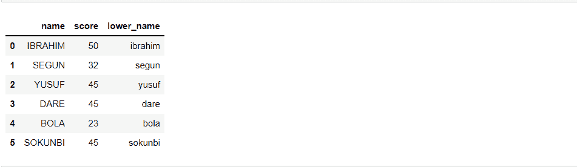

# Python Lambda 函数的工作原理——用示例解释

> 原文：<https://www.freecodecamp.org/news/python-lambda-function-explained/>

Python 的优点之一是它通常是最直观的编程语言之一。尽管如此，某些概念可能难以掌握和理解。lambda 函数就是其中之一。

我去过那里。当我刚开始学习 Python 的时候，我跳过了 lambda 函数，因为它对我来说不太清楚。但是随着时间的推移，我开始明白了。所以不要担心——如果你也在为此挣扎，我会帮你的。

本教程将教你什么是 lambda 函数，何时使用它，并且我们将回顾一些 lambda 函数经常应用的常见用例。事不宜迟，让我们开始吧。

## 什么是 Lambda 函数？

Lambda 函数类似于用户定义的函数，但没有名称。它们通常被称为匿名函数。

当你想创建一个只包含简单表达式的函数时，Lambda 函数是非常有效的——也就是说，表达式通常是一条语句中的一行。当你想用一次这个函数时，它们也很有用。

## 如何定义 Lambda 函数

您可以像这样定义 lambda 函数:

```
lambda argument(s) : expression 
```

1.  `lambda`是 Python 中定义匿名函数的关键字。
2.  `argument(s)`是一个占位符，它是一个变量，用来保存要传递给函数表达式的值。一个 lambda 函数可以有多个变量，这取决于你想要实现什么。
3.  `expression`是您要在 lambda 函数中执行的代码。

注意，匿名函数没有 return 关键字。这是因为匿名函数一旦执行，就会自动返回函数中表达式的结果。

让我们看一个 lambda 函数的例子，看看它是如何工作的。我们将它与常规的用户定义函数进行比较。

假设我想写一个函数，返回两倍于我传递给它的数。我们可以如下定义用户定义的函数:

```
def f(x):
  return x * 2

f(3)
>> 6 
```

现在对于一个λ函数。我们将像这样创建它:

```
lambda x: x * 3 
```

正如我上面解释的，lambda 函数没有 return 关键字。因此，它将自己返回表达式的结果。其中的 x 也用作要传递到表达式中的值的占位符。你想怎么改都行。

现在，如果你想调用一个 lambda 函数，你将使用一种称为立即调用函数的方法。看起来像这样:

```
(lambda x : x * 2)(3)

>> 6 
```

这样做的原因是因为 lambda 函数没有一个你可以调用的名字(它是匿名的)，当你想调用它时，你需要把整个语句括起来。

## 什么时候应该使用 Lambda 函数？

您应该使用 lambda 函数来创建简单的表达式。例如，不包含 if-else、for-loops 等复杂结构的表达式。

所以，举例来说，如果你想创建一个带有 for 循环的函数，你应该使用用户定义的函数。

## Lambda 函数的常见用例

### 如何将 Lambda 函数用于 Iterables

iterable 本质上是由一系列值组成的任何东西，比如字符、数字等等。

在 Python 中，可迭代对象包括字符串、列表、字典、范围、元组等等。使用 iterables 时，可以将 lambda 函数与两个常用函数结合使用:`filter()`和`map()`。

#### `Filter()`

当您希望关注 iterable 中的特定值时，可以使用 filter 函数。以下是过滤函数的语法:

```
filter(function, iterable) 
```

如您所见，筛选函数需要另一个函数，该函数包含将在 iterable 上执行的表达式或操作。

比如说我有一个`[1, 2, 3, 4, 5, 6, 7, 8, 9, 10]`之类的列表。现在假设我只对列表中除以 2 余数为 0 的值感兴趣。我可以利用`filter()`和一个 lambda 函数。

首先，我将使用 lambda 函数来创建我想要导出的表达式，如下所示:

```
lambda x: x % 2 == 0 
```

然后我会像这样把它插入到过滤函数中:

```
list1 = [1, 2, 3, 4, 5, 6, 7, 8, 9, 10]
filter(lambda x: x % 2 == 0, list1)

>> <filter at 0x1e3f212ad60> # The result is always filter object so I will need to convert it to list using list()

list(filter(lambda x: x % 2 == 0, list1))
>> [2, 4, 6, 8, 10] 
```

#### `Map()`

每当您想要修改 iterable 中的每个值时，就可以使用`map()`函数。

```
map(function, iterable) 
```

例如，假设我想对下面列表中的所有值进行 2 次幂运算。我可以像这样使用 lambda 和 map 函数轻松地做到这一点:

```
list1 = [2, 3, 4, 5]

list(map(lambda x: pow(x, 2), list1))
>> [4, 9, 16, 25] 
```

### 熊猫系列

使用 lambda 函数的另一个地方是在数据科学中从 Pandas 创建数据框。系列是数据框列。您可以使用 lambda 函数来处理序列中的所有值。

例如，如果我有一个包含以下各列的数据框，并且想要将“名称”列中的值转换为小写，我可以使用 Pandas apply 函数和 Python lambda 函数来实现，如下所示:

```
import pandas as pd

df = pd.DataFrame(
    {"name": ["IBRAHIM", "SEGUN", "YUSUF", "DARE", "BOLA", "SOKUNBI"],
     "score": [50, 32, 45, 45, 23, 45]
    }
) 
```


```
df["lower_name"] = df["name"].apply(lambda x: x.lower()) 
```

apply 函数会将序列中的每个元素应用到 lambda 函数。lambda 函数将根据您传递给它的表达式为每个元素返回一个值。在我们的例子中，表达式是小写每个元素。



## 结论

在本教程中，您学习了 lambda 函数的基础知识以及如何应用它。感谢您花时间阅读本文。