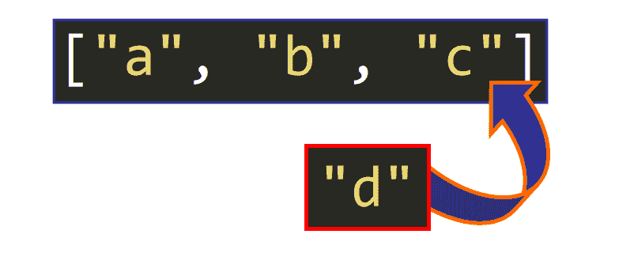
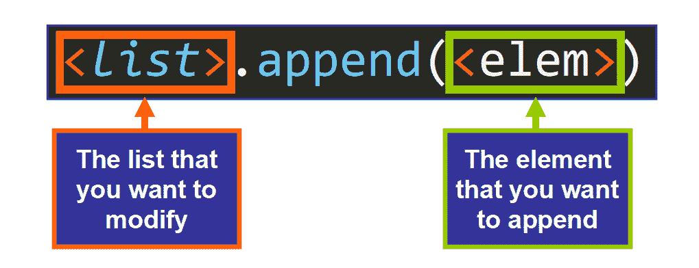
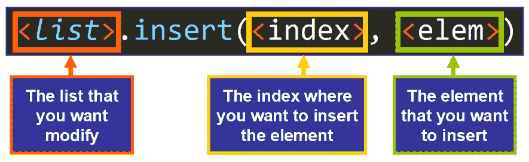
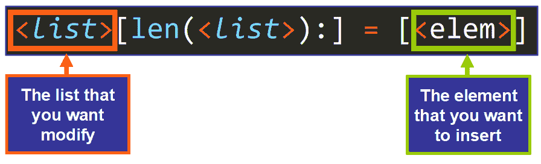

# python List Append——如何向数组中添加元素，用例子解释

> 原文：<https://www.freecodecamp.org/news/python-list-append-how-to-add-an-element-to-an-array-explained-with-examples/>

## 欢迎

嗨！如果你想学习如何使用`**append()**`方法，那么这篇文章就是为你准备的。这是一个强大的列表方法，您肯定会在 Python 项目中使用它。

**在这篇文章中，你将学到:**

*   为什么以及何时应该使用`append()`。
*   怎么称呼。
*   它的效果和返回值。
*   它如何等价于`insert()`和带有适当参数的字符串切片。

您会发现将`append()`应用于字符串、整数、浮点、布尔、列表、元组和字典的例子。

让我们开始吧！✨

## 🔹目的

使用这种方法，您可以**将单个元素添加到列表**的末尾。

在这里你可以看到`append()`的图形效果:



💡**提示:**要添加单个元素的序列，您需要使用`extend()`方法。

## 🔸语法和参数

这是调用此方法时需要使用的基本语法:



💡**提示:**点非常重要，因为`append()`是一个方法。当我们调用一个方法时，我们在列表后面用一个点来表示我们想要“修改”或者“影响”那个特定的列表。

如您所见，`append()`方法只接受一个参数，即您想要追加的元素。此元素可以是任何数据类型:

*   整数
*   线
*   浮动
*   布尔代数学体系的
*   另一份名单
*   元组
*   词典
*   自定义类的实例

基本上，可以在 Python 中创建的任何值都可以追加到列表中。

**💡提示:**语法的第一个元素(列表)通常是一个引用列表的变量。

### 例子

这是一个调用`append()`的示例:

```
>>> musical_notes = ["C", "D", "E", "F", "G", "A"]
>>> musical_notes.append("B")
```

*   首先，定义列表并将其赋给一个变量。
*   然后，使用这个变量我们调用`append()`方法，传递我们想要追加的元素(字符串`"B"`)作为参数。

## 🔹效果和回报价值

这个方法**改变了**(改变)内存中的原始列表。它并不像我们直觉上认为的那样返回列表的新副本，而是返回`None`。因此，只要调用这个方法，就可以修改原始列表。

在我们之前的例子中:

```
>>> musical_notes = ["C", "D", "E", "F", "G", "A"]
>>> musical_notes.append("B")
```

您可以看到(如下)原始列表在添加元素后被修改了。最后一个元素现在是`"B"`，原始列表现在是修改后的版本。

```
>>> musical_notes
['C', 'D', 'E', 'F', 'G', 'A', 'B']
```

通过将这个值赋给一个变量并打印出来，可以确认`append()`的返回值是`None`:

```
>>> musical_notes = ["C", "D", "E", "F", "G", "A"]
>>> a = musical_notes.append("B")
>>> print(a)
None
```

## 🔸例子

现在您已经知道了`append()`方法的目的、语法和效果，让我们看一些它在各种数据类型中的使用示例。

### 追加字符串

```
>>> top_players = ["gino234", "nor233", "lal453"]
>>> top_players.append("auop342")

# The string was appended
>>> top_players
['gino234', 'nor233', 'lal453', 'auop342']
```

### 追加一个整数

```
>>> data = [435, 324, 275, 567, 123]
>>> data.append(456)

>>> data
[435, 324, 275, 567, 123, 456]
```

### 追加一个浮点数

```
>>> data = [435.34, 324.35, 275.45, 567.34, 123.23]
>>> data.append(456.23)

>>> data
[435.34, 324.35, 275.45, 567.34, 123.23, 456.23]
```

### 追加一个布尔值

```
>>> values = [True, True, False, True]
>>> values.append(False)

>>> values
[True, True, False, True, False]
```

### 附加一份清单

该方法将一个元素追加到列表的末尾，因此如果您将一个列表作为参数传递，整个列表将作为一个元素追加(它将是原始列表中的一个嵌套列表)。

```
>>> data = [[4.5, 4.8, 5.7], [2.5, 2.6, 2.7]]
>>> data.append([6.7, 2.3])

>>> data
[[4.5, 4.8, 5.7], [2.5, 2.6, 2.7], [6.7, 2.3]]
```

### 追加一个元组

这对元组完全一样，整个元组作为单个元素追加。

```
>>> data = [[4.5, 4.8, 5.7], [2.5, 2.6, 2.7]]
>>> data.append((6.7, 2.3))

>>> data
[[4.5, 4.8, 5.7], [2.5, 2.6, 2.7], (6.7, 2.3)] 
```

**💡提示:**如果需要添加一个列表或者元组的元素作为原列表的单个元素，需要使用`extend()`方法，而不是`append()`。要了解更多，你可以阅读我的文章:[Python List Append VS Python List Extend——用数组方法示例解释区别](https://www.freecodecamp.org/news/python-list-append-vs-python-list-extend/)

### 附加一本词典

类似地，如果您试图追加一个字典，整个字典将作为列表中的一个元素被追加。

```
>>> data = [{"a": 1, "b": 2}]
>>> data.append({"c": 3, "d": 4})
>>> data
[{'a': 1, 'b': 2}, {'c': 3, 'd': 4}]
```

## 🔹追加和插入的等价性

一个有趣的提示是，如果我们传递正确的参数，`insert()`方法可以等价于`append()`。

`insert()`方法用于在列表中的特定索引(位置)插入一个元素。

这是用于调用`insert()`方法的语法:



**使其等同于`append()` :**

*   index 的值必须是列表的长度(`len(<list>)`)，因为我们希望该元素是列表的最后一个元素。

这里有一个例子，说明使用带有这些参数的 insert 的结果相当于`append()`:

```
>>> musical_notes = ["C", "D", "E", "F", "G", "A"]
>>> musical_notes.insert(len(musical_notes), "B")
>>> musical_notes
['C', 'D', 'E', 'F', 'G', 'A', 'B']
```

但是正如你所看到的，`append()`要简洁实用得多，所以通常推荐在这种情况下使用。

## 🔸追加和列表切片的等价性

在`append()`方法和列表切片之间还有一个有趣的等价关系。



这个语法实际上是将包含元素`[<elem>]`的列表指定为列表的最后一部分(end)。这里可以看到结果相当于`append()`:

```
>>> musical_notes = ["C", "D", "E", "F", "G", "A"]
>>> musical_notes[len(musical_notes):] = ["B"]
>>> musical_notes
['C', 'D', 'E', 'F', 'G', 'A', 'B']
```

这些都是有趣的选择，但是出于实际目的，我们通常使用`append()`,因为它是 Python 提供的无价工具。它精确、简洁、易于使用。

**我真的希望你喜欢我的文章，并发现它很有帮助。**现在你可以在你的 Python 项目中使用`append()`了。[查看我的在线课程](https://www.udemy.com/user/estefania-cn/)。在推特上关注我。⭐️