# Python 列表。append()–如何在 Python 中向列表添加项目

> 原文：<https://www.freecodecamp.org/news/python-list-append-how-to-add-an-item-to-a-list-in-python/>

列表是 Python 中最有用和最通用的数据类型之一。列表是任意对象的集合，就像其他编程语言中的数组一样。

在本教程中，您将学习:

*   列表概述及其定义方式。
*   使用`list.append()`、`list.extend`和`list.insert()`在列表中插入数据的方法。
*   每种数据插入方法的语法、代码示例和输出。
*   如何使用列表插入和删除方法实现堆栈？

### 先决条件

对于本教程，您需要:

*   Python 3。
*   您选择的代码编辑器。

## Python 中的列表

列表具有以下属性，这些属性使它们强大而灵活:

*   列表是有序的。
*   使用索引来访问列表。第一个索引从`0`开始。
*   列表是可变的和动态的，这意味着它们可以在创建后被修改。

### 如何在 Python 中创建列表

在 Python 中使用方括号创建列表。

我们可以将它们留空，并在程序的后面提供值:

```
# Create an empty list

programming_lang = []
```

我们还可以在创建列表时提供值:

```
# Create a filled list

programming_lang = ['P','Y','T','H','O','N']
```

这将创建一个列表，如下图所示:

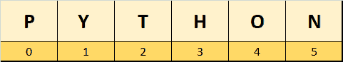

List items against indexes

### 如何访问列表中的项目

由于列表项是有序的，您可以使用它们的索引来访问它们。

语法:`list[index]`。

在下图中，“P”位于索引“0”处，而“H”位于索引“3”处。


让我们写一个简短的程序来定义一个列表并访问它的条目:

```
programming_lang = ['P','Y','T','H','O','N']

print(programming_lang)

print("At index 0:", programming_lang[0])
print("At index 3:",programming_lang[3])
```

Defining and printing a list

**输出:**

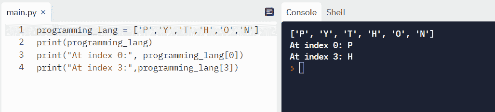

您还可以使用负索引来访问项目，其中`-1`表示最后一个列表项目。如果我们想访问上面列表中的最后一项，我们也可以使用 index `-1`:

```
programming_lang = ['P','Y','T','H','O','N']

print(programming_lang)

print("At index -1:", programming_lang[-1])
print("At index -5:",programming_lang[-5])
```

Accessing list via negative index.

**输出:**

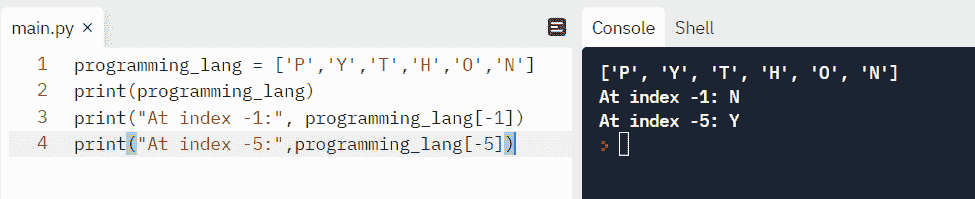

### 如何找到列表的长度

我们可以使用`len()`方法很容易地找到一个列表的长度。

```
programming_lang = ['P','Y','T','H','O','N']

print("Length of List: ",len(programming_lang))
```

Finding the length of a list

**输出:**

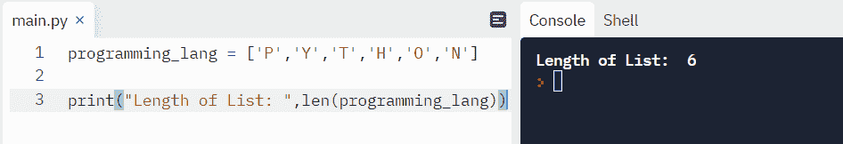

Finding a list's length.

## 向列表添加项的方法

我们可以使用以下任何一种方法来扩展列表:

*   `list.insert()`–在列表中的任意位置插入单个元素。
*   `list.append()`–总是在列表末尾添加项目(字符串、数字、列表)。
*   `list.extend()`–将可迭代项目(列表、元组、字符串)添加到列表末尾。

### 如何用`insert()`在列表中插入项目

您可以使用`insert()`方法在列表中的任何索引处插入项目。还有更多的插入方法，我们将在这篇文章的后面看到它们。

插入的语法:`insert(index, element)`。

**insert()示例:**

```
# create a list of odd numbers
odd_n = [1,3,5,7,9]

# '21' is inserted at index 3 (4th position)
odd_n.insert(3, 21)

print('List of odd #:', odd_n) 
```

插入前:

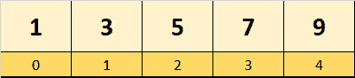

插入后:

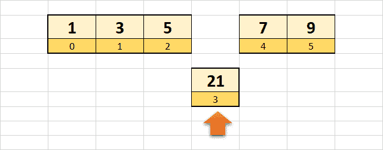

**输出:**

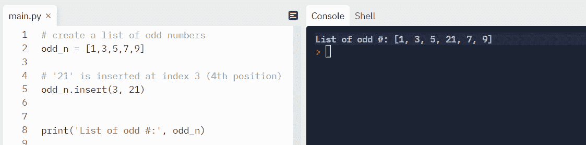

### 如何使用`list.append()`将项目添加到列表中

我们可以使用`list.append()`在列表末尾添加一个**单项**。

**语法** : `list.append(item)`。

**举例:**

```
# crops list
crops = ['corn', 'wheat', 'cotton']

# Add 'cane' to the list
crops.append('cane')

print('Updated crops list: ', crops)
```

**输出:**

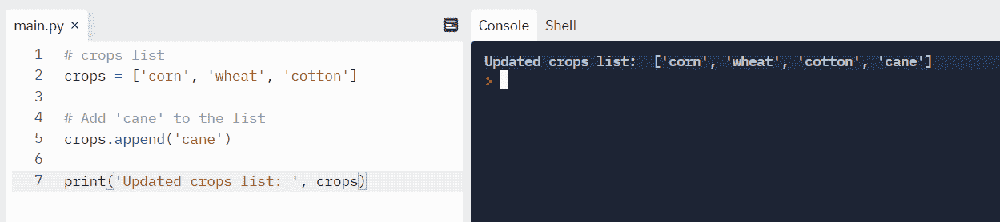

⚠️Note 认为，试图追加多个项目会出现异常，因为`list.append()`只接受一个参数。

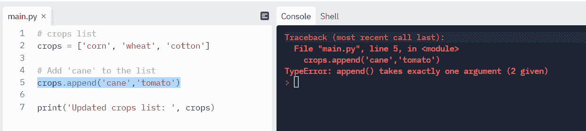

Unable to add multiple items using `list.append()`.

### 如何使用`list.extend()`在列表中添加多个项目

我们可以使用`extend()`方法将多个条目添加到一个列表中。

以下示例将两个列表合并成一个列表。

```
# create a list
even_numbers = [2, 4, 8]

# create another list
more_even_numers = [100, 400]

# add all elements of even_numbers to more_even_numbers
even_numbers.extend(more_even_numers)

print('List after extend():', even_numbers) 
```

**输出:**

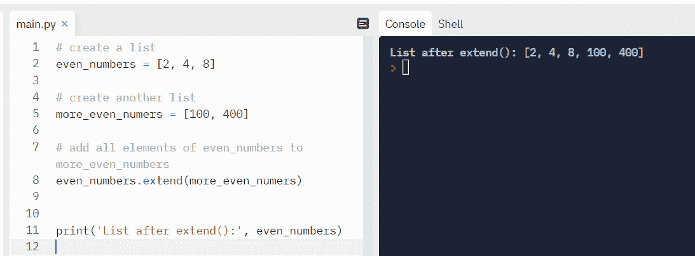

Extending a list using `extend()`.

### 在 Python 中扩展列表的其他方法:

#### 列表切片

切片允许我们在列表中选择一定范围的值。

语法如下所示:

`list[starting index:upto index]`

举个例子，

*   list[1:3]将返回从索引 1 开始直到(不包括)索引 3 的项目。
*   缺少左索引意味着从索引 0 开始。
    *   `list[:len(list)]`表示从索引 0 开始，一直持续到结束。
*   缺少右索引意味着直到最后一个索引。
    *   `list[0:]`表示从索引 0 开始，直到最后一项。

让我们看看如何使用切片来添加列表。

**举例**:

```
A = [99, 100, 101]
B = [103, 104, 105]

# starting from last index +1, add items from list B

A[len(A):] = B

print('A =', A)
```

**输出:**

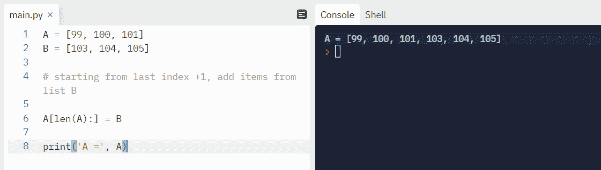

#### 使用+运算符组合数组

让我们使用`+`操作符将两个数组`odd`和`even`合并成一个列表。

**举例:**

```
odd = [1, 3, 5, 7]
even = [2, 4, 6, 8]

odd += even    # odd = odd + even

# Output: [1, 2, 3, 4]
print('odd and even combined =', odd)
```

**输出:**

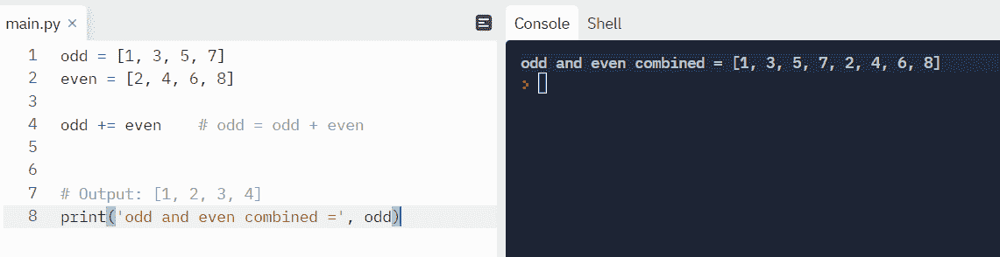

### 如何使用`for loop`和`append()`填充空列表

有两种方法来填充空列表:使用带有`append()`的`for`循环和使用列表理解。

我们先用`append()`循环`for`。

**举例:**

在这个例子中，我们正在计算一个正方形的面积，并将结果添加到一个数组中。

```
# Return area of square
# Area of square = length x length

def square_area(side_length):
     result = []
     for length in side_length:
         result.append(length*length)
     return result

lengths = [1, 4, 9, 20]
print(square_area(lengths)) 
```

**输出:**

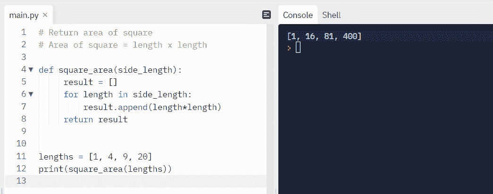

我们可以通过完全跳过`for loop - append()`组合，转而使用列表理解，让上面的代码变得高效。让我们在下一节看看如何实现。

### 如何使用列表理解来填充空列表

列表理解通过将`for`循环和`append()`组合成一行，使得代码简单易读。

我们可以修改前面的例子来实现列表理解。注意这里注释掉的行:

```
# Return area of square
# Area of square = length x length

def square_area(side_length):
     #result = []
     #for length in side_length:
     #    result.append(length*length)
     return [length*length for length in side_length]

lengths = [1, 4, 9, 20]
print(square_area(lengths)) 
```

`return [length*length for length in side_length]` is list comprehension.

**输出:**

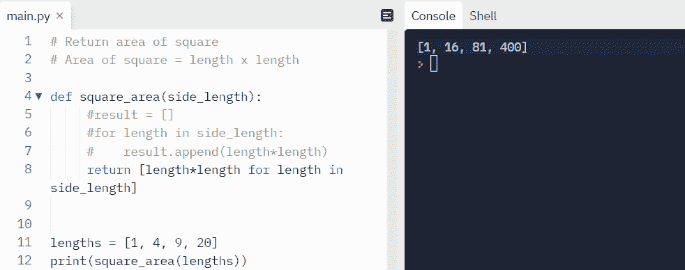

填充空列表的两种方法都是有效的，适用于不同的场景。

## `Append()` vs `Insert()` vs `Extend()`

总是在列表末尾添加一个项目。当只需要插入一个项目时，这很有用。

但是如果您需要进行多次添加，`extend()`是一个更好的选择，因为它在一个批处理中添加可迭代的项目。

当需要在特定索引或索引范围插入时，应该使用`Insert()`。

## 如何实现堆栈(LIFO)

### 什么是堆栈(LIFO)？

堆栈是按照后进先出的顺序排列的项目。最后走的项目是最先出来的项目。堆栈的一个例子是照片编辑应用程序中的撤销/重做堆栈。

下图直观地解释了堆栈。

您可以使用`append()`添加项目。

您可以使用`pop()`删除项目。`pop()`方法[详见此处](https://docs.python.org/3/tutorial/datastructures.html#:~:text=no%20such%20item.-,list.pop(%5Bi%5D),-Remove%20the%20item)。

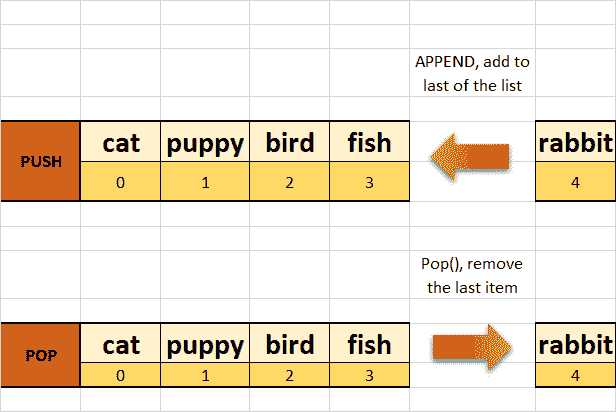

Queue visualization

### 编码堆栈

让我们创建一个堆栈类，首先在`init`方法中声明一个空列表。

方法将一个条目添加到列表中。

`pop()`方法使用`pop()`删除列表的最后一项。如果列表中没有项目，将引发异常。

__ `len` __ 方法决定了堆栈的长度。

最后，__ `repr` **__** 以可读格式返回输出。

**类别定义:**

```
class Stack:
    def __init__(stack_t):
        stack_t._items = []

    def push(stack_t, item):
        stack_t._items.append(item)

    def pop(stack_t):
        try:
            return stack_t._items.pop()
        except IndexError:
            print("Stack is empty, all items deleted")

    def __len__(stack_t):
        return len(stack_t._items)

    def __repr__(stack_t):
        return f"stack ({stack_t._items})" 
```

**代码体:**

让我们调用类函数，看看实际的输出。

```
stack = Stack()

# Push items onto the top of the stack
stack.push(3)
stack.push(5)
stack.push(8)
stack.push(99)

 # Print stack

print(stack)

# Find the length of the stack
print("Length of stack is:" ,len(stack))

# Pop items from the stack
print("popping last item")
stack.pop()
print(stack)

print("popping last item again")
stack.pop()
print(stack)

print("finally the stack is")

print(stack)
```

**输出:**

我们在堆栈中添加了 3、5、8、99。接下来，我们打印堆栈及其长度。之后，我们弹出两个项目，每次都打印堆栈。

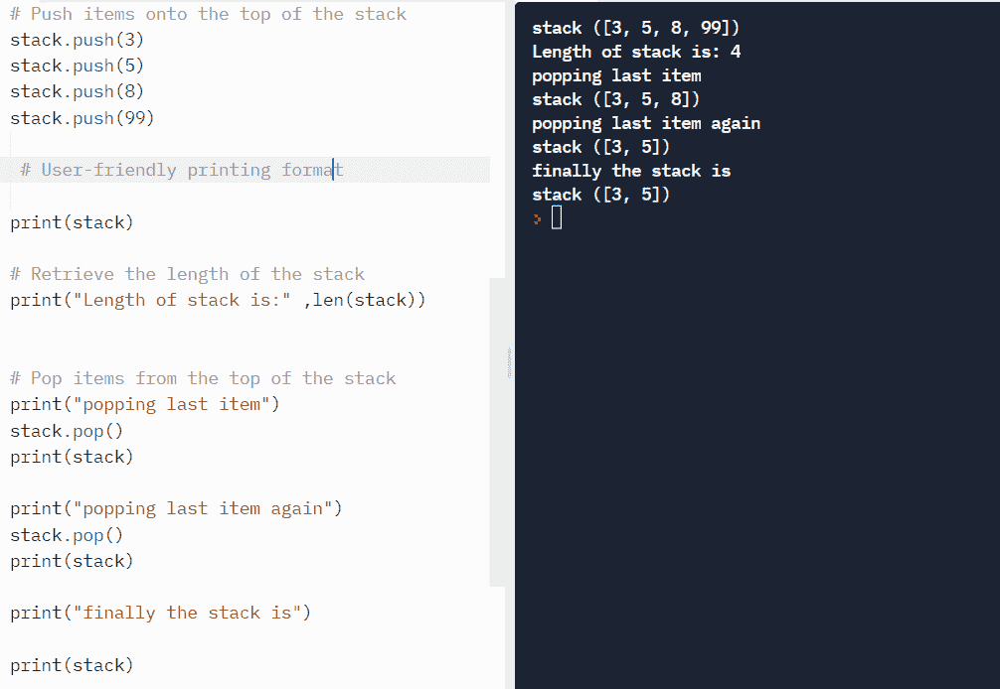

## 包扎

在本教程中，我们学习了列表创建方法。我们还看了一些例子以及一个栈的实际实现，以了解它是如何工作的。

你从这个教程中学到的最喜欢的东西是什么？在 [Twitter](https://twitter.com/hira_zaira) 上告诉我！

你可以在这里阅读我的其他帖子[。](https://www.freecodecamp.org/news/author/zaira/)