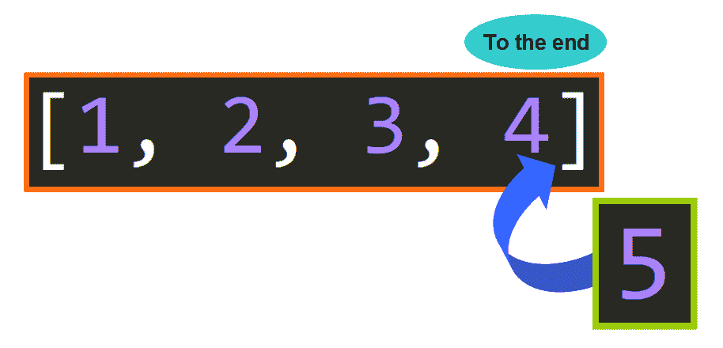
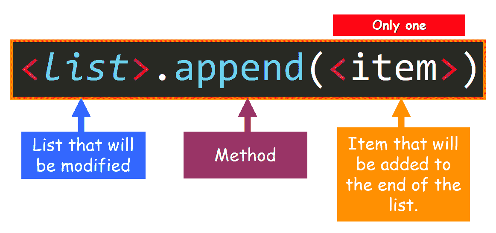
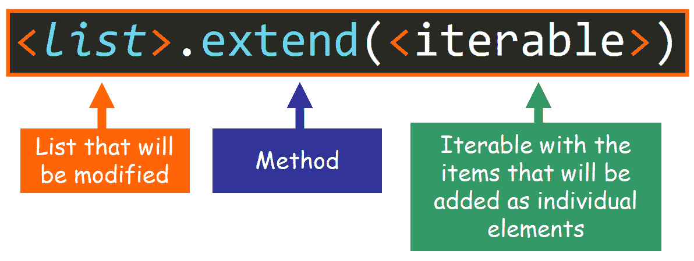
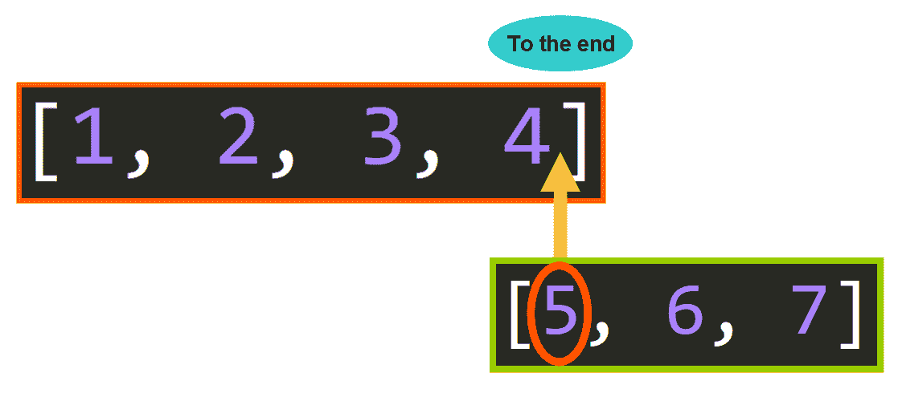
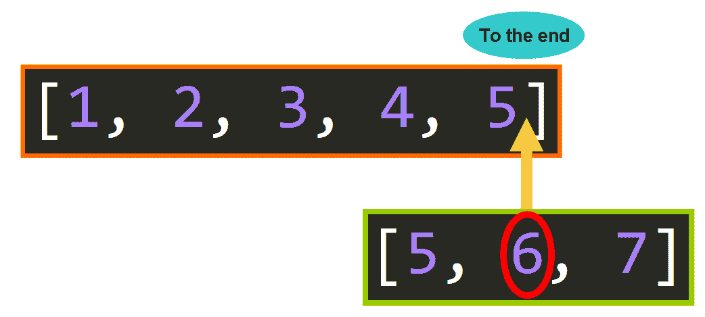
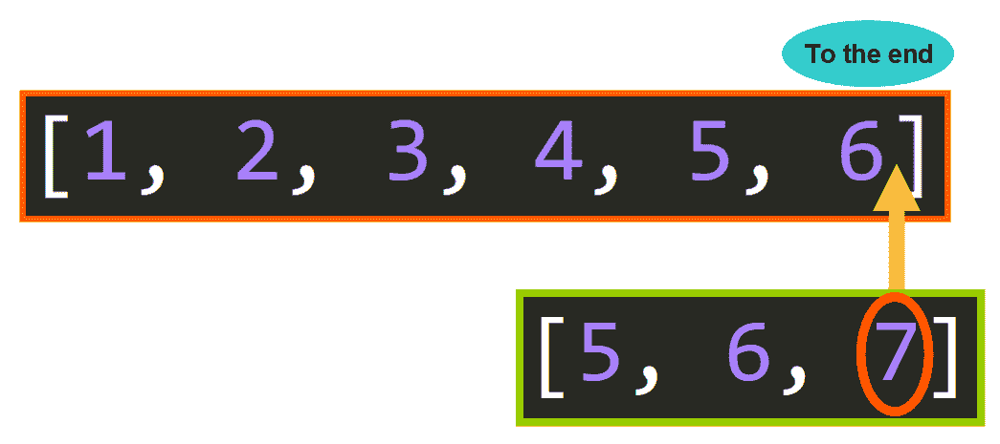

# Python List Append 与 Python List Extend——用数组方法示例解释区别

> 原文：<https://www.freecodecamp.org/news/python-list-append-vs-python-list-extend/>

## 🔹欢迎

如果你想学习如何与`.append()`和`.extend()`一起工作，并了解他们的不同，那么你来对地方了。它们是强大的列表方法，您肯定会在 Python 项目中使用它们。

在本文中，您将了解到:

*   如何以及何时使用`.append()`方法。
*   如何以及何时使用`.extend()`方法。
*   他们的主要区别。

我们开始吧。✨

## 🔸附加

让我们看看`.append()`方法是如何在幕后工作的。

### 用例

当你想在列表的末尾添加一个条目时，你应该使用这个方法。

**💡提示:**您可以添加任何数据类型的项目，因为列表可以包含不同数据类型的元素。



### 语法和参数

要调用`.append()`方法，您需要使用以下语法:



**从左到右:**

*   将被修改的列表。这通常是引用列表的变量。
*   一个点，后面跟着方法名`.append()`。
*   在括号内，将被添加到列表末尾的项目。

💡**小贴士:**圆点很重要。这叫做“点记数法”。圆点基本上表示“在这个特定的列表上调用这个方法”，因此该方法的效果将应用于位于圆点之前的列表。

### 例子

这里有一个如何使用`.append()`的例子:

```
# Define the list
>>> nums = [1, 2, 3, 4]

# Add the integer 5 to the end of the existing list
>>> nums.append(5)

# See the updated value of the list
>>> nums
[1, 2, 3, 4, 5]
```

💡**提示:**当您使用`.append()`时，原始列表被修改。该方法不会创建列表的副本，而是改变内存中的原始列表。

让我们假设我们正在进行一项研究，并且我们想要分析使用 Python 收集的数据。我们需要在现有的值列表中添加一个新的度量。

我们怎么做呢？我们用`.append()`法！

你可以在这里看到:

```
# Existing list
>>> nums = [5.6, 7.44, 6.75, 4.56, 2.3]

# Add the float (decimal number) to the end of the existing list
>>> nums.append(7.34)

# See the updated value of the list
>>> nums
[5.6, 7.44, 6.75, 4.56, 2.3, 7.34]
```

### 等于...

如果您熟悉字符串、列表或元组切片，那么`.append()`在幕后真正做的事情相当于:

```
a[len(a):] = [x]
```

通过这个例子，你可以看到它们是等价的。

使用`.append()`:

```
>>> nums = [5.6, 7.44, 6.75, 4.56, 2.3]
>>> nums.append(4.52)
>>> nums
[5.6, 7.44, 6.75, 4.56, 2.3, 4.52]
```

使用列表切片:

```
>>> nums = [5.6, 7.44, 6.75, 4.56, 2.3]
>>> nums[len(nums):] = [4.52]
>>> nums
[5.6, 7.44, 6.75, 4.56, 2.3, 4.52]
```

### 追加序列

现在，你觉得这个例子怎么样？你认为会输出什么？

```
>>> nums = [5.6, 7.44, 6.75, 4.56, 2.3]
>>> nums.append([5.67, 7.67, 3.44])
>>> nums
# OUTPUT?
```

你准备好了吗？这将是输出:

```
[5.6, 7.44, 6.75, 4.56, 2.3, [5.67, 7.67, 3.44]]
```

你可能会问，为什么要把完整的列表作为一个单独的项目添加进来？这是因为`.append()`方法将整个项目添加到列表的末尾。如果项目是诸如列表、字典或元组之类的序列，则整个序列将作为现有列表的单个项目添加。

这里我们有另一个例子(如下)。在这种情况下，项目是一个元组，它作为列表的单个项目添加，而不是作为单个项目添加:

```
>>> names = ["Lulu", "Nora", "Gino", "Bryan"]
>>> names.append(("Emily", "John"))
>>> names
['Lulu', 'Nora', 'Gino', 'Bryan', ('Emily', 'John')]
```

## 🔹扩展

现在让我们深入研究一下`.extend()`方法的功能。

### 用例

如果您需要将几个项目作为单个项目添加到列表中，您应该使用这个方法。

让我用你刚学会的一个熟悉的朋友来说明这个方法的重要性:`.append()`法。根据您目前所学，如果我们想使用`.append()`将几个**单个的**项目添加到一个列表中，我们需要多次使用`.append()`，就像这样:

```
# List that we want to modify
>>> nums = [5.6, 7.44, 6.75, 4.56, 2.3]

# Appending the items
>>> nums.append(2.3)
>>> nums.append(9.6)
>>> nums.append(4.564)
>>> nums.append(7.56)

# Updated list
>>> nums
[5.6, 7.44, 6.75, 4.56, 2.3, 2.3, 9.6, 4.564, 7.56]
```

我敢肯定，你可能认为这不是很有效率，对不对？如果我需要添加数千或数百万个值呢？我不能为这个简单的任务写成千上万行。那要花很长时间！

所以我们来看一个替代方案。我们可以将想要添加的值存储在一个单独的列表中，然后使用 for 循环根据需要多次调用`.append()`:

```
# List that we want to modify
>>> nums = [5.6, 7.44, 6.75, 4.56, 2.3]

# Values that we want to add
>>> new_values = [2.3, 9.6, 4.564, 7.56]

# For loop that is going to append the value
>>> for num in new_values:
	nums.append(num)

# Updated value of the list
>>> nums
[5.6, 7.44, 6.75, 4.56, 2.3, 2.3, 9.6, 4.564, 7.56]
```

这样效率更高吧？我们只写了几行。但是有一种更有效、更易读、更简洁的方法来达到同样的目的:`.extend()`！

```
>>> nums = [5.6, 7.44, 6.75, 4.56, 2.3]
>>> new_values = [2.3, 9.6, 4.564, 7.56]

# This is where the magic occurs! No more for loops
>>> nums.extend(new_values)

# The list was updated with individual values
>>> nums
[5.6, 7.44, 6.75, 4.56, 2.3, 2.3, 9.6, 4.564, 7.56]
```

让我们看看这个方法在幕后是如何工作的。

### 语法和参数

要调用`.extend()`方法，您需要使用以下语法:



**从左到右:**

*   将被修改的列表。这通常是一个引用列表的变量。
*   一个圆点`.`(到目前为止，一切都和以前一模一样)。
*   方法的名称`extend`。(现在情况开始发生变化...).
*   在括号内，是一个 **iterable** (列表、元组、字典、集合或字符串)，包含将作为列表的单个元素添加的项目。

**💡提示:**根据 [Python 文档](https://docs.python.org/3/glossary.html)，iterable 被定义为“能够一次返回一个成员的对象”。Iterables 可以在 for 循环中使用，因为它们一次返回一个元素，所以我们可以对它们中的每一个做一些事情，每次迭代一个。

### 在幕后

让我们看看`.extend()`是如何在幕后运作的。这里我们有一个例子:

```
# List that will be modified
>>> a = [1, 2, 3, 4]

# Sequence of values that we want to add to the list a
>>> b = [5, 6, 7]

# Calling .extend()
>>> a.extend(b)

# See the updated list. Now the list a has the values 5, 6, and 7
>>> a
[1, 2, 3, 4, 5, 6, 7]
```

您可以将`.extend()`视为一种方法，它按照 iterable 中各个元素出现的顺序追加这些元素。

在这种情况下，我们有一个列表`a = [1, 2, 3, 4]`，如下图所示。我们还有一个列表`b = [5, 6, 7]`，它包含了我们想要添加的值的序列。该方法获取`b`的每个元素，并以相同的顺序将其添加到列表`a`中。



Step 1\. First element is appended. 



Step 2\. Second element appended. 



Step 3\. Third element appended

这个过程完成后，我们有了更新的列表`a`，我们可以将这些值作为`a`的单个元素来处理。


💡**提示:**用于扩展列表`a`的列表`b`在此过程后保持不变。你可以在给`.extend()`打完电话后使用它。这就是证据:

```
>>> a = [1, 2, 3, 4]
>>> b = [5, 6, 7]
>>> a.extend(b)
>>> a
[1, 2, 3, 4, 5, 6, 7]

# List b is intact!
>>> b
[5, 6, 7]
```

### 例子

您可能很想知道当您传递不同类型的 iterables 时，`.extend()`方法是如何工作的。让我们看看下面的例子:

**对于元组:**
如果传递一个元组，过程完全一样。元组的单个元素按照它们出现的顺序一个接一个地被附加。

```
# List that will be extended
>>> a = [1, 2, 3, 4]

# Values that will be added (the iterable is a tuple!)
>>> b = (1, 2, 3, 4)

# Method call
>>> a.extend(b)

# The value of the list a was updated
>>> a
[1, 2, 3, 4, 1, 2, 3, 4]
```

**对于集合:**
如果你传递一个集合也会发生同样的情况。集合中的元素被一个接一个地追加。

```
# List that will be extended
>>> a = [1, 2, 3, 4]

# Values that will be appended (the iterable is a set!)
>>> c = {5, 6, 7}

# Method call
>>> a.extend(c)

# The value of a was updated
>>> a
[1, 2, 3, 4, 5, 6, 7]
```

**对于字符串:**
字符串的工作方式与`.extend()`方法略有不同。字符串中的每个字符都被视为一个“项目”，因此这些字符按照它们在字符串中出现的顺序一个接一个地被追加。

```
# List that will be extended
>>> a = ["a", "b", "c"]

# String that will be used to extend the list
>>> b = "Hello, World!"

# Method call
>>> a.extend(b)

# The value of a was updated
>>> a
['a', 'b', 'c', 'H', 'e', 'l', 'l', 'o', ',', ' ', 'W', 'o', 'r', 'l', 'd', '!']
```

**对于字典:**
当您将字典作为参数传递给`.extend()`时，它们会有一种特殊的行为。在这种情况下，字典的**键**被逐一追加。不会附加相应的键值对的值。

在下面的例子中，键是“d”、“e”和“f”。这些值被附加到列表`a`中。

```
# List that will be extended
>>> a = ["a", "b", "c"]

# Dictionary that will be used to extend the list
>>> b = {"d": 5, "e": 6, "f": 7}

# Method call
>>> a.extend(b)

# The value of a was updated
>>> a
['a', 'b', 'c', 'd', 'e', 'f']
```

### 等于...

`.extend()`做的事情相当于`a[len(a):] = iterable`。这里我们有一个例子来说明它们是等价的:

使用`.extend()`:

```
# List that will be extended
>>> a = [1, 2, 3, 4]

# Values that will be appended
>>> b = (6, 7, 8)

# Method call
>>> a.extend(b)

# The list was updated
>>> a
[1, 2, 3, 4, 6, 7, 8] 
```

使用列表切片:

```
# List that will be extended
>>> a = [1, 2, 3, 4]

# Values that will be appended
>>> b = (6, 7, 8)

# Assignment statement. Assign the iterable b as the final portion of the list a
>>> a[len(a):] = b

# The value of a was updated
>>> a
[1, 2, 3, 4, 6, 7, 8]
```

结果是一样的，但是使用`.extend()`可读性更好，也更简洁，对吗？Python 确实提供了惊人的工具来改进我们的工作流程。

## 🔸总结他们的不同之处

现在您已经知道如何使用`.append()`和`.extend()`，让我们来看看它们的主要区别:

*   **效果** : `.append()`将单个元素添加到列表的末尾，而`.extend()`可以将多个单独的元素添加到列表的末尾。
*   **参数** : `.append()`以单个元素作为参数，而`.extend()`以一个 iterable 作为参数(列表、元组、字典、集合、字符串)。

**我真的希望你喜欢我的文章，并发现它很有帮助。**现在你可以在你的 Python 项目中使用`.append()`和`.extend()`了。[查看我的在线课程](https://www.udemy.com/user/estefania-cn/)。在推特上关注我。⭐️