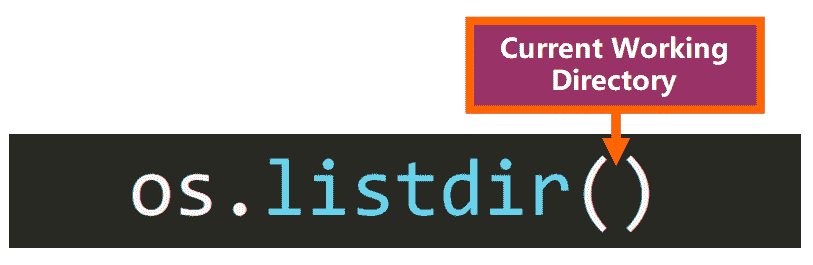
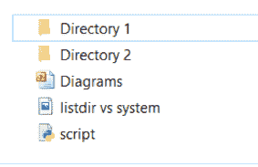
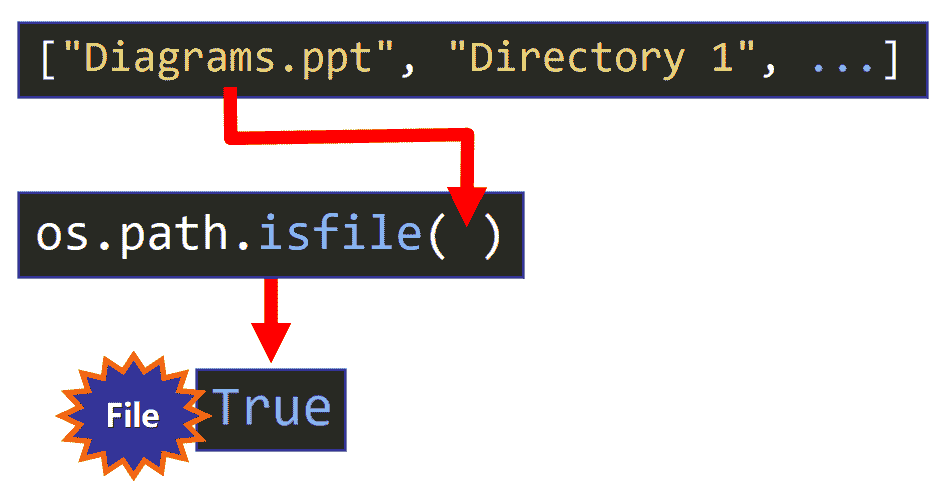
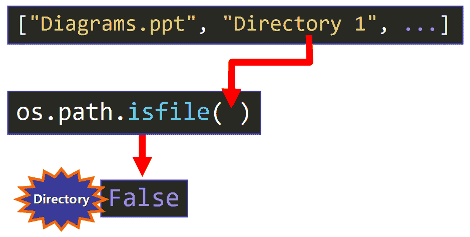
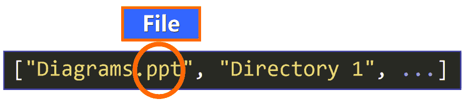
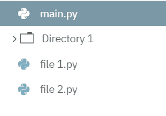

# 目录指南中的 Python 列表文件——listdir VS system(“ls”)举例说明

> 原文：<https://www.freecodecamp.org/news/python-list-files-in-a-directory-guide-listdir-vs-system-ls-explained-with-examples/>

## 🔹欢迎

如果您想了解这些功能在幕后是如何工作的，以及如何使用它们的全部功能，那么这篇文章就是为您准备的。

我们将从深入了解使用`listdir`和`system`的基本概念开始:

*   内置的 Python `os`模块以及如何导入。
*   “目录”和“当前工作目录”的概念。
*   如何检查和更改您当前的工作目录。
*   绝对路径和相对路径的区别。

然后，我们将深入函数本身:

*   如何使用`listdir`功能以及何时使用。
*   如何使用`system("ls")`功能以及何时使用。
*   两者的例子以及它们如何在幕后工作。

我们开始吧！⭐

## 🔸操作系统模块

我们将要讨论的两个函数:`listdir()`和`system()`属于`os`模块。该模块包括用于与操作系统交互的功能，执行如下操作:

*   创建新目录。
*   重命名现有目录。
*   删除目录。
*   显示当前工作目录的路径。
*   多得多！

**💡温馨提示:**

*   **目录**就是我们通常所说的“文件夹”，我们通常在其中存储相关文件和/或其他目录，在称为子目录的目录中创建目录层次结构。目录的一个例子是你的“文档”文件夹。
*   一个**模块**是一个包含相关 Python 代码的文件。

### 如何导入操作系统模块

要在脚本中使用`os`模块，您需要“导入”它。导入模块意味着可以访问存储在模块中的所有函数和变量。当我们想在脚本中使用一个模块的代码时，我们导入它。

要导入`os`模块，只需在 Python 脚本的顶部包含这一行，或者在交互式 shell 中运行这一行:

```
import os
```

这将允许您访问`os`模块中定义的所有功能。

**💡提示:**这个模块在你安装 Python 3 的时候就已经安装好了，所以你马上就可以使用它了。

为了能够使用来自`os`模块的函数，您需要在您想要调用的函数名称前添加前缀`os.`，就像这样:

```
os.<function>(<params>)
```

例如:

```
os.mkdir("New Folder")
```

### 如何导入单个函数

如果您只想使用模块中的一两个函数，可以使用以下语法分别导入它们:

```
from <module> import <function1>, <function2>, ...
```

例如:

```
from os import listdir, system
```

在这种情况下，您可以像平常一样调用脚本中的函数，**不需要**添加前缀`os.`，就像这样:

```
<function>(<params>)
```

例如:

```
mkdir("New Folder")
```

## 🔹当前工作目录

现在让我们来看一个非常重要的概念，在开始使用`listdir`和`system`之前，你需要知道这个概念。您当前的工作目录，顾名思义，就是您当前工作的目录(文件夹)。

您可以从`os`模块使用此功能检查您当前的工作目录:

```
os.getcwd()
```

这将显示当前工作目录的路径。

💡**提示:** `cwd`表示“当前工作目录”

### 从交互式 Shell 中

如果我在交互式 shell (Windows)中运行此命令，我会看到:

```
>>> os.getcwd()
'C:\\Users\\estef\\AppData\\Local\\Programs\\Python\\Python38-32'
```

这是我当前工作目录的完整路径:

```
'C:\\Users\\estef\\AppData\\Local\\Programs\\Python\\Python38-32'
```

### 来自剧本

如果我从脚本中运行这个命令，如下所示:

```
import os
print(os.getcwd())
```

我明白了:

```
C:\Users\estef\Documents\freeCodeCamp\freeCodeCamp News\listdir vs system
```

脚本的完整路径(它在系统中的位置，在目录的层次结构中)。

💡**提示:**如果你运行一个脚本(Python 文件)，你当前的工作目录就是脚本当前所在的目录。

### 如何改变你当前的工作目录

您可以从`os`模块使用该命令更改当前工作目录:

```
os.chdir(<path>)
```

您需要指定新工作目录的路径，将其作为参数传递，格式为字符串。它可以是绝对路径，也可以是相对路径。

💡**提示:**

*   一个**绝对路径**指定了到达目标目录需要经过的所有目录序列。该路径从系统的根目录开始。

例如:

```
>>> import os
>>> os.chdir(r"C:\Users\estef\Documents\FreeCodeCamp\freeCodeCamp News\9 - listdir vs system")

# Checking current working directory:
>>> os.getcwd()
'C:\\Users\\estef\\Documents\\FreeCodeCamp\\freeCodeCamp News\\9 - listdir vs system'
```

注意，我在绝对路径前添加了一个`r`来将字符串转换成原始字符串。如果您使用了`\`而没有添加`r`，您将会得到一个错误，因为`\`符号将被视为一个特殊字符。

或者，您可以在路径中用正斜杠`/`替换反斜杠`\`:

```
>>> os.chdir("C:/Users/estef/Documents/FreeCodeCamp/freeCodeCamp News/9 - listdir vs system")

# Checking current working directory
>>> os.getcwd()
'C:\\Users\\estef\\Documents\\FreeCodeCamp\\freeCodeCamp News\\9 - listdir vs system'
```

*   一个**相对路径**指定了您想要沿着它找到目标目录的路径，但是现在该路径从您的**当前**工作目录开始。它比绝对路径更短更简单。

例如，如果您当前的工作目录包含一个子目录(文件夹)`Directory 1`，您可以使用相对路径移动到该目录(想象它是另一个文件夹中的一个文件夹，我们将越来越深入到层次结构中)，如下所示:

```
>>> import os
>>> os.chdir(".\Directory 1")

# Check current working directory
>>> os.getcwd()
'C:\\Users\\estef\\Documents\\FreeCodeCamp\\freeCodeCamp News\\9 - listdir vs system\\Directory 1'
```

💡**提示:**相对路径`.\Directory 1`开头的点(`.`)代表当前工作目录。一个双点(`..`)用于向上移动到“父”目录。

现在你已经掌握了真正理解`listdir`和`system`如何工作所需的所有背景知识，让我们来看看它们的细节。

## 🔸 Listdir

我们将从`listdir`函数开始。让我们揭开它的神秘面纱。？

### 目的和返回值

根据 [Python 文档](https://docs.python.org/3/library/os.html#os.listdir)，该函数的目的是:

> 返回一个列表，其中包含由路径给出的目录中的条目名称。

基本上，这个函数返回一个列表，其中包含当前在调用该函数时指定的特定目录中找到的所有文件和目录的名称。

💡**提示:**列表不会有特定的顺序，即使你通常按字母顺序对元素进行排序。

### 语法和参数

要调用`listdir`，将需要使用以下语法:


参数`path`就是您想要可视化的目录的绝对或相对路径。在 Python 3.2 及更高版本中，此参数是可选的。默认情况下，如果不传递参数，该路径将指向您当前的工作目录。



请记住，在调用该函数之前，您必须导入`os`模块。

💡**提示:**如果使用这个 import 语句`from os import listdir`单独导入函数，可以省略前缀`os.`，如下所示:


### 使用案例和优势

函数`listdir`非常有帮助，因为它可以在 Python 运行的任何操作系统上工作，所以如果 Python 安装在您的设备上，该函数将正确工作。

现在我们来谈一点它的返回值。因为它返回一个列表，我们可以将这个列表存储在一个变量中，并在我们的程序中使用它。

例如，假设我们想对给定目录中的所有文件做一些事情，比如将图像转换为黑白或修改其内容。我们可以使用 for 循环来实现，就像这样:

```
images = os.listdir(<path>)

for image in images:
	# Do something to the image 
```

当然，你需要定义在循环中发生了什么，但是这是一个你可以用这个函数做什么的例子。

太棒了，对吧？

但是如果我们想使用 for 循环，让文件和目录在同一个列表中会有一点问题，对吗？我们需要添加一个条件来检查每个元素的类型。怎样才能做一个只包含文件名(不包含目录)的列表，反之亦然？

让我们看看！✨

### 仅包含文件

如果您想“过滤”由`os.listdir()`返回的列表，只包括**文件**(没有目录)，您可以使用这行代码:

```
list(filter(os.path.isfile, os.listdir(<path>)))
```

💡**提示:**您可以定制`<path>`参数或者省略它来使用您当前的工作目录。

让我们看一个我当前工作目录的例子(我使用的是 Windows):



我的目录(文件夹)有:

*   两个子目录(主文件夹中的文件夹)
*   一个 PowerPoint 文件
*   一个图像(。png 文件)
*   一个 Python 脚本

如果我从`script.py`文件中调用`listdir`函数并打印返回的列表:

```
print(os.listdir())
```

这是输出:

```
['Diagrams.ppt', 'Directory 1', 'Directory 2', 'listdir vs system.png', 'script.py']
```

您可以看到我当前工作目录中的所有文件和目录都包括在内。

要过滤列表以仅包含文件，我们可以使用以下语句:

```
print(list(filter(os.path.isfile, os.listdir())))
```

现在的输出是:

```
['Diagrams.ppt', 'listdir vs system.png', 'script.py']
```

注意目录是如何被“过滤”的，这正是我们想要的。

### 仅包括目录

类似地，如果您想“过滤”列表，只包括**目录**，您可以使用这行代码:

```
list(filter(os.path.isdir, os.listdir(<path>)))
```

现在的输出是:

```
['Directory 1', 'Directory 2']
```

正是我们想要的。但是这种说法在幕后是如何运作的呢？让我们看看。

### 如何在幕后工作

使用以下语法调用 filter 函数:

```
filter(<function>, <list>)
```

它基本上是根据调用作为第一个参数传递的函数所返回的真值来“过滤”第二个参数(列表)的元素(在它们各自的命令中是`os.path.isfile()`或`os.path.isdir()`):

```
print(list(filter(os.path.isfile, os.listdir())))
```

```
list(filter(os.path.isdir, os.listdir()))
```

这两个功能:

```
os.path.isfile(<path>)

os.path.isdir(<path>)
```

如果参数是文件或目录，则分别返回`True`。

基于这些真值，列表的元素将包括(或不包括)在最终的“过滤”列表中。由`os.listdir()`返回的列表元素被逐个传递给这些函数，以检查它们是否是文件(或目录)。

例如:如果我们有这行代码:

```
filter(os.path.isfile, os.listdir())))
```

并且`os.listdir()`返回这个列表:

```
['Diagrams.ppt', 'Directory 1', 'Directory 2', 'script.py']
```

列表的第一个元素(`'Diagrams.ppt'`)作为参数传递给`os.path.isfile()`以检查它是否是一个文件:

```
os.path.isfile('Diagrams.ppt') # True
```



函数调用返回`True`，所以它是一个文件，并且包含在列表中。

但是如果元素是一个目录:

```
os.path.isfile('Directory 1') # False
```



函数调用返回`False`，所以不在列表中。对列表中的每个元素继续这个过程，直到新列表只包含文件名。

然后，由于`filter()`返回一个 iterable，我们使用`list()`从这个 iterable 中创建一个列表:

```
list(filter(os.path.isfile, os.listdir()))
```

我们打印它，因为我们正在处理一个 Python 文件(脚本):

```
print(list(filter(os.path.isfile, os.listdir())))
```

💡**提示:**您可以通过查看列表元素的名称后是否有扩展名(类型)来直观地识别它是代表文件还是目录。例如:`Diagrams.ppt`有一个`.ppt`扩展名，告诉你这是一个 PowerPoint 文件，但是一个目录没有扩展名，像`'Directory 1'`。



## 🔹系统(“ls”)

现在你已经知道了如何使用`listdir`，让我们看看`system()`函数是如何在幕后工作的，以及你如何使用它。

### 目的

根据 [Python 文档](https://docs.python.org/3/library/os.html#os.system),`system()`函数的目的是:

> 在子 shell 中执行命令(一个字符串)

基本上，这个函数接受一个命令(作为一个字符串)并执行它。

在本例中，我们传递的命令是`'ls'`，这是一个在 Linux 中使用的 Unix 命令，用于将目录的内容显示为标准输出。

与`listdir`不同，`system()`函数**不会返回列表**，如果我们传递`'ls'`命令，它只会在**显示**文件和目录列表作为标准输出。因此，如果您只想可视化列表，而不想在程序中实际使用它，那么您应该使用它。

### 语法和参数

要调用此函数，您需要使用以下语法:


它唯一的参数是您要执行的字符串格式的命令(用双引号或单引号括起来)。

特别是，`ls`命令可以让您看到当前工作目录的内容。

例如:如果这是我的工作目录(三个 Python 文件和一个子目录):



我调用了`system()`函数，就像这样:

```
>>> import os
>>> os.system("ls")
```

这是输出:

```
'Directory 1'  'file 1.py'  'file 2.py'   main.py
0
```

我们可以在控制台中看到标准输出(文件和目录列表):

```
'Directory 1'  'file 1.py'  'file 2.py'   main.py
```

返回值是:

```
0
```

💡**注意:**对于这些`system()`函数的例子，我正在使用一个名为 Repl.it 的在线命令行工具，因为我的计算机安装了 Windows，默认的命令提示符无法识别命令`ls`。

### 限制

这个函数的一个主要限制是，作为参数传递的命令必须被您正在使用的操作系统或环境所识别。

例如，在 Windows 中，默认情况下，在命令提示符下不会识别`ls`命令。如果您尝试运行它，将会看到以下错误:

> ' ls '不是内部或外部命令、可操作的程序或批处理文件。

Windows 中类似的命令是`'dir'`命令:

```
os.system('dir')
```

**💡提示:**在 Windows 上运行`ls`命令还有其他方法，比如使用识别 Unix 命令的终端程序，但是默认情况下 Windows 不识别`'ls'`命令。

### 返回值

根据 [Python 文档](https://docs.python.org/3/library/os.html#os.system):

> 在 Unix 上，返回值是以为 [`wait()`](https://docs.python.org/3/library/os.html#os.wait) 指定的格式编码的进程的退出状态。

和...

> 在 Windows 上，返回值是运行*命令*后系统 shell 返回的值。

💡**提示:**注意这个函数不返回列表。它只是将列表显示为标准输出，所以您不能像使用`listdir`那样将它存储在变量中。

### `ls`命令的变体

`os.system('ls')`的一个关键特性是它有许多有用和有趣的选项来定制如何呈现输出。让我们看看其中的一些。

**选项 1:** 我们可以使用命令`ls -l`显示文件和目录的更多信息，比如它们的大小、位置、修改日期和时间。

```
>>> import os
>>> os.system('ls -l')
total 12
drwxr-xr-x 1 runner runner  0 Apr  3 18:23 'Directory 1'
-rw-r--r-- 1 runner runner 11 Apr  3 18:38 'file 1.py'
-rw-r--r-- 1 runner runner 11 Apr  3 18:38 'file 2.py'
-rw-r--r-- 1 runner runner 11 Apr  3 18:38  main.py
0
```

**选项 2:** 为了能够更快地在视觉上识别目录，我们可以使用`ls -F`，它在目录名的末尾加上一个正斜杠`/`(见下面的`'Directory 1/'`)。

```
>>> import os
>>> os.system('ls -F')
'Directory 1'/  'file 1.py'  'file 2.py'   main.py
0
```

**选项 3:** 要按大小排序文件，我们可以使用命令`ls -lS`。

```
>>> import os
>>> os.system('ls -lS')
total 12
-rw-r--r-- 1 runner runner 11 Apr  3 18:38 'file 1.py'
-rw-r--r-- 1 runner runner 11 Apr  3 18:38 'file 2.py'
-rw-r--r-- 1 runner runner 11 Apr  3 18:38  main.py
drwxr-xr-x 1 runner runner  0 Apr  3 18:23 'Directory 1'
0
```

有更多的定制选项可以帮助您实现特定的目标。[在这里你可以找到更多关于`-ls`命令的信息](https://en.wikipedia.org/wiki/Ls)，以及你如何使用它的全部力量。

## 🔸列表目录与系统(“ls”)的摘要

*   **用途:** `listdir`返回指定路径(默认为当前工作目录)下的文件名和目录列表，`system("ls")`只显示为标准输出。
*   **操作系统:** `listdir`可以独立于您正在使用的操作系统使用。相比之下，`system('ls')`必须在识别`'ls'`命令的操作系统或环境中执行。
*   **定制:**如果需要使用`filter()`函数删除文件或目录，可以过滤`listdir`返回的列表，并且可以通过选项定制`system('ls')`的输出。

我真的希望你喜欢我的文章，并觉得它很有帮助。现在您可以在您的 Python 项目中使用这些函数了。[查看我的在线课程](https://www.udemy.com/user/estefania-cn/)。在[推特](https://twitter.com/EstefaniaCassN)上关注我。⭐️