# Python 换行符和如何不用换行符进行 Python 打印

> 原文：<https://www.freecodecamp.org/news/python-new-line-and-how-to-python-print-without-a-newline/>

欢迎光临！Python 中的新行字符是用来标记一行的结束和新行的开始。如果您想将输出打印到控制台并处理文件，了解如何使用它是非常重要的。

**在这篇文章中，你将学到:**

*   如何识别 Python 中的新行字符？
*   如何在字符串和打印语句中使用换行符。
*   如何编写不在字符串末尾添加新行字符的打印语句？

让我们开始吧！✨

## 🔹换行符

Python 中的换行符是:


**由两个字组成:**

*   一个反斜杠。
*   字母`n`。

如果您在字符串中看到此字符，这意味着当前行在该点结束，新的一行紧随其后开始:


您也可以在 **f 弦**中使用该字符:

```
>>> print(f"Hello\nWorld!")
```

## 🔸打印语句中的换行符

默认情况下，print 语句在字符串末尾添加一个新的行字符“幕后”。

像这样:

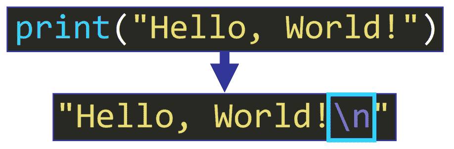

发生这种情况是因为，根据 [Python 文档](https://docs.python.org/3/library/functions.html#print):

内置`print`函数的`end`参数的缺省值是`\n`，所以字符串后面会追加一个新的行字符。

**💡提示:** Append 的意思是“加到最后”。

这是函数定义:


注意，`end`的值是`\n`，所以它将被添加到字符串的末尾。

如果您只使用一条 print 语句，您不会注意到这一点，因为只会打印一行:

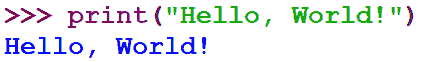

但是，如果在 Python 脚本中一个接一个地使用几个 print 语句:

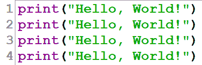

输出将被打印在单独的行中，因为`\n`已被“幕后”添加到每一行的末尾:

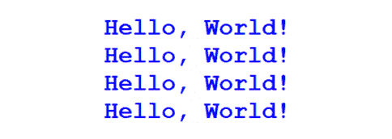

## 🔹如何在不换行的情况下打印

我们可以通过定制`print`函数的`end`参数的值来改变这个默认行为。

如果我们在本例中使用默认值:

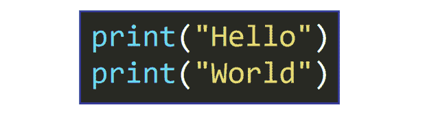

我们看到输出打印成两行:

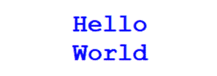

但是如果我们自定义`end`的值并将其设置为`" "`

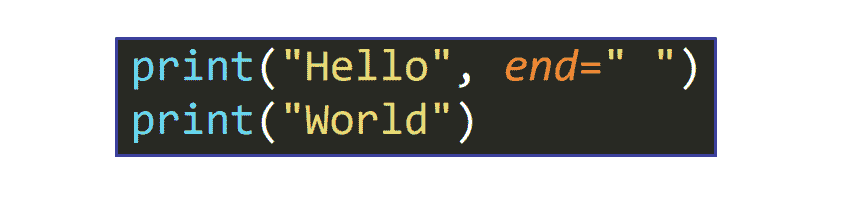

字符串末尾将添加一个空格，而不是新的行字符`\n`，因此两条打印语句的输出将显示在同一行:


您可以使用它在一行中打印一系列值，如下例所示:

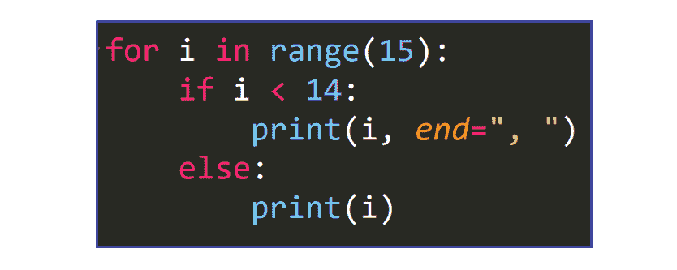

输出是:

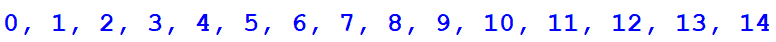

**💡提示:**我们添加一个条件语句来确保逗号不会被添加到序列的最后一个数字。

类似地，我们可以使用它在同一行中打印 iterable 的值:

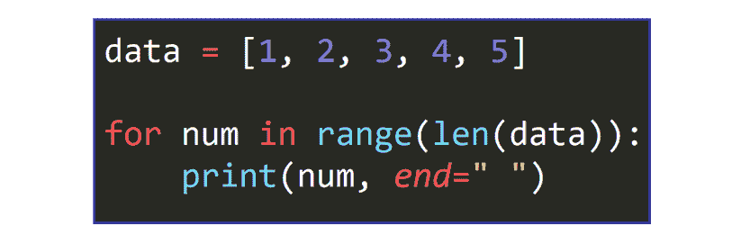

输出是:

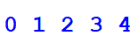

## 🔸文件中的换行符

新行字符`\n`也可以在文件中找到，但它是“隐藏”的。当您在文本文件中看到新的一行时，新的一行字符`\n`已经被插入。

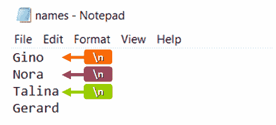

您可以通过使用`<file>.readlines()`读取文件来检查这一点，就像这样:

```
with open("names.txt", "r") as f:
    print(f.readlines())
```

输出是:

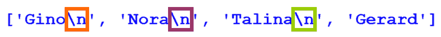

如您所见，文本文件的前三行以一个新行字符`\n`结束，该字符在“幕后”工作

**💡提示:**注意，只有文件的最后一行不以换行符结尾。

## 🔹概括起来

*   Python 中的新行字符是`\n`。它用于指示一行文本的结束。
*   您可以打印字符串，而不用添加新的一行`end = <character>`，其中`<character>`是用于分隔行的字符。

我真的希望你喜欢我的文章，并觉得它很有帮助。现在您可以在 Python 中使用新的行字符了。

查看我的在线课程。在[推特](https://twitter.com/EstefaniaCassN)上关注我。⭐️