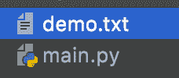
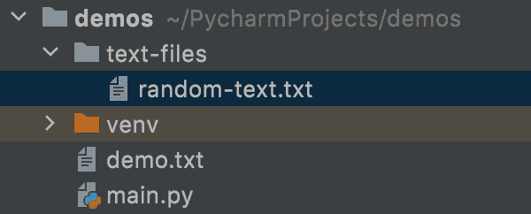
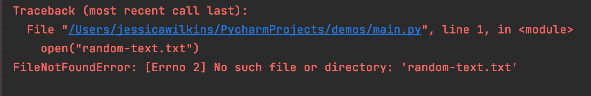
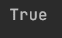
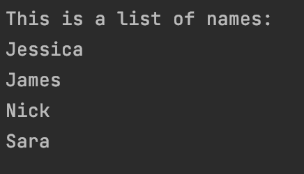
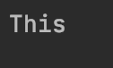
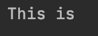
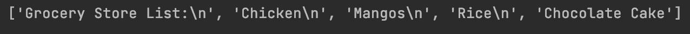
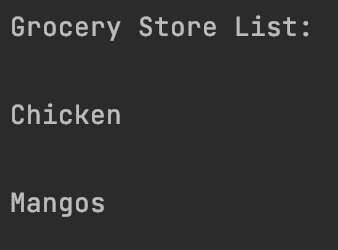

# Python 打开文件——如何逐行读取文本文件

> 原文：<https://www.freecodecamp.org/news/python-open-file-how-to-read-a-text-file-line-by-line/>

在 Python 中，有几种方法可以读取文本文件。

在本文中，我将介绍一下`open()`函数、`read()`、`readline()`、`readlines()`、`close()`方法和`with`关键字。

## Python 中的 open()函数是什么？

如果你想用 Python 阅读一个文本文件，你首先要打开它。

这是 Python 的`open()`函数的基本语法:

```
open("name of file you want opened", "optional mode")
```

### 文件名和正确的路径

如果文本文件和你当前的文件在同一个目录(“文件夹”)，那么你可以在`open()`函数中引用文件名。

```
open("demo.txt")
```

以下是两个文件位于同一目录的示例:



如果您的文本文件在不同的目录中，那么您将需要引用该文本文件的正确路径名。

在本例中，`random-text`文件位于与`main.py`不同的文件夹中:



为了在`main.py`中访问该文件，您必须在文件名中包含文件夹名称。

```
open("text-files/random-text.txt")
```

如果没有该文件的正确路径，您将会看到如下错误消息:

```
open("random-text.txt")
```



跟踪您所在的目录非常重要，这样您就可以引用正确的路径名。

### `open()`中的可选模式参数

处理文件时有不同的模式。默认模式是读取模式。

字母`r`代表读取模式。

```
open("demo.txt", mode="r")
```

也可以省略`mode=`，只写`"r"`。

```
open("demo.txt", "r")
```

还有其他类型的模式，如用于写入的`"w"`或用于追加的`"a"`。我不打算详细介绍其他模式，因为我们只是将重点放在读取文件上。

有关其他模式的完整列表，请通读[文档](https://docs.python.org/3/library/functions.html#open)。

### Python 中`open()`函数的附加参数

`open()`函数可以接受这些可选参数。

*   减轻
*   编码
*   错误
*   新行
*   关闭的
*   开启工具

要了解关于这些可选参数的更多信息，请通读[文档](https://docs.python.org/3/library/functions.html#open)。

## Python 中的 readable()方法是什么？

如果你想检查一个文件是否可读，那么你可以使用`readable()`方法。这将返回一个`True`或`False`。

该示例将返回`True`，因为我们处于读取模式:

```
file = open("demo.txt")
print(file.readable())
```



如果我把这个例子改成`"w"`(写)模式，那么`readable()`方法将返回`False`:

```
file = open("demo.txt", "w")
print(file.readable())
```


## Python 中的 read()方法是什么？

`read()`方法将把文件的所有内容作为一个字符串读取。如果文本文件中没有很多内容，这是一个很好的方法。

在这个例子中，我使用`read()`方法从`demo.txt`文件中打印出一个名字列表:

```
file = open("demo.txt")
print(file.read())
```



这个方法可以接受一个名为 size 的可选参数。不是读取整个文件，而是只读取其中的一部分。

如果我们修改前面的例子，我们可以通过添加数字 4 作为`read()`的参数，只打印出第一个单词。

```
file = open("demo.txt")
print(file.read(4))
```



如果省略 size 参数，或者如果该数字为负数，则将读取整个文件。

## Python 中的 close()方法是什么？

一旦你读完一个文件，关闭它是很重要的。如果你忘记关闭你的文件，那么这可能会导致问题。

这是一个如何关闭`demo.txt`文件的例子:

```
file = open("demo.txt")
print(file.read())
file.close()
```

### 如何在 Python 中使用`with`关键字关闭文件

确保文件关闭的一个方法是使用`with`关键字。这被认为是一种好的做法，因为文件会自动关闭，而不是您必须手动关闭它。

下面是如何使用关键字`with`重写我们的例子:

```
with open("demo.txt") as file:
    print(file.read())
```

## Python 中的 readline()方法是什么？

这个方法将从文件中读取一行并返回。

在本例中，我们有一个包含这两个句子的文本文件:

```
This is the first line
This is the second line
```

如果我们使用`readline()`方法，它只会打印文件的第一句话。

```
with open("demo.txt") as file:
    print(file.readline())
```


该方法还接受可选的 size 参数。我们可以修改示例，添加数字 7，以便只读取和打印出`This is`:

```
with open("demo.txt") as file:
    print(file.readline(7))
```



## Python 中的 readlines()方法是什么？

这个方法将读取并返回文件中所有行的列表。

在这个例子中，我们将使用`readlines()`方法把我们的杂货项目打印成一个列表。

```
with open("demo.txt") as file:
    print(file.readlines())
```



## 如何在 Python 中使用 for 循环从文件中读取行

这些不同读取方法的替代方法是使用`for loop`。

在这个例子中，我们可以通过遍历对象来打印出`demo.txt`文件中的所有条目。

```
with open("demo.txt") as file:
    for item in file:
        print(item)
```



## 结论

如果你想用 Python 阅读一个文本文件，你首先要打开它。

```
open("name of file you want opened", "optional mode") 
```

如果文本文件和你当前的文件在同一个目录(“文件夹”)，那么你可以在`open()`函数中引用文件名。

如果您的文本文件在不同的目录中，那么您将需要引用该文本文件的正确路径名。

`open()`函数接受可选的模式参数。默认模式是读取模式。

```
open("demo.txt", "r")
```

如果你想检查一个文件是否可读，那么你可以使用`readable()`方法。这将返回一个`True`或`False`。

```
file.readable()
```

`read()`方法将把文件的所有内容作为一个字符串读取。

```
file.read()
```

一旦你读完一个文件，关闭它是很重要的。如果你忘记关闭你的文件，那么这可能会导致问题。

```
file.close()
```

确保文件关闭的一个方法是使用`with`关键字。

```
with open("demo.txt") as file:
    print(file.read())
```

`readline()`方法将从文件中读取一行并返回。

```
file.readline()
```

方法将读取并返回文件中所有行的列表。

```
file.readlines()
```

这些不同读取方法的替代方法是使用`for loop`。

```
with open("demo.txt") as file:
    for item in file:
        print(item)
```

我希望您喜欢这篇文章，并祝您的 Python 之旅好运。