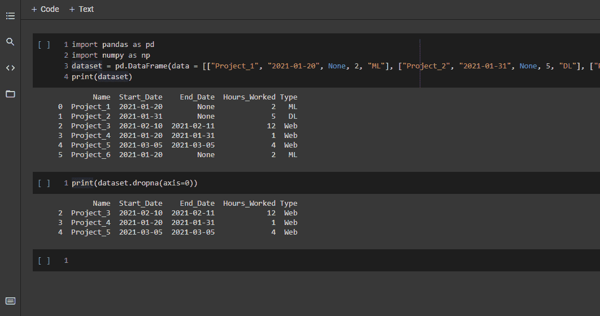
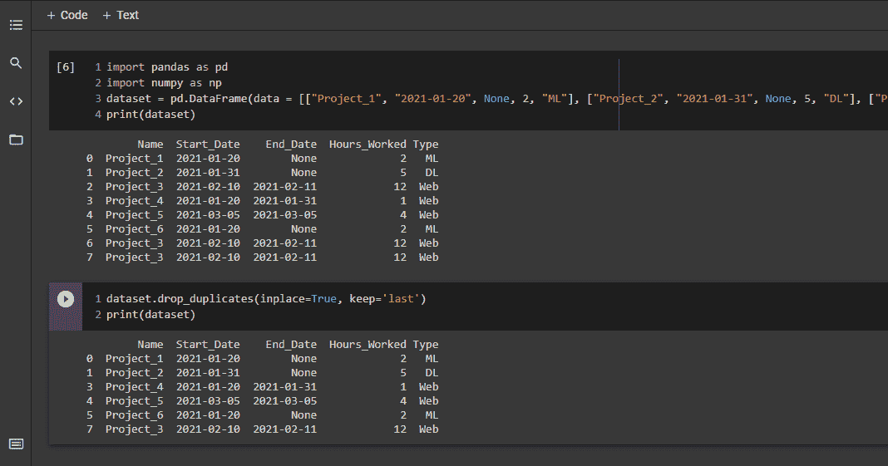
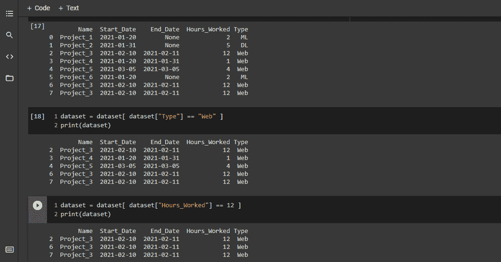
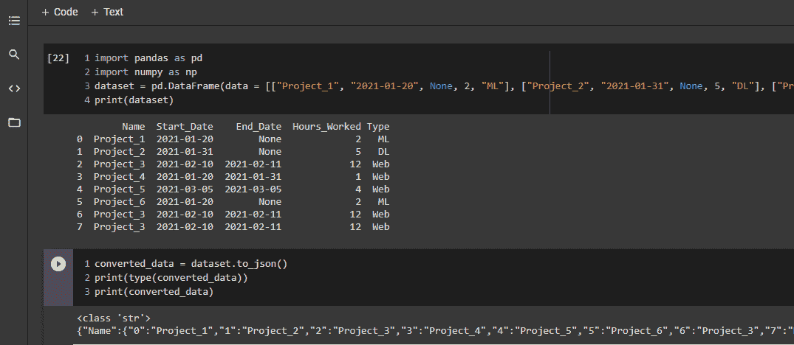
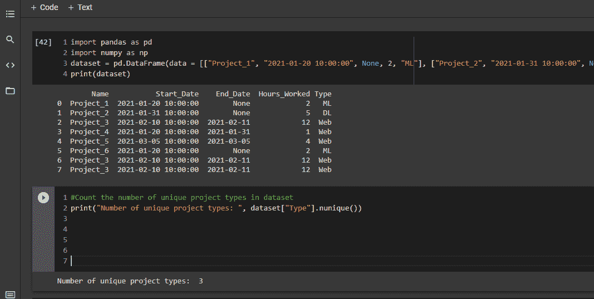
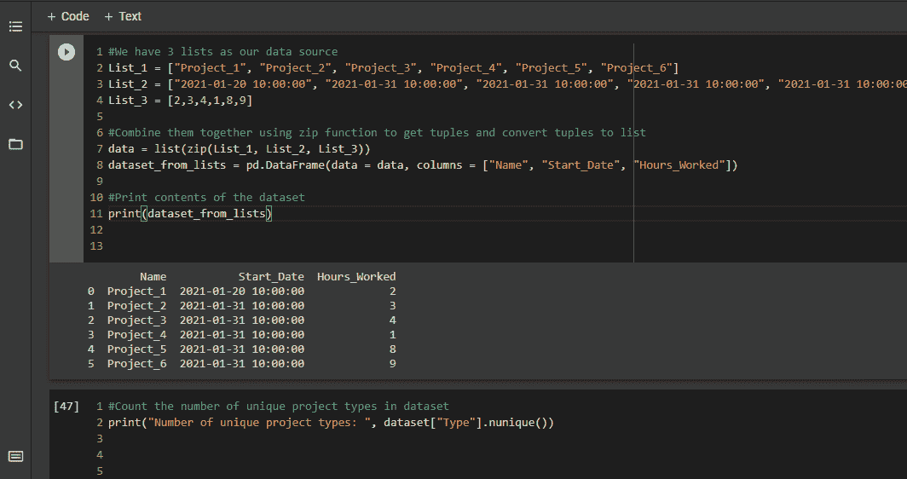
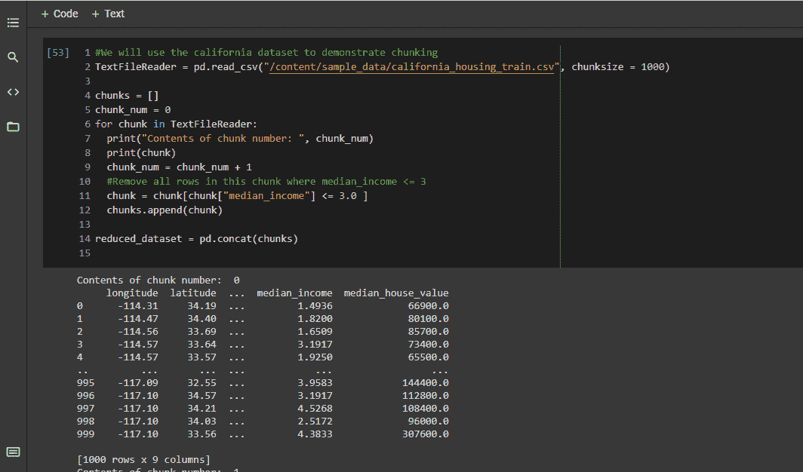
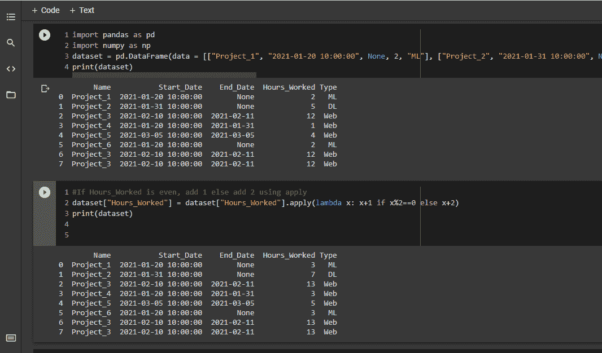

# 如何开始使用 Python 学习熊猫——初学者指南

> 原文：<https://www.freecodecamp.org/news/python-pandas-functions/>

Python 中的 Pandas 包为您提供了许多很酷的功能和特性，可以帮助您更有效地操作数据。它还可以让您毫不费力地执行许多数据清理和数据预处理步骤。

太棒了，不是吗？这里列出了一些最常用的 Pandas 功能和技巧，帮助您享受数据科学之旅。

## 如何删除数据帧中缺失的值

清除丢失的值是数据清理中最常见的任务之一。丢失的值可能只存在于一行或一列中，也可能存在于多行和多列中。

根据您的应用和问题领域，您可以使用不同的方法来处理缺失数据，如插值、用平均值替换或简单地删除缺失值的行。

Pandas 提供了`dropna`函数，该函数删除所有行(对于轴=0)或所有列(对于轴=1 ),其中存在缺失值。dropna 函数的一些参数如下:

*   `axis`指定是删除行(轴=0)还是删除列(轴=1)
*   `subset`指定当轴=0 时要考虑缺失值的列列表
*   `inplace`指定是否要对现有数据帧本身进行更改

点击此处查看链接[的文件，了解更多深度报道。](https://pandas.pydata.org/pandas-docs/stable/reference/api/pandas.DataFrame.dropna.html)

在下面的示例中，我们创建了一个带有缺失值的小型数据帧，然后丢弃任何列中带有缺失值的行。



Drop missing values in Pandas

## 如何删除数据帧中的重复项

另一个常见的数据清理任务是删除重复的行。`drop_duplicates`函数使用类似于`dropna`的参数来执行此操作，例如:

*   `subset`，指定当轴=0 时要考虑重复值的列子集
*   `inplace`
*   `keep`，指定保留哪些重复值。Keep 可以等于 first、last 或 False，以删除所有重复项。

点击查看链接[的文件，了解更多详细信息。](https://pandas.pydata.org/pandas-docs/stable/reference/api/pandas.DataFrame.drop_duplicates.html)

让我们复制几行并将它们从数据集中删除:



Drop duplicate values in Pandas

## 如何删除具有特定于列的值的行

假设我们希望只保留那些项目类型为 Web 或者工作小时数等于 12 的行。我们可以这样做。

使用这种方法，我们可以根据某些特定的列值筛选出行:



Remove rows with column specific values

## 如何将 DataFrames 转换成 JSON

数据框架是超级酷的优化结构，非常适合使用。JSON 是无缝数据交换最流行的数据格式之一。

让我们使用 [`to_json`](https://pandas.pydata.org/pandas-docs/stable/reference/api/pandas.DataFrame.to_json.html) 将我们的数据帧转换成 JSON，这需要如下参数:

*   `orient`，指定什么应该是键和值对。默认值是 columns，因此列名是键，每列是值。
*   `date_format`指定日期的格式。默认值是 epoch。

请看下面的例子:



Convert DataFrame to JSON

我们可以看到`to_json`返回了一个字符串，其模式如下:

```
column_0 :
{ row_index_0: column_value_0, row_index_1:column_value_1, ...}, 
column_1:
{ row_index_0: column_value_0, row_index_1:column_value_1, ...}, 
...
column_N:
{ row_index_0: column_value_0, row_index_1:column_value_1, ...} 
```

如果我们想将每一行转换成一个字典，我们需要指定那个`orient=records`并使用 JSON 模块解析它。


Convert DataFrame to JSON with orient=records

## 如何计算列中唯一值的数量

假设我们想知道存在多少不同的项目类型。我们可以使用`nunique`函数获得这些信息。



Count number of unique values in a column

## 如何将数据帧保存为？csv 文件

将数据帧保存为 csv 文件只需要一行代码:

```
dataset.to_csv("save_as_csv.csv")
```

## 如何将多个列表保存为一个列表？csv 文件

假设我们有三个单独的列表作为我们的数据源，我们想把它们保存在一个 csv 文件中。这仅仅涉及到两个步骤:

*   使用 zip 将其转换成多个元组，
*   然后将它转换成一个列表。

在下面的例子中，我们按照这种方法将三个列表转换成一个数据帧，我们现在可以将它保存为一个. csv 文件。



Save multiple lists as one csv file

### 如何以内存高效的方式读取数据帧

我们经常需要读取大到内存容纳不下的文件。对于这样庞大的数据集，我们使用不同的方法。

首先，我们创建一个`TextFileReader`对象。接下来，我们指定一个名为`chunksize`的参数，它指定我们一次要读取文件的多少行，比如说 4 行。所以我们一次读取 4 行，在那个块上执行一些任务，然后继续下 4 行。

与数千行的整个文件相比，小块更有可能适合内存。以下示例显示了分块的工作原理。



Read DataFrame in a memory efficient manner

在这里，我们一次读取 1000 行的`california`数据集，删除所有小于或等于 3 的行，并将这些减少的块附加在一起，形成一个更小的数据集。

通过只读取那些您需要的列，并为列指定较小的数据类型，您可以节省更多的内存，如在此处链接的[文档中详细描述的。](https://pandas.pydata.org/pandas-docs/stable/user_guide/scale.html)

## 如何使用`apply`改变数据帧中的所有值

让我们回到项目数据框架的例子来说明这一点。我们关注于`Hours_Worked`列，如果是偶数，计数增加 1，如果是奇数，计数增加 2。为此，我们使用了 lambda 函数。



Change all values in a DataFrame using apply

## 结论

熊猫是一个强大的包裹，由于它的巨大，有时看起来令人生畏。这就是为什么我试着列出一些我遇到过的最有用的函数。

这些 Pandas 功能将帮助您加速数据分析工作。感谢你的时间，我希望你喜欢阅读这篇文章。