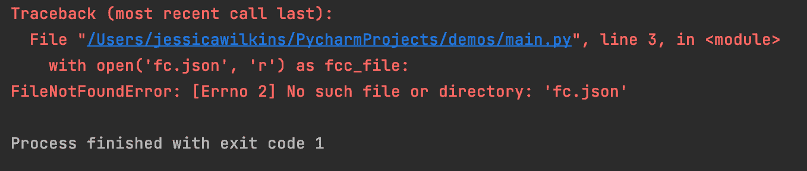
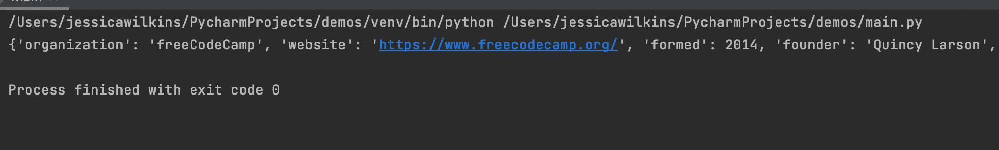
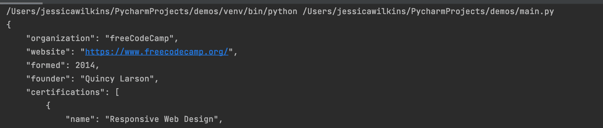
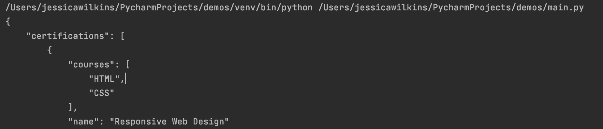

# python Parse JSON——如何读取 JSON 文件

> 原文：<https://www.freecodecamp.org/news/python-parse-json-how-to-read-a-json-file/>

JSON (JavaScript Object Notation)是一种流行的数据结构化方法。它用于在 web 应用程序和服务器之间交换信息。但是如何用 Python 读取 JSON 文件呢？

在本文中，我将向您展示如何使用`json.loads()`和`json.load()`方法来解析和读取 JSON 文件和字符串。

## JSON 语法

在开始解析和读取 JSON 文件之前，我们首先需要理解基本语法。JSON 语法看起来像带有键值对的 JavaScript 对象文字。

这是 [freeCodeCamp](https://www.freecodecamp.org/) 的 JSON 数据示例:

```
{
  "organization": "freeCodeCamp",
  "website": "https://www.freecodecamp.org/",
  "formed": 2014,
  "founder": "Quincy Larson",
  "certifications": [
    {
      "name": "Responsive Web Design",
      "courses": [
        "HTML",
        "CSS"
      ]
    },
    {
      "name": "JavaScript Algorithms and Data Structures",
      "courses": [
        "JavaScript"
      ]
    },
    {
      "name": "Front End Development Libraries",
      "courses": [
        "Bootstrap",
        "jQuery",
        "Sass",
        "React",
        "Redux"
      ]
    },
    {
      "name": "Data Visualization",
      "courses": [
        "D3"
      ]
    },
    {
      "name": "Relational Database Course",
      "courses": [
        "Linux",
        "SQL",
        "PostgreSQL",
        "Bash Scripting",
        "Git and GitHub",
        "Nano"
      ]
    },
    {
      "name": "Back End Development and APIs",
      "courses": [
        "MongoDB",
        "Express",
        "Node",
        "NPM"
      ]
    },
    {
      "name": "Quality Assurance",
      "courses": [
        "Testing with Chai",
        "Express",
        "Node"
      ]
    },
    {
      "name": "Scientific Computing with Python",
      "courses": [
        "Python"
      ]
    },
    {
      "name": "Data Analysis with Python",
      "courses": [
        "Numpy",
        "Pandas",
        "Matplotlib",
        "Seaborn"
      ]
    },
    {
      "name": "Information Security",
      "courses": [
        "HelmetJS"
      ]
    },
    {
      "name": "Machine Learning with Python",
      "courses": [
        "Machine Learning",
        "TensorFlow"
      ]
    }
  ]
}
```

## 如何用 Python 解析 JSON 字符串

Python 有一个内置模块，允许您处理 JSON 数据。在文件的顶部，您需要导入`json`模块。

```
import json 
```

如果需要解析返回字典的 JSON 字符串，那么可以使用`json.loads()`方法。

```
import json

# assigns a JSON string to a variable called jess 
jess = '{"name": "Jessica Wilkins", "hobbies": ["music", "watching TV", "hanging out with friends"]}'

# parses the data and assigns it to a variable called jess_dict
jess_dict = json.loads(jess)

# Printed output: {"name": "Jessica Wilkins", "hobbies": ["music", "watching TV", "hanging out with friends"]}
print(jess_dict)
```

## 如何用 Python 解析和读取 JSON 文件

在这个例子中，我们有一个名为`fcc.json`的 JSON 文件，它保存了之前关于 freeCodeCamp 提供的课程的相同数据。

如果我们想读取那个文件，我们首先需要使用 Python 内置的`open()`函数，其模式为 read。我们使用关键字`with`来确保文件被正确关闭。

```
with open('fcc.json', 'r') as fcc_file: 
```

如果文件无法打开，那么我们将收到一个 OSError。这是一个“FileNotFoundError”的例子，如果我拼错了`fcc.json`文件名。



然后，我们可以使用`json.load()`方法解析该文件，并将其赋给一个名为`fcc_data`的变量。

```
 fcc_data = json.load(fcc_file)
```

最后一步是打印结果。

```
print(fcc_data) 
```

整个代码如下所示:

```
import json

with open('fcc.json', 'r') as fcc_file:
    fcc_data = json.load(fcc_file)
    print(fcc_data)
```

## 如何用 Python 漂亮地打印 JSON 数据

如果我们检查打印的数据，那么我们应该看到 JSON 数据都打印在一行上。



但是这很难理解。为了解决这个问题，我们可以使用带有参数`indent`的`json.dumps()`方法。

在本例中，我们将缩进 4 个空格，并以更易于阅读的格式打印数据。

```
 print(json.dumps(fcc_data, indent=4)) 
```



我们还可以使用参数`sort_keys`并将其设置为`True`来按字母顺序对键进行排序。

```
print(json.dumps(fcc_data, indent=4, sort_keys=True)) 
```



## 结论

JSON (JavaScript Object Notation)是一种流行的数据结构化方法，用于在 web 应用程序和服务器之间交换信息。

如果需要解析返回字典的 JSON 字符串，那么可以使用`json.loads()`方法。

如果需要解析返回字典的 JSON 文件，那么可以使用`json.load()`方法。