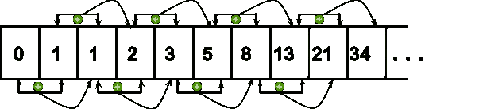
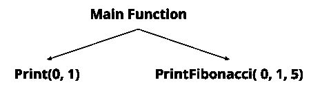
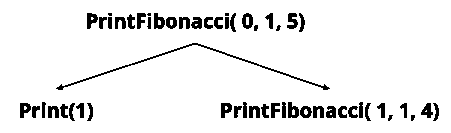
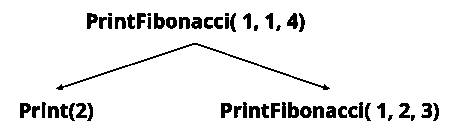
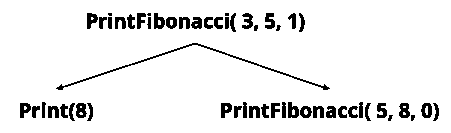

# Python 程序打印斐波那契数列

> 原文：<https://www.freecodecamp.org/news/python-program-to-print-the-fibonacci-sequence/>

关于斐波那契数列的问题是 Python 访谈中最常被问到的。

在本文中，我将一步一步地解释如何使用两种不同的技术打印斐波那契数列，迭代和递归。

在开始之前，我们先来了解一些基本的术语。

## 什么是斐波那契数列？

[斐波那契数列](https://en.wikipedia.org/wiki/Fibonacci_number)是一个数列，其中一个给定的数字是它之前的两个数字相加的结果。将前面的两个数字相加若干次，就形成了一个数列，我们称之为斐波那契数列。

斐波纳契数列以两个数字开始，即 0 和 1。那么后面的每一个数字都是由前面两个数字相加而成的。

比如取 0 和 1。它们是序列中的前两个数字。如果你把它们加在一起，你会得到 1。所以序列从 0，1，1 开始，...

然后，为了找到下一个数字，你把最后一个数字和它前面的数字相加。所以 1+1 = 2。所以目前为止的顺序是 0，1，1，2，...有道理吗？

我们可以用更数学的方式来表示它，比如 0，1，(1)-(0+1)。同样，下一个斐波那契数是- 0，1，1，(2) - [1 + 1]。诸如此类。下图显示了前 10 个斐波那契数列:



这是一个斐波那契数列的例子-**0，1，1，2，3，5，8，13，21，** **34** 。在这个连续序列中，每个数字都是一个斐波那契数。

数学上，斐波纳契数列由以下公式表示:

**F(n) = F(n-1) + F(n-2)** ，其中 **n > 1** 。

我们可以用这个序列找到任何第 n 个斐波那契数。

这个迷人的序列被广泛与数学家莱昂纳多·皮萨诺联系在一起，他也被称为斐波那契。他来自比萨共和国，这就是为什么他也被称为比萨的莱昂纳多。

莱昂纳多被认为是中世纪最有才华的数学家之一。

## 如何用 Python 打印斐波那契数列

你可以写一个计算机程序，用两种不同的方式打印斐波那契数列:

*   迭代地，并且
*   递归地。

迭代意味着重复工作，直到满足指定的条件。另一方面，递归意味着执行一个任务，然后继续执行下一个任务。

### 以下是打印斐波纳契数列的迭代算法:

1.  创建 2 个变量并用 0 和 1 初始化它们(第一个= 0，第二个= 1)
2.  创建另一个变量来跟踪要打印的斐波纳契数列的长度(length)
3.  循环(长度小于系列长度)
4.  打印第一张**和第二张**
5.  更新**第一个**和**第二个**变量(第一个会指向第二个，第二个会指向第一个+第二个)
6.  减少长度变量，从第 3 步开始重复
7.  一旦循环终止，就终止程序

### 迭代算法如何工作:

假设我们需要打印一个长度为 7 的斐波那契数列。那么算法的流程将是这样的:

| 迭代次数 | 解释的步骤 | 输出 |
| --- | --- | --- |
| 最初的 | 第一个= 0，第二个= 1 | [0, 1] |
| one | Print (first + second) = [0+1]现在变量`first`将指向变量`second`。第二个将指向我们上面计算的下一个斐波纳契数。 | [0, 1, 1] |
| Two | Print (first + second) = [1+1]现在变量 first 会指向变量 second。第二个将指向我们上面计算的下一个斐波纳契数。 | [0, 1, 1, 2] |
| three | Print (first + second) = [1+2]现在变量 first 会指向变量 second。第二个将指向我们上面计算的下一个斐波纳契数。 | [0, 1, 1, 2, 3] |
| four | Print (first + second) = [2+3]现在变量 first 会指向变量 second。第二个将指向我们上面计算的下一个斐波那契数。 | [0, 1, 1, 2, 3, 5] |
| five | Print (first + second) = [3+5]现在变量 first 会指向变量 second。第二个将指向我们上面计算的下一个斐波纳契数。 | [0, 1, 1, 2, 3, 5, 8] |

所以长度为 7 的最终斐波那契数列将是**【0，1，1，2，3，5，8】**。

### 打印斐波那契数列的迭代 Python 代码:

```
def PrintFibonacci(length):
    #Initial variable for the base case. 
    first = 0
    second = 1

    #Printing the initial Fibonacci number.
    print(first, second, end=" ")

    #decreasing the length by two because the first 2 Fibonacci numbers 
    #already printed.
    length -= 2

    #Loop until the length becomes 0.
    while length > 0:

        #Printing the next Fibonacci number.
        print(first + second, end=" ")

        #Updating the first and second variables for finding the next number. 
        temp = second
        second = first + second
        first = temp

        #Decreasing the length that states the Fibonacci numbers to be 
        #printed more.
        length -= 1

if __name__ == "__main__":
    print("Fibonacci Series - ")
    PrintFibonacci(7)
    pass
```

[长度 7 的输出](https://www.interviewbit.com/snippet/242ec6ca5cec8a2fcaf6/):

```
Fibonacci Series - 
1 1 2 3 5 8
```

**代码说明:**

在上面的代码中，首先我们定义了一个打印斐波那契数列的函数。它接受一个长度参数，该函数需要打印斐波那契数列。

接下来，我们创建了 2 个变量，包含最初的 2 个斐波那契值，即 0 和 1。

然后我们打印了前两个值[0，1]，并将长度减少了 2，因为已经打印了两个值。

我们将运行一个剩余长度时间的循环，每次都通过添加存储在第一个和第二个变量中的前两项(我们最初创建该变量是为了跟踪前两个值)来打印下一个斐波那契值。

更新指向前两个值的第一个和第二个值[first = second，second = previous first + second]。

循环将一直运行，直到长度变为 0，这表示打印了斐波纳契数列的所需长度。

然后，我们从 main 函数调用为打印 Fibonacci 而定义的函数，方法是传递所需打印长度的参数。现在你知道了！

还有另一种方法是借助递归来打印斐波那契数列。让我们也来理解这种方法。

### 打印斐波纳契数列的递归算法:

*   接受前面第一个和第二个斐波纳契数的值作为要打印的长度。
*   检查长度是否为 0，然后终止函数调用。
*   通过将函数参数(第一个和第二个)中收到的前两个值相加，打印斐波那契值。
*   递归调用函数以获取第一个和第二个的更新值，以及长度的减少值。

对于这个递归函数调用，我们需要在第一个和第二个变量中传递 Fibonacci 的初始值，也就是(0 和 1)。

为了帮助您更好地理解这个算法，让我们来看看算法的 Python 实现。然后我们将看一个例子，这样你就可以看到这个递归算法是如何工作的。

### 用于打印斐波那契数列的递归 Python 代码:

```
def PrintFibonacci(first, second, length):

    #Stop the printing and recursive calling if length reaches 
    #the end.
    if(length == 0):
        return

    #Printng the next Fibonacci number.
    print(first + second, end=" ")

    #Recursively calling the function by updating the value and 
    #decrementing the length.
    PrintFibonacci(second, first+second, length-1)

if __name__ == "__main__":
    #Print initial 2 values.
    print(0,1,end=" ")

    #Calling the Function to print the remaining length 
    #fibonacci series
    PrintFibonacci(0,1,7-2)
```

[输出](https://www.interviewbit.com/snippet/1e85af84b1916aed890b/):

```
For Length 7 
1 1 2 3 5 8

For Length 10
1 1 2 3 5 8 13 21 34
```

**代码说明:**

首先，我们创建了一个函数并对其执行递归。在该函数中，我们接受前两个斐波纳契数的值来计算当前的斐波纳契数。我们有一个长度来记录基本情况。

对于递归的基本情况，我们正在检查长度是否达到 0。如果是，那么我们将终止递归调用。

在其他情况下，我们通过将前面的 2 个斐波那契数列相加来打印斐波那契数列。

然后我们递归地调用函数来打印下一个 Fibonacci 值，方法是更新前两个值并减少长度。

现在让我们借助递归树来形象化这个函数的递归调用。我们要打印的长度是 7。



在进行递归调用之前，main 函数打印出最初的 2 个值，0 和 1。然后将这些值传递给递归函数。



递归函数打印值(0 + 1)并递归调用下一个更新值。



然后递归函数打印值 **(1 + 1)** ，并递归调用下一个更新值。


现在递归函数正在打印值 **(1 + 2)** ，并递归调用下一个更新的值。


然后递归函数打印值 **(2 + 3)** 并递归调用下一个更新的值。



现在递归函数正在打印值 **(3 + 5)** ，并递归调用下一个更新的值。


最后，打最后一个电话。并且长度为 0，所以它将再次终止递归调用，并将该序列打印在控制台上。

## 时间复杂性分析

### 对于迭代方法

在迭代算法中，我们一直循环，直到长度变为 0。在循环中，我们执行打印值和更新变量的恒定时间操作。

如果我们认为长度是 n，那么时间复杂度将是 **O(n)** 。

### 对于递归方法

在递归方法中，我们调用递归函数的次数达到给定的长度。我们也在做一个简单的打印常量操作。

因此，在这种情况下，如果我们认为长度为 n，那么时间复杂度将为 O(n) 。

## 空间复杂性分析

### 对于迭代方法

在迭代方法中，我们没有额外的内存来接受跟踪前两个斐波纳契数的两个变量和任何数列长度的常数。所以空间复杂度将是常数 O(1)。

### 对于递归方法

在递归方法中，我们调用长度函数的次数。我们知道递归在内部使用了一个调用堆栈。

因此，如果我们认为这是程序占用的内存，那么递归调用就是这个长度的次数。那么空间复杂度将为 O(n)。

## 结论

斐波纳契数列是一系列数字，其中每个数字都是前两个数字的相加。

斐波那契数列不仅存在于数学中，也存在于自然界中——比如花瓣、叶子或仙人掌的刺等等。

这也是一个常见的面试问题——所以知道它是如何工作的很好。

我从 [InterviewBit](https://www.interviewbit.com/python-interview-questions/) 的这篇帖子中获得了灵感。