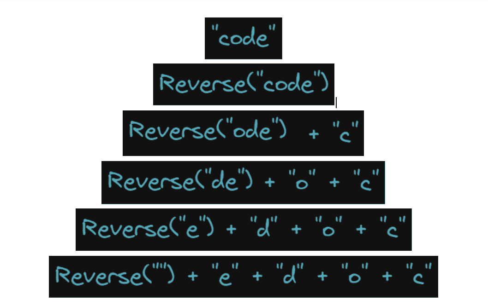
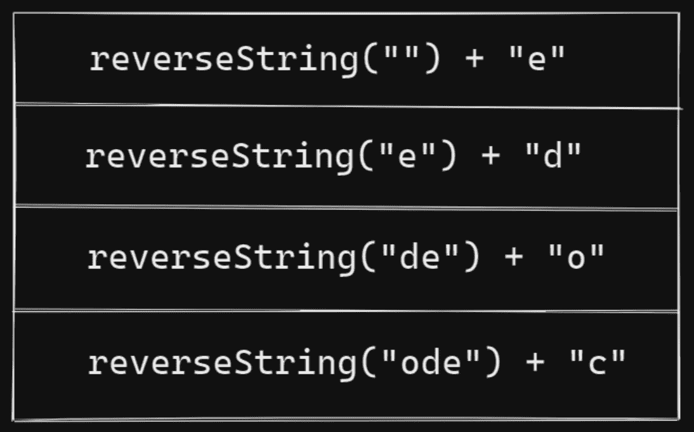
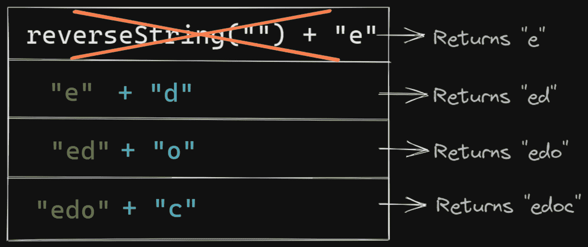
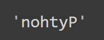
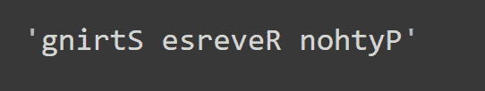
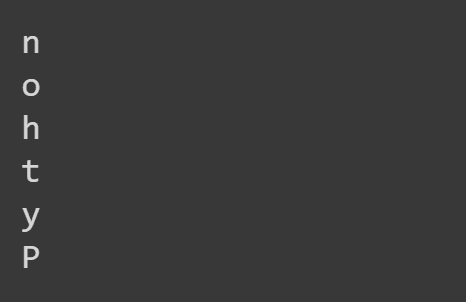
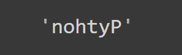
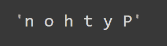

# Python 反向字符串——用例子解释 Python 中的字符串反向

> 原文：<https://www.freecodecamp.org/news/python-reverse-string-string-reversal-in-python-explained-with-code-examples/>

当您使用 Python 字符串时，有时您必须反转它们，并使用它们的反转副本。

但是由于 Python 字符串是*不可变的*，所以不能就地修改或反转它们。

在 Python 中，有几种不同的方法可以做到这一点。本教程将教你如何使用字符串切片、内置方法和递归来反转字符串。

### 🎯你会学到什么

*   [使用**递归**反转字符串](#how-to-reverse-python-strings-using-recursion):您将了解递归是如何工作的，以及使用递归反转字符串背后的直觉。
*   [使用**字符串切片**反转字符串](#how-to-reverse-python-strings-using-string-slicing):你将学习一种更简单的反转 Python 字符串的方法。
*   [使用**内置方法**](#how-to-reverse-python-strings-using-the-reversed-and-the-join-methods) :您将学习另一种在 Python 中反转字符串的简单而直观的方法。

所以让我们开始吧。

## 如何使用递归反转 Python 字符串

在学习如何使用递归来反转字符串之前，我们先来了解一下递归是如何工作的。

> 递归是一种强大的编程范式。为了解决兴趣问题，递归函数**反复调用自身**，直到到达一个**基本情况**。

这是你们之前可能读过的关于递归的内容。

现在让我们用通俗易懂的语言重新表述这个定义。

### 简明英语中的递归

假设你已经创建了一个函数来解决一个问题。

*   该函数被设计为每次被调用时，它都会再次调用自己。
*   这些被称为*递归*函数调用。
*   每个递归函数调用都做同样少量的工作。
*   这种情况一直持续到没有工作可做为止。并且函数不再需要调用自己——这被称为**基础用例**。

### 如何使用递归来反转字符串

现在让我们直观地讨论一下反转字符串背后的动机。为此，请考虑字符串`"code"`。

**问题:**反串`"code"`。


让我们暂时忘记递归，从你知道的开始。

> 原始字符串中的第一个字母将是反转字符串中的最后一个字母，对吗？

*   所以把第一个字母——这里——拉出来，推到最后。
*   现在只剩下字符串`"ode"`。问题已经简化为反转这个子串`"ode"`(因为`"c"`已经在正确的位置上)


*   你可以做同样的任务，再次拉出第一个字母，现在是`"o"`。把它推到右边最后一个空位。
*   现在`"c"`和`"o"`已经处理好了，剩下的问题是反转子串`"de"`。


*   再做几次——先拉出`"d"`,然后拉出`"e"`。


*   你现在只剩下反转`""`——一个空字符串。


*   这时你已经把`"e"`、`"d"`、`"o"`和`"c"`放到了正确的位置上，你再也不用这么做了。在递归的上下文中，您已经到达了*的基本情况*。

你在这里做了什么？

1.  在每一步中，您都执行同样的任务，即在每个后续子字符串中提取第一个字母。
2.  你把这个问题简化为，反转一个比之前短一个字母的字符串。

你什么时候停止的？

当字符串为空的时候，你就没有更多的字母可以抽出来了。

下图总结了我们所做的工作:



Intuition behind String Reversal (Image by the author)

既然您已经掌握了使用递归进行字符串反转的诀窍，那么让我们来编写一些代码。

### 理解递归调用堆栈

这里有一个 Python 函数`reverseString()`，它的功能与您在上一节中所学的完全相同。

函数`reverseString()`接受`any_string`并返回`any_string`的反向副本。

```
def reverseString(any_string):
  if any_string == "":
    return any_string
  else:
    return reverseString(any_string[1:]) + any_string[:1]
```

您必须理解当您调用函数`reverseString()`时，递归调用是如何被推到堆栈上的。

```
reverseString("code")

# Output
'edoc'
```

*   比方说，你调用函数`reverseString()`并把`"code"`作为参数。这又调用了`reverseString()`,参数为`"ode"`。
*   这个调用再次调用`reverseString()`并把`"de"`作为参数。
*   这一直持续到最后调用`reverseString()`并以空字符串`""`作为参数。

对于每个函数调用，都会在计算机内存的堆栈部分创建一个激活记录。

并且每个后续函数调用的激活记录都被推到堆栈的顶部。

下图对此进行了解释:



Call Stack (Image by the author)

*   您知道，当使用`""`进行调用时，该函数返回与`"e"`连接的`""`，后者就是`"e"`。它的激活记录被弹出堆栈。
*   下一个调用返回`"ed"`，下一个返回`"edo"`。弹出堆栈的激活记录最终返回`"edoc"`，这是一个反向的字符串。

注意，一旦值被返回，对应于每个递归调用的激活记录就会从堆栈中弹出——如返回`"e"`的调用所示。

为了可读性，我省略了下图中的❌。在调用堆栈中，前一个调用的返回值已经用绿色的*表示。*



Return values from the recursive calls (Image by the author)

现在可以用任何有效的 Python 字符串调用`reverseString()`。这里还有几个例子。

```
reverseString("Python")
```



```
reverseString("Python Reverse String")
```



嗯，那需要相当大的努力。😓但是我希望你现在能够更好地理解递归调用。😊

在接下来的两节中，您将看到反转字符串的更简单的方法。我们走吧。✅

## 如何使用字符串切片反转 Python 字符串

您也可以使用*字符串切片*来反转 Python 字符串。您可以像分析 Python 列表一样分析 Python 字符串。

### Python 字符串切片解释

`<string>[start: stop: step]`返回字符串的一部分——从索引`start`开始，以`step`为步长一直延伸到`stop - 1`。

以下是关于字符串的几点值得回忆:

*   `<string>`是任何有效的 Python 字符串。
*   `start`指标为*可选*。如果不指定，默认情况下，*，*切片从`<string>`的开头开始(在索引`0`)。
*   `stop`指标也是*可选*。如果不指定，默认情况下，*，*切片会延伸到`<string>`的末尾。
*   *可选的* `step`参数给出了您想要如何切分`<string>`的上下文。
*   我们来设定`step = 2`。现在，切片将从`start`开始，一直到`stop - 1`，包括字符串中的每两个字符。

综上所述，`<string>[:::]`返回整个字符串的副本。

你能看出为什么这是正确的吗？🤔

没有索引`start`，切片从索引`0`开始。

如果没有`end`索引，切片将扩展到字符串中的最后一个字符。

如果没有`step`参数，切片将包含字符串中的所有字符。

*   您也可以为`step`设置负的值*。负值将返回从字符串的*末端*开始的字符串片段。*
*   Set `step = -1`:返回一段字符串，从最后一个字符的**开始，一直延伸到第一个**字符*到*。而且还包括每一个角色。****

等等，这不正是反弦吗？🙂是的，它是。

所以`<string>[::-1]`返回字符串的反向副本。✅

```
any_string = "Python"

rev_string = any_string[::-1]

print(rev_string)

# Output
nohtyP
```

转到下一节，学习另一种反转字符串的方法。

## 如何使用`reversed()`和`join()`方法反转 Python 字符串

我们先来看看 Python 的`reversed()`方法是做什么的。

> Python 的内置`reversed()`函数返回给定序列值的反向迭代器。

```
any_string = "Python"
```

给定一个类似于`any_string`的字符串，您可以使用`reversed()`方法来获得逆序的字符。

如下所示:

```
for char in reversed(any_string):
  print(char)
```



现在，您已经将所有的字符以相反的顺序排列，您需要将它们放入一个字符串中。

Python 的`join()`方法可以让你做到这一点。

`<sep>.join(<these>)`用`<sep>`作为分隔符将`<these>`连接成一个字符串。

*   这里，`<these>`是颠倒顺序的字符。
*   但是`<sep>`应该是什么呢？你不需要任何分隔符——你只希望所有的字符都在正确的索引处进入字符串。
*   那你该怎么办呢？只需在`<sep>`字段中插入一个`""`，如图所示:

```
"".join(reversed(any_string)) 
```



只是要小心*而不是*在开口和关闭`"`之间插入一个空间。

如果您执行以下操作:

```
" ".join(reversed(any_string)) 
```

你将得到一个字符串，其中的字符由空格分隔，这不是你想要的。



在本节中，您已经学习了另一种颠倒 Python 字符串的 Python 方法。

## 结论

恭喜你走到这一步！🎉

总而言之，您已经学会了:

*   如何递归地反转一个字符串——继续下去，直到你有一个空字符串或者只剩下*一个字符*(这也很好，因为反转的一个字符就是它自己)，
*   如何使用`<string>[::-1]`获得`<string>`的反向副本，以及
*   如何使用`"".join(reversed(<string>))`获得`<string>`的反向副本？

希望你觉得这个教程有帮助和有趣。编码快乐！😄