# Python 集合:详细的可视化介绍

> 原文：<https://www.freecodecamp.org/news/python-sets-detailed-visual-introduction/>

## 欢迎

在本文中，您将学习 Python 中集合的基础知识。这是一种非常强大的内置数据类型，可以在 Python 项目中使用。

**我们将探索:**

*   什么是集合，为什么它们与你的项目相关。
*   如何创建集合？
*   如何检查一个元素是否在一个集合中？
*   集合和冷冻集的区别。
*   如何操作集合(在这一部分我们将深入研究集合论的基础)。
*   如何在集合中添加和移除元素，以及如何清除它们。

让我们开始吧！⭐️

## 🔹在上下文中设置

让我先告诉你为什么你想在你的项目中使用集合。在数学中，集合是不同对象的集合。在 Python 中，使它们如此特别的是这样一个事实，即**它们没有重复的元素**，因此它们可以用来有效地从列表和元组中删除重复的元素。

根据 [Python 文档](https://docs.python.org/3/tutorial/datastructures.html#sets):

> Python 还包括一个用于*集合*的数据类型。集合是没有重复元素的无序集合。基本用途包括成员资格测试和消除重复条目。

❗️Important:集合中的元素必须是不可变的(它们不能被改变)。不可变数据类型包括字符串、元组和数字，如整数和浮点数。

## 🔸句法

为了创建一个集合，我们从写一对花括号`{}`开始，在这些花括号中，我们包括由逗号和空格分隔的集合元素。

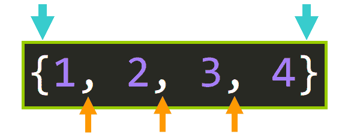

**💡提示:**注意，这个语法不同于 Python 字典，因为我们没有创建键值对，我们只是简单地将单个元素包含在花括号`{}`中。

### 集合()

或者，我们可以使用 [set()](https://docs.python.org/3/library/stdtypes.html#set) 函数来创建一个集合(见下文)。

为此，我们将传递一个 iterable(例如，一个 list、string 或 tuple ),这个 iterable 将被转换为一个 set，删除任何重复的元素。

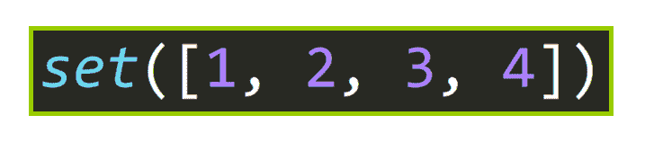

这是一个闲置的例子:

```
# Set
>>> {1, 2, 3, 4}
{1, 2, 3, 4}

# From a list
>>> set([1, 2, 3, 4])
{1, 2, 3, 4}

# From a tuple
>>> set((1, 2, 3, 4))
{1, 2, 3, 4}
```

**💡提示:**要创建一个空集，你必须使用 [set()](https://docs.python.org/3/library/stdtypes.html#set) 函数，因为使用一个空的花括号集，就像这个`{}`，会自动创建一个空的**字典**，而不是空集。

```
# Creates a dictionary, not a set.
>>> type({})
<class 'dict'>

# This is a set
>>> type(set())
<class 'set'>
```

## 🔹重复的元素被删除

如果作为参数传递给`set()`的 iterable 有重复的元素，它们将被删除以创建集合。

例如，注意当我们传递这个列表时，重复的元素是如何被删除的:

```
>>> a = [1, 2, 2, 2, 2, 3, 4, 1, 4]
>>> set(a)
{1, 2, 3, 4}
```

请注意，当我们传递这个字符串时，重复的字符是如何被删除的:

```
>>> a = "hhheeelllooo"
>>> set(a)
{'e', 'l', 'o', 'h'}
```

## 🔸长度

要找到一个集合的长度，可以使用内置函数 [len()](https://docs.python.org/3/library/stdtypes.html#set) :

```
>>> a = {1, 2, 3, 4}
>>> b = set(a)
>>> len(b)
4
```

在数学中，一个集合的元素个数称为该集合的“**基数**”。

## 🔹成员测试

您可以使用`in`操作符测试一个元素是否在一个集合中:

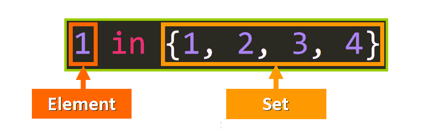

这在一个例子中:

```
>>> a = "hhheeelllooo"
>>> b = set(a)
>>> b
{'e', 'l', 'o', 'h'}

# Test if the characters 'e' and 'a' are in set b
>>> 'e' in b
True
>>> 'a' in b
False
```

## 🔸集合与冷冻集合

集合是可变的，这意味着它们在被定义后可以被修改。

根据 [Python 文档](https://docs.python.org/3.8/library/stdtypes.html#set-types-set-frozenset):

> [`set`](https://docs.python.org/3.8/library/stdtypes.html#set) 类型是**可变**——可以使用`add()`和`remove()`等方法改变内容。因为它是可变的，所以它没有哈希值，既不能用作字典键，也不能用作另一个集合的元素。

由于它们不能包含可变数据类型的值，如果我们试图创建一个包含集合作为元素的集合(嵌套集合)，我们将会看到以下错误:

```
TypeError: unhashable type: 'set' 
```

这是一个闲置的例子。请注意我们试图包含的元素是如何设置的:

```
>>> a = {{1, 2, 3}, {1, 2, 4}}
Traceback (most recent call last):
  File "<pyshell#23>", line 1, in <module>
    a = {{1, 2, 3}, {1, 2, 4}}
TypeError: unhashable type: 'set'
```

### 冰冻集

为了解决这个问题，我们有另一种类型的集合，称为 frozensets。

它们是**不可变的**，所以它们不能被改变，我们可以用它们来创建嵌套集合。

根据 [Python 文档](https://docs.python.org/3.8/library/stdtypes.html#set-types-set-frozenset):

> [`frozenset`](https://docs.python.org/3.8/library/stdtypes.html#frozenset) 类型是不可变的，[是可散列的](https://docs.python.org/3.8/glossary.html#term-hashable)——其内容在创建后不能更改；因此，它可以用作字典键或另一个集合的元素。

为了创建冷冻集，我们使用:

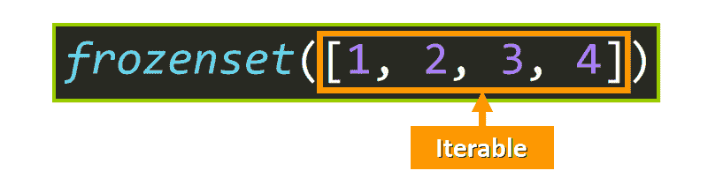

💡**提示:**你可以用`frozenset()`创建一个空的冰冻集。

这是一个包含两个冷冻集的集合示例:

```
>>> a = {frozenset([1, 2, 3]), frozenset([1, 2, 4])}
>>> a
{frozenset({1, 2, 3}), frozenset({1, 2, 4})}
```

请注意，我们没有收到任何错误，集合创建成功。

## 🔹集合论导论

在深入集合运算之前，我们需要探索一点集合论和维恩图。我们将深入研究每一个 set 操作及其在 Python 代码中对应的等价操作。我们开始吧。

### 子集和超集

您可以将子集视为集合的“较小部分”。我喜欢这么想。如果你取一个集合中的一些元素，用这些元素组成一个新的集合，这个新集合就是原集合的子集。

这就好像你有一个装满不同颜色的橡胶球的袋子。如果你用袋子里所有的橡皮球做一个集合，然后拿一些橡皮球做一个新集合，这个新集合就是原来集合的子集。

让我用图表来说明这一点。如果我们有一个包含元素 1，2，3，4 的集合 A:

```
>>> a = {1, 2, 3, 4}
```

我们可以“获取”或“选择”a 的一些元素，并创建一个名为 B 的新集合。假设我们选择将元素 1 和 2 包含在集合 B 中:

```
>>> a = {1, 2, 3, 4}
>>> b = {1, 2}
```

B 的每个元素都在 a 中。因此，B 是 a 的子集。

这可以用这样的图形表示，其中新的集合 B 用黄色表示:

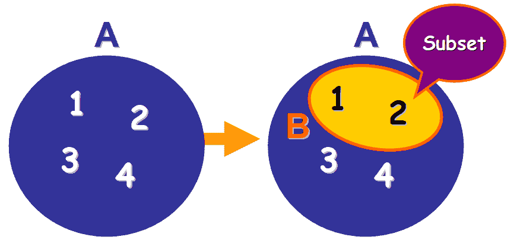

**💡注:**在集合论中，用大写字母表示集合是约定俗成的。这就是为什么我会用它们来指代集合(A 和 B)，但在 Python 中我会用小写字母(A 和 B)。

### .issubset()

我们可以用方法[检查 B 是否是 A 的子集。issubset( <其他> )](https://docs.python.org/3/library/stdtypes.html#frozenset.issubset) :

```
>>> a = {1, 2, 3, 4}
>>> b = {1, 2}
>>> b.issubset(a)
True
```

如你所见，B 是 A 的子集，因为返回值是`True`。

但反之则不然，因为 A 的元素并不都在 B 中:

```
>>> a.issubset(b)
False
```

让我们来看一些非常有趣的事情:

```
>>> a = {1, 2, 3, 4}
>>> b = {1, 2, 3, 4}
>>> a.issubset(b)
True
>>> b.issubset(a)
True
```

如果两个集合相等，则一个集合是另一个集合的子集，反之亦然，因为 A 的所有元素都在 B 中，B 的所有元素都在 A 中。这可以如下所示:

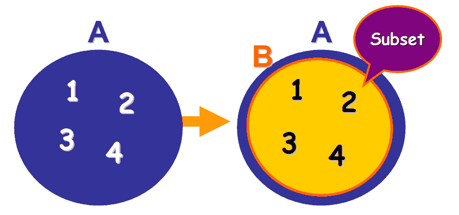

### 使用< =

我们可以用`<=`比较操作符实现与`.issubset()`方法相同的功能:

```
>>> a = {1, 2, 3, 4}
>>> b = {1, 2, 3, 4}
>>> a <= b
True
```

如果左操作数是右操作数的子集，即使两个集合相等(当它们具有相同的元素)，该操作符也返回`True`。

### 真子集

但是如果我们想检查一个集合是否是另一个集合的真子集会发生什么呢？真子集是不等于集合的子集(不具有所有相同的元素)。

这是真子集的一个图形示例。b 不具备 A 的所有要素:


为了检查这一点，我们可以使用`<`比较运算符:

```
# B is not a proper subset of A because B is equal to A
>>> a = {1, 2, 3, 4}
>>> b = {1, 2, 3, 4}
>>> b < a
False

# B is a proper subset of A because B is not equal to A
>>> a = {1, 2, 3, 4}
>>> b = {1, 2}
>>> b < a
True
```

### 超集

**如果 B 是 A 的子集，那么 A 就是 B 的超集**。超集是包含子集所有元素的集合。

这可以这样说明(见下文)，其中 A 是 B 的超集:

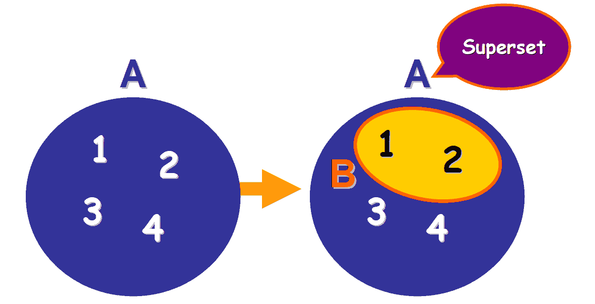

### 。issuperset()

我们可以用[测试一个集合是否是另一个集合的超集。issuperset()](https://docs.python.org/3/library/stdtypes.html#frozenset.issuperset) 方法:

```
>>> a = {1, 2, 3, 4}
>>> b = {1, 2}
>>> a.issuperset(b)
True
```

我们也可以使用运算符`>`和`>=`。它们的工作方式与`<`和`<=`完全一样，但是现在它们确定左操作数是否是右操作数的**超集**:

```
>>> a = {1, 2, 3, 4}
>>> b = {1, 2}
>>> a > b
True
>>> a >= b
True
```

### 不相交集

如果两个集合没有公共元素，则它们是不相交的。例如，这里我们有两个不相交的集合:

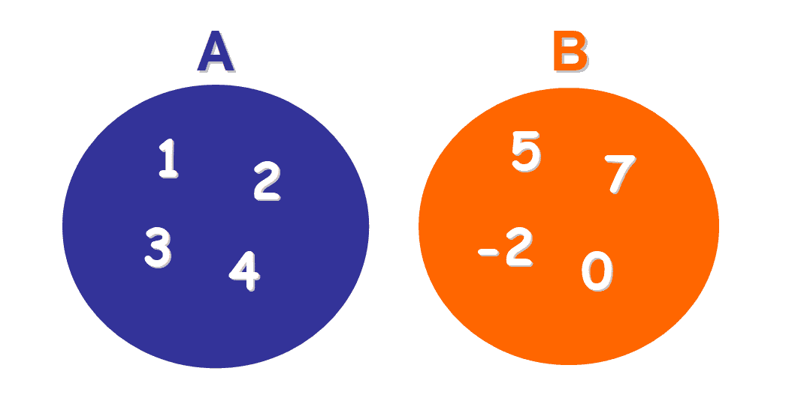

### 。isdisjoint()

我们可以用[来检查两个集合是否不相交。isdisjoint()](https://docs.python.org/3/library/stdtypes.html#frozenset.isdisjoint) 方法:

```
# Elements in common: 3, 1
>>> a = {3, 6, 1}
>>> b = {2, 8, 3, 1}
>>> a.isdisjoint(b)
False

# Elements in common: None
>>> a = {3, 1, 4}
>>> b = {8, 9, 0}
>>> a.isdisjoint(b)
True
```

## 🔸集合操作

我们可以根据集合论的规则，对集合进行运算来创建新的集合。让我们来探究这些操作。

### 联盟

这是我们将分析的第一个操作。它创建一个包含两个集合中所有元素的新集合(没有重复)。

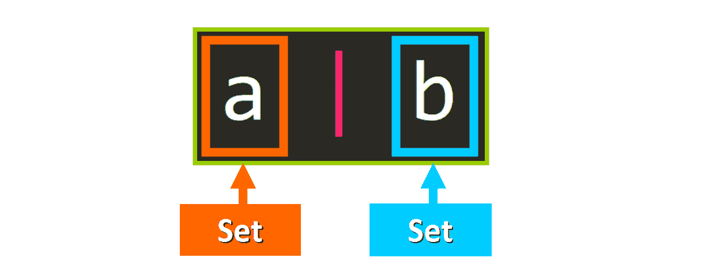

这是一个例子:

```
>>> a = {3, 1, 7, 4}
>>> b = {2, 8, 3, 1}
>>> a | b
{1, 2, 3, 4, 7, 8}
```

💡**提示:**我们可以把这个新集合赋给一个变量，就像这样:

```
>>> a = {3, 1, 7, 4}
>>> b = {2, 8, 3, 1}
>>> c = a | b
>>> c
{1, 2, 3, 4, 7, 8}
```

在图表中，这些集合可以这样表示(见下文)。这被称为文氏图，它被用来说明集合和集合运算结果之间的关系。

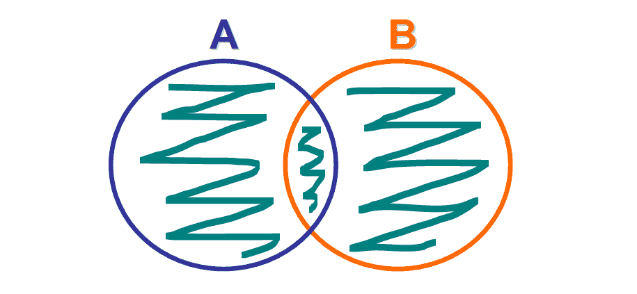

Venn Diagram. Union.

我们可以很容易地将这个操作扩展到两个以上的集合:

```
>>> a = {3, 1, 7, 4}
>>> b = {2, 8, 3, 1}
>>> c = {1, 0, 4, 6}
>>> d = {8, 2, 6, 3}

# Union of these four sets
>>> a | b | c | d
{0, 1, 2, 3, 4, 6, 7, 8}
```

💡**提示:**如果并集包含重复元素，则最终集合中只包含一个，以消除重复。

### 交集

两个集合的交集创建了另一个集合，该集合包含所有元素，这些元素是 **中的**以及 A 和 B** 。**

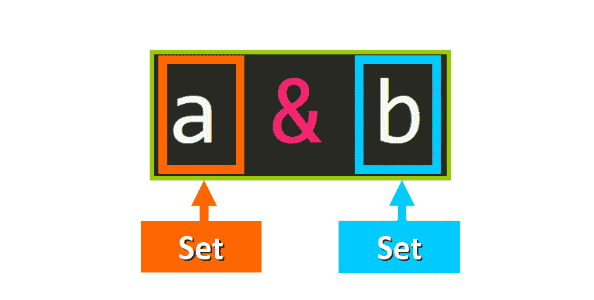

这是一个例子:

```
>>> a = {3, 6, 1}
>>> b = {2, 8, 3, 1}
>>> a & b
{1, 3}
```

交集运算的维恩图应该是这样的(见下文)，因为只有在 A 和 B 中都是**的元素才包含在结果集中:**

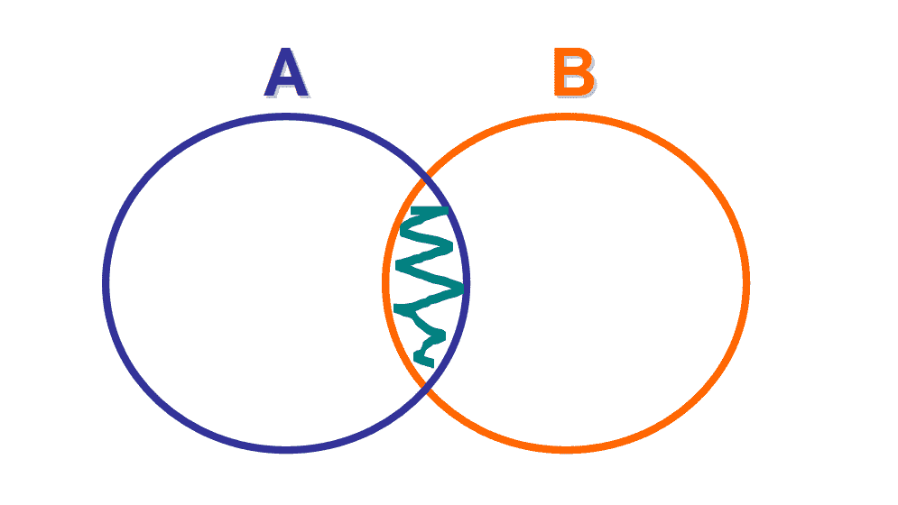

Venn Diagram. Intersection.

我们可以很容易地将这个操作扩展到两个以上的集合:

```
>>> a = {3, 1, 7, 4, 5}
>>> b = {2, 8, 3, 1, 5}
>>> c = {1, 0, 4, 6, 5}
>>> d = {8, 2, 6, 3, 5}

# Only 5 is in a, b, c, and d.
>>> a & b & c & d
{5}
```

### 差异

集合 A 和集合 B 的区别是另一个集合，它包含了集合 A 中所有不在集合 B 中的**元素。**

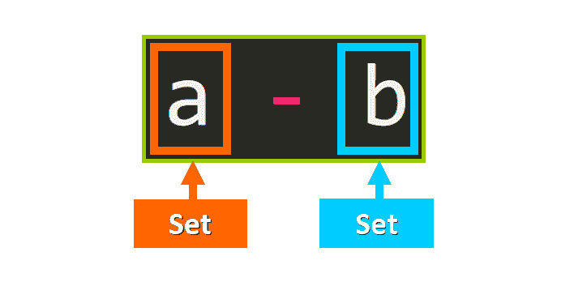

这是一个例子:

```
>>> a = {3, 6, 1}
>>> b = {2, 8, 3, 1}
>>> a - b
{6}
```

这种差异的维恩图将是这样的(见下文)，因为只有不在 B 中的 A 的元素被包括在结果集中:

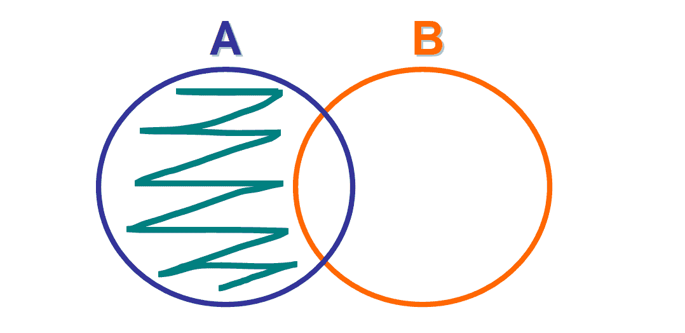

Venn Diagram. Difference.

💡**提示:**注意我们如何移除 A 中也在 B 中的元素(在交集中)。

我们可以很容易地将其扩展到两个以上的集合:

```
>>> a = {3, 1, 7, 4, 5}
>>> b = {2, 8, 3, 1, 5}
>>> c = {1, 0, 4, 6, 5}

# Only 7 is in A but not in B and not in C
>>> a - b - c
{7}
```

### 对称差

两个集合 A 和 B 之间的对称差是另一个集合，它包含**A 或 B 中的所有元素，但不同时包含**。我们基本上从交集中移除元素。

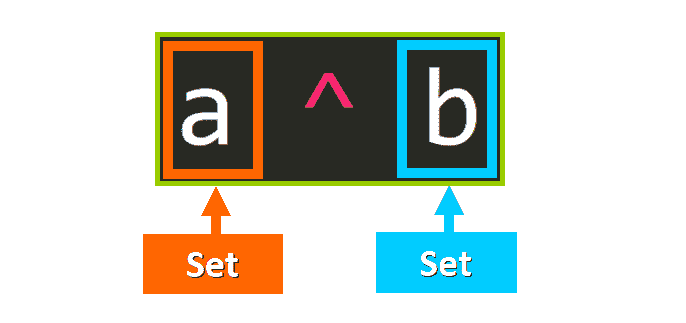

```
>>> a = {3, 6, 1}
>>> b = {2, 8, 3, 1}
>>> a ^ b
{2, 6, 8}
```

对称差的维恩图应该是这样的(见下文)，因为只有在 A 或 B 中的元素，而不是两者都在，才包括在结果集中:

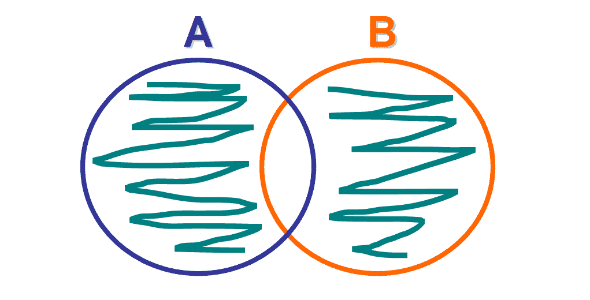

Venn Diagram. Symmetric Difference

我们可以很容易地将其扩展到两个以上的集合:

```
>>> a = {3, 1, 7, 4, 5}
>>> b = {2, 8, 3, 1, 5}
>>> c = {1, 0, 4, 6, 5}
>>> d = {8, 2, 6, 3, 5}

>>> a ^ b ^ c ^ d
{0, 1, 3, 7}
```

### 自动更新集合

如果想在执行完这些操作后立即更新集合 A，只需在操作符后添加一个等号。例如:

```
>>> a = {1, 2, 3, 4}
>>> b = {1, 2}

# Notice the &= 
>>> a &= b
>>> a
{1, 2}
```

我们将把从`a & b`得到的集合分配给仅在一行中的集合`a`。您可以对其他操作员进行同样的操作:`^=`、`|=`和`-=`。

**💡提示:**这与我们使用变量的语法非常相似(例如:`a += 5`)，但是现在我们使用集合。

## 🔹设置方法

集合包括有用的内置方法，帮助我们执行常见的和基本的功能，如添加元素、删除元素和清除集合。

### 添加元素

为了向集合中添加元素，我们使用了[。add()](https://docs.python.org/3/library/stdtypes.html#frozenset.add) 方法，将元素作为唯一的参数传递。

```
>>> a = {1, 2, 3, 4}
>>> a.add(7)
>>> a
{1, 2, 3, 4, 7}
```

### 删除元素

从集合中删除元素有三种方式:`.remove(<elem>)`、`.discard(<elem>)`和`.pop()`。我们将探究它们之间的主要区别。

前两种方法(。移除()和。discard())的工作方式与元素在集合中时完全相同。新的集合被返回:

```
>>> a = {1, 2, 3, 4}
>>> a.remove(3)
>>> a
{1, 2, 4}

>>> a = {1, 2, 3, 4}
>>> a.discard(3)
>>> a
{1, 2, 4}
```

这两种方法的关键区别在于，如果我们使用[。remove()](https://docs.python.org/3/library/stdtypes.html#frozenset.remove) 方法，我们冒着试图删除集合中不存在的元素的风险，这将引发一个`KeyError`:

```
>>> a = {1, 2, 3, 4}
>>> a.remove(5)
Traceback (most recent call last):
  File "<pyshell#102>", line 1, in <module>
    a.remove(5)
KeyError: 5
```

我们永远不会有那个问题。discard() 因为如果没有找到元素，它不会引发异常。该方法将简单地保持集合不变，如您在本例中所见:

```
>>> a = {1, 2, 3, 4}
>>> a.discard(5)
>>> a
{1, 2, 3, 4}
```

第三种方法([)。pop()](https://docs.python.org/3/library/stdtypes.html#frozenset.pop) )将从集合中移除并返回任意元素，如果集合为空，它将引发一个`KeyError`。

```
>>> a = {1, 2, 3, 4}
>>> a.pop()
1
>>> a.pop()
2
>>> a.pop()
3
>>> a
{4}
>>> a.pop()
4
>>> a
set()
>>> a.pop()
Traceback (most recent call last):
  File "<pyshell#119>", line 1, in <module>
    a.pop()
KeyError: 'pop from an empty set'
```

### 清空布景

如果需要删除集合中的所有元素，可以使用`.clear()`方法。例如:

```
>>> a = {1, 2, 3, 4}
>>> a.clear()
>>> a
set()
>>> len(a)
0
```

## 🔸概括起来

*   集合是没有任何重复元素的无序内置数据类型，因此它们允许我们从列表和元组中消除重复元素。
*   它们是可变的，只能包含不可变的元素。
*   我们可以检查一个集合是否是另一个集合的子集或超集。
*   Frozenset 是一种不可变的集合类型，它允许我们创建嵌套集合。
*   我们可以对集合进行运算:并(`|`)、交(`&`)、差(`-`)和对称差(`^`)。
*   我们可以使用内置方法向集合中添加元素、删除元素以及完全清除集合。

我真的希望你喜欢我的文章，并觉得它很有帮助。现在您可以在 Python 项目中使用集合了。[查看我的在线课程](https://www.udemy.com/user/estefania-cn/)。在[推特](https://twitter.com/EstefaniaCassN)上关注我。⭐️