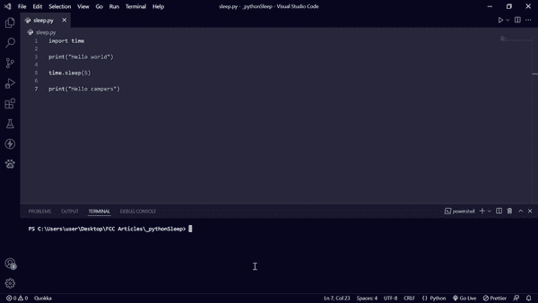
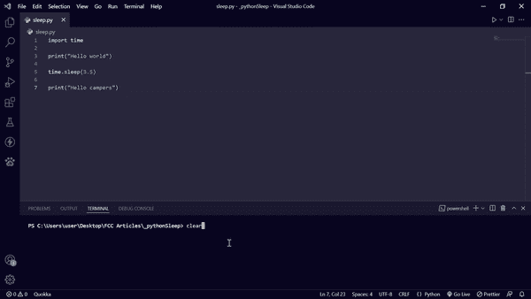
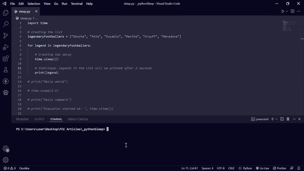

# Python Sleep–Python 中的 time.sleep()

> 原文：<https://www.freecodecamp.org/news/python-sleep-time-sleep-in-python/>

在运行 Python 程序时，有时您可能希望将程序的执行延迟几秒钟。

Python 时间模块有一个名为`time.sleep()`的内置函数，使用它可以延迟程序的执行。

使用 sleep()函数，您可以在 Python 项目中获得更大的创造性，因为它允许您创建延迟，这可能有助于您引入某些功能。

在本文中，您将学习如何使用`time.sleep()`方法来创建延迟。

请注意，用`time.sleep()`创建的延迟不会停止整个程序的执行——它们只会延迟当前线程。

## `time.sleep()`的基本语法

要在您的程序中使用`time.sleep()`，您必须首先从时间模块中导入它。

导入`sleep()`功能后，在括号内指定您希望延迟运行的秒数。

```
import time
time.sleep(delayInSeconds) 
```

## `time.sleep()`的基本例子

在下面的代码片段中，我在两个 print 语句之间设置了 5 秒的延迟，因此第二个 print 语句将在第一个 print 语句运行 5 秒后运行:

```
import time

print("Hello world")

time.sleep(5)

print("Hello campers") 
```



您也可以用浮点数指定延迟:

```
import time

print("Hello world")

time.sleep(3.5)

print("Hello campers") 
```



## 更多 time.sleep 示例()

通过将 time.sleep()与另一个来自 time 模块的内置函数`ctime()`(代表“当前时间”)结合起来，您可以更有创意地处理 time . sleep()产生的延迟。

```
import time

print("Execution started at: ", time.ctime())

time.sleep(10)
print("Hello world")

print("Execution ended at at: ", time.ctime())

# Output
# Executiuon started at:  Thu Mar 17 10:37:55 2022
# Hello world
# Executiuon ended at at:  Thu Mar 17 10:38:05 2022 
```

还可以使用 time.sleep()在遍历 list 或 tuple 等可迭代数据时创建多个延迟。

下面的例子展示了我是如何用一个列表做到这一点的:

```
import time

# Creating the list
legendaryFootballers = ["Okocha", "Pele", "Eusebio", "Martha", "Cruyff", "MAradona"]

for legend in legendaryFootballers:

    # Creating the delay
    time.sleep(2)

    # Individual legends in the list will be printed after 2 seconds
    print(legend) 
```

输出:

## 结论

本文向您介绍了如何在 Python 中使用`time.sleep()`函数。

`time.sleep()`是一个令人兴奋的内置函数，可以用于在 Python 项目中创建延迟，无论是游戏、web 项目还是 AI 系统。

继续编码！