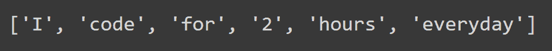
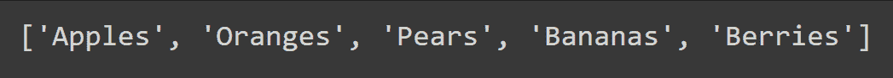
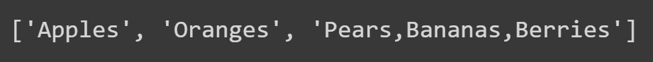
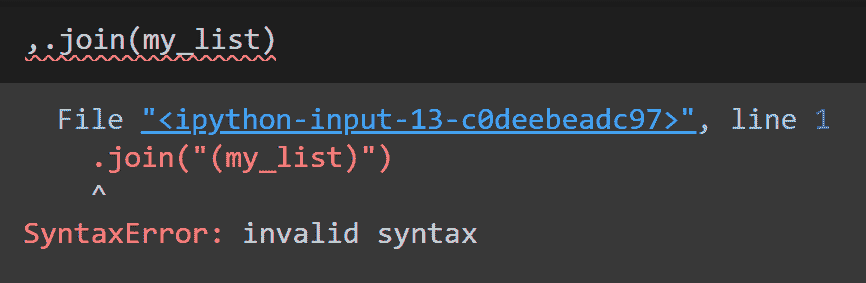
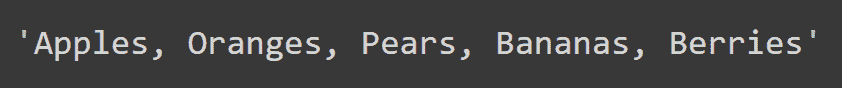
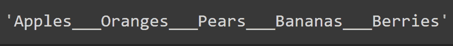

# Python 字符串 split()和 join()方法——用示例解释

> 原文：<https://www.freecodecamp.org/news/python-string-split-and-join-methods-explained-with-examples/>

在 Python 中处理字符串时，可能需要将一个字符串拆分成子字符串。或者你可能需要将更小的块连接在一起形成一个字符串。Python 的`split()`和`join()`字符串方法帮助你轻松完成这些任务。

在本教程中，您将学习带有大量示例代码的`split()`和`join()`字符串方法。

因为 Python 中的字符串是不可变的，所以您可以在不修改原始字符串的情况下调用它们的方法。让我们开始吧。

## Python `split()`方法语法

当需要将一个字符串拆分成子字符串时，可以使用`split()`方法。

`split()`方法作用于一个字符串，*返回给*一个子字符串列表。语法是:

```
<string>.split(sep,maxsplit)
```

在上面的语法中:

*   `<string>`是任何有效的 Python 字符串，
*   `sep`是您要拆分的分隔符。它应该被指定为一个*字符串*。

> 例如，如果您想在出现逗号时拆分`<string>`，您可以设置`sep = ","`。

*   `sep`是一个*可选的*参数。默认情况下，这个方法在*空格*上拆分字符串。
*   `maxsplit`是一个*可选*参数，表示你想要分割`<string>`的次数。
*   `maxsplit`有一个缺省值`-1`，它在*上拆分所有`sep`出现的*的字符串。

> 如果你想在第一个*逗号*出现时拆分`<string>`，你可以设置`maxsplit = 1`。

设置`maxsplit = 1`会给你留下两个块——一个在第一个逗号前有`<string>`部分，另一个在第一个逗号后有`<string>`部分。

当你拆分一个字符串的时候，你会得到两个块。当你把一根绳子分开两次，你会得到 3 块。当你拆分一个字符串`k`次，你会得到`k+1`个块。

让我们举几个例子来看看`split()`方法的作用。

## Python `split()`方法示例

先说下图的`my_string`。

```
my_string = "I code for 2 hours everyday"
```

现在，调用`my_string`上的`split()`方法，不带参数`sep`和`maxsplit`。

```
my_string.split()
```



您可以看到,`my_string`已经在所有空格上被拆分，并且返回了子字符串列表，如上所示。

现在让我们考虑下面的例子。这里，`my_string`有水果的名字，用逗号隔开。

```
my_string = "Apples,Oranges,Pears,Bananas,Berries"
```

现在让我们用逗号分隔`my_string`——在方法调用中设置`sep = ","`或只指定`","`。

```
my_string.split(",")
```

正如所料，`split()`方法返回一个水果列表，其中`my_string`中的每个水果现在都是一个列表项。



现在我们也使用可选的`maxsplit`参数，将其设置为 2。

```
my_string.split(",",2)
```



让我们试着解析返回的列表。

回想一下，`my_string`是`"Apples,Oranges,Pears,Bananas,Berries"`，我们决定用逗号(`","`)分开。

*   第一个逗号在`Apples`之后，在第一次拆分之后你会有两个条目，`Apples`和`Oranges,Pears,Bananas,Berries`。
*   第二个逗号在`Oranges`之后。第二次拆分后你会有 3 个项目，`Apples`、`Oranges`和`Pears,Bananas,Berries`。
*   在这一点上，您已经达到了 2 的`maxsplit`计数，并且不能再进行进一步的分割。
*   这就是为什么第二个逗号之后的字符串部分在返回的列表中被集中为一个单独的项。

我希望你明白`split()`方法以及`sep`和`maxsplit`参数是如何工作的。

## Python `join()`方法语法

既然您已经知道了如何将一个字符串拆分成子字符串，那么是时候学习如何使用`join()`方法从子字符串中形成一个字符串了。

Python 的`join()`方法的语法是:

```
<sep>.join(<iterable>)
```

这里，

*   任何包含子字符串的 Python iterable，比如一个列表或一个元组，以及
*   `<sep>`是要连接子字符串的分隔符。

> 本质上，`join()`方法使用`<sep>`作为分隔符来连接`<iterable>`中的所有项目。

现在是举例的时候了。

## Python `join()`方法示例

在前面关于`split()`方法的部分中，您将`my_string`分割成一个逗号出现列表。让我们称这个名单为`my_list`。

现在，您将使用`join()`方法形成一个字符串，将返回列表中的项目放在一起。`my_list`中的项目都是水果的名称。

```
my_list = my_string.split(",")

# after my_string is split my_list is:
['Apples', 'Oranges', 'Pears', 'Bananas', 'Berries'] 
```

📑注意，要连接的分隔符应该被指定为一个*字符串*。如果不这样做，就会遇到语法错误，如下所示。

```
,.join(my_list)
```



要使用逗号作为分隔符连接`my_list`中的项目，请使用`","`而非`,`。这显示在下面的代码片段中。

```
", ".join(my_list)
```

上面一行代码使用逗号后跟空格作为分隔符来连接`my_list`中的项目。



您可以指定自己选择的任何分隔符。这一次，您将使用 3 个下划线(`___`)来连接`my_list`中的项目。

```
"___".join(my_list)
```



`my_list`中的项目现在已经被连接成一个字符串，并且都被一个`___`相互分开。

现在您知道了如何通过使用`join()`方法将子字符串放在一起形成 Python 字符串。

## 结论

在本教程中，您学习了以下内容:

*   `<string>.split(sep, maxsplit)`拆分`<string>`上发生的`sep`、`maxsplit`次数、
*   `<sep>.join(<iterable>)`使用`<sep>`作为分隔符连接`<iterable>`中的子字符串。

希望这篇教程对你有所帮助。编码快乐！