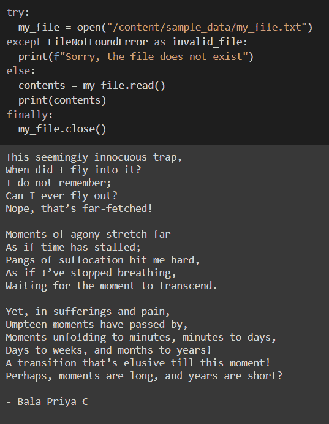

# Python Try 和 Except 语句——如何在 Python 中处理异常

> 原文：<https://www.freecodecamp.org/news/python-try-and-except-statements-how-to-handle-exceptions-in-python/>

当用 Python 编码时，即使在语法和逻辑上都正确的程序中，您也经常可以预见到运行时错误。这些错误可能是由无效输入或一些*可预测的*不一致引起的。

在 Python 中，您可以使用`try`和`except`块更优雅地将这些错误作为*异常*来处理。

在本教程中，您将学习`try`和`except`的一般语法。然后我们将继续编写简单的例子，讨论什么可能出错，并使用`try`和`except`块提供纠正措施。

## Python Try 和 Except 块的语法

让我们从理解 Python 中的`try`和`except`语句的语法开始。通用模板如下所示:

```
try:
	# There can be errors in this block

except <error type>:
	# Do this to handle exception;
	# executed if the try block throws an error

else:
	# Do this if try block executes successfully without errors

finally:
	# This block is always executed 
```

让我们来看看不同块的用途:

*   `try`块是您想要尝试执行的语句块。但是，由于异常，可能会出现运行时错误，并且该块可能无法按预期工作。
*   当`try`模块因异常而失效时，触发`except`模块。它包含一组语句，这些语句通常会给你一些关于`try`块内部出错的上下文。
*   您应该始终提到您打算在`except`块中作为异常捕获的*错误*的*类型*，在上面的代码片段中用占位符`<error type>`表示。
*   你也可以使用`except`而不指定`<error type>`。但是，这不是推荐的做法，因为您没有考虑可能发生的不同类型的错误。

> 在尝试执行`try`块中的代码时，也有可能出现多个错误。

例如，您可能正在使用超出范围的索引访问一个列表，使用错误的字典键，并试图打开一个不存在的文件——所有这些都在`try`块中。

在这种情况下，你可能会碰到`IndexError`、`KeyError`、`FileNotFoundError`。您必须添加与您预期的错误数量一样多的`except`块，每种错误一个。

*   只有在执行`try`程序块时没有错误，才会触发`else`程序块。当您想在`try`块成功后采取后续行动时，这可能很有用。例如，如果您尝试成功打开一个文件，您可能想要读取其内容。
*   不管其他块中发生了什么，总是执行`finally`块。当您希望在执行特定代码块后释放资源时，这很有用。

> **注**:模块`else`和`finally`为*可选。*在大多数情况下，你可以只使用`try`块来尝试做一些事情，并在`except`块中捕捉错误作为异常。

在接下来的几分钟里，您将使用到目前为止学到的知识来处理 Python 中的异常。让我们开始吧。

## 如何在 Python 中处理一个`ZeroDivisionError`

考虑下面显示的函数`divide()`。它有两个参数——`num`和`div`——并返回除法运算的商`num/div`。

```
def divide(num,div):
  return num/div
```

用不同的数字调用该函数会返回预期的结果:

```
res = divide(100,8)
print(res)

# Output
12.5

res = divide(568,64)
print(res)

# Output
8.875 
```

这段代码运行良好，直到您尝试除以零:

```
divide(27,0) 
```

您会看到程序崩溃并抛出一个`ZeroDivisionError`:

```
# Output
---------------------------------------------------------------------------
ZeroDivisionError                         Traceback (most recent call last)
<ipython-input-19-932ea024ce43> in <module>()
----> 1 divide(27,0)

<ipython-input-1-c98670fd7a12> in divide(num, div)
      1 def divide(num,div):
----> 2   return num/div

ZeroDivisionError: division by zero 
```

您可以通过执行以下操作来异常处理这种被零除的情况:

*   在`try`块中，调用`divide()`函数。本质上，你试图用`div`除`num`。
*   在`except`块内，当`div`为`0`时，作为异常处理。
*   在这个例子中，您可以通过打印一条消息通知用户他们试图除以零来排除`ZeroDivisionError`。

这显示在下面的代码片段中:

```
try:
    res = divide(num,div)
    print(res)
except ZeroDivisionError:
    print("You tried to divide by zero :( ") 
```

有了有效的输入，代码仍然可以正常工作。

```
divide(10,2)
# Output
5.0 
```

当您尝试从零开始执行时，您会收到发生异常的通知，程序会优雅地结束。

```
divide(10,0)
# Output
You tried to divide by zero :( 
```

## 如何在 Python 中处理一个`TypeError`

在这一节中，您将看到如何使用`try`和`except`来处理 Python 中的`TypeError`。

考虑下面的函数`add_10()`,它接受一个数字作为参数，给它加 10，然后返回这个加法的结果。

```
def add_10(num):
  return num + 10
```

你可以用任何数字调用函数`add_10()`,它会正常工作，如下所示:

```
result = add_10(89)
print(result)

#Output
99
```

现在试着用`"five"`而不是`5`来称呼`add_10()`。

```
add_10("five")
```

您会注意到您的程序崩溃了，并显示以下错误消息:

```
---------------------------------------------------------------------------
TypeError                                 Traceback (most recent call last)
<ipython-input-15-9844e949c84e> in <module>()
----> 1 add_10("five")

<ipython-input-13-2e506d74d919> in add_10(num)
      1 def add_10(num):
----> 2   return num + 10

TypeError: can only concatenate str (not "int") to str
```

错误消息`TypeError: can only concatenate str (not "int") to str`解释说您只能连接两个字符串，并且不能将一个整数添加到一个字符串中。

现在，您有以下内容:

*   给定一个数字`my_num`、*，尝试*调用函数`add_10()`并将`my_num`作为参数。如果参数是有效类型，没有例外
*   否则，对应于`TypeError`的`except`块被触发，通知用户参数是无效类型。

这解释如下:

```
my_num = "five"
try:
  result = add_10(my_num)
  print(result)
except TypeError:
  print("The argument `num` should be a number")
```

因为您现在已经将`TypeError`作为一个异常来处理，所以您只被告知参数是无效类型。

```
The argument `num` should be a number
```

## 如何在 Python 中处理一个`IndexError`

如果您以前使用过 Python 列表或任何 Python iterable，您可能会遇到`IndexError`。

这是因为通常很难跟踪对 iterables 的所有更改。您可能试图访问无效索引中的项目。

在本例中，列表`my_list`有 4 个项目。有效的索引是 0、1、2 和 3，如果使用负索引，则为-1、-2、-3、-4。

由于`2`是一个有效的索引，您会看到索引`2`处的项目，即`C++`，被打印出来:

```
my_list = ["Python","C","C++","JavaScript"]
print(my_list[2])

#Output
C++
```

如果您试图访问有效索引范围之外的索引项，您将遇到一个`IndexError`:

```
print(my_list[4])
```

```
---------------------------------------------------------------------------
IndexError                                Traceback (most recent call last)
<ipython-input-7-437bc6501dea> in <module>()
      1 my_list = ["Python","C","C++","JavaScript"]
----> 2 print(my_list[4])

IndexError: list index out of range
```

如果您熟悉这种模式，现在您将使用`try`和`except`来处理索引错误。

在下面的代码片段中，您尝试访问由`search_idx`指定的索引处的项目。

```
search_idx = 3
try:
  print(my_list[search_idx])
except IndexError:
  print("Sorry, the list index is out of range")
```

这里，`search_idx` ( `3`)是一个有效的索引，特定索引处的项目被打印出来:

```
JavaScript
```

如果`search_idx`在索引的有效范围之外，except 块将捕捉`IndexError`作为异常，并且不再有长的错误消息。🙂

```
search_idx = 4
try:
  print(my_list[search_idx])
except IndexError:
  print("Sorry, the list index is out of range")
```

相反，会显示一条消息，说明`search_idx`超出了索引的有效范围:

```
Sorry, the list index is out of range
```

## 如何在 Python 中处理一个`KeyError`

在使用 Python 字典时，您可能会遇到`KeyError`

考虑这个例子，你有一本字典`my_dict`。

```
my_dict ={"key1":"value1","key2":"value2","key3":"value3"}
search_key = "non-existent key"
print(my_dict[search_key])
```

*   字典`my_dict`有 3 个键值对，`"key1:value1"`、`"key2:value2"`和`"key3:value3"`
*   现在，您尝试进入字典并访问与键`"non-existent key"`对应的值。

不出所料，你会得到一个`KeyError`:

```
---------------------------------------------------------------------------
KeyError                                  Traceback (most recent call last)
<ipython-input-2-2a61d404be04> in <module>()
      1 my_dict ={"key1":"value1","key2":"value2","key3":"value3"}
      2 search_key = "non-existent key"
----> 3 my_dict[search_key]

KeyError: 'non-existent key'
```

您可以用几乎与处理`IndexError`相同的方式来处理`KeyError`。

*   您可以尝试访问与由`search_key`指定的键相对应的值。
*   如果`search_key`确实是一个有效的键，则相应的值被打印出来。
*   如果因为不存在的键而遇到异常，可以使用`except`块让用户知道。

下面的代码片段对此进行了解释:

```
try:
  print(my_dict[search_key])
except KeyError:
  print("Sorry, that's not a valid key!")
```

```
Sorry, that's not a valid key!
```

如果您想提供额外的上下文，如无效密钥的名称，您也可以这样做。有可能是键拼写错误导致无效。在这种情况下，让用户知道所使用的键可能会帮助他们纠正输入错误。

您可以通过将无效键捕获为`<error_msg>`并在异常发生时在打印的消息中使用它来做到这一点:

```
try:
  print(my_dict[search_key])
except KeyError as error_msg:
  print(f"Sorry,{error_msg} is not a valid key!")
```

请注意钥匙的名称也是如何打印出来的:

```
Sorry,'non-existent key' is not a valid key!
```

## 如何在 Python 中处理一个`FileNotFoundError`

在 Python 中处理文件时出现的另一个常见错误是`FileNotFoundError`。

在以下示例中，您试图通过指定文件`my_file.txt`到函数`open()`的路径来打开文件`my_file.txt`。你想阅读文件并打印出文件的内容。

但是，您还没有在指定的位置创建文件。

如果您尝试运行下面的代码片段，您将得到一个`FileNotFoundError`:

```
my_file = open("/content/sample_data/my_file.txt")
contents = my_file.read()
print(contents)
```

```
---------------------------------------------------------------------------
FileNotFoundError                         Traceback (most recent call last)
<ipython-input-4-4873cac1b11a> in <module>()
----> 1 my_file = open("my_file.txt")

FileNotFoundError: [Errno 2] No such file or directory: 'my_file.txt'
```

使用`try`和`except`，您可以执行以下操作:

*   尝试打开`try`块中的文件。
*   通过让用户知道他们试图打开一个不存在的文件来处理`except`块中的`FileNotFoundError`。
*   如果`try`块成功，并且文件确实存在，读取并打印出文件的内容。
*   在`finally`块中，关闭文件，这样就不会浪费资源。回想一下不管在文件打开和读取步骤中发生了什么，文件将如何关闭。

```
try:
  my_file = open("/content/sample_data/my_file.txt")
except FileNotFoundError:
  print(f"Sorry, the file does not exist")
else:
  contents = my_file.read()
  print(contents)
finally:
  my_file.close()
```

请注意您是如何将该错误作为一个异常来处理的，程序会优雅地结束并显示下面的消息:

```
Sorry, the file does not exist
```

让我们考虑触发`else`块的情况。文件`my_file.txt`现在出现在前面提到的路径中。


下面是文件`my_file.txt`包含的内容:


现在，重新运行前面的代码片段可以正常工作了。

这一次，文件`my_file.txt`存在，触发`else`块并打印出其内容，如下所示:



我希望这阐明了在处理文件时如何处理异常。

## 结论

在本教程中，您已经学习了如何在 Python 中使用`try`和`except`语句来处理异常。

您编写了示例来理解可能发生的异常类型，以及如何使用`except`来捕捉最常见的错误。

希望你喜欢这个教程。编码快乐！直到下次:)