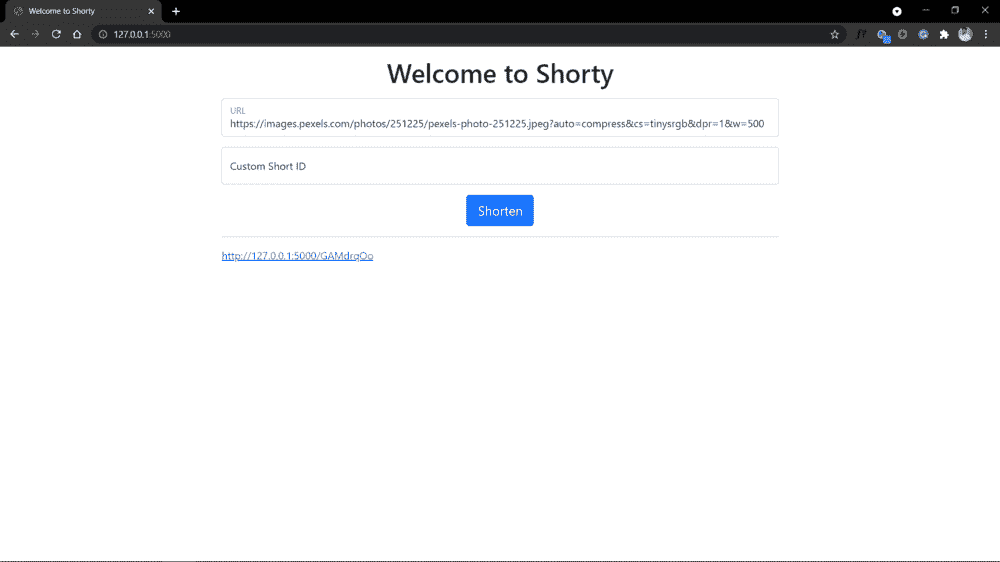
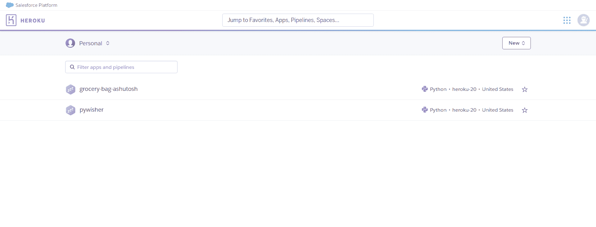
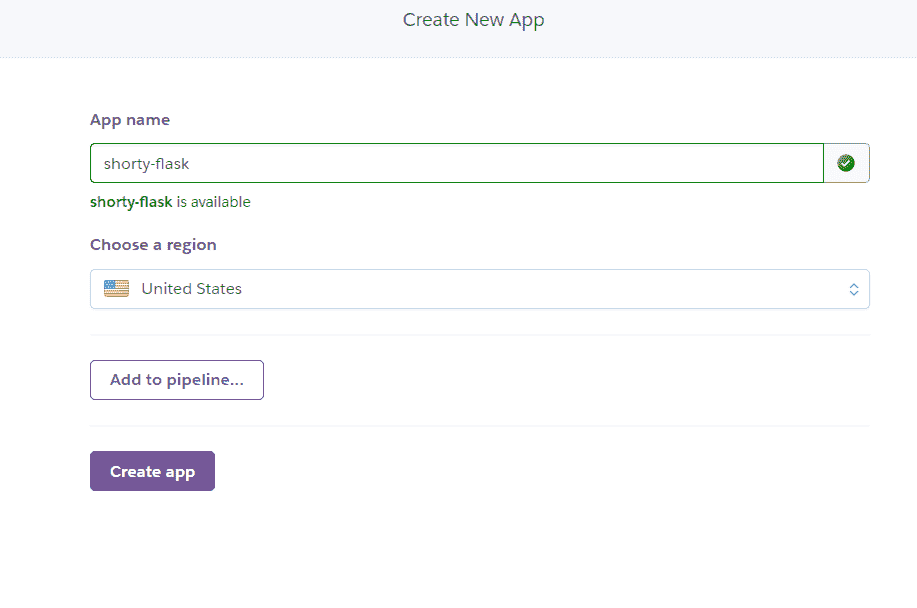
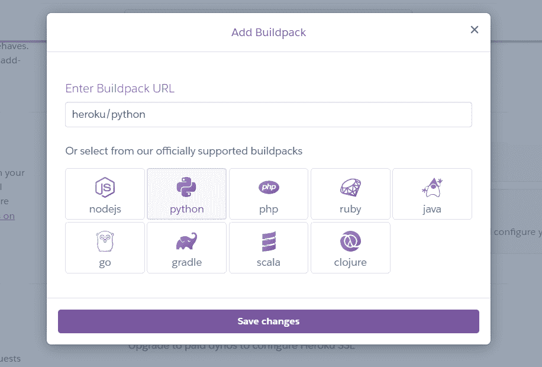
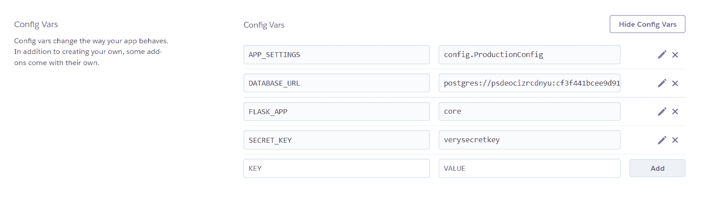
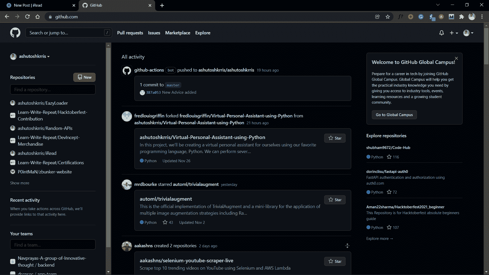
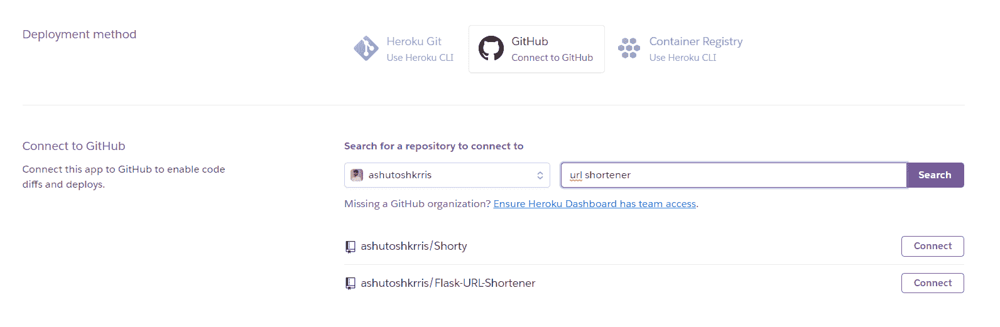
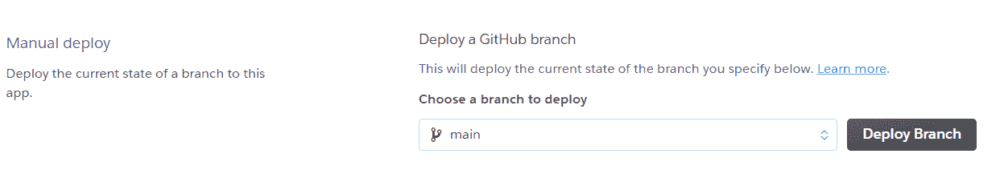
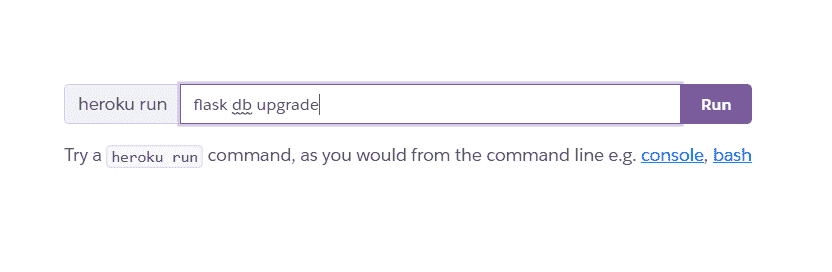

# Python 教程——如何使用 Flask 创建 URL 缩写器

> 原文：<https://www.freecodecamp.org/news/python-tutorial-how-to-create-a-url-shortener-using-flask/>

在本教程中，我们将使用 Flask 构建一个 URL 缩短器。该工具接受任何 URL，并生成一个更短、可读性更强的版本，如 [bit.ly](https://bitly.com/) 。

该应用程序将允许用户输入一个 URL 和一个可选的自定义短 id，并生成一个较短的版本。

这是我们将要建造的:

[https://www.youtube.com/embed/g6chXThUReU?feature=oembed](https://www.youtube.com/embed/g6chXThUReU?feature=oembed)

应用程序的前端并不吸引人，因为项目的主要焦点是构建一个后端项目。

一些缩短的 URL 的例子是 https://shorty-flask.herokuapp.com/mzkpK8sw 的[和 https://shorty-flask.herokuapp.com/linkify 的](https://shorty-flask.herokuapp.com/mzkpK8sw)[和](https://shorty-flask.herokuapp.com/linkify)。

## 创建虚拟环境并安装依赖项

在本教程中，我们将使用 Pipenv 来管理我们的虚拟环境。

[Pipenv](https://pypi.org/project/pipenv/) 是一个工具，可以自动为你的项目创建和管理一个 virtualenv，并且在你安装/卸载软件包时从你的`Pipfile`中添加/移除软件包。它还生成非常重要的`Pipfile.lock`，用于产生确定性的构建。

你可以阅读[这篇文章](https://medium.com/analytics-vidhya/why-pipenv-over-venv-for-python-projects-a51fb6e4f31e)了解更多。

Pipenv 是一个外部库，我们需要显式安装它。要安装库，请使用 pip 命令:

```
pip install pipenv
```

安装完成后，我们可以创建一个虚拟环境，并使用以下命令激活它:

```
pipenv shell
```

要停用虚拟环境，我们有一个简单的命令:

```
exit
```

一旦创建并激活了虚拟环境，就可以安装所需的库了。

*   Flask 是一个简单易用的 Python 微框架，可以帮助构建可扩展的安全 web 应用程序。Python 没有预装该模块，因此我们需要使用以下命令来安装它:

    ```
    pipenv install Flask 
    ```

*   Flask-Migrate 是一个使用 Alembic 为 Flask 应用程序处理 SQLAlchemy 数据库迁移的扩展。数据库操作通过 Flask 命令行界面可用。要安装该模块，请使用以下命令:

    ```
    pipenv install Flask-Migrate 
    ```

*   Flask-SQLAlchemy 是 Flask 的扩展，为您的应用程序增加了对 SQLAlchemy 的支持。它通过提供有用的缺省值和额外的帮助器来简化 SQLAlchemy 和 Flask 的使用，使执行普通任务变得更加容易。要安装该模块，请使用以下命令:

    ```
    pipenv install Flask-SQLAlchemy 
    ```

*   [Psycopg2](https://pypi.org/project/psycopg2/) 是 Python 编程语言最流行的 PostgreSQL 数据库适配器。要安装该模块，请使用以下命令:

    ```
    pipenv install psycopg2 
    ```

*   [Gunicorn](https://gunicorn.org/) 是用于 UNIX 的 Python WSGI HTTP 服务器。要安装该模块，请使用以下命令:

    ```
    pipenv install gunicorn 
    ```

*   [Python 解耦](https://pypi.org/project/python-decouple/):我们还将在这个项目中使用[环境变量](https://iread.ga/posts/49/do-you-really-need-environment-variables-in-python)。因此，我们将安装另一个名为 python-decouple 的模块来处理这个问题:

    ```
    pipenv install python-decouple 
    ```

## 如何设置 Flask 项目

我们要做的第一件事是创建一个 Flask 项目。如果你查一下 Flask 的官方文档，你会在那里找到一个[的最小应用](https://flask.palletsprojects.com/en/2.0.x/quickstart/#a-minimal-application)。

但是，我们不打算这样做。我们将编写一个可扩展性更强、基础结构更好的应用程序。如果你愿意，你可以按照[这个指南](https://iread.ga/posts/54/getting-started-with-flask)开始使用 Flask。

我们的应用程序将存在于一个名为 ****内核**** 的包中。要将一个普通的目录转换成 Python 包，我们只需要包含一个`__init__.py`文件。所以，让我们首先创建我们的核心包。

```
$ mkdir core
```

之后，让我们在核心目录中创建`__init__.py`文件:

```
$ cd core
$ touch __init__.py
$ cd ..
```

在项目的根目录下，创建一个名为`config.py`的文件。我们将把项目的配置存储在这个文件中。在文件中，添加以下内容:

```
from decouple import config

DATABASE_URI = config("DATABASE_URL")
if DATABASE_URI.startswith("postgres://"):
    DATABASE_URI = DATABASE_URI.replace("postgres://", "postgresql://", 1)

class Config(object):
    DEBUG = False
    TESTING = False
    CSRF_ENABLED = True
    SECRET_KEY = config('SECRET_KEY', default='guess-me')
    SQLALCHEMY_DATABASE_URI = DATABASE_URI
    SQLALCHEMY_TRACK_MODIFICATIONS = False

class ProductionConfig(Config):
    DEBUG = False

class StagingConfig(Config):
    DEVELOPMENT = True
    DEBUG = True

class DevelopmentConfig(Config):
    DEVELOPMENT = True
    DEBUG = True

class TestingConfig(Config):
    TESTING = True
```

在上面的脚本中，我们创建了一个`Config`类，并在其中定义了各种属性。此外，我们已经创建了继承`Config`类的不同子类(按照不同的开发阶段)。

注意，我们使用了一些环境变量，如 **SECRET_KEY** 和 **DATABASE_URL** 。在根目录下创建一个名为`.env`的文件，并在其中添加以下内容:

```
SECRET_KEY=verysecretkey
DATABASE_URL=sqlite:///shorty.db
APP_SETTINGS=config.DevelopmentConfig
FLASK_APP=core
```

除了 **SECRET_KEY** 和 **DATABASE_URL** ，我们还指定了 **APP_SETTINGS** 和 **FLASK_APP** 。

**APP_SETTINGS** 引用了我们在`config.py`文件中创建的一个类。我们将其设置为项目的当前阶段。 **FLASK_APP** 的值是我们已经创建的包的名称。

现在，我们可以在`core/__init__.py`文件中添加以下内容:

```
from flask import Flask
from flask_sqlalchemy import SQLAlchemy
from flask_migrate import Migrate
from decouple import config

app = Flask(__name__)
app.config.from_object(config("APP_SETTINGS"))

db = SQLAlchemy(app)
migrate = Migrate(app, db)

from core import routes
```

在上面的 Python 脚本中，我们首先从已经安装的 Flask 模块中导入 Flask 类。接下来，我们创建一个 Flask 类的对象`app`。我们使用`__name__`参数来指示应用程序的模块或包，以便 Flask 知道在哪里可以找到其他文件，比如模板。

接下来，我们根据`.env`文件中的变量将应用配置设置为 ****APP_SETTINGS**** 。为了在我们的应用程序中使用 Flask-SQLAlchemy 和 Flask-Migrate，我们只需要分别从`flask_sqlalchemy`和`flask_migrate`库中创建`SQLAlchemy`类和`Migrate`类的对象。

然后应用程序导入还不存在的`routes`模块。

为了运行应用程序，我们将使用一个包含以下内容的`main.py`文件:

```
from core import app

if __name__ == '__main__':
    app.run()
```

## 如何创建数据库表

为了定义我们的数据库表，我们将在核心包中创建一个`models.py`文件。在其中，我们可以编写以下代码:

```
from core import db
from datetime import datetime

class ShortUrls(db.Model):
    id = db.Column(db.Integer, primary_key=True)
    original_url = db.Column(db.String(500), nullable=False)
    short_id = db.Column(db.String(20), nullable=False, unique=True)
    created_at = db.Column(db.DateTime(), default=datetime.now(), nullable=False)
```

我们首先导入在`__init__.py`文件中初始化的`db` 对象。然后我们创建了一个`ShortUrls`类，包含几个字段，如 **id** (主键)、 **original_url** (由用户提供)、 **short_id** (由我们生成或由用户提供)、以及 **created_at** (时间戳)。

然后我们可以使用 **Flask-Migrate** 命令用新表迁移数据库。我们将使用的命令是:

*   `flask db init` —开始初始化数据库(仅使用一次)
*   `flask db migrate` —将新的更改迁移到数据库(每次我们在数据库表中进行更改时使用)
*   `flask db upgrade` —用新的变化升级我们的数据库(与 migrate 命令一起使用)

在我们运行数据库初始化之后，我们将在项目中看到一个名为“ **migrations** 的新文件夹。这是 Alembic 针对项目运行迁移所必需的设置。

在“migrations”中，我们会看到它有一个名为“versions”的文件夹，其中包含创建的迁移脚本。

# **如何创建缩短网址的主页**

在这一步中，我们将为索引页面创建一个 Flask route，它将允许用户输入一个 URL，然后我们将它保存到数据库中。这个路由将使用用户提供的自定义短 id，或者自己生成一个短 id，构造短 URL，然后将其作为结果呈现出来。

首先，我们在核心包中创建一个`routes.py`文件，并创建一个 Python 函数来生成短 id。

```
from random import choice
import string

def generate_short_id(num_of_chars: int):
    """Function to generate short_id of specified number of characters"""
    return ''.join(choice(string.ascii_letters+string.digits) for _ in range(num_of_chars))
```

为了生成一个短 id，我们使用了 Python 的**随机***模块中的**选择**方法。此外，我们使用 Python 内置的**字符串**模块来处理字母(小写+大写)和数字。*

现在，我们需要为将由索引路由提供服务的索引页面创建一个模板。这个模板将有一个简单的形式，用户可以输入原始的 URL 和自定义短 id(可选)并提交它。

但是我们不会直接创建`index.html`。我们可以使用 Jinja2 中的模板继承概念。因此，让我们在`core`包中创建一个**模板**目录，并在其中创建一个`base.html`文件。您可以将 HTML 代码粘贴到该文件中。

```
<!doctype html>
<html lang="en">
  <head>
    <!-- Required meta tags -->
    <meta charset="utf-8">
    <meta name="viewport" content="width=device-width, initial-scale=1, shrink-to-fit=no">

    <!-- Bootstrap CSS -->
    <link href="https://cdn.jsdelivr.net/npm/bootstrap@5.1.0/dist/css/bootstrap.min.css" rel="stylesheet" integrity="sha384-KyZXEAg3QhqLMpG8r+8fhAXLRk2vvoC2f3B09zVXn8CA5QIVfZOJ3BCsw2P0p/We" crossorigin="anonymous">

    <title> </title>
  </head>
  <body>
    <div class="container mt-3">
        
            <div class="alert alert-danger">{{ message }}</div>
        
         
    </div>

    <!-- Optional JavaScript -->
    <!-- jQuery first, then Popper.js, then Bootstrap JS -->
    <script src="https://code.jquery.com/jquery-3.3.1.slim.min.js" integrity="sha384-q8i/X+965DzO0rT7abK41JStQIAqVgRVzpbzo5smXKp4YfRvH+8abtTE1Pi6jizo" crossorigin="anonymous"></script>
    <script src="https://cdn.jsdelivr.net/npm/@popperjs/core@2.9.3/dist/umd/popper.min.js" integrity="sha384-eMNCOe7tC1doHpGoWe/6oMVemdAVTMs2xqW4mwXrXsW0L84Iytr2wi5v2QjrP/xp" crossorigin="anonymous"></script>
    <script src="https://cdn.jsdelivr.net/npm/bootstrap@5.1.0/dist/js/bootstrap.min.js" integrity="sha384-cn7l7gDp0eyniUwwAZgrzD06kc/tftFf19TOAs2zVinnD/C7E91j9yyk5//jjpt/" crossorigin="anonymous"></script>
  </body>
</html>
```

注意，为了设计风格，我们在这里使用了 [Bootstrap](https://getbootstrap.com/) 。

前面块中的大部分代码是引导所需的标准 HTML 代码。`<meta>`标签为网络浏览器提供信息，`<link>`标签链接引导 CSS 文件，`<script>`标签链接到允许一些额外引导特性的 JavaScript 代码。

您可以查看[引导文档](https://getbootstrap.com/)了解更多信息。

标签允许继承模板定义一个定制的标题。

我们使用`for message in get_flashed_messages()`循环来显示闪烁的消息(警告、警报等)。

` `占位符是继承模板放置内容的地方，这样所有的模板都可以访问这个基础模板，这样可以避免重复。

接下来，创建将扩展这个`base.html`文件的`index.html`文件:

```



    <h1 class="text-center mb-3"> Welcome to Shorty </h1>
    <div class="row">
        <div class="col-md-2"></div>
        <div class="col-md-8">
            <form method="post" action="{{url_for('index')}}">
            <div class="form-floating mb-3">
                <input type="text" name="url" id="url"
                    placeholder="Enter looooooooooooong URL" class="form-control"
                    value="{{ request.form['url'] }}" autofocus></input>
                <label for="url">URL</label>
            </div>
            <div class="form-floating mb-3">
                <input type="text" name="custom_id" id="custom_id"
                    placeholder="Want to customise? (optional)" class="form-control"
                    value="{{ request.form['custom_id'] }}"></input>
                <label for="custom_id">Custom Short ID</label>
            </div>

            <div class="form-group text-center">
                <button type="submit" class="btn btn-lg btn-primary">Shorten</button>
            </div>
            </form>

            
            <hr>
            <span><a href="{{ short_url }}" target="_blank">{{ short_url }}</a></span>
            
        </div>
        <div class="col-md-2"></div>
    </div>

```

这里我们扩展了`base.html`，定义了一个标题，并创建了一个带有两个名为`url`和`custom_id`的输入的表单。

`url`输入将允许用户输入 URL 来缩短。它有一个值`request.form['url']`，在提交失败的情况下存储数据(即如果用户没有提供 URL)。同样，`custom_id`输入将允许用户输入一个自定义的短 id。然后我们有一个提交按钮。

然后我们检查`short_url`变量是否有任何值——如果表单提交并且短 URL 成功生成，则为真。如果条件为真，我们在表单下显示短 URL。

现在我们可以将`routes.py`中的索引视图函数重写为:

```
from datetime import datetime
from core.models import ShortUrls
from core import app, db
from random import choice
import string
from flask import render_template, request, flash, redirect, url_for

def generate_short_id(num_of_chars: int):
    """Function to generate short_id of specified number of characters"""
    return ''.join(choice(string.ascii_letters+string.digits) for _ in range(num_of_chars))

@app.route('/', methods=['GET', 'POST'])
def index():
    if request.method == 'POST':
        url = request.form['url']
        short_id = request.form['custom_id']

        if short_id and ShortUrls.query.filter_by(short_id=short_id).first() is not None:
            flash('Please enter different custom id!')
            return redirect(url_for('index'))

        if not url:
            flash('The URL is required!')
            return redirect(url_for('index'))

        if not short_id:
            short_id = generate_short_id(8)

        new_link = ShortUrls(
            original_url=url, short_id=short_id, created_at=datetime.now())
        db.session.add(new_link)
        db.session.commit()
        short_url = request.host_url + short_id

        return render_template('index.html', short_url=short_url)

    return render_template('index.html') 
```

`index()`函数是一个烧瓶**视图函数**，这是一个使用特殊`@app.route` [装饰器](https://en.wikipedia.org/wiki/Python_syntax_and_semantics#Decorators)装饰的函数。它的返回值被转换成 HTTP 客户端(如 web 浏览器)显示的 HTTP 响应。

在`index()`视图函数中，我们通过将`methods=['GET', 'POST']`传递给`app.route()`装饰器来接受 GET 和 POST 请求。

然后，如果请求是 GET 请求，它跳过`if request.method == 'POST'`条件，直到最后一行。这就是我们呈现一个名为`index.html`的模板的地方，该模板将包含一个供用户输入 URL 以缩短的表单。

如果请求是 POST 请求，`if request.method == 'POST'`条件为真，这意味着用户已经提交了一个 URL。我们将 URL 存储在`url`变量中。如果用户提交了一个空表单，你闪现消息`The URL is required!`并重定向到索引页面。

如果用户输入了`custom_id`，我们将它存储在 **short_id** 中，否则我们使用之前创建的函数生成随机的短 id。

如果用户提交了一个 URL，我们创建一个包含所有数据的`new_link`，比如`original_url` `short_id`和`created_at`。然后我们提交交易。

然后我们使用`request.host_url`构造短 URL，这是 Flask 的`request`对象提供的一个属性，用于访问应用程序主机的 URL。这将是开发环境中的`http://127.0.0.1:5000/`，如果我们部署我们的应用程序，这将是`our_domain`。

例如，`short_url`变量将有一个类似于`http://127.0.0.1:5000/asdf1gHJ`的值，它是一个短 URL，将用户重定向到数据库中存储的原始 URL，其 ID 与`asdf1gHJ`匹配。

最后，我们渲染`index.html`模板，将`short_url`变量传递给它。

我们现在可以运行服务器并测试我们的视图功能。



我们已经创建了一个 Flask 应用程序，它有一个接受 URL 并生成更短的 URL 的页面，但是 URL 还不能做任何事情。

在下一步中，我们将添加一个路由，它从短 URL 中提取 short_id，找到原始 URL，并将用户重定向到它。

## 如何添加重定向路由

在这一步中，我们将添加一个新的路由，它采用应用程序生成的短 id 并获取原始 URL。最后，我们会将用户重定向到原始 URL。

```
@app.route('/<short_id>')
def redirect_url(short_id):
    link = ShortUrls.query.filter_by(short_id=short_id).first()
    if link:
        return redirect(link.original_url)
    else:
        flash('Invalid URL')
        return redirect(url_for('index'))
```

这个新路由通过 URL 接受一个值`short_id`，并将其传递给`url_redirect()`视图函数。例如，访问`[http://127.0.0.1:5000/asdf1gHJ](http://127.0.0.1:5000/asdf1gHJ)`会将字符串`'asdf1gHJ'`传递给`short_id`参数。

在视图函数中，我们使用`short_id`从数据库中获取链接。如果不是 None，view 函数将使用`redirect()` Flask helper 函数将用户重定向到与这个`short_id`相关联的`original_url`。否则，它会闪现一条错误消息，通知用户该 URL 无效，并将他们重定向到索引页面。

现在我们可以再次运行服务器，最后测试应用程序。

## 如何在 Heroku 上部署应用程序

为了在 Heroku 上部署我们的应用程序，我们需要对我们的项目做一些修改。但首先，你应该在 Heroku 上创建一个免费帐户。

前往[heroku.com](https://signup.heroku.com/)创建一个账户。一旦您创建了帐户，您就可以继续了。

登录你的 Heroku 账户，你会看到一个类似的界面:



点击**新建**按钮，然后点击**创建新应用**。输入应用名称，然后点击**创建应用按钮**。请确保该名称可用。



点击**设置**选项卡，向下滚动到**构建包**。点击**添加 buildpack** 按钮，添加 **Python** 。



由于这个应用程序需要一个数据库，我们将在参考资料中添加一个 Postgres 数据库(Heroku 上免费提供)。

点击**资源**选项卡，在搜索框中搜索 Postgres。在搜索结果中选择 **Heroku Postgres** ，然后点击**提交订单**将其添加到资源中。


因为我们已经在项目中使用了环境变量，所以我们需要在 Heroku 上添加它们。

点击**设置**选项卡，滚动到**配置变量**，点击**显示配置变量**。打开项目中的`.env`文件，复制并粘贴到配置变量中，如下所示:



注意，我们已经将`APP_SETTINGS`设置为`config.ProductionConfig`,因为我们正在公开部署应用程序。

我们将使用 GitHub 部署我们的应用程序，这将使我们的任务更容易。如果您没有 GitHub 帐户，请在这里为您自己创建一个。如果您有 GitHub 帐户，请登录您的帐户。登录后，您会看到一个类似的屏幕:



使用绿色的 **New** 按钮为您的项目创建一个存储库。然后转到您系统上的项目。确保您的系统中安装了 Git。如果没有，从[这里](https://git-scm.com/downloads)安装。在您的项目中打开一个终端，并编写以下命令:

```
$ git init
$ git remote add origin <your-repository-url-here>
$ git add .
$ git commit -m "Initial commit"
$ git push origin main
```

用 GitHub 提供的 URL 替换`<your-repository-url-here>` 。

现在我们需要添加 Heroku 需要的两个新文件—`Procfile`和`runtime.txt`:

```
web: gunicorn main:app
```

这声明了一个流程类型`web`，以及运行它所需的命令。

名字`web`在这里很重要。它声明这个流程类型将被附加到 Heroku 的 [HTTP 路由](https://devcenter.heroku.com/articles/http-routing)栈，并在部署时接收 web 流量。请注意，Procfile 文件没有任何扩展名。

接下来，创建一个`runtime.txt`文件，并在其中添加您的 Python 版本，如下所示:

```
python-3.9.7
```

另外，创建一个`.gitignore`文件并添加以下内容:

```
# Django #
*.log
*.pot
*.pyc
__pycache__
media
db.sqlite3

# Backup files # 
*.bak 

# If you are using PyCharm # 
.idea/**/workspace.xml 
.idea/**/tasks.xml 
.idea/dictionaries 
.idea/**/dataSources/ 
.idea/**/dataSources.ids 
.idea/**/dataSources.xml 
.idea/**/dataSources.local.xml 
.idea/**/sqlDataSources.xml 
.idea/**/dynamic.xml 
.idea/**/uiDesigner.xml 
.idea/**/gradle.xml 
.idea/**/libraries 
*.iws /out/ 

# Python # 
*.py[cod] 
*$py.class 

# Distribution / packaging 
.Python build/ 
develop-eggs/ 
dist/ 
downloads/ 
eggs/ 
.eggs/ 
lib/ 
lib64/ 
parts/ 
sdist/ 
var/ 
wheels/ 
*.egg-info/ 
.installed.cfg 
*.egg 
*.manifest 
*.spec 

# Installer logs 
pip-log.txt 
pip-delete-this-directory.txt 

# Unit test / coverage reports 
htmlcov/ 
.tox/ 
.coverage 
.coverage.* 
.cache 
.pytest_cache/ 
nosetests.xml 
coverage.xml 
*.cover 
.hypothesis/ 

# Jupyter Notebook 
.ipynb_checkpoints 

# pyenv 
.python-version 

# celery 
celerybeat-schedule.* 

# SageMath parsed files 
*.sage.py 

# Environments 
.env 
.venv 
env/ 
venv/ 
ENV/ 
env.bak/ 
venv.bak/ 

# mkdocs documentation 
/site 

# mypy 
.mypy_cache/ 

# Sublime Text # 
*.tmlanguage.cache 
*.tmPreferences.cache 
*.stTheme.cache 
*.sublime-workspace 
*.sublime-project 

# sftp configuration file 
sftp-config.json 

# Package control specific files Package 
Control.last-run 
Control.ca-list 
Control.ca-bundle 
Control.system-ca-bundle 
GitHub.sublime-settings 

# Visual Studio Code # 
.vscode/* 
!.vscode/settings.json 
!.vscode/tasks.json 
!.vscode/launch.json 
!.vscode/extensions.json 
.history
```

这告诉 Git 忽略这些文件。

现在，我们已经做了足够多的更改，我们准备使用以下命令提交并将其推送到 GitHub 存储库:

```
$ git add .
$ git commit -m "Ready for deployment"
$ git push origin main
```

现在我们已经完全准备好在 Heroku 上部署我们的应用程序了。

打开 Heroku 应用程序，点击**部署**选项卡。在**页面的**部署方式中，选择 GitHub。搜索您的存储库，然后单击 Connect 选择它。



一旦成功连接，您将看到一个名为 Deploy Branch 的按钮。单击按钮，部署过程将开始:



Heroku 将安装 requirements.txt 文件中提到的所有依赖项，并将使用 runtime.txt 文件中提到的 Python 版本。该过程完成后，您将看到如下成功消息:


我们的应用已成功部署！

但是还有一步。如果您还记得，每当我们对数据库进行任何更改时，我们都需要迁移数据库。同样，我们需要迁移数据库。

点击**更多**，然后点击**运行控制台**运行 bash。一旦你点击它，你会发现一个文本框。在那里写下下面的命令:



运行该命令后，您将看到数据库迁移正在进行。至此，您的应用已经成功部署，您可以开始测试了！

现在你可以按照本教程添加一个自定义域名到你的 Heroku 应用，因为 Heroku 的 URL 太长了。

# **结束**

我们已经创建了一个 Flask 应用程序，允许用户输入一个长 URL 并生成一个较短的版本。如果您愿意，您可以向该应用程序添加更多功能，如用户身份验证、缩短的 URL 统计信息等等。

感谢阅读！

Github 库:[https://github.com/ashutoshkrris/Flask-URL-Shortener](https://github.com/ashutoshkrris/Flask-URL-Shortener)