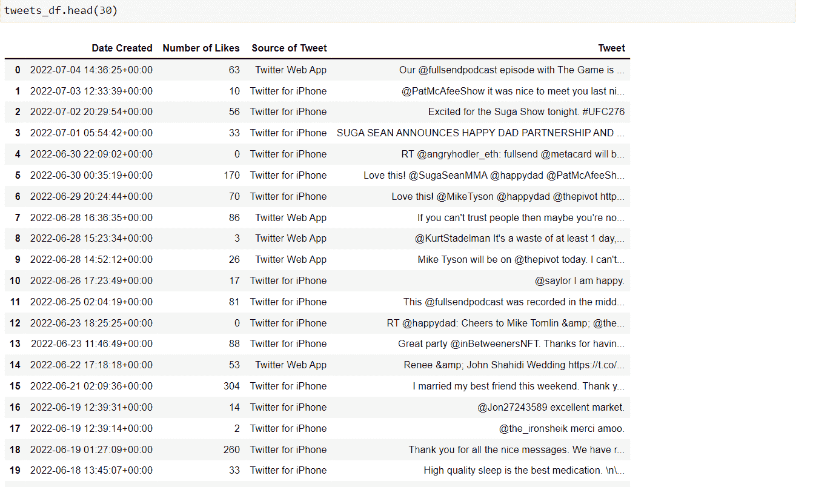
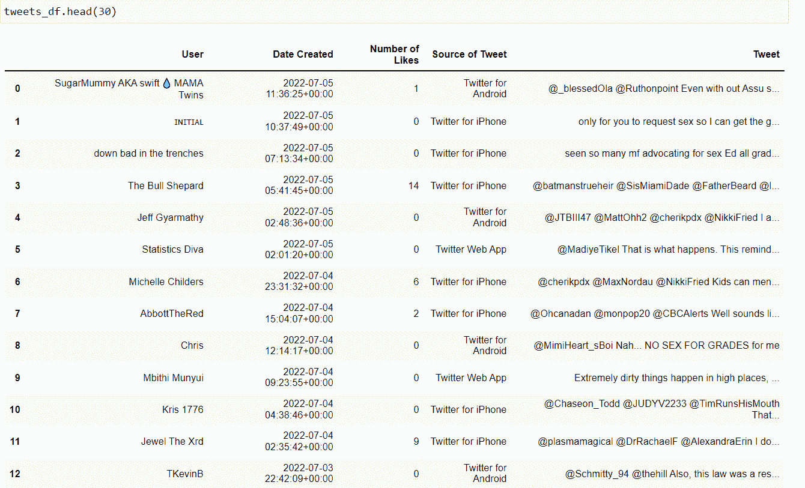
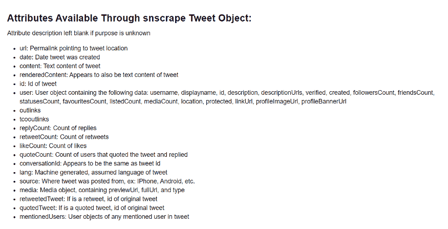
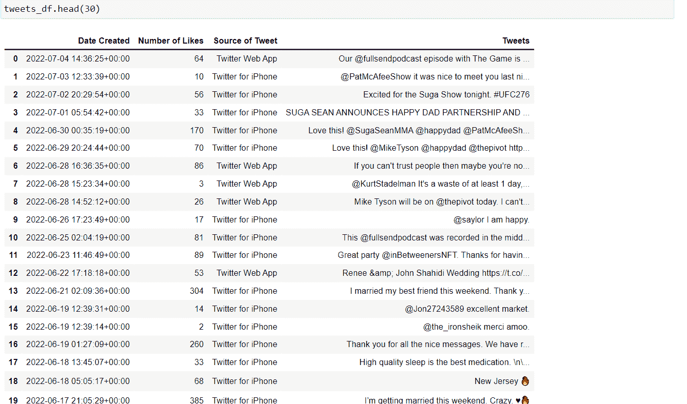
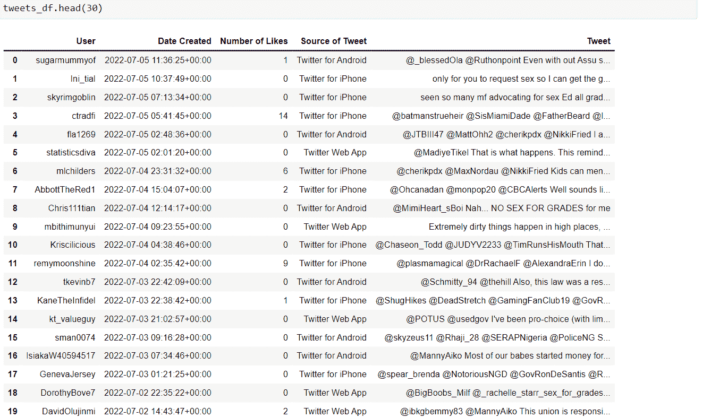
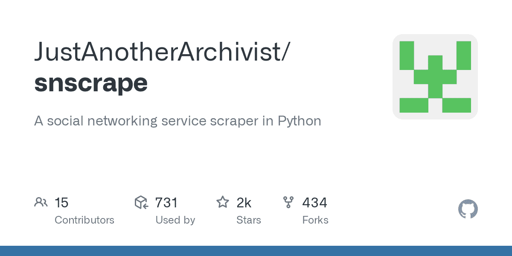

# 使用 Python 进行 Web 抓取——如何使用 Tweepy 和 Snscrape 从 Twitter 抓取数据

> 原文：<https://www.freecodecamp.org/news/python-web-scraping-tutorial/>

如果你是一个数据爱好者，你可能会同意社交媒体是现实世界中最丰富的数据来源之一。像 Twitter 这样的网站充满了数据。

你可以通过多种方式使用从社交媒体获得的数据，比如对特定问题或感兴趣的领域进行情感分析(分析人们的想法)。

有几种方法可以从 Twitter 上收集数据。在本文中，我们将研究其中的两种方法:使用 Tweepy 和 Snscrape。

我们将学习一种方法，从人们那里收集关于特定热门话题的公开对话，以及来自特定用户的推文。

现在事不宜迟，让我们开始吧。

## tweepy vs Snscrape–介绍我们的刮擦工具

现在，在我们进入每个平台的实现之前，让我们试着掌握每个平台的差异和限制。

### 亲爱的；糖果；甜点；甜心

Tweepy 是一个用于集成 Twitter API 的 Python 库。因为 Tweepy 与 Twitter API 连接，所以除了抓取 tweets 之外，还可以执行复杂的查询。它使您能够利用 Twitter API 的所有功能。

但也有一些缺点——比如它的标准 API 只允许你收集长达一周的推文(也就是说，Tweepy 不允许恢复超过一周窗口的推文，所以历史数据检索是不允许的)。

此外，你可以从一个用户的账户中检索多少条推文是有限制的。你可以[在这里](https://www.tweepy.org/)阅读更多关于 Tweepy 的功能。

### 太阳景观

Snscrape 是从 Twitter 上抓取信息的另一种方法，它不需要使用 API。Snscrape 允许您抓取基本信息，如用户的个人资料、tweet 内容、来源等。

Snscrape 不仅限于 Twitter，还可以从其他著名的社交媒体网络，如脸书、Instagram 和其他网络上抓取内容。

它的优点是对可以检索的推文数量或推文窗口(即推文的日期范围)没有限制。因此 Snscrape 允许您检索旧数据。

但一个缺点是，它缺乏 Tweepy 的所有其他功能——尽管如此，如果你只想抓取推文，Snscrape 就足够了。

既然我们已经阐明了这两种方法之间的区别，让我们一个接一个地检查它们的实现。

## 如何使用 Tweepy 抓取推文

在我们开始使用 Tweepy 之前，我们必须首先确保我们的 Twitter 凭证已经准备好。这样，我们就可以将 Tweepy 连接到我们的 API 键并开始抓取。

如果你没有 Twitter 证书，你可以通过[这里](https://developer.twitter.com/)注册一个 Twitter 开发者账户。您将被问到一些关于您打算如何使用 Twitter API 的基本问题。之后，您就可以开始实现了。

第一步是在您的本地机器上安装 Tweepy 库，您可以通过键入:

```
pip install git+https://github.com/tweepy/tweepy.git 
```

### 如何从 Twitter 上抓取用户的推文

现在我们已经安装了 Tweepy 库，让我们从 Twitter 上一个名为`john`的用户那里收集 100 条 Tweepy。我们将查看允许我们这样做的完整代码实现，并对其进行详细讨论，以便我们能够理解正在发生的事情:

```
import tweepy

consumer_key = "XXXX" #Your API/Consumer key 
consumer_secret = "XXXX" #Your API/Consumer Secret Key
access_token = "XXXX"    #Your Access token key
access_token_secret = "XXXX" #Your Access token Secret key

#Pass in our twitter API authentication key
auth = tweepy.OAuth1UserHandler(
    consumer_key, consumer_secret,
    access_token, access_token_secret
)

#Instantiate the tweepy API
api = tweepy.API(auth, wait_on_rate_limit=True)

username = "john"
no_of_tweets =100

try:
    #The number of tweets we want to retrieved from the user
    tweets = api.user_timeline(screen_name=username, count=no_of_tweets)

    #Pulling Some attributes from the tweet
    attributes_container = [[tweet.created_at, tweet.favorite_count,tweet.source,  tweet.text] for tweet in tweets]

    #Creation of column list to rename the columns in the dataframe
    columns = ["Date Created", "Number of Likes", "Source of Tweet", "Tweet"]

    #Creation of Dataframe
    tweets_df = pd.DataFrame(attributes_container, columns=columns)
except BaseException as e:
    print('Status Failed On,',str(e))
    time.sleep(3) 
```

现在让我们检查一下上面代码块中的每一部分。

```
import tweepy

consumer_key = "XXXX" #Your API/Consumer key 
consumer_secret = "XXXX" #Your API/Consumer Secret Key
access_token = "XXXX"    #Your Access token key
access_token_secret = "XXXX" #Your Access token Secret key

#Pass in our twitter API authentication key
auth = tweepy.OAuth1UserHandler(
    consumer_key, consumer_secret,
    access_token, access_token_secret
)

#Instantiate the tweepy API
api = tweepy.API(auth, wait_on_rate_limit=True) 
```

在上面的代码中，我们将 Tweepy 库导入到我们的代码中，然后我们创建了一些变量来存储我们的 Twitter 凭证(Tweepy 身份验证处理程序需要我们的四个 Twitter 凭证)。因此，我们将这些变量传递给 Tweepy 身份验证处理程序，并将它们保存到另一个变量中。

然后，调用的最后一条语句是我们实例化 Tweepy API 并传入 require 参数的地方。

```
username = "john"
no_of_tweets =100

try:
    #The number of tweets we want to retrieved from the user
    tweets = api.user_timeline(screen_name=username, count=no_of_tweets)

    #Pulling Some attributes from the tweet
    attributes_container = [[tweet.created_at, tweet.favorite_count,tweet.source,  tweet.text] for tweet in tweets]

    #Creation of column list to rename the columns in the dataframe
    columns = ["Date Created", "Number of Likes", "Source of Tweet", "Tweet"]

    #Creation of Dataframe
    tweets_df = pd.DataFrame(attributes_container, columns=columns)
except BaseException as e:
    print('Status Failed On,',str(e)) 
```

在上面的代码中，我们创建了想要从中检索推文的用户名(Twitter 中的@name)以及推文的数量。然后，我们创建了一个异常处理程序来帮助我们以更有效的方式捕捉错误。

之后，`api.user_timeline()`返回我们在`screen_name`参数中选择的用户最近发布的推文的集合，以及您想要检索的推文的数量。

在下一行代码中，我们传递了一些想要从每条 tweet 中检索的属性，并将它们保存到一个列表中。要查看您可以从推文中检索到的更多属性，请阅读 [this](https://developer.twitter.com/en/docs/twitter-api/v1/tweets/timelines/api-reference/get-statuses-user_timeline) 。

在最后一段代码中，我们创建了一个 dataframe，并传入了我们创建的列表以及我们创建的列的名称。

请注意，列名必须按照您将它们传递到属性容器中的顺序排列(也就是说，当您从 tweet 中检索属性时，如何在列表中传递这些属性)。

如果您正确地遵循了我描述的步骤，您应该会看到这样的内容:



Image by Author

现在我们已经完成了，在进入 Snscrape 实现之前，让我们再看一个例子。

### 如何从文本搜索中抓取推文

在这个方法中，我们将基于搜索检索一条 tweet。你可以这样做:

```
import tweepy

consumer_key = "XXXX" #Your API/Consumer key 
consumer_secret = "XXXX" #Your API/Consumer Secret Key
access_token = "XXXX"    #Your Access token key
access_token_secret = "XXXX" #Your Access token Secret key

#Pass in our twitter API authentication key
auth = tweepy.OAuth1UserHandler(
    consumer_key, consumer_secret,
    access_token, access_token_secret
)

#Instantiate the tweepy API
api = tweepy.API(auth, wait_on_rate_limit=True)

search_query = "sex for grades"
no_of_tweets =150

try:
    #The number of tweets we want to retrieved from the search
    tweets = api.search_tweets(q=search_query, count=no_of_tweets)

    #Pulling Some attributes from the tweet
    attributes_container = [[tweet.user.name, tweet.created_at, tweet.favorite_count, tweet.source,  tweet.text] for tweet in tweets]

    #Creation of column list to rename the columns in the dataframe
    columns = ["User", "Date Created", "Number of Likes", "Source of Tweet", "Tweet"]

    #Creation of Dataframe
    tweets_df = pd.DataFrame(attributes_container, columns=columns)
except BaseException as e:
    print('Status Failed On,',str(e)) 
```

上面的代码和前面的代码类似，只是我们把 API 方法从`api.user_timeline()`改成了`api.search_tweets()`。我们还将`tweet.user.name`添加到了属性容器列表中。

在上面的代码中，您可以看到我们传入了两个属性。这是因为如果我们只传入`tweet.user`，它将只返回一个字典用户对象。所以我们还必须传入另一个我们想从用户对象中检索的属性，即`name`。

您可以到[这里](https://developer.twitter.com/en/docs/twitter-api/v1/data-dictionary/object-model/user)来查看您可以从用户对象中检索的附加属性列表。现在，一旦运行它，您应该会看到类似这样的内容:



Image by Author.

好了，这差不多完成了 Tweepy 实现。请记住，您可以检索的推文数量是有限制的，并且您不能使用 Tweepy 检索超过 7 天的推文。

## 如何使用 Snscrape 抓取推文

正如我之前提到的，Snscrape 不需要 Twitter 凭证(API key)来访问它。你可以获取的推文数量也没有限制。

不过，对于这个例子，我们将只检索与上一个例子相同的 tweets，但是使用 Snscrape。

要使用 Snscrape，我们必须首先在我们的 PC 上安装它的库。您可以通过键入:

```
pip3 install git+https://github.com/JustAnotherArchivist/snscrape.git 
```

### 如何用 Snscrape 抓取用户的推文

Snscrape 包括两种从 Twitter 获取 tweets 的方法:命令行界面(CLI)和 Python 包装器。请记住，Python 包装器目前还没有文档记录——但是我们仍然可以通过试错来解决问题。

在本例中，我们将使用 Python 包装器，因为它比 CLI 方法更直观。但是如果您遇到一些代码问题，您可以随时向 GitHub 社区寻求帮助。贡献者会很乐意帮助你。

为了检索特定用户的推文，我们可以执行以下操作:

```
import snscrape.modules.twitter as sntwitter
import pandas as pd

# Created a list to append all tweet attributes(data)
attributes_container = []

# Using TwitterSearchScraper to scrape data and append tweets to list
for i,tweet in enumerate(sntwitter.TwitterSearchScraper('from:john').get_items()):
    if i>100:
        break
    attributes_container.append([tweet.date, tweet.likeCount, tweet.sourceLabel, tweet.content])

# Creating a dataframe from the tweets list above 
tweets_df = pd.DataFrame(attributes_container, columns=["Date Created", "Number of Likes", "Source of Tweet", "Tweets"]) 
```

让我们来看一看您可能不理解的一些代码:

```
for i,tweet in enumerate(sntwitter.TwitterSearchScraper('from:john').get_items()):
    if i>100:
        break
    attributes_container.append([tweet.date, tweet.likeCount, tweet.sourceLabel, tweet.content])

# Creating a dataframe from the tweets list above 
tweets_df = pd.DataFrame(attributes_container, columns=["Date Created", "Number of Likes", "Source of Tweet", "Tweets"]) 
```

在上面的代码中，`sntwitter.TwitterSearchScaper`所做的是从我们传递给它的用户名(也就是 john)中返回一个 tweets 对象。

正如我前面提到的，Snscrape 对 tweet 的数量没有限制，所以它会返回来自该用户的任意数量的 tweet。为此，我们需要添加枚举函数，该函数将遍历对象并添加一个计数器，这样我们就可以访问用户最近的 100 条 tweets。

您可以看到，我们从每条 Tweepy 中获得的属性语法看起来与 Tweepy 中的相似。这些是我们可以从马丁·贝克策划的 Snscrape 推文中获得的属性列表。



Credit: Martin Beck

可能会添加更多的属性，因为 Snscrape 库仍在开发中。如上图所示，`source`已经被替换为`sourceLabel`。如果你只传入`source`，它将返回一个对象。

如果您运行上面的代码，您也应该看到类似这样的内容:



Image by Author

现在让我们做同样的搜索抓取。

### 如何用 Snscrape 从文本搜索中抓取推文

```
import snscrape.modules.twitter as sntwitter
import pandas as pd

# Creating list to append tweet data to
attributes_container = []

# Using TwitterSearchScraper to scrape data and append tweets to list
for i,tweet in enumerate(sntwitter.TwitterSearchScraper('sex for grades since:2021-07-05 until:2022-07-06').get_items()):
    if i>150:
        break
    attributes_container.append([tweet.user.username, tweet.date, tweet.likeCount, tweet.sourceLabel, tweet.content])

# Creating a dataframe to load the list
tweets_df = pd.DataFrame(attributes_container, columns=["User", "Date Created", "Number of Likes", "Source of Tweet", "Tweet"]) 
```

同样，您可以使用 Snscrape 访问大量历史数据(与 Tweepy 不同，因为它的标准 API 不能超过 7 天。高级 API 为 30 天。).所以我们可以在`sntwitter.TwitterSearchScraper()`方法中传递我们希望开始搜索的日期和结束搜索的日期。

我们在前面的代码中所做的基本上就是我们之前讨论过的。唯一需要记住的是，until 的工作方式类似于 Python 中的 range 函数(也就是说，它排除了最后一个整数)。因此，如果您想获得今天的推文，您需要在“直到”参数中包含今天之后的一天。



Image of Author.

现在你也知道如何用 Snscrape 抓取推文了！

### 何时使用每种方法

现在我们已经看到了每种方法的工作原理，您可能想知道何时使用哪种方法。

对于何时使用每种方法，并没有统一的规则。一切都归结于一个问题偏好和你的用例。

如果你想获得无限数量的推文，你应该使用 Snscrape。但是如果你想使用 Snscrape 无法提供的额外功能(比如地理定位)，那么你绝对应该使用 Tweepy。它直接与 Twitter API 集成，并提供完整的功能。

即便如此，Snscrape 也是基础刮削最常用的方法。

# 结论

在本文中，我们学习了如何使用 Tweepy 和 Snscrape 从 Python 中抓取数据。但这只是对每种方法如何工作的简要概述。您可以通过浏览网页了解更多信息。

如果你需要更多的信息，我已经包括了一些有用的资源。感谢您的阅读。

[GitHub - JustAnotherArchivist/snscrape: A social networking service scraper in PythonA social networking service scraper in Python. Contribute to JustAnotherArchivist/snscrape development by creating an account on GitHub.JustAnotherArchivistGitHub](https://github.com/JustAnotherArchivist/snscrape)[](https://docs.tweepy.org/en/stable/index.html)[Tweepy Documentation — tweepy 4.10.0 documentation](https://docs.tweepy.org/en/stable/index.html)[](https://docs.tweepy.org/en/stable/index.html)[How to Scrape Tweets With snscrapeTwitter has introduced changes to their API that have rendered various tweet scraping libraries obsolete. In this tutorial, I cover snscrape as a viable substitute.Martin BeckBetter Programming](https://betterprogramming.pub/how-to-scrape-tweets-with-snscrape-90124ed006af)