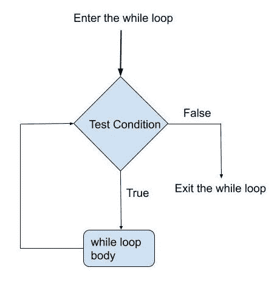
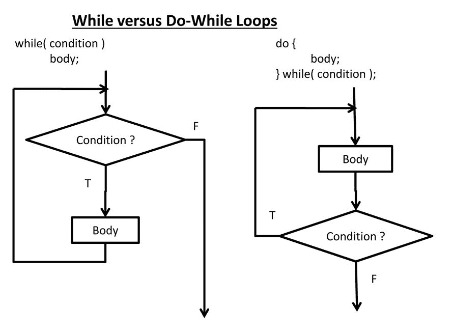

# Python While 循环教程–Do While True 示例语句

> 原文：<https://www.freecodecamp.org/news/python-while-loop-tutorial-do-while-true-example-statement/>

循环是在满足某个条件之前执行的一系列指令。让我们看看 Python 中的 while 循环是如何工作的。

## 什么是循环？

如果你正在学习编码，循环是你应该理解的主要概念之一。循环帮助您执行一系列指令，直到满足某个条件。

Python 中有两种主要类型的循环。

*   对于循环
*   While 循环

这两种类型的循环都可以用于类似的操作。但是当你学会写高效的程序时，你会知道什么时候用什么。

在本文中，我们将研究 Python 中的 while 循环。要了解更多关于 for 循环的内容，请查看最近发表在 freeCodeCamp 上的这篇文章。

## While 循环

while 循环背后的概念很简单:*当条件为真- >运行我的命令。*

while 循环每次都会检查条件，如果返回“true ”,它将执行循环中的指令。

在我们开始编写代码之前，让我们看一下流程图，看看它是如何工作的。



现在让我们写一些代码。下面是如何编写一个简单的 while 循环来打印从 1 到 10 的数字。

```
#!/usr/bin/python

x = 1

while(x <= 10):
	print(x)
	x = x+1
```

如果你看看上面的代码，只有当 x 小于或等于 10 时，循环才会运行。如果你初始化 x 为 20，循环将永远不会执行。

以下是 while 循环的输出:

```
> python script.py
1
2
3
4
5
6
7
8
9
10
```

### Do-While 循环

while 循环有两种变体——While 和 do-While。两者的区别在于 do-while 至少运行一次。

如果不满足条件，while 循环甚至可能不会执行一次。但是，do-while 将运行一次，然后检查后续循环的条件。



尽管 Python 出现在大多数流行的编程语言中，但它并没有本地的 do-while 语句。但是您可以使用其他方法(如函数)轻松模拟 do-while 循环。

让我们通过将命令包装在一个函数中来尝试 do-while 方法。

```
#!/usr/bin/python

x = 20

def run_commands():
	x = x+1
	print(x)

run_commands()
while(x <= 10):
	run_commands()
```

上面的代码在调用 while 循环之前运行一次“run_commands()”函数。一旦 while 循环开始，“run_commands”函数将永远不会被执行，因为 x 等于 20。

### 而-否则

如果循环条件失败，您可以添加一个“else”语句来运行。

让我们在代码中添加一个 else 条件，在打印完 1 到 10 的数字后打印“Done”。

```
#!/usr/bin/python

x = 1

while(x <= 10):
	print(x)
	x = x+1
else:
	print("Done")
```

上面的代码将首先打印从 1 到 10 的数字。当 x 为 11 时，while 条件将失败，触发 else 条件。

### 单行 While 语句

如果在 while 循环中只有一行代码，可以使用单行语法。

```
#!/usr/bin/python

x = 1
while (x): print(x)
```

### 无限循环

如果在编写循环时不小心，你将会创建无限循环。无限循环是条件总是为真的循环。

```
#!/usr/bin/python

x = 1
while (x >= 1):
	print(x)
```

上面的代码是一个无限循环的例子。没有命令来改变 x 的值，所以条件“x 大于或等于 1”总是为真。这将使循环永远运行下去。

写循环的时候一定要小心。一个小小的错误可能会导致无限循环并使您的应用程序崩溃。

## 循环控制

最后，让我们看看如何在循环运行时控制它的流量。

当您编写真实世界的应用程序时，您经常会遇到需要添加附加条件来跳过循环或中断循环的情况。

### 破裂

让我们看看当条件为真时，如何跳出循环。

```
#!/usr/bin/python

x = 1
while (x <= 10):
    if(x == 5):
    	break
    print(x)
    x += 1
```

在上面的代码中，当 x 为 5 时，循环将停止执行，尽管 x 大于或等于 1。

### 继续

这里有另一个场景:假设您希望在满足特定条件的情况下跳过循环。但是，您希望继续后续的执行，直到主 while 条件变为 false。

您可以使用“继续”关键字，就像这样:

```
#!/usr/bin/python

x = 1
while (x <= 10):
    if(x == 5):
    	x += 1
    	continue
    print(x)
```

在上面的例子中，循环将从 1 到 10 打印，除了 5。当 x 为 5 时，跳过其余的命令，控制流返回到 while 程序的开始。

## 摘要

循环是编程中最有用的组件之一，您每天都会用到。

For 和 while 是 Python 中的两个主要循环。while 循环有两种变体，while 和 do-while，但是 Python 只支持前者。

您可以使用“中断”和“继续”命令来控制程序流程。永远要注意意外创建无限循环。

我定期撰写包括人工智能和网络安全在内的主题。如果你喜欢这篇文章，你可以在这里阅读我的博客。