# Python While 循环教程–While True 语法示例和无限循环

> 原文：<https://www.freecodecamp.org/news/python-while-loop-tutorial/>

欢迎光临！如果您想学习如何使用 Python 中的 while 循环，那么这篇文章就是为您准备的。

While 循环是非常强大的编程结构，您可以在程序中使用它来重复一系列语句。

**在这篇文章中，你将学到:**

*   什么是 while 循环。
*   它们的用途。
*   何时应该使用它们。
*   他们如何在幕后工作。
*   如何用 Python 写 while 循环？
*   什么是无限循环以及如何中断无限循环。
*   `while True`的用途及其一般语法。
*   如何使用`break`语句停止 while 循环？

您将通过示例、表格和图表了解 while 循环如何在幕后工作。

你准备好了吗？我们开始吧。🔅

## 🔹While 循环的用途和用例

让我们从 while 循环的目的开始。它们是用来做什么的？

它们用于重复一系列语句，重复次数未知。这种循环在给定条件为`True`时运行**，只有当条件变为`False`时才停止。**

当我们编写 while 循环时，我们不明确定义将完成多少次迭代，我们只编写必须为`True`的条件来继续该过程，并编写必须为`False`的条件来停止该过程。

**💡提示:**如果 while 循环条件永远不会求值为`False`，那么我们将会有一个无限循环，这是一个在没有外部干预的情况下永远不会停止(理论上)的循环。

**以下是 while 循环的一些真实用例:**

*   **用户输入:**当我们要求用户输入时，我们需要检查输入的值是否有效。我们不可能预先知道在程序继续运行之前，用户会输入多少次无效输入。因此，while 循环非常适合这种情况。
*   **Search:** 在数据结构中搜索元素是 while 循环的另一个完美用例，因为我们无法预先知道需要多少次迭代才能找到目标值。例如，二分搜索法算法可以使用 while 循环来实现。
*   **游戏:**在游戏中，while 循环可以用来保持游戏的主要逻辑运行，直到玩家失败或游戏结束。我们无法提前知道这将在何时发生，因此这是 while 循环的另一个完美场景。

## 🔸While 循环如何工作

现在您已经知道 while 循环的用途，让我们看看它们的主要逻辑以及它们在幕后是如何工作的。这里我们有一个图表:

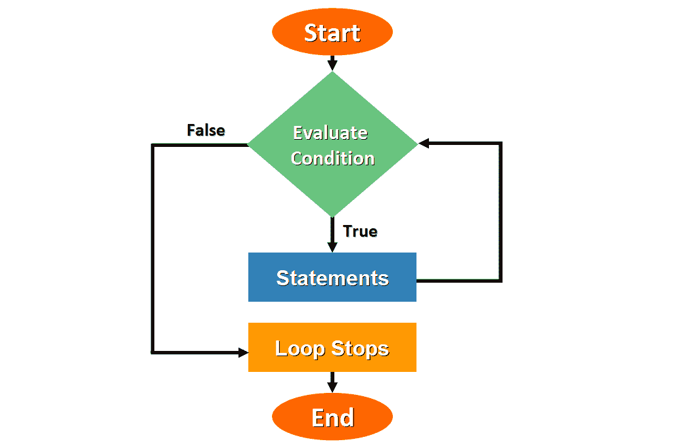

While Loop

**让我们更详细地分析一下:**

*   当在程序执行期间发现 while 循环时，该过程开始。
*   评估条件以检查它是`True`还是`False`。
*   如果条件为`True`，则执行属于循环的语句。
*   再次检查 while 循环条件。
*   如果条件再次评估为`True`，则语句序列再次运行，并重复该过程。
*   当条件评估为`False`时，循环停止，程序继续循环。

while 循环最重要的特征之一是循环条件中使用的变量不会自动更新。我们必须用我们的代码显式地更新它们的值，以确保当条件评估为`False`时，循环最终会停止。

## 🔹While 循环的一般语法

太好了。现在您已经知道 while 循环是如何工作的了，所以让我们深入代码，看看如何用 Python 编写 while 循环。这是基本语法:

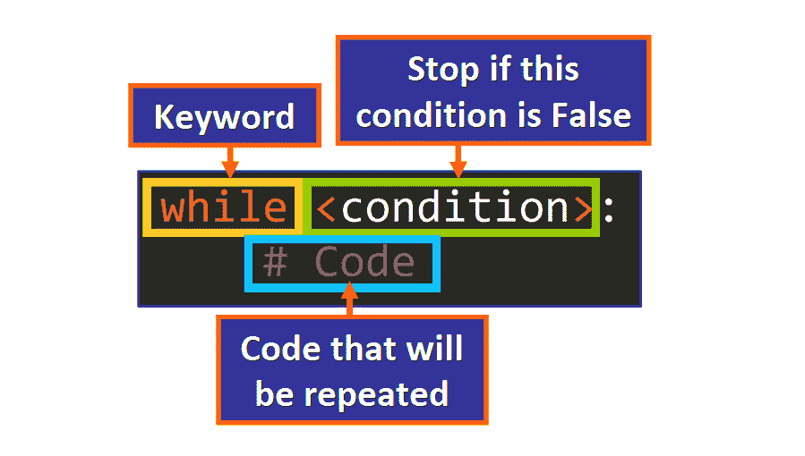

While Loop (Syntax)

这些是主要元素(按顺序排列):

*   `while`关键字(后跟一个空格)。
*   根据其真值(`True`或`False`)确定循环是否继续运行的条件。
*   第一行末尾的冒号(`:`)。
*   将要重复的语句的顺序。这个代码块被称为循环的“主体”,它必须缩进。如果一个语句没有缩进，它将不会被认为是循环的一部分(请参见下图)。

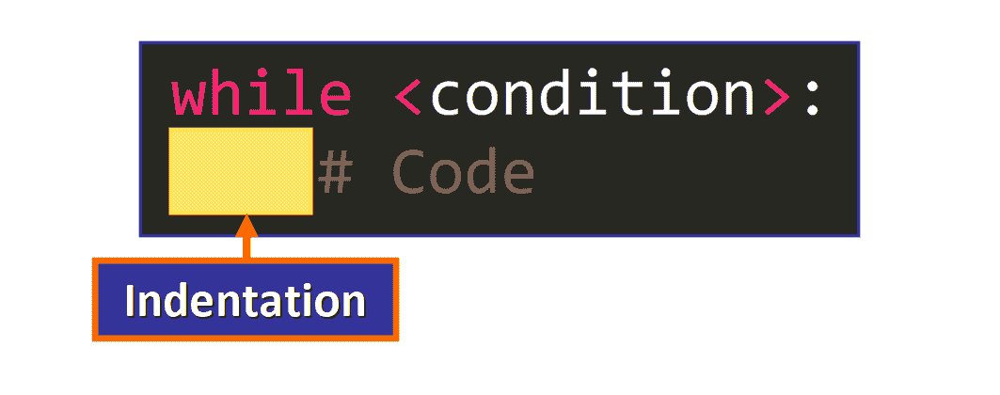

**💡提示:**[Python 风格指南](https://www.python.org/dev/peps/pep-0008/#indentation) (PEP 8)推荐每个缩进层次使用 4 个空格。制表符应该只用于与已经用制表符缩进的代码保持一致。

## 🔸While 循环的示例

现在您已经知道了 while 循环是如何工作的，以及如何用 Python 编写它们，让我们通过一些例子来看看它们是如何在幕后工作的。

### 基本 While 循环如何工作

这里我们有一个基本的 while 循环，它打印出`i` **的值，而** `i`小于 8 ( `i < 8`):

```
i = 4

while i < 8:
    print(i)
    i += 1
```

如果我们运行代码，我们会看到以下输出:

```
4
5
6
7
```

让我们看看代码运行时幕后发生了什么:

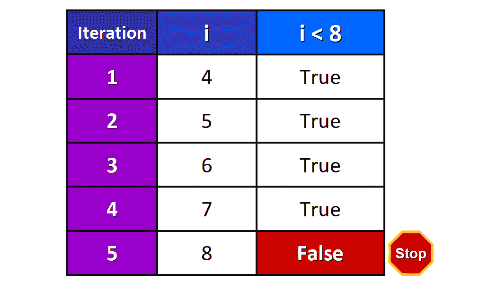

*   **迭代 1:** 最初，`i`的值为 4，因此条件`i < 8`的值为`True`，循环开始运行。打印出`i`的值(4 ),该值增加 1。循环又开始了。
*   **迭代 2:** 现在`i`的值为 5，所以条件`i < 8`的值为`True`。循环体运行，打印出`i`的值(5 ),该值`i`增加 1。循环又开始了。
*   **第 3 次和第 4 次迭代:**第 3 次和第 4 次迭代重复相同的过程，因此打印出整数 6 和 7。
*   在开始第五次迭代之前，`i`的值是`8`。现在 while 循环条件`i < 8`评估为`False`，循环立即停止。

💡**提示:**如果在开始第一次迭代之前，while 循环条件为`False`，那么 while 循环甚至不会开始运行。

### 使用 While 循环的用户输入

现在让我们看一个程序中接受用户输入的 while 循环的例子。我们将使用`input()`函数来要求用户输入一个整数，如果这个整数是偶数，它将被追加到列表中。

这是代码:

```
# Define the list
nums = []

# The loop will run while the length of the
# list nums is less than 4
while len(nums) < 4:
    # Ask for user input and store it in a variable as an integer.
    user_input = int(input("Enter an integer: "))
    # If the input is an even number, add it to the list
    if user_input % 2 == 0:
        nums.append(user_input)
```

循环条件是`len(nums) < 4`，所以循环将在列表`nums`的长度严格小于 4 时运行。

**让我们一行一行地分析这个程序:**

*   我们首先定义一个空列表，并将其赋给一个名为`nums`的变量。

```
nums = []
```

*   然后，我们定义一个 while 循环，它将在`len(nums) < 4`运行。

```
while len(nums) < 4:
```

*   我们用`input()`函数请求用户输入，并将其存储在`user_input`变量中。

```
user_input = int(input("Enter an integer: "))
```

**💡提示:**在将用户输入的值赋给变量之前，我们需要使用`int()`函数将其转换(强制转换)为一个整数，因为`input()`函数返回一个字符串([源](https://docs.python.org/3/library/functions.html#input))。

*   我们检查这个值是偶数还是奇数。

```
if user_input % 2 == 0:
```

*   如果是偶数，我们将它添加到`nums`列表中。

```
nums.append(user_input)
```

*   否则，如果是奇数，循环再次开始，并检查条件以确定循环是否应该继续。

如果我们使用自定义用户输入运行此代码，我们将得到以下输出:

```
Enter an integer: 3
Enter an integer: 4    
Enter an integer: 2    
Enter an integer: 1
Enter an integer: 7
Enter an integer: 6    
Enter an integer: 3
Enter an integer: 4 
```

下表总结了代码运行时后台发生的情况:

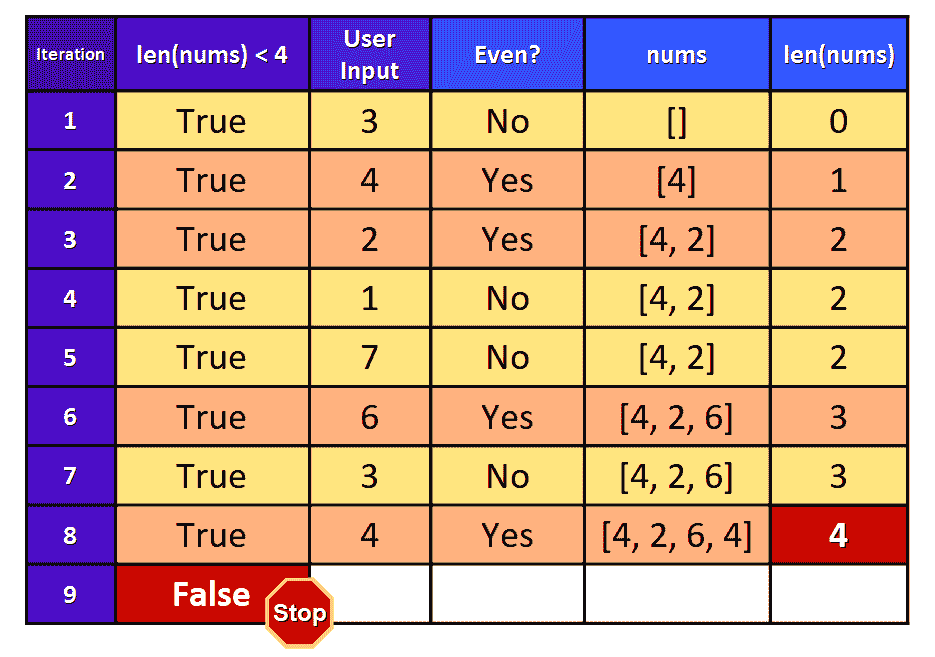

💡**提示:**`len(nums)`的初始值是`0`，因为列表最初是空的。表格的最后一列显示了当前迭代结束时列表的长度。该值用于在下一次迭代开始之前检查条件。

正如您在表中看到的，用户在第二、第三、第六和第八次迭代中输入偶数，这些值被附加到`nums`列表中。

在“第九次”迭代开始之前，再次检查条件，但是现在它评估为`False`，因为`nums`列表有四个元素(长度为 4)，所以循环停止。

如果我们在流程完成后检查`nums`列表的值，我们会看到:

```
>>> nums
[4, 2, 6, 4]
```

正如我们所料，当条件`len(nums) < 4`的值为`False`时，while 循环停止。

现在，您已经知道了 while 循环在幕后是如何工作的，并且已经看到了一些实际的例子，所以让我们深入了解 while 循环的一个关键元素:条件。

## 🔹While 循环中条件的提示

在开始使用 while 循环之前，您应该知道循环条件在 while 循环的功能和输出中起着核心作用。

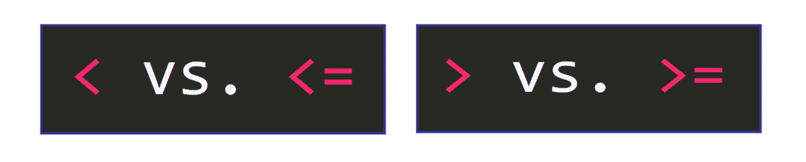

您必须非常小心地使用您选择的比较运算符，因为这是一个非常常见的错误来源。

例如，常见错误包括:

*   用`<`(小于)代替`<=`(小于或等于)(反之亦然)。
*   用`>`(大于)代替`>=`(大于或等于)(反之亦然)。

这可能会影响循环的迭代次数，甚至影响其输出。

让我们看一个例子:

如果我们用条件`i < 9`写这个 while 循环:

```
i = 6

while i < 9:
    print(i)
    i += 1 
```

当代码运行时，我们会看到以下输出:

```
6
7
8
```

循环完成三次迭代，并在`i`等于`9`时停止。

下表说明了代码运行时幕后发生的情况:

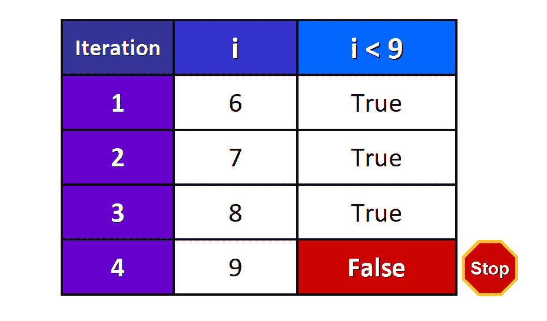

*   在循环的第一次迭代之前，`i`的值为 6，因此条件`i < 9`为`True`，循环开始运行。打印出`i`的值，然后增加 1。
*   在循环的第二次迭代中，`i`的值是 7，所以条件`i < 9`是`True`。循环体运行，打印出`i`的值，然后加 1。
*   在循环的第三次迭代中，`i`的值是 8，所以条件`i < 9`是`True`。循环体运行，打印出`i`的值，然后加 1。
*   在第四次迭代开始之前，再次检查条件，但是现在`i`的值是 9，所以`i < 9`是`False`，循环停止。

在这种情况下，我们使用`<`作为条件中的比较运算符，但是如果我们使用`<=`代替，您认为会发生什么情况？

```
i = 6

while i <= 9:
    print(i)
    i += 1
```

我们看到这样的输出:

```
6
7
8
9
```

循环又完成了一次迭代，因为现在我们使用了“小于或等于”运算符`<=`，所以当`i`等于`9`时，条件仍然是`True`。

下表说明了幕后发生的情况:

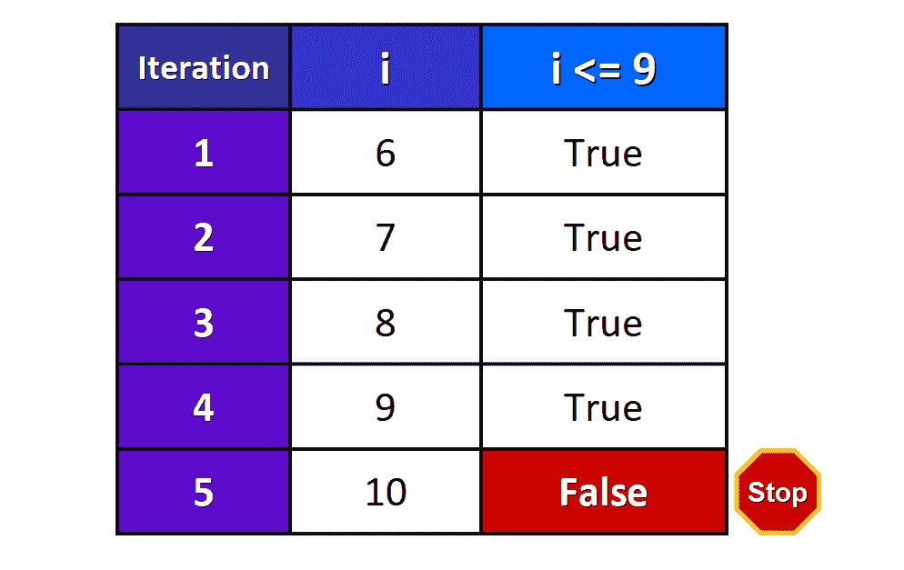

完成四次迭代。在开始“第五次”迭代之前，再次检查该条件。此时，`i`的值为`10`，因此条件`i <= 9`为`False`，循环停止。

## 🔸无限 While 循环

现在您知道了 while 循环是如何工作的，但是如果 while 循环条件的计算结果永远不会是`False`，您认为会发生什么？


### 什么是无限 While 循环？

请记住，while 循环不会自动更新变量(我们负责用代码显式地更新变量)。因此，不能保证循环会停止，除非我们编写必要的代码，在循环执行期间的某个时刻创建条件`False`。

如果我们不这样做，并且条件总是评估为`True`，那么我们将有一个**无限循环**，这是一个无限运行的 while 循环(理论上)。

无限循环通常是错误的结果，但当我们想要无限重复一系列语句直到找到一个`break`语句时，它们也可能是故意造成的。

让我们在下面的例子中看看这两种类型的无限循环。

💡提示:bug 是程序中导致不正确或意外结果的错误。

### 无限循环示例

这是一个由程序中的错误导致的意外无限循环的例子:

```
# Define a variable
i = 5

# Run this loop while i is less than 15
while i < 15:
    # Print a message
    print("Hello, World!") 
```

分析一下这段代码。

你没有注意到循环体中缺少了什么吗？

没错！

变量`i`的值永远不会更新(它总是`5`)。因此，条件`i < 15`始终为`True`，循环永不停止。

如果我们运行这段代码，输出将是一个“无限”的`Hello, World!`消息序列，因为循环体`print("Hello, World!")`将无限期运行。

```
Hello, World!
Hello, World!
Hello, World!
Hello, World!
Hello, World!
Hello, World!
Hello, World!
Hello, World!
Hello, World!
Hello, World!
Hello, World!
Hello, World!
Hello, World!
Hello, World!
Hello, World!
Hello, World!
Hello, World!
Hello, World!
.
.
.
# Continues indefinitely
```

要停止程序，我们需要通过按`CTRL + C`手动中断循环。

当我们这样做时，我们会看到一个类似于下面的`KeyboardInterrupt`错误:

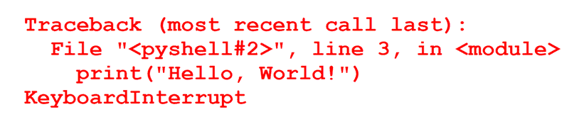

为了修复这个循环，我们需要更新循环体中`i`的值，以确保条件`i < 15`最终将评估为`False`。

这是一种可能的解决方案，在每次迭代时将`i`的值增加 2:

```
i = 5

while i < 15:
    print("Hello, World!")
    # Update the value of i
    i += 2
```

太好了。现在您知道如何修复由 bug 导致的无限循环了。您只需要编写代码来保证条件最终评估为`False`。

让我们开始深入了解有意的无限循环以及它们是如何工作的。

## 🔹如何用 While True 进行无限循环

我们可以使用`while True`有意生成一个无限循环。在这种情况下，循环将无限期运行，直到外部干预(`CTRL + C`)或找到`break`语句(稍后您将了解关于`break`的更多信息)停止该过程。

这是基本语法:

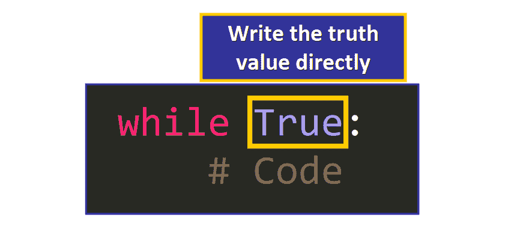

我们没有在`while`关键字后面写一个条件，而是直接写真值来表示条件永远是`True`。

这里我们有一个例子:

```
>>> while True:
	print(0)

0
0
0
0
0
0
0
0
0
0
0
0
0
Traceback (most recent call last):
  File "<pyshell#2>", line 2, in <module>
    print(0)
KeyboardInterrupt
```

循环一直运行到按下`CTRL + C`键，但是 Python 也有一个`break`语句，我们可以在代码中直接使用它来停止这种类型的循环。

### `break`声明

该语句用于立即停止循环。你应该把它看作一个红色的“停止标志”,你可以在你的代码中使用它来更好地控制循环的行为。


根据 [Python 文档](https://docs.python.org/3/tutorial/controlflow.html?highlight=break#break-and-continue-statements-and-else-clauses-on-loops):

> [`break`](https://docs.python.org/3/reference/simple_stmts.html#break) 语句和 C 语言一样，从最内层的 [`for`](https://docs.python.org/3/reference/compound_stmts.html#for) 或 [`while`](https://docs.python.org/3/reference/compound_stmts.html#while) 循环中脱离出来。

该图说明了`break`语句的基本逻辑:

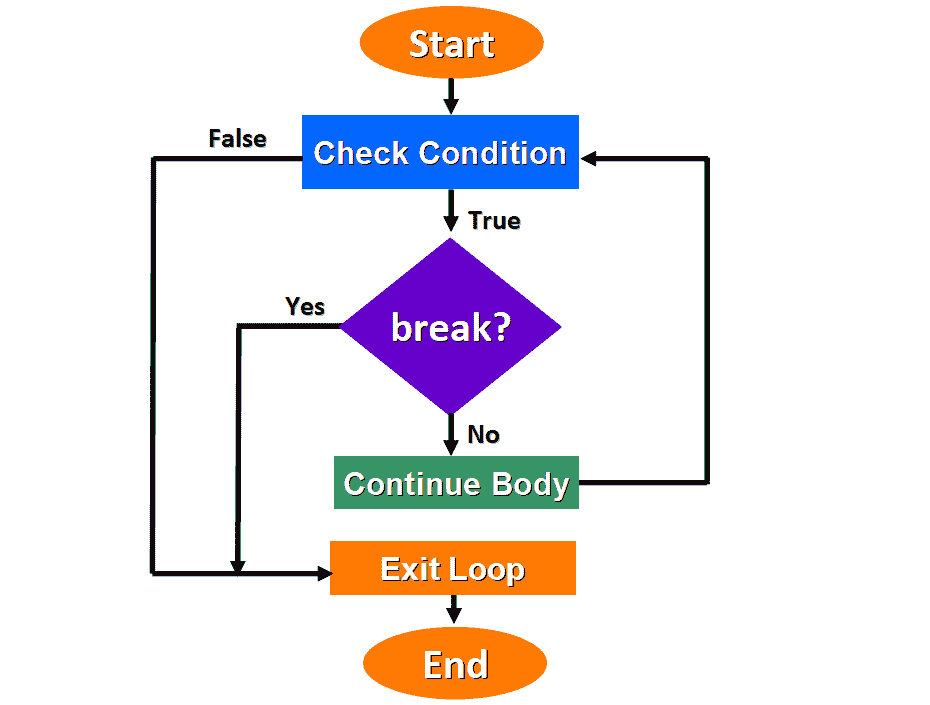

The `break` statement

**这是`break`语句的基本逻辑:**

*   只有当条件评估为`True`时，while 循环才开始。
*   如果在循环执行过程中的任何一点发现了`break`语句，循环将立即停止。
*   否则，如果没有找到`break`，循环继续其正常执行，并在条件评估为`False`时停止。

我们可以使用`break`在 while 循环执行的特定点满足条件时停止 while 循环，因此您通常会在条件语句中找到它，如下所示:

```
while True:
    # Code
    if <condition>:
    	break
    # Code
```

如果条件为`True`，则立即停止循环。

💡**提示:**(理论上)你可以在循环体的任何地方写一个`break`语句。它不一定是条件的一部分，但是我们通常在给定条件为`True`时使用它来停止循环。

这里我们有一个`while True`循环中`break`的例子:

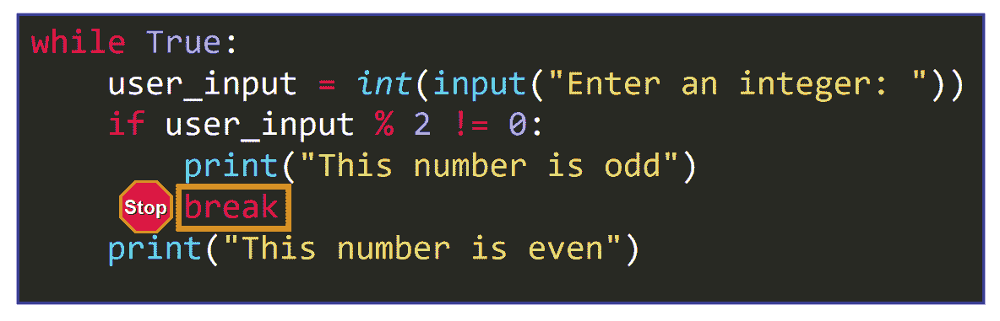

**我们来看更详细的:**

第一行定义了一个`while True`循环，它将无限期运行，直到找到一个`break`语句(或者直到它被`CTRL + C`中断)。

```
while True:
```

第二行要求用户输入。该输入被转换成一个整数并赋给变量`user_input`。

```
user_input = int(input("Enter an integer: "))
```

第三行检查输入是否是奇数。

```
if user_input % 2 != 0:
```

如果是，则打印消息`This number is odd`并且`break`语句立即停止循环。

```
print("This number of odd")
break
```

否则，如果输入是偶数，则打印消息`This number is even`并再次开始循环。

```
print("This number is even")
```

循环将无限期运行，直到输入一个奇数，因为这是找到`break`语句的唯一方法。

这里我们有一个自定义用户输入的示例:

```
Enter an integer: 4
This number is even
Enter an integer: 6
This number is even
Enter an integer: 8
This number is even
Enter an integer: 3
This number is odd
>>> 
```

## 🔸概括起来

*   While 循环是用于在条件为`True`时重复一系列语句的编程结构。当条件评估为`False`时，它们停止。
*   当您编写 while 循环时，您需要在代码中进行必要的更新，以确保循环最终会停止。
*   无限循环是一种无限期运行的循环，只有在外部干预或发现`break`语句时才会停止。
*   可以用`CTRL + C`停止无限循环。
*   你可以用`while True`有意生成一个无限循环。
*   `break`语句可以用来立即停止 while 循环。

********我真的希望你喜欢我的文章，并发现它很有帮助。******** 现在你知道如何在 Python 中使用 While 循环了。

在 Twitter 上关注我[@ estefanicassn](https://twitter.com/EstefaniaCassN)，如果你想了解更多关于这个话题的信息，请查看我的在线课程 [Python 循环和循环技术:从初级到高级](https://www.udemy.com/course/python-loops-and-looping-techniques-beginner-to-advanced/?referralCode=EEABE054BAB98C00CC8E)。