# Python 写文件——解释了打开、读取、追加和其他文件处理功能

> 原文：<https://www.freecodecamp.org/news/python-write-to-file-open-read-append-and-other-file-handling-functions-explained/>

## 欢迎

嗨！如果你想学习如何在 Python 中处理文件，那么这篇文章就是为你准备的。处理文件是每个 Python 开发人员都应该学习的重要技能，所以让我们开始吧。

**在这篇文章中，你将学到:**

*   如何打开文件？
*   如何读取文件？
*   如何创建文件？
*   如何修改文件？
*   如何关闭文件？
*   如何打开文件进行多重操作？
*   如何使用文件对象方法。
*   如何删除文件？
*   如何使用上下文管理器以及为什么它们有用。
*   如何处理使用文件时可能引发的异常。
*   还有更多！

让我们开始吧！✨

## 🔹使用文件:基本语法

在 Python 中处理文件时，你需要用到的最重要的函数之一是`**open()**` **，**，这是一个内置函数，它打开一个文件并允许你的程序使用它。

**这是基本语法**:

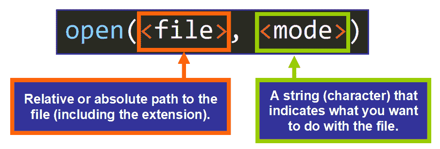

💡提示:这是调用这个函数最常用的两个参数。还有六个额外的可选参数。要了解更多信息，请阅读文档中的[这篇文章](https://docs.python.org/3/library/functions.html#open)。

### 第一个参数:文件

`open()`函数的第一个参数是`**file**`，它是您试图处理的文件的绝对或相对路径。

我们通常使用相对路径，它表示文件相对于调用`open()`函数的脚本(Python 文件)的位置。

例如，此函数调用中的路径:

```
open("names.txt") # The relative path is "names.txt"
```

仅包含文件的名称。当您尝试打开的文件与 Python 脚本位于同一目录或文件夹中时，可以使用这种方法，如下所示:


但是，如果文件位于嵌套文件夹中，如下所示:


The names.txt file is in the "data" folder

然后我们需要使用一个特定的路径来告诉函数这个文件在另一个文件夹中。

在本例中，路径如下:

```
open("data/names.txt")
```

请注意，我们首先写的是`data/`(文件夹名后跟一个`/`)，然后是`names.txt`(带有扩展名的文件名)。

💡**提示:**跟在`names.txt`中点号后面的三个字母`.txt`是文件的“扩展名”，或者说是它的类型。在这种情况下，`.txt`表明这是一个文本文件。

### 第二个参数:模式

`open()`函数的第二个参数是`**mode**`，一个只有一个字符的字符串。这个字符基本上告诉 Python 你打算在程序中用这个文件做什么。

可用的模式有:

*   阅读(`"r"`)。
*   追加(`"a"`)
*   写(`"w"`)
*   创建(`"x"`)

您也可以选择在以下位置打开文件:

*   文本模式(`"t"`)
*   二进制模式(`"b"`)

要使用文本或二进制模式，您需要将这些字符添加到主模式中。比如:`"wb"`表示用二进制方式写。

💡**提示:**默认模式为阅读(`"r"`)和文本(`"t"`)，意思是“打开阅读文本”(`"rt"`)，所以如果你想使用的话，不需要在 **`open()`** 中指定，因为它们是默认分配的。你可以简单地写`open(<file>)`。

**为什么是模式？**

对于 Python 来说，根据您打算对文件做什么来授予特定的权限是很有意义的，对吗？为什么 Python 应该允许你的程序做不必要的事情？这就是模式存在的基本原因。

想一想——允许程序做不必要的事情会有问题。例如，如果您只需要读取一个文件的内容，允许您的程序意外地修改它可能是危险的，这可能会引入错误。

## 🔸如何读取文件

现在您已经了解了更多关于`**open()**`函数的参数，让我们看看如何打开一个文件并将其存储在一个变量中，以便在您的程序中使用。

这是基本语法:

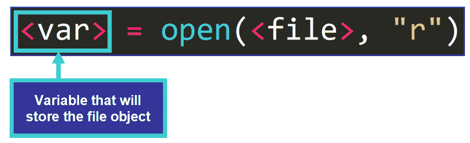

我们只是将返回值赋给一个变量。例如:

```
names_file = open("data/names.txt", "r")
```

我知道你可能会问:`**open()**`返回什么类型的值？

嗯，**一个** **文件对象**。

让我们稍微谈一谈它们。

### 文件对象

根据 [Python 文档](https://docs.python.org/3/glossary.html#term-file-object)，一个**文件对象**是:

> 向底层资源公开面向文件的 API(使用 read()或 write()等方法)的对象。

这基本上是告诉我们，文件对象是一个让我们在 Python 程序中与现有文件进行工作和交互的对象。

文件对象具有属性，例如:

*   **名称**:文件的名称。
*   **关闭**:如果文件关闭`True`。`False`否则。
*   **模式**:打开文件的模式。

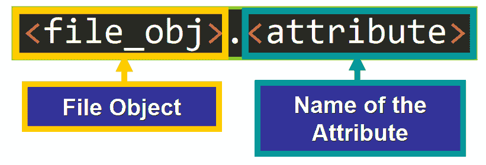

例如:

```
f = open("data/names.txt", "a")
print(f.mode) # Output: "a"
```

现在让我们看看如何通过 file 对象访问文件的内容。

### 读取文件的方法

为了能够处理文件对象，我们需要在程序中有一种与它们“交互”的方式，而这正是方法所做的。让我们看看其中的一些。

### **Read()**

您需要了解的第一个方法是 **`read()`** ，，其中**以字符串形式返回文件的全部内容。**

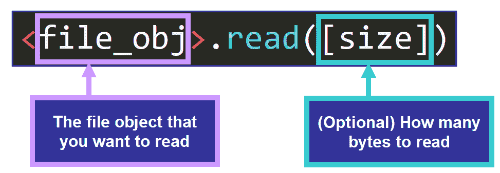

这里我们有一个例子:

```
f = open("data/names.txt")
print(f.read())
```

输出是:

```
Nora
Gino
Timmy
William
```

您可以使用`type()`函数来确认`f.read()`返回的值是一个字符串:

```
print(type(f.read()))

# Output
<class 'str'>
```

没错，就是一串！

在这种情况下，打印了整个文件，因为我们没有指定最大字节数，但我们也可以这样做。

这里我们有一个例子:

```
f = open("data/names.txt")
print(f.read(3))
```

返回值被限制为这个字节数:

```
Nor
```

❗️ **重要提示:**你需要在任务完成后**关闭**一个文件来释放与该文件相关的资源。为此，你需要调用 **`close()`** 方法，就像这样:

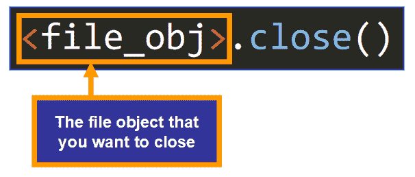

### Readline()与 Readlines()

您可以用这两种方法逐行读取文件。两者略有不同，我们来详细看看。

`**readline()**`读取**文件的一行**，直到到达该行的末尾。字符串中保留一个尾随换行符(`\n`)。

💡**提示:**可选地，您可以传递大小，即您想要在结果字符串中包含的最大字符数。

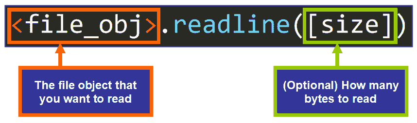

例如:

```
f = open("data/names.txt")
print(f.readline())
f.close()
```

输出是:

```
Nora 
```

这是文件的第一行。

相反，`**readlines()**`返回一个**列表，其中文件的所有行**都是单独的元素(字符串)。这是语法:

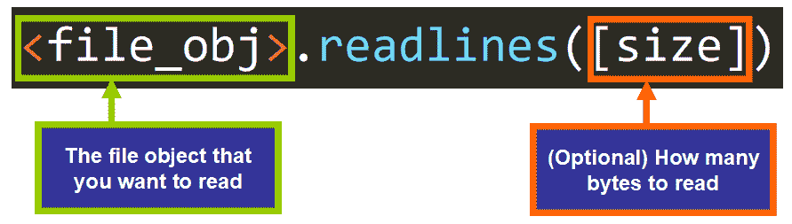

例如:

```
f = open("data/names.txt")
print(f.readlines())
f.close()
```

输出是:

```
['Nora\n', 'Gino\n', 'Timmy\n', 'William']
```

注意，除了最后一个字符串，每个字符串的末尾都有一个`\n`(换行符)。

💡**提示:**你可以用`list(f)`得到同样的列表。

通过将该列表赋给变量或在循环中使用，可以在程序中使用该列表:

```
f = open("data/names.txt")

for line in f.readlines():
    # Do something with each line

f.close()
```

我们还可以在循环中直接迭代`f`(文件对象):

```
f = open("data/names.txt", "r")

for line in f:
	# Do something with each line

f.close()
```

这些是用来读取文件对象的主要方法。现在让我们看看如何创建文件。

## 🔹如何创建文件

如果需要使用 Python“动态”创建文件，可以使用`"x"`模式。

让我们看看怎么做。这是基本语法:

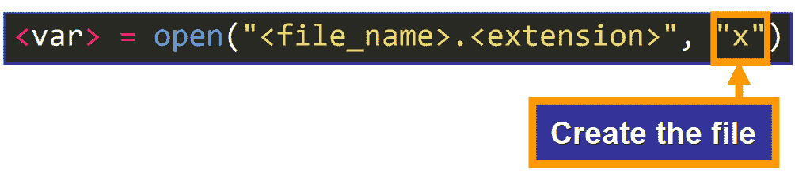

这里有一个例子。这是我当前的工作目录:


如果我运行这行代码:

```
f = open("new_file.txt", "x")
```

将创建一个具有该名称的新文件:

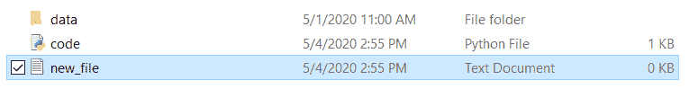

在这种模式下，您可以创建一个文件，然后使用稍后将学习到的方法动态地写入该文件。

💡提示:文件最初将是空的，直到您修改它。

奇怪的是，如果您尝试再次运行这一行，并且具有该名称的文件已经存在，您将看到以下错误:

```
Traceback (most recent call last):
  File "<path>", line 8, in <module>
    f = open("new_file.txt", "x")
FileExistsError: [Errno 17] File exists: 'new_file.txt'
```

根据 [Python 文档](https://docs.python.org/3/library/exceptions.html#FileExistsError)，这个异常(运行时错误)是:

> 试图创建已经存在的文件或目录时引发。

既然您已经知道了如何创建文件，那么让我们来看看如何修改它。

## 🔸如何修改文件

要修改(写入)一个文件，您需要使用`**write()**`方法。根据您选择的打开模式，您有两种方法可以做到这一点(追加或写入)。下面我们来详细看看。

### 附加

“附加”的意思是在另一件事的末尾加上一件事。`"a"`模式允许您打开一个文件，向其中添加一些内容。

例如，如果我们有这个文件:

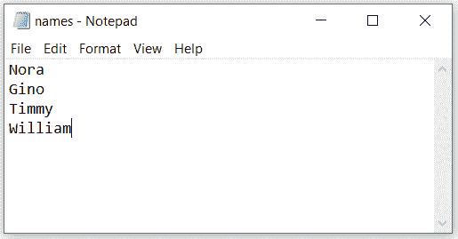

如果我们想向它添加一个新行，我们可以使用`**"a"**`模式(append)打开它，然后调用`**write()**`方法，将我们想要追加的内容作为参数传递。

这是调用`**write()**` 方法的基本语法:

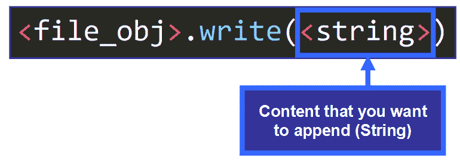

这里有一个例子:

```
f = open("data/names.txt", "a")
f.write("\nNew Line")
f.close()
```

💡**提示:**注意，我在这一行之前添加了`\n`，表示我希望新的一行作为一个单独的行出现，而不是现有行的延续。

运行脚本后，文件如下:

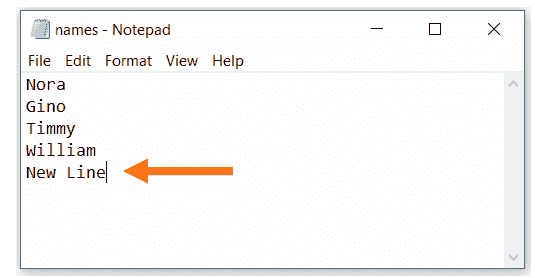

**💡提示:**在`**f.close()**`运行之前，新行可能不会显示在文件中。

### 写

有时，您可能希望删除文件的内容，并用新内容完全替换它。如果你用`**"w"**`模式打开文件，你可以用`**write()**`方法做到这一点。

这里我们有这个文本文件:


如果我运行这个脚本:

```
f = open("data/names.txt", "w")
f.write("New Content")
f.close() 
```

这是结果:

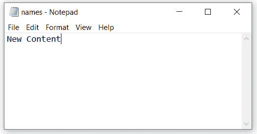

正如你所看到的，用`**"w"**`模式打开一个文件，然后写入它，替换了现有的内容。

💡**提示:****`write()`**方法返回书写的字符数。

如果你想一次写几行，你可以使用`**writelines()**`方法，它接受一个字符串列表。每个字符串代表要添加到文件中的一行。

这里有一个例子。这是初始文件:


如果我们运行这个脚本:

```
f = open("data/names.txt", "a")
f.writelines(["\nline1", "\nline2", "\nline3"])
f.close()
```

这些行将添加到文件的末尾:

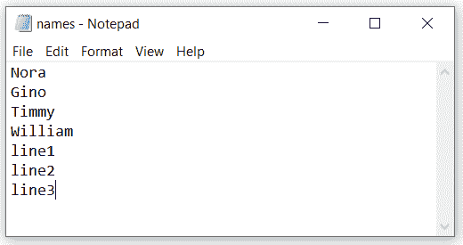

### 为多个操作打开文件

现在您知道了如何创建、读取和写入文件，但是如果您想在同一个程序中做多件事情呢？让我们看看，如果我们尝试用您目前为止所学的模式来做这件事，会发生什么:

如果您以`"r"`模式打开一个文件(读取)，然后尝试写入它:

```
f = open("data/names.txt")
f.write("New Content") # Trying to write
f.close()
```

您将得到以下错误:

```
Traceback (most recent call last):
  File "<path>", line 9, in <module>
    f.write("New Content")
io.UnsupportedOperation: not writable
```

同样，如果您以`"w"`模式打开一个文件(写入)，然后尝试读取它:

```
f = open("data/names.txt", "w")
print(f.readlines()) # Trying to read
f.write("New Content")
f.close()
```

您将看到以下错误:

```
Traceback (most recent call last):
  File "<path>", line 14, in <module>
    print(f.readlines())
io.UnsupportedOperation: not readable
```

在`"a"`(追加)模式下也会发生同样的情况。

我们如何解决这个问题？为了能够读取一个文件并在同一程序中执行另一个操作，您需要在模式中添加`"+"`符号，如下所示:

```
f = open("data/names.txt", "w+") # Read + Write
```

```
f = open("data/names.txt", "a+") # Read + Append
```

```
f = open("data/names.txt", "r+") # Read + Write
```

很有用吧？这可能是您将在程序中使用的模式，但是请确保只包含您需要的模式，以避免潜在的错误。

有时不再需要文件。让我们看看如何使用 Python 删除文件。

## 🔹如何删除文件

要使用 Python 删除一个文件，您需要导入一个名为`**os**`的模块，它包含与您的操作系统交互的函数。

**💡提示:****模块**是一个包含相关变量、函数和类的 Python 文件。

尤其需要`**remove()**` 功能。这个函数将文件的路径作为参数，并自动删除文件。

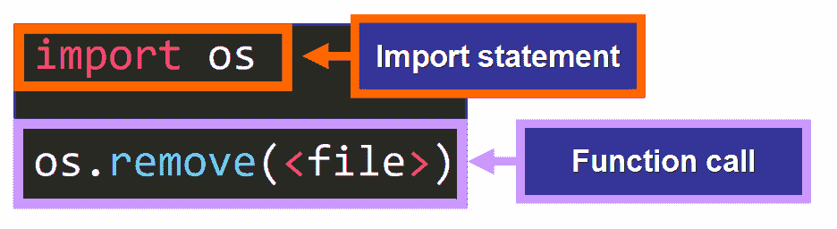

让我们看一个例子。我们想删除名为`sample_file.txt`的文件。

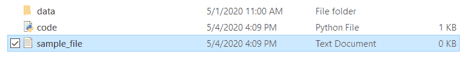

为此，我们编写以下代码:

```
import os
os.remove("sample_file.txt")
```

*   第一行:`import os`称为“导入语句”。这条语句写在你的文件的顶部，它让你可以访问在`os`模块中定义的函数。
*   第二行:`os.remove("sample_file.txt")`删除指定的文件。

💡提示:你可以使用绝对或相对路径。

现在你知道如何删除文件，让我们来看看一个有趣的工具...上下文管理器！

## 🔸会见上下文经理

上下文管理器是 Python 构造，它将使您的生活更加轻松。通过使用它们，你不需要记住在程序结束时关闭一个文件，你可以在你选择的程序的特定部分访问这个文件。

### 句法

这是一个用于处理文件的上下文管理器的示例:

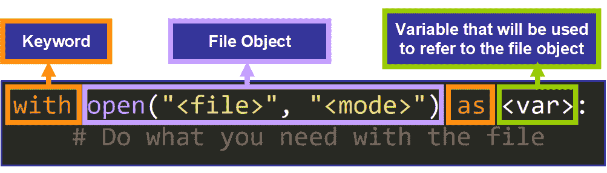

💡提示:上下文管理器的主体必须缩进，就像我们缩进循环、函数和类一样。如果代码没有缩进，它将不会被视为上下文管理器的一部分。

当上下文管理器主体完成时，文件自动关闭。

```
with open("<path>", "<mode>") as <var>:
    # Working with the file...

# The file is closed here!
```

### 例子

这里有一个例子:

```
with open("data/names.txt", "r+") as f:
    print(f.readlines()) 
```

该上下文管理器打开`names.txt`文件进行读/写操作，并将该文件对象分配给变量`f`。该变量在上下文管理器的主体中用来引用文件对象。

### 试着再读一遍

主体完成后，文件会自动关闭，因此不重新打开就无法读取。但是等等！我们有一行试图再读一遍，就在下面:

```
with open("data/names.txt", "r+") as f:
    print(f.readlines())

print(f.readlines()) # Trying to read the file again, outside of the context manager
```

让我们看看会发生什么:

```
Traceback (most recent call last):
  File "<path>", line 21, in <module>
    print(f.readlines())
ValueError: I/O operation on closed file.
```

抛出这个错误是因为我们试图读取一个关闭的文件。太棒了，对吧？上下文管理器为我们做了所有繁重的工作，它是可读的，简洁的。

## 🔹处理文件时如何处理异常

当您处理文件时，可能会出现错误。有时，您可能没有修改或访问文件的必要权限，或者文件甚至可能不存在。

作为一名程序员，您需要预见这些情况，并在您的程序中处理它们，以避免可能会影响用户体验的突然崩溃。

让我们看看在处理文件时可能会发现的一些最常见的异常(运行时错误):

### FileNotFoundError

根据 [Python 文档](https://docs.python.org/3/library/exceptions.html#FileNotFoundError)，这个异常是:

> 当文件或目录被请求但不存在时引发。

例如，如果您试图打开的文件不在当前工作目录中:

```
f = open("names.txt")
```

您将看到以下错误:

```
Traceback (most recent call last):
  File "<path>", line 8, in <module>
    f = open("names.txt")
FileNotFoundError: [Errno 2] No such file or directory: 'names.txt'
```

让我们一行一行地分析这个错误:

*   `File "<path>", line 8, in <module>`。这一行告诉您，位于`<path>`中的文件上的代码运行时引发了错误。具体来说，`line 8`在`<module>`被执行死刑的时间。
*   `f = open("names.txt")`。这是导致错误的行。
*   `FileNotFoundError: [Errno 2] No such file or directory: 'names.txt'`。这一行表示由于文件或目录`names.txt`不存在而引发了一个`FileNotFoundError`异常。

💡**提示:** Python 对错误消息的描述非常详细，对吗？这在调试过程中是一个巨大的优势。

### 许可错误

这是处理文件时的另一个常见异常。根据 [Python 文档](https://docs.python.org/3/library/exceptions.html#PermissionError)，这个异常是:

> 当试图在没有足够访问权限(例如文件系统权限)的情况下运行操作时引发。

当您试图读取或修改无权访问的文件时，会引发此异常。如果您尝试这样做，将会看到以下错误:

```
Traceback (most recent call last):
  File "<path>", line 8, in <module>
    f = open("<file_path>")
PermissionError: [Errno 13] Permission denied: 'data'
```

### IsADirectoryError

根据 [Python 文档](https://docs.python.org/3/library/exceptions.html#IsADirectoryError)，这个异常是:

> 在目录上请求文件操作时引发。

当您试图打开或处理一个目录而不是一个文件时，就会出现这个异常，所以要非常小心作为参数传递的路径。

### 如何处理异常

要处理这些异常，您可以使用一个 **try/except** 语句。有了这个语句，你就可以“告诉”你的程序在发生意外时该做什么。

这是基本语法:

```
try:
	# Try to run this code
except <type_of_exception>:
	# If an exception of this type is raised, stop the process and jump to this block 
```

这里你可以看到一个`FileNotFoundError`的例子:

```
try:
    f = open("names.txt")
except FileNotFoundError:
    print("The file doesn't exist")
```

这基本上是说:

*   尝试打开文件`names.txt`。
*   如果抛出一个`FileNotFoundError`，不要崩溃！只需为用户打印一份描述性声明。

💡**提示:**您可以通过在`except`块中编写适当的代码来选择如何处理这种情况。如果文件不存在，也许你可以创建一个新文件。

要在任务完成后自动关闭文件(不管`try`块中是否出现异常),您可以添加`finally`块。

```
try:
	# Try to run this code
except <exception>:
	# If this exception is raised, stop the process immediately and jump to this block
finally: 
	# Do this after running the code, even if an exception was raised
```

这是一个例子:

```
try:
    f = open("names.txt")
except FileNotFoundError:
    print("The file doesn't exist")
finally:
    f.close()
```

有许多方法可以定制 try/except/finally 语句，您甚至可以添加一个`else`块来运行一个代码块，前提是在`try`块中没有出现异常。

**💡提示:**要了解更多关于 Python 中异常处理的知识，你可能会喜欢阅读我的文章:[《如何在 Python 中处理异常:详细的可视化介绍》](https://www.freecodecamp.org/news/exception-handling-python/)。

## 🔸概括起来

*   您可以使用 Python 创建、读取、写入和删除文件。
*   文件对象有自己的一套方法，您可以在程序中使用这些方法。
*   上下文管理器通过在任务完成后自动关闭文件来帮助您处理和管理文件。
*   异常处理是 Python 的关键。处理文件时常见的例外包括`FileNotFoundError`、`PermissionError`和`IsADirectoryError`。可以使用 try/except/else/finally 来处理它们。

********我真的希望你喜欢我的文章，并发现它很有帮助。******** 现在你可以在你的 Python 项目中处理文件了。查看我的在线课程。在推特上关注我。⭐️