# 如何在谷歌电子表格中查询数据

> 原文：<https://www.freecodecamp.org/news/querying-like-an-sql-boss-in-google-sheets/>

我构建了一个电子表格，并希望在一个小表格中显示一些数据，该表格将根据一周中的某一天进行更新。

经过一番挖掘，查询似乎是实现这一目标的最佳选择。

在本文中，您将了解关于 Google Sheets 表格、函数、查询、数据验证和格式化的一些内容，包括:

1.  创建一个干净、可用的数据表。
2.  创建数据验证下拉列表
3.  命名范围便于使用和更清晰的数据管理
4.  查询基础知识，包括 SELECT、WHERE、TEXT()和 TODAY()函数
5.  在 Google 工作表查询中引用单元格的时髦语法
6.  在官方文档中可以找到更多的信息。

## Google Sheets 类似于 SQL

Google Sheets 确实有内置的“Google 可视化 API 查询语言”。点击查看文档[。](https://developers.google.com/chart/interactive/docs/querylanguage)

一些语法是相同的，大部分功能类似于 SQL，所以如果您对 SQL 很熟悉，应该很快就能学会。

我对 SQL 了解不多，但是我能够毫不费力地解析一些基本的查询。

其实最让我头疼的是**单元格引用语法**。我希望这篇文章能让你省去一些我今天经历的挠头。

Barney scratching his head

## 布置你的桌子

首先要做的事情是:把所有的数据放在一个组织有序的表格中。这有时是任何数据分析中最困难的部分:简单地以有序、可用的格式获取数据。

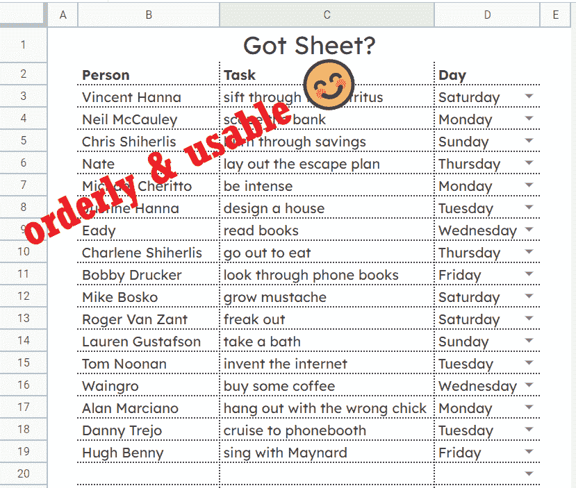

data table

我对一周中的每一天进行了数据验证，以确保没有输入错误，因为我们的查询将依赖于这些天。

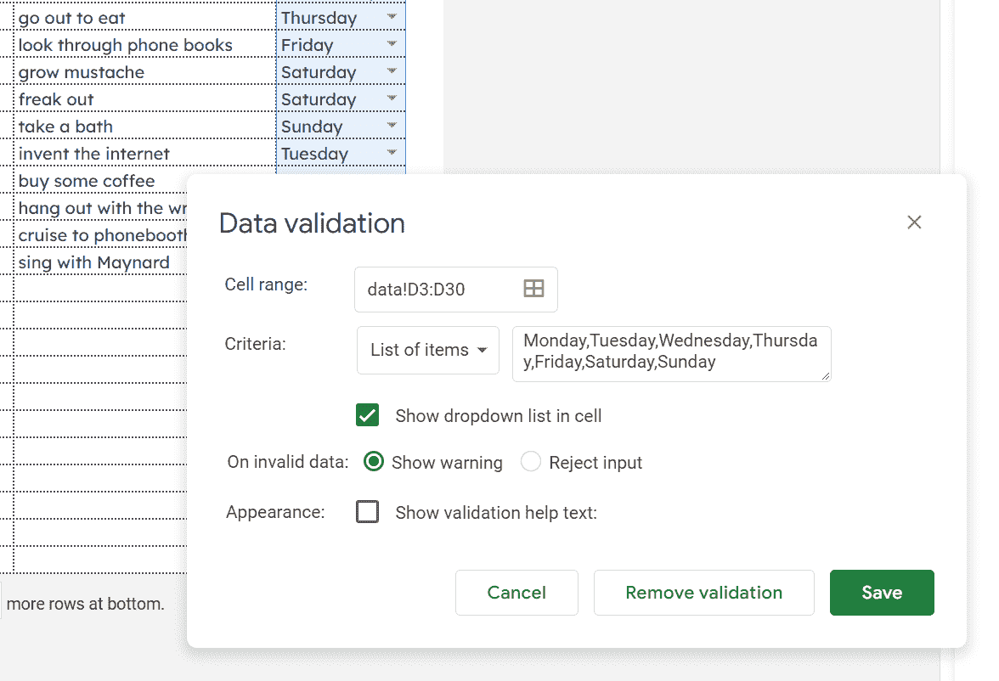

data validation

## 创建命名范围

选择整个表格以创建命名区域。这将使事情在下一步变得更干净和容易。尽可能保持数据整洁是一个好习惯。

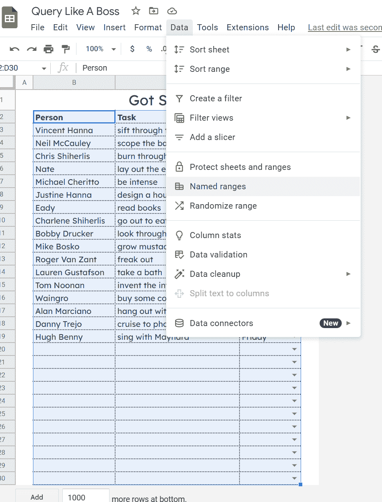

named range

确认并命名范围以保存它。

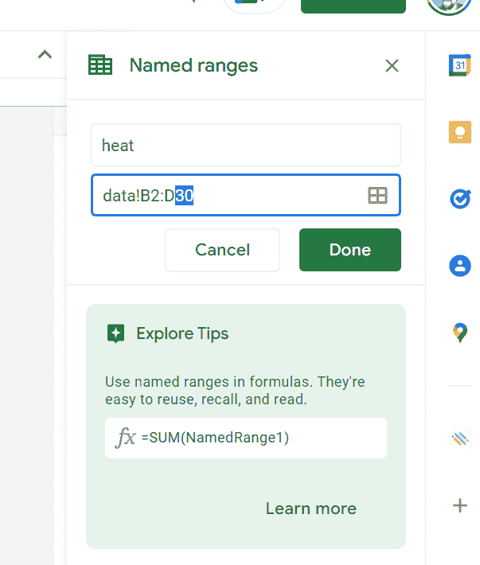

named range confirmation

## 如何编写查询

现在，让我们制作另一个表来输入我们的查询。我只需要两列数据:一列用于人员，一列用于任务。如果您的数据需要，可以腾出更多空间。

第一步需要一点小技巧，以便在加载工作表时显示当天，并在我们的查询中使用。

有一个内置的`=Today()`函数，但是即使改变格式，单独使用它也是不够的。他们的查询不会将它识别为与我们表中的星期文本相匹配。

相反，将`Today()`函数包装在`Text()`函数中，如下所示。`Text()`函数接受一个数字和一种格式作为参数。当我们传递给它`Today()`时，它可以使用`"dddd"`格式将日期数字转换成文本。整洁，对不对？😊

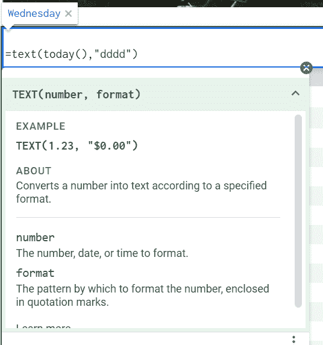

text() and today() functions

在 Google Sheets 中，`=QUERY`也是一个内置函数。当您在单元格中输入它时(在我的例子中是`B22`),您可以单击右上角的下拉箭头来获得关于接受的参数的更多信息。

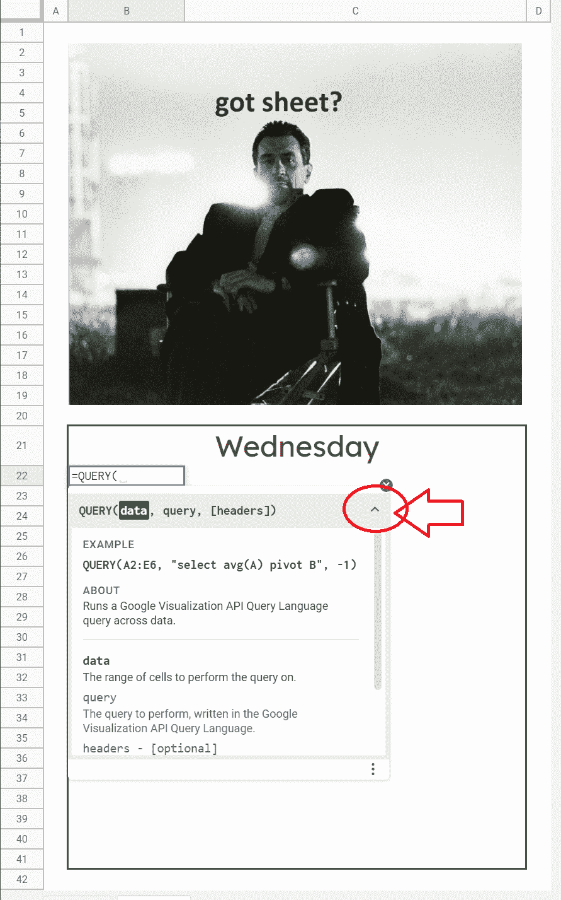

Query function parameters

我们将选择我们的数据。键入您创建的范围的名称，它将自动选择该表。

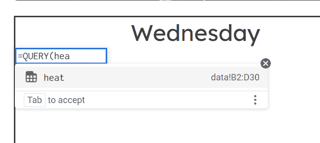

如果您愿意，可以手动选择要查询的表的范围。但是你想要尽可能的棒，所以使用那个命名的范围！🙌

我们希望基于第四列(星期几)选择并返回数据表中的前两列(姓名和任务)。

查询内容为`=QUERY(heat,"select B,C where D='"&B21&"'",1)`。

是的，单引号、双引号和&符号对于我们正在创建的条件语句来说是必要的。

我们告诉查询将数据表中的 D 列与`B21`中的值相匹配，由于我们之前的公式处理了星期几，所以它现在是文本。

匹配单元格中文本的语法很粗糙，但这就是你必须要做的。

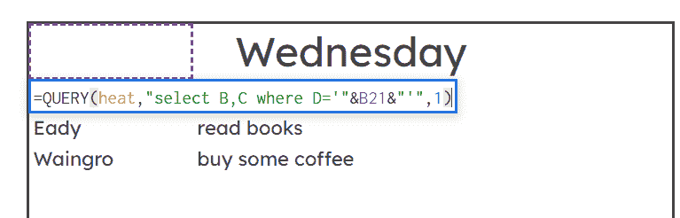

Query Function

最后一个参数`1)`让查询知道有一行标题要显示(name，task)。

然后，瞧！我们已经有了一个基于一周中当天自动更新的任务列表。剩下的就是清理最后的结果了！🎁

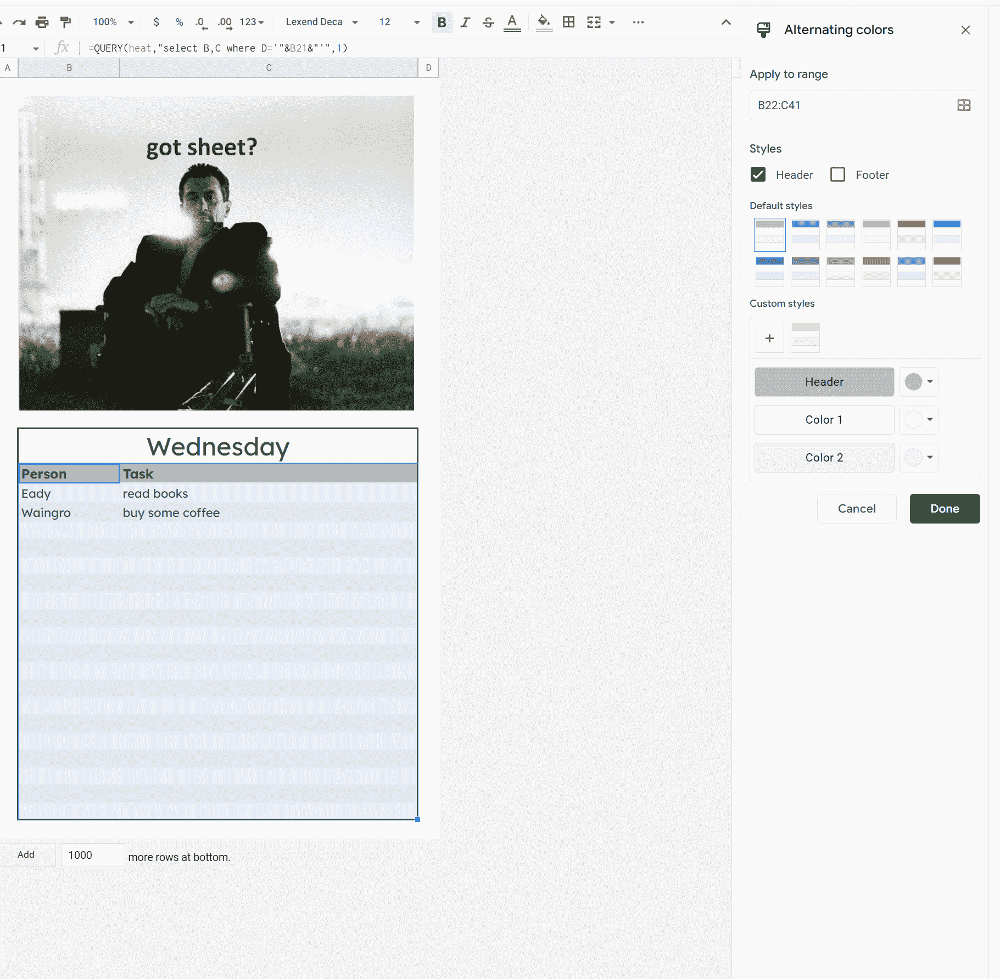

## 官方示例

我从 Google Support 上的查询功能页面引用了[这篇文章](https://support.google.com/docs/answer/3093343?hl=en)来学习，它有一个 Google Sheet 你可以复制，里面有一堆例子。超级有帮助。

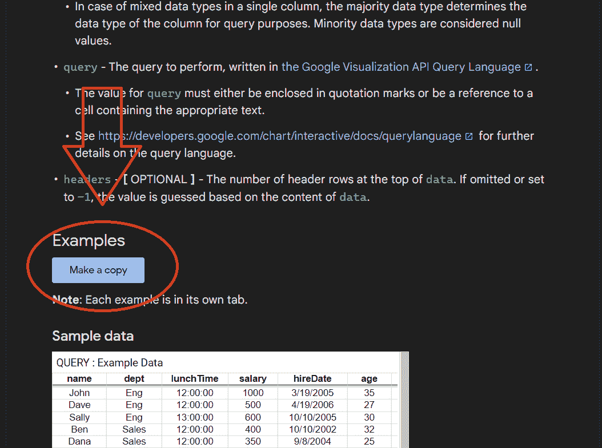

## 我的电子表格示例

这是我为这篇文章制作的表格。你可以随意复制一份自己用。

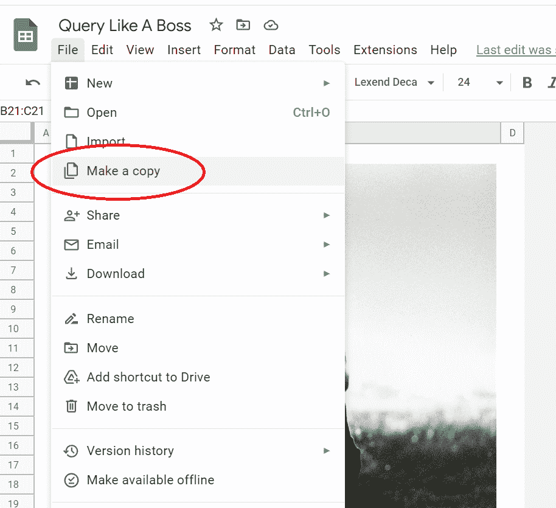

make a copy of Google Sheet

## 感谢阅读！

我在[https://blog.eamonncottrell.com/](https://blog.eamonncottrell.com/)从一个创业者的角度写关于网页设计和开发的文章，你可以在推特上找到我:[https://twitter.com/EamonnCottrell](https://twitter.com/EamonnCottrell)

祝你愉快！🎉

bye!