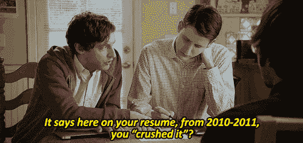
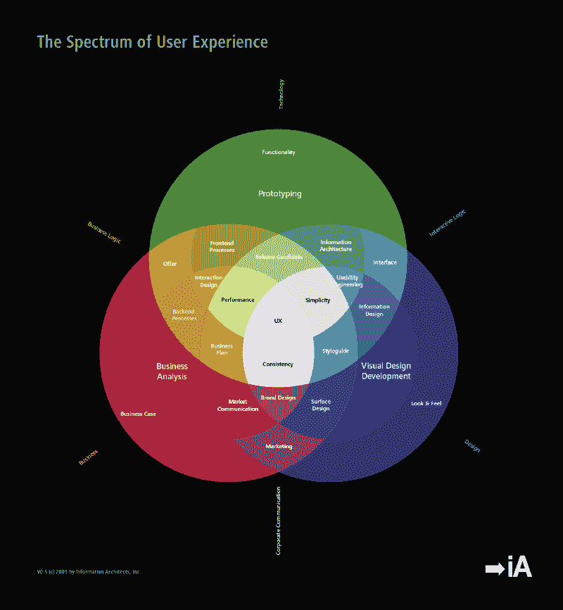
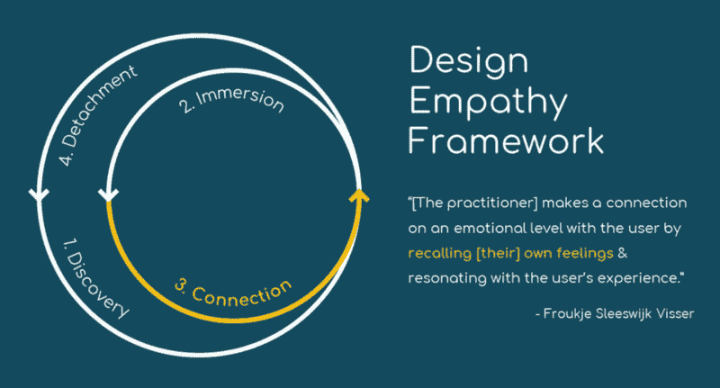
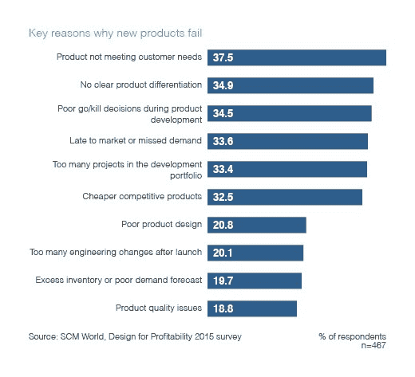
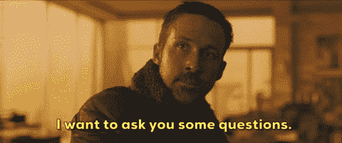
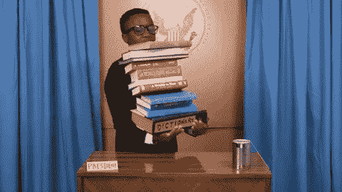

# 为初创公司招聘产品设计师时要问的问题

> 原文：<https://www.freecodecamp.org/news/questions-to-ask-when-hiring-a-product-designer-for-a-startup-da58a3ca0a71/>

作者 Bohdan Kit

# 为初创公司招聘产品设计师时要问的问题

#### 如何在人群中找到隐藏的宝石

Courtesy: [Mike Shannon](http://michaelshannon.tumblr.com/post/118468127504)

为一家初创公司找到合适的人可能很难，但找到第一个在美学和可用性方面加强你的产品的产品设计师可能更难。从一开始，你就希望有人能够领导设计过程。你希望有人能竭尽所能解决用户的问题，让产品变得可爱和易用。

开普勒最近在招聘方面遇到了困难，因为我们要为 T2 的新产品 T3 寻找设计明星。我们在采访一群产品设计师的时候，我提出了一系列问题，现在这些问题可以像 x 光透视一样帮助我们扫描潜在招聘对象。

正如脸书产品设计总监朱莉·卓曾经说过的:

> 在一家初创公司，你需要你的第一个或两个设计师是多才多艺的——多面手……他们不仅需要深刻理解和思考产品战略，还需要有良好的互动能力和良好的视觉感，因为他们将做从设计 UX 到思考品牌再到设计图标的一切事情——他们需要拥有多样化的技能组合。

专业建议:永远记住，你应该根据艺术家的作品来评价他们。不要盲目地依靠简单的交谈来揭示他们的真实个性和技能。

然而，你通过问以下问题获得的信息将帮助你了解你是否有兴趣看到这个潜在雇员的工作。

之后，与你的产品设计挑战相关的某种形式的测试任务将是一个完美的下一步。

以下是我最喜欢问的问题。我将讨论你为什么要问他们，以及你希望从他们的回答中听到什么样的信息。

### **1。在你看来，什么是产品设计？**

**为什么你应该问**:产品设计是一个非常跨学科的领域，涉及商业、心理学、技术技能等等。你不仅要让潜在的雇员明白这一点，还要让他们解释他们在之前的工作中是如何运用这些知识的。

**你想听的**:我面试的一位候选人给出了一个很好的答案:

> 产品设计是商业需求、视觉外观和领导力的混合体。这就是为什么这么难，因为如果你想让你的产品成功，你必须同时擅长这三件事…

这表明他真的知道自己在做什么。

Courtesy: Information Architects, Inc.

### **2。告诉我们你学到的改进你设计工作的最新东西。那是什么？你为什么决定在这方面投入时间？事后你是怎么应用的？**

**为什么要问** : 产品设计是一个不断进化的领域。学会如何学习是每个人在这个领域取得成功的必备条件。实用的方法是优秀产品设计师和平庸产品设计师的区别。

你想要一个在真正了解它是如何工作之前就已经去过那里并弄脏自己的手很多次的人。而且，你需要一个平衡。你不希望有人在产品没有任何可见价值的情况下进行无休止的用户研究。

**你想听到的** : 试着找出好的因果关系。如果一个设计师学到了一些新的东西来超越他们的工作，仔细评估了时间和精力的比例，然后实际应用这些知识，他们就是学习的摇滚明星。

以下是我认为这方面的一个主要危险信号:

> *候选人 **:*** 最近，我和帮助你创造那些设计精美的图标的【软件名称】关系很好。
> ***我:*** 能给我们看看吗？
> ***候选人:*** 我的上级决定我们不需要他们…

### 3.在你看来，一个好的设计过程应该如何开始？为什么？

**为什么你应该问**:正如西蒙·西内克所说，我们做的每件事都应该从“为什么”开始不管潜在雇员使用什么样的方法，设计是一种以人为本的工作。因此，拥有相当程度的同理心和与他人问题相关的意愿是这一创造性领域中不可或缺的技能。

**你想听到的** : 竖起耳朵，注意任何有助于你将此人描述为关心他人需求的迹象/行为。一个好的答案可能包括如下内容:

> 我首先从一个用户的问题开始，然后把它框定为一个设计挑战。一个好的挑战不会太宽泛，但会给你留下足够的空间来创造性地解决问题…

Courtesy: [Brian Pagán](https://twitter.com/brianpagan)

### 4.你工作中最重要的方面是什么？

**为什么要问**:这基本上是一个自我认知测试。人们必须明白为什么他们决定成为终身设计师。在我看来，设计师和产品设计师是问题解决者，他们在用户需求和商业需求之间的平衡中茁壮成长。

**你想听的话**:没有放之四海而皆准的答案。在我的招聘经历中，有一位应聘者是这样回答的:

> 赋予人们权力是我来到这里的动力。帮助他们更好地完成工作，在一天结束时更有效率和快乐。当用户写下[产品名称]如何帮助他们获得推广或增加收入的故事时，这是令人惊讶的。这绝对是值得努力的事情…

### 5.什么应该放在第一位——产品还是风格指南？

**为什么你应该问**:这是一个先有鸡还是先有蛋的问题。在 99%的情况下，答案表明一个人是否有能力捍卫自己的观点。设计师，像企业家一样，应该有坚定的信念，但不要太紧。

**你想听的**:这个也没有正确答案。寻找双方合理的解释。

一般来说，如果你已经有了某种品牌，那么风格指南肯定有助于保持视觉传达和形象的一致性。

另一方面，如果你雇人从一张白纸开始，那么试图标准化视觉效果就像在陷入泥沼前擦鞋一样。

### 6.告诉我们你简化复杂情况或问题的一次经历。是什么让你寻求一种更简单的方法？

**为什么你应该问**:我从我的好朋友[德米特里·沃洛辛](https://www.freecodecamp.org/news/questions-to-ask-when-hiring-a-product-designer-for-a-startup-da58a3ca0a71/undefined)那里借了这个。他用它来测试候选人是否符合他公司的价值观。我认为它与整个创业主题完美契合。

今天的好作品胜过明天的伟大作品。因此，寻找候选人为了时间和资源而做出的任何妥协。我们生活在一个充满不确定性的世界里，时间成了最昂贵的货币。因此，从长远来看，有时快速犯错误是制造伟大产品的关键。

**你想听的话**:

> 当我开始在[公司名称]工作时，有一个非常复杂和漫长的用户流程，需要用户采取许多步骤来完成任务，甚至需要更多的开发工作来推出产品。我建议优先考虑其中一个客户群，首先建立一个适合这些客户的用户流，然后再为其余的客户群发布新功能。它有助于更快地推出产品并避免高开发成本…设计的目的就是找到一个简单的解决方案…

Courtesy: SCM World

### 7.回想一下你被要求做你不喜欢或知道是错的事情的情况。你有什么反应？

**为什么你应该问**:每个人都会时不时地和同事、朋友、配偶等等发生争执。这不是谁对谁错的问题，而是正确的沟通。

**你想听的话**:最让我印象深刻的答案如下:

> 我必须先了解需求背后的目的是什么。一旦我了解它，我就可以提供他或她在问(关于我个人不喜欢/认为不对的事情)之前甚至无法意识到的解决方案

### 8.就设计而言，你最喜欢的产品是什么？你喜欢什么，不喜欢什么？你会如何改进它？

**为什么你应该问**:优秀的候选人总是会提前做好准备。这是件好事。产品思维是一种技能，需要通过不断的刻意练习才能掌握。一个好的产品设计师解决这个问题不会有问题。

**你想听的**:我面试的一位应聘者回答说，Medium 是她最喜欢的产品。我深入挖掘了一下，问她对引入鼓掌机制而不是简单的“喜欢”有什么看法，很多人认为这是很有争议的。她说，在这里发表的每一份出版物或故事都是一场表演，一场好的表演应该得到一百万次掌声的认可。这样的回应是一个很好的例子，说明有人有好的产品思维的诀窍。

### 9.你开始开发一个新的桌面/移动/网络应用。你的第一步是什么？

**为什么你应该问**:这是一种双重检查。一旦人们建立了一些系统，他们做的每件事都会变得更好。这是你观察候选人是否能够在你的团队中拥有和领导产品设计过程的机会。另一方面，寻找问题而不是答案。优秀的产品设计人员总是会问很多问题来帮助他们处理不确定性。

**你想听的**:用户是谁？想要的平台是什么？在这个平台上能找到那些用户吗？一个优秀的产品设计师肯定会问这样的问题。

一旦你给出了一些答案，寻找一个合适的解释，说明他们如何处理你的产品类型的设计过程。在我们的例子中，我们主要为 macOS 开发一个桌面应用程序。因此，熟悉界面指南在这里是至关重要的。

Courtesy: Giphy

### 10.你如何跟上最新的设计趋势？你用什么资源来激励自己？

**为什么要问**:这个问题相当简单。尽管如此，根据我的经验，很多人都在这里被淘汰了。要么他们不关注英语资源(在当今全球化的世界中这是一个巨大的缺失)，要么他们就是想不起任何资源。这将是一个危险信号。

**你想听的**:你只是想听那些能产生高质量内容的著名名字(比如[尼尔森诺曼集团](https://www.nngroup.com/)、[远见博客](https://www.invisionapp.com/blog)、 [UX Pin](https://www.uxpin.com/studio/) 、 [IDEO](https://www.ideo.com/blog) 等等)。他们还应该表现出尝试的愿望。

一位候选人给我看了他在前面提到的博客中的一篇文章后做的按钮颜色实验的结果。因此，如果候选人没有主动展示一些例子，请随意提示他们。归根结底，发现一个实用的头脑总是有用的。

Courtesy: Giphy

我希望这能对你下一次招聘有所帮助，也希望你能找到人来领导你的产品的伟大设计。

如果你觉得这个故事有用，请点击？按钮并分享，帮助其他人找到它！也可以在 T [**witter 上关注我。**](https://twitter.com/bohdan_kit) 得到了想法或反馈？请在下面留下你的评论。我很想听听！