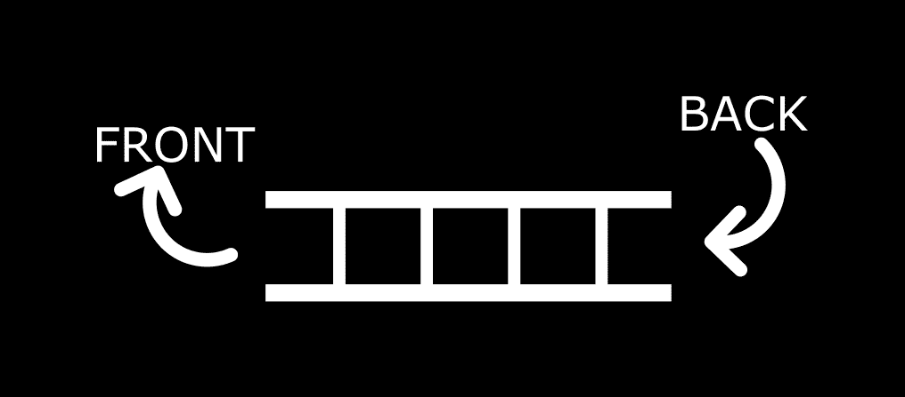
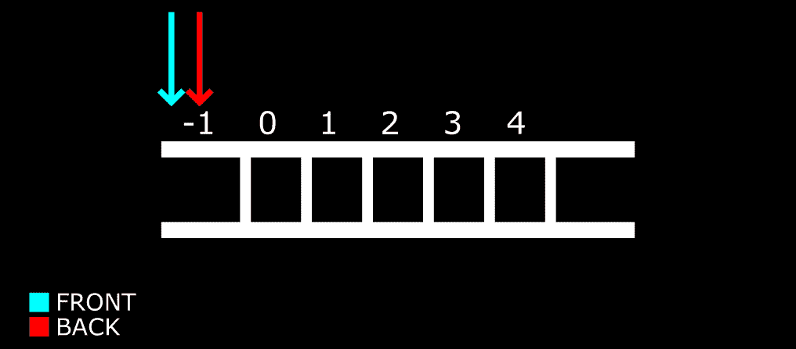
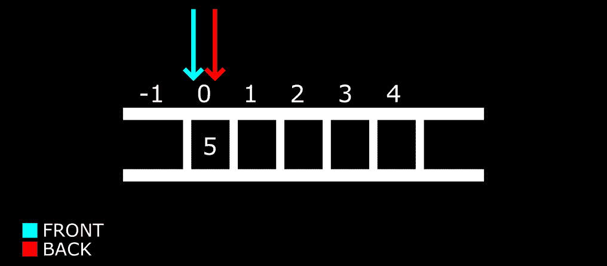
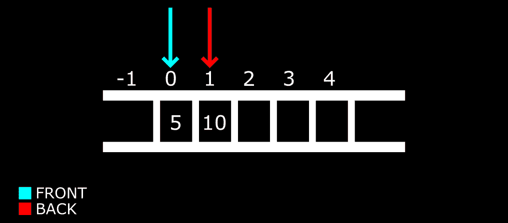
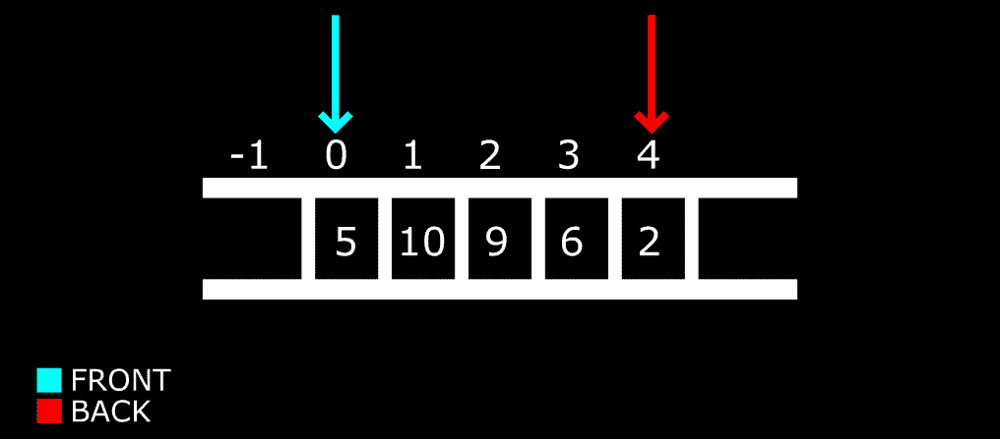
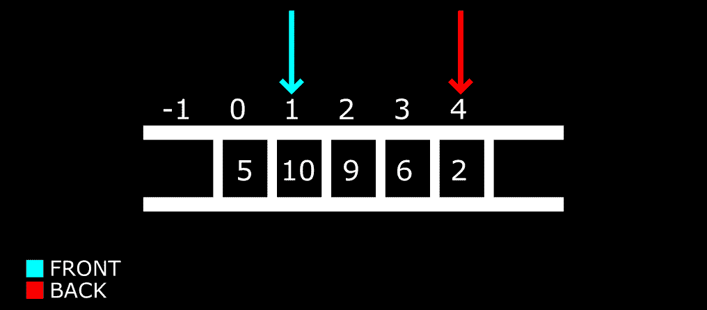

# 队列数据结构–定义和 Java 示例代码

> 原文：<https://www.freecodecamp.org/news/queue-data-structure-definition-and-java-example-code/>

在本文中，我们将讨论队列数据结构、其操作以及如何使用 Java 中的数组实现这些操作。

## 什么是队列？

一个**队列**是线性数据结构，它由一个遵循**先进先出**序列的项目集合组成。这意味着要插入的第一个项目将首先被移除。您也可以说项目是按照插入的顺序移除的。

使用一个真实世界的例子，我们可以将队列数据结构与排队等候服务的个体队列进行比较。一旦一个人得到照顾，他们就离开队列等待下一个人得到照顾。他们按照来的顺序得到帮助。

## 队列的结构

队列主要由两部分组成:前部/头部和后部/尾部/后部。为了清晰和一致，我们将坚持使用正面和背面。

**后面的**是插入项目的地方，而**前面的**是队列中移除/删除项目的部分。

这里有一个图表可以帮助你更好地理解:



该图像显示了包含各种单元的阵列。物品通过**后部**插入，通过**前部**取出。有一些术语用于在队列中插入和删除项目，我们将在下一节中介绍。

请注意，您可以颠倒队列的结构——前排在右边，后排在左边。无论你使用哪种结构，都要记住项目的插入是从后面进行的，删除是从前面进行的。

## 队列的常见操作

队列中通常使用以下操作:

*   **入队**:从队列的后面添加一个项目。
*   **出列**:从队列前面删除一个项目。
*   **Front** / **Peek** :返回队列前面项目的值，而不将项目出队(移除)。
*   **IsEmpty** :检查队列是否为空。
*   **IsFull** :检查队列是否已满。
*   **显示**:打印队列中的所有项目。

在我们看到如何用代码实现这一点之前，您需要理解**入队**和**出列**操作是如何工作的，以及它们如何影响前后位置。

大多数编程语言中数组的索引从 0 开始。在实现我们的代码时，我们将把数组的前后值的索引设置为-1。这将使我们能够在添加值时适当地移动前端和后端位置。

考虑下图:



箭头显示了我们阵列的前后位置。当两个位置都为-1 时，表示数组为空。

让我们向数组中添加一些项，看看会发生什么。



我们已经插入了第一个项目——5。前面和后面的位置也移动了。接下来，我们将看到当我们将更多的项目入队时会发生什么



第二个项目已被添加，但只有背部移动。随着我们将更多的项目加入队列，这一过程将会继续。在最后一个示例中，前面和后面一起移动，以便前面可以占据第一个项目的位置。

因为那是当时第一个也是唯一一个项目，所以前面和后面坐在那个位置。但是现在我们已经让更多的项目排队，后面将继续跟随最后一个项目。

我们将继续填充数组，这样我们可以看到当我们出队时会发生什么。



因此，返回箭头按照项目添加的顺序一直到最后。现在让我们删除(出列)一些项目。

还记得**先来先出**的顺序吗？当我们执行出列操作时，它将首先从队列中删除 5。如果我们再次执行它，那么它将移动到下一个数字 10，并且只要我们调用它，就继续这个顺序。

这里，第一个出列操作:



现在前面的箭头已经移动到索引 1。这意味着索引 0 处的项目已被移除。我们所说的“删除”不是指从数组中删除，而是指从队列中删除，只有从前面位置到后面位置的项目才是队列的一部分。

在同样的顺序中，如果我们继续移除项目，它将到达队列末尾前箭头和后箭头相遇的点。如果我们在该点再次出列，前面的箭头将移过后面的箭头，然后队列将被认为是空的，因为那里没有要删除的内容。当这种情况发生时，我们会将它们的索引重置为-1(它们的初始起点)。

是写代码的时候了！

## Java 中的队列实现

我们将通过创建每个操作来分解这一部分，然后在最后将所有内容放在一起。

```
int queueLength = 3;
int items[] = new int[queueLength];
int front = -1; 
int back = -1;
```

我们已经创建了变量及其参数。我们使用 3 作为数组中可以排队的最大项数。就像我们在上一节的图片中看到的那样，我们已经将前面和后面的初始索引设置为-1。

接下来，我们将定义 **isEmpty** 和 **isFull** 功能。

对于**是空的**:

```
boolean isEmpty(){
      if(front == -1 && back == -1){
          return true;
      } else {
          return false;
      }
  }
```

如果你按照上一节的内容去做，这很容易理解。只有当 front 和 back 的索引为-1 时，数组才为空。

For **isFull** :

```
boolean isFull(){
      if(back == queueLength - 1){
          return true;
      } else {
          return false;
      }
  }
```

这个看起来有点复杂，但是逻辑是这样的:数组中允许的最大项数是 3，但是数组中的三个项不是用索引 3 表示，而是用 2 表示，因为第一个索引是 0。所以最大长度减 1 得到索引 2，这是数组中的第三个单元格。

当所有单元格都以一个值排队到第三个单元格时，数组已满。

对于**入队**:

```
void enQueue(int itemValue) {
      if(isFull()){
          System.out.println("Queue is full");
      } else if(front == -1 && back == -1){
          front = back = 0;
          items[back] = itemValue;
      } else{
          back++;
          items[back] = itemValue;
      }
  }
```

如果数组已满，我们会收到一条消息说数组已满。如果前端和后端为-1，则该项被分配给索引为 0 的第一个单元格，否则，将插入该值，后端位置递增。

对于**出列**:

```
void deQueue(){
      if(isEmpty()){
          System.out.println("Queue is empty. Nothing to dequeue");
      } else if (front == back){
          front = back = -1;
      } else {
          front++;
      }
  }
```

在这里，如果数组是空的，我们得到相应的消息。如果前面遇到了后面，我们将它们的索引重置回-1，就像我们在上一节的图像中看到的那样。如果最后两个条件不适用，则前端递增。

对于**显示**:

```
void display(){
      int i;

      if(isEmpty()){
          System.out.println("Queue is empty");
      } else {
          for(i = front; i <= back; i++){
              System.out.println(items[i]);
          }
      }
  }
```

在这里，如果数组不为空，我们将遍历并打印所有条目。

最后，对于**窥视**:

```
void peak(){
      System.out.println("Front value is: " + items[front]);
  }
```

这只是打印前面项目的值。

这些都是我们队列的操作。以下是它们的完整版本:

```
// Queue implementation in Java

public class Queue {

  int queueLength = 3;
  int items[] = new int[queueLength];
  int front = -1; 
  int back = -1;

  boolean isFull(){
      if(back == queueLength - 1){
          return true;
      } else {
          return false;
      }
  }

  boolean isEmpty(){
      if(front == -1 && back == -1){
          return true;
      } else {
          return false;
      }
  }

  void enQueue(int itemValue) {
      if(isFull()){
          System.out.println("Queue is full");
      } else if(front == -1 && back == -1){
          front = back = 0;
          items[back] = itemValue;
      } else{
          back++;
          items[back] = itemValue;
      }
  }

  void deQueue(){
      if(isEmpty()){
          System.out.println("Queue is empty. Nothing to dequeue");
      } else if (front == back){
          front = back = -1;
      } else {
          front++;
      }
  }

  void display(){
      int i;

      if(isEmpty()){
          System.out.println("Queue is empty");
      } else {
          for(i = front; i <= back; i++){
              System.out.println(items[i]);
          }
      }
  }

  void peak(){
      System.out.println("Front value is: " + items[front]);
  }

}
```

现在让我们执行操作:

```
 public static void main(String[] args) {
    Queue myQueue = new Queue();

    myQueue.enQueue(3);
    myQueue.enQueue(2);
    myQueue.enQueue(1);

    myQueue.display();

    myQueue.peak();

  }
```

将 3 插入到我们的队列中，类似于下面两行代码。

`display()`打印出数组中的项目。

`peak()`打印前端项目的值。

我们没有执行`deQueue`,所以您可以继续自己尝试——显示您的数组，并在您出列后查看一下，看看会发生什么。修改代码的方法多种多样，玩得开心点！

## 结论

在本文中，我们定义了队列及其结构。我们接着看了一些例子，使用图像来显示当项目入队和出队时，队列的前端和后端位置如何反应。

最后，我们看到了如何在 Java 中使用数组实现队列数据结构。

感谢您的阅读和快乐编码！