# React 中测试驱动开发的快速指南

> 原文：<https://www.freecodecamp.org/news/quick-guide-to-tdd-in-react-81888be67c64/>

让米迦勒巴隆斯基

# React 中测试驱动开发的快速指南

Random picture by [Deanna Ritchie](https://unsplash.com/@deannaritchie?utm_source=medium&utm_medium=referral) on [Unsplash](https://unsplash.com?utm_source=medium&utm_medium=referral)

在编写前端React 应用时，遵循**测试驱动开发** (TDD)的原则似乎比在后端做同样的事情更困难。

首先，我们需要以某种方式**呈现**我们的组件。然后我们需要**模拟**用户与浏览器的交互。接下来，我们对**道具**和**状态**的变化做出响应，最后想出一种方法来测试由点击按钮触发的**异步**方法。

试图在我们的测试中涵盖所有这些情况通常会导致测试难以阅读。他们也经常互相依赖。我们嘲笑很多，作为回报，我们有充满反模式的测试。

### 别浪费你的时间

据我所见，许多程序员首先创建可工作的 React 组件。然后他们试图用测试来覆盖它们，只是为了意识到组件不能在它们当前的实现中被测试。然后他们需要重构。因此，他们失去了耐心、时间和雇主的金钱。

### 可用的解决方案

幸运的是，有许多测试库可以帮助我们解决这些问题。我们可以尝试用 [**酶**](https://github.com/airbnb/enzyme) 渲染 React 组件，用 [**MockAxios**](https://github.com/ctimmerm/axios-mock-adapter) 模拟 API 响应。然而，这些库通常有太多的方法和选项，这可能会让人感到困惑，尤其是对于那些刚刚开始编写测试的人。

让我们以**酶**为例——**浅**、**挂载**和**渲染**的方法有什么区别？你应该使用哪一个？在我看来，这不是你在编写测试时应该担心的。应该尽可能直截了当。

### 我们的项目

出于快速指南的目的，我们将创建一个小的 React 应用程序。点击一个按钮后，一个随机的关于查克·诺里斯的笑话就会显示出来。

> 没有人曾经和查克·诺里斯结对编程，并且活着讲述它。

让我们开始吧。

首先在 [**CodeSandbox**](https://codesandbox.io/s/new) **，**中创建一个 React 项目，然后安装以下依赖项(如果从上面的链接开始，J **est** 已经预装):

*   [**axios**](https://github.com/axios/axios) —用于从外部 API 获取数据
*   [**axios-mock-adapter**](https://github.com/ctimmerm/axios-mock-adapter)—用于模拟服务器响应
*   [**react-testing-library**](https://github.com/kentcdodds/react-testing-library)**—轻量级、易于使用的测试库，用于渲染、模拟动作和处理异步方法——由 [Kent C. Dodds](https://www.freecodecamp.org/news/quick-guide-to-tdd-in-react-81888be67c64/undefined) 创建**
*   **[**jest**](https://facebook.github.io/jest/) —用于运行测试和创建断言**

#### **文件夹/文件结构**

*   ****src/index.js** —我们 React 应用的入口点**
*   ****src/joke generator . js**—*我们的[容器](https://medium.com/@dan_abramov/smart-and-dumb-components-7ca2f9a7c7d0)组件，获取、控制并提供数据***
*   ****src/joke.js** —简单展示组件**
*   ****src/_ _ tests _ _/joke generator . test . js**—*包含了我们的测试***

#### ***你的第一次测试***

***每次在我们创建一个组件**之前，我们会先写一个失败的测试，然后试着让它通过**。让我们首先为我们的虚拟组件 **<笑话** / >编写一个测试，它将从道具中呈现文本。***

***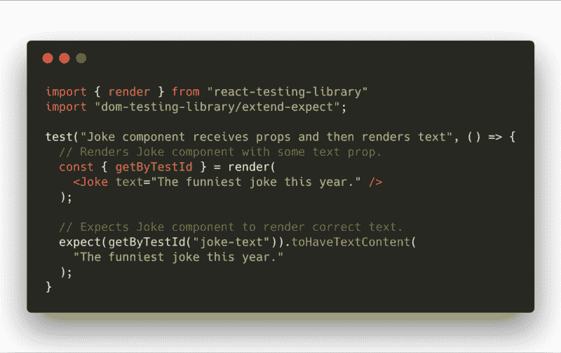

jokeGenerator.test.js*** 

***从顶部读取:我们使用来自**反应测试库**的[渲染](https://github.com/kentcdodds/react-testing-library#render)方法，并通过&**lt；Jok** e/ >组件(此时不存在)到其中。它返回一个包含一些非常有用的方法的对象(在这里可以找到可用方法的完整列表)，例如 getBy TestId。然后，它返回一个基于 data-t estid 的 HTML 元素作为参数。***

***接下来，我们使用上述方法和**数据-testid，**编写一个 **expect** ，并检查元素是否包含来自 props 的文本。运行测试后，我们得到:***

> ***笑话没有定义***

***是的，我们希望它失败！ **<笑话** / >还不存在，记得吗？我们到目前为止只创建了一个*空 jo* ke.j *s* 文件。我们编写了一个测试，在这个测试中，我们可以清楚地看到我们期望组件做什么。现在我们的工作是在不修改 tes t 代码的情况下通过**测试。那就这么办吧:*****

***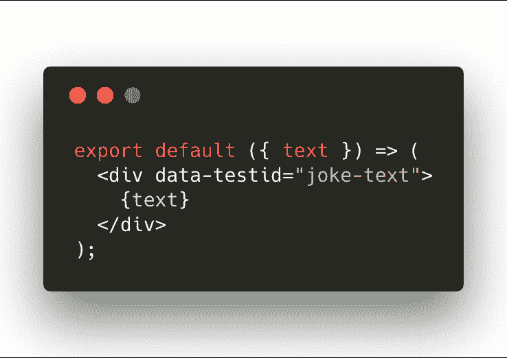

joke.js*** 

***现在，如果你像我一样做每件事，测试应该通过:)***

#### ***第二成分***

***我们的第二个组件将负责在用户点击按钮后获取一个随机笑话。我们将它保存在组件的状态中，并将其传递给我们的 **<笑话** / >组件。我们也想显示一个默认消息时，还没有加载笑话。***

***当然，我们首先从测试开始。它是一个更大的组件，所以我们将一步一步地编写测试。我们还将确保它尽可能频繁地通过。***

***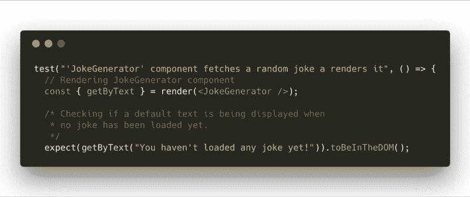

jokeGenerator.test.js*** 

***我们已经熟悉了**呈现**方法，但是这次我们从返回对象中获取 **getByText** 。正如您可能已经猜到的，如果 DOM 中存在 HTML 元素，该方法将返回一个 HTML 元素。***

***运行测试和…***

> ***JokeGenerator 未定义***

***你知道该怎么做:***

***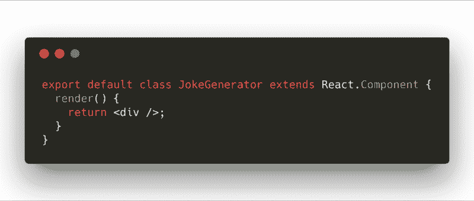

jokeGenerator.js*** 

***测试仍然失败，但是这次它输出了一个不同的错误:***

> ***找不到带有文本的元素。***

*****你还没有加载任何笑话**。这可能是因为文本被多个元素分割。在这种情况下，您可以为您的文本匹配器提供一个函数，使您的匹配器更加灵活。***

***让我们通过向组件引入一个**状态**来快速修复这个问题，当在**状态**下没有**笑话**时，显示一个默认消息。***

***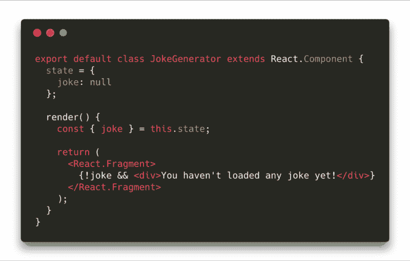

jokeGenerator.js*** 

***测试正在通过，所以我们可以继续添加新的功能。想象一下，当我们单击一个按钮时，组件中的默认文本消失，为“ *Loading…* ”消息腾出空间。听起来很简单，对吧？我们可以只用**三**行代码来测试这个场景！***

***让我们首先导入**模拟**方法，因为我们将需要:***

> ***从“反应-测试-库”导入{渲染，模拟}***

***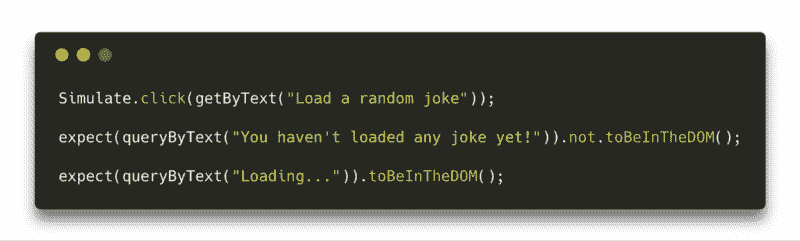

Append it to our second test — jokeGenerator.test.js*** 

*****queryByText** 和 **getByText** 的区别在于当元素没有被找到时各自返回什么。第一个返回 **null** ，第二个抛出**错误消息**。重新运行测试:***

> ***找不到文本元素:**加载一个随机笑话** …***

***我们需要创建一个按钮并设置 **onClick** 方法，该方法会将**加载**状态设置为**真**。***

***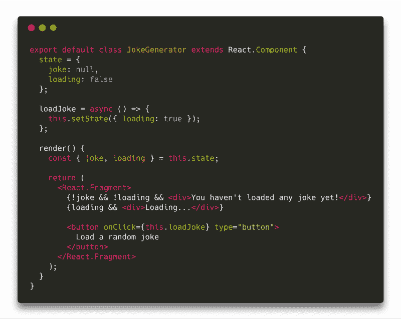

jokeGenerator.js*** 

***就这样考验又过去了。现在是时候拿我们的随机笑话了！嗯……在我们的测试中不会是随机的。我们将使用 **MockAxios** 来模拟它。***

> ***从“axios”导入*为 axios
> 从“axios-模拟适配器”导入模拟 axios***

***在我们在 **jokeGenerator.test.js 中的测试上面，**插入这两行代码:***

***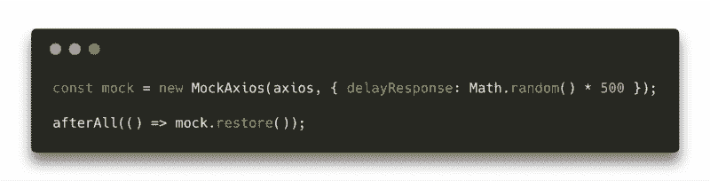

Insert above all tests — jokeGenerator.test.js*** 

***第一行创建了一个带有随机延迟的新实例 **MockAxios** 。第二行代码在运行完该文件中的所有测试后，获取并执行一个回调函数，并从 **axios** 中移除模拟状态。***

***在我们测试 **< JokeGenerator** / >组件的第二个测试的顶部，添加:***

***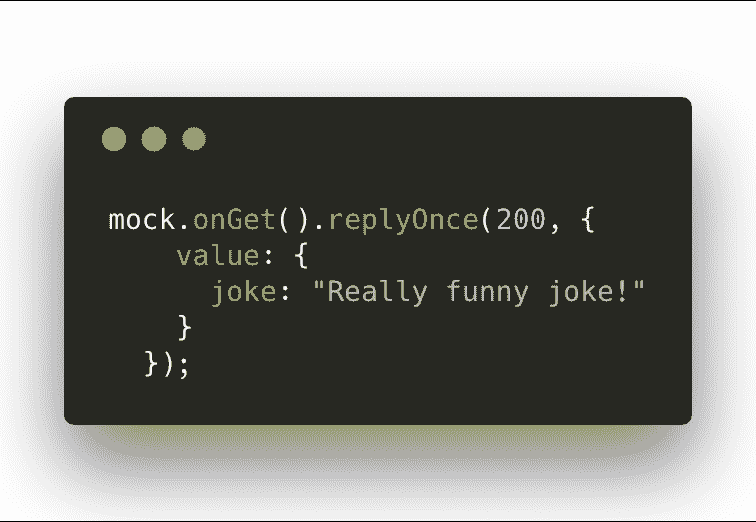

Top of the second test — jokeGenerator.test.js*** 

***它模仿任何通过 **axios** 完成的 **GET** 调用的响应。在同一测试结束时:***

***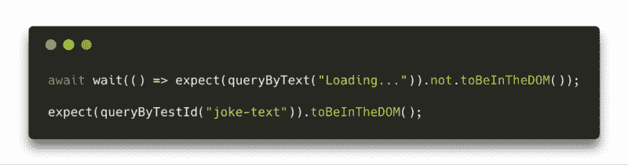

jokeGenerator.test.js*** 

***不要忘记导入**等待**:***

> ***从“反应-测试-库”导入{渲染，模拟，等待}***

*****wait** 方法等待(默认为 4500 毫秒)直到回调函数停止抛出错误。每隔 50 毫秒检查一次。基本上，我们只是在等待加载消息从 DOM 中消失。***

***[**等待**](https://github.com/TheBrainFamily/wait-for-expect) 也可以作为单独的 [npm 包](https://github.com/TheBrainFamily/wait-for-expect)(**react-testing-library**将其作为依赖)。它是由 ukasz Gozda Gandecki 创建的。***

***在完成所有的代码修改并运行测试之后，我们应该会得到下面的失败消息:***

> ***期望元素**不**出现
> 收到:< div >加载… < /div >***

***你觉得可能是什么？根据我们的测试，我们希望加载消息消失。此外，我们想从 API 获取我们的笑话，并将其保存到**状态**，以便下一个**期望**通过。***

***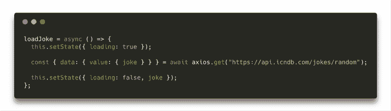

jokeGenerator.js*** ***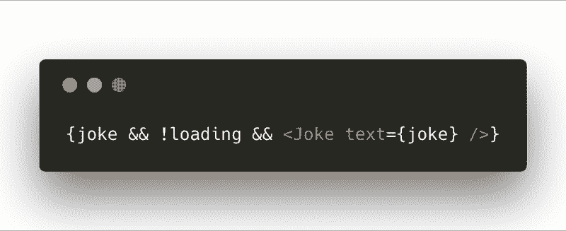

Insert into render() method — jokeGenerator.js*** 

***测试应该会再次通过。我们确信一切都像预期的那样工作…不是吗？请注意，我们从未**打开我们的浏览器并手动验证我们的应用程序是否工作**…然而，由于我们编写测试的方式([以便我们的测试类似于用户使用应用程序的方式](https://twitter.com/kentcdodds/status/977018512689455106)，我们几乎可以 100%确定我们的小应用程序工作正常。***

***作为最后一段代码，让我们将它添加到 index.js 并打开浏览器:)***

***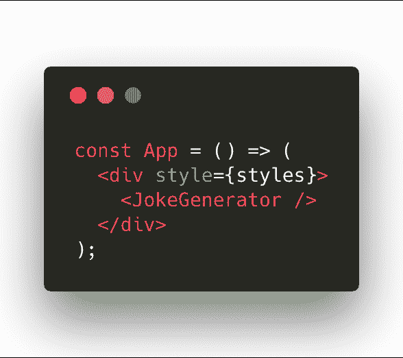

index.js*** 

### ***奖金***

***由于我们编写测试的方式，我们可以利用它们作为 **e2e** 测试**而不用添加一行代码！我们需要做的就是移除所有与 **MockAxios** 相关的线路，然后再次运行测试！他们现在将使用真正的外部 API。很酷，不是吗？:)*****

### ***摘要***

***项目的 [**CodeSandbox**](https://codesandbox.io/s/6yq6v1xk3) **上的所有代码都可用。**我真的鼓励你去熟悉一个完整的[**react-testing-library**](https://github.com/kentcdodds/react-testing-library)文档。你会发现更多的例子和使用案例。***

***我希望你喜欢我在 React，中的**TDD 快速指南，并且你今天学到了一些新东西。*****