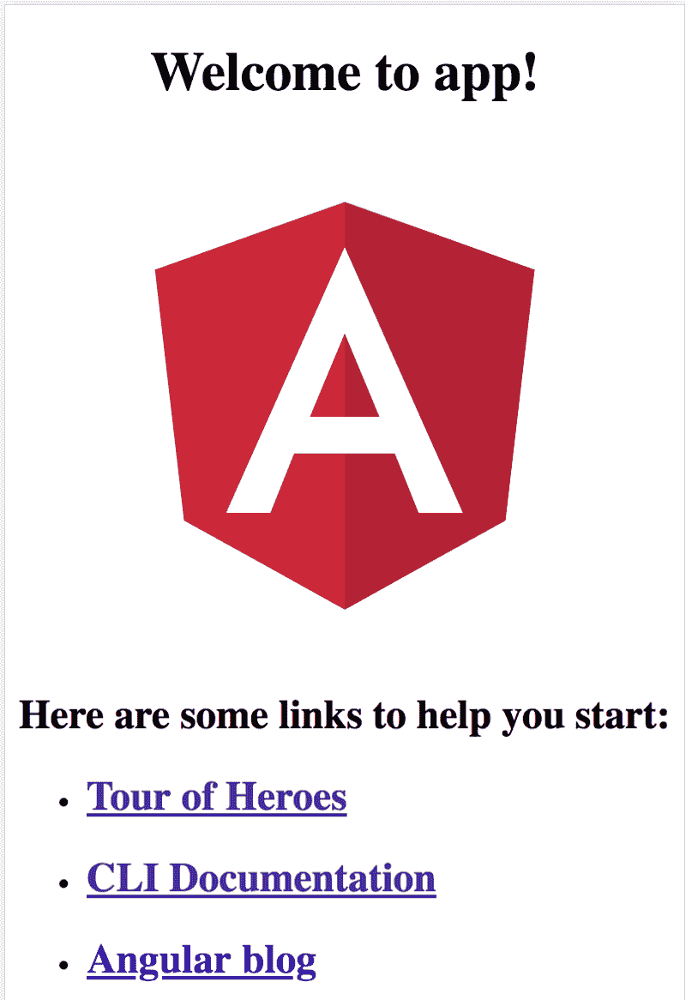
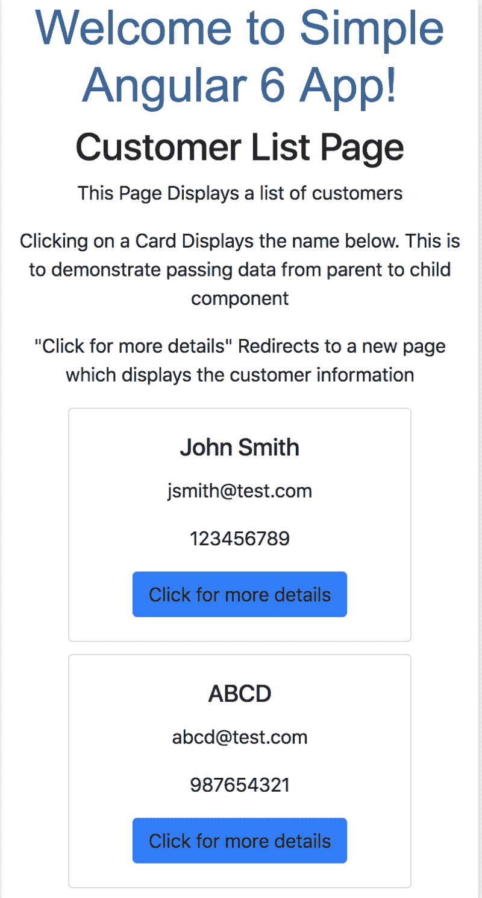

# 帮助您理解和创建 Angular 6 应用程序的快速指南

> 原文：<https://www.freecodecamp.org/news/quick-guide-to-understanding-and-creating-angular-6-apps-2f491dffca1c/>

这篇文章分为两部分:

第一部分演示了如何使用 Angular CLI 创建一个简单的 Angular 6 应用程序，并解释了项目结构。

第二部分解释了我在 GitHub 中发布的现有代码。这段代码演示了组件、服务、HTTP 客户端和组件间通信的使用。

### 第一部分

#### 如果 Node.js 不存在，请安装它

您需要 Node.js，因为 Angular 所需的库是使用节点包管理器(npm)下载的。参考[https://nodejs.org/en/](https://nodejs.org/en/)安装 Node.js

#### 安装 Angular CLI

Angular CLI 是 Angular 的命令行界面，对于快速创建 Angular 6 项目模板非常有用。使用以下命令全局安装 Angular CLI npm 软件包:

```
npm install -g @angular/cli
```

#### 创建项目

Angular CLI 有助于非常轻松地创建项目。为了创建项目，请使用以下命令。

```
ng new simple-angular6-app
```

**simple-angular6-app** 是项目的名称。现在你会注意到你看到一个名为**的文件夹。**该文件夹是已经创建的项目。为了测试是否一切都已正确设置，进入项目文件夹并使用以下命令运行应用程序:

```
cd simple-angular6-app
npm start
```

打开你的浏览器，点击下面的网址: **localhost:4200。**您应该能够看到您的应用程序正在运行。

该应用程序将如下所示:



#### 解释了基本文件夹结构

当您创建项目时，您会注意到它创建了一堆文件。在这里，我将列出一些您应该知道的重要文件和文件夹:

1.  **package.json:** 该文件包含所需的节点依赖列表。
2.  **src/styles.css** :这个文件拥有整个应用程序都可用的全局 css。
3.  **src/main.ts** :这是启动 Angular 应用程序的主文件(如代码所示，AppModule 在这里被引导)。这是分机。ts 代表 TypeScript。
4.  **src/index.html** :这是页面加载时与 main.ts 一起执行的第一个文件。
5.  **src/app/app.module.ts** :这是定义所有组件、提供者和模块的文件。如果不在这里定义它们，就不能在代码的其他地方使用它们。
6.  **src/app/app . component . html:**这是 angular app 的主要组件，其他所有组件通常都存在于这个组件内。 **src/app/app.component.ts** 是该组件的逻辑，**src/app/app . component . css**是该组件的 CSS。这个组件本身不做任何重要的逻辑，而是充当其他组件的容器。
7.  **dist** :这个文件夹是构建好的文件所在的位置。TypeScript 基本上被转换成 JavaScript，生成的文件在捆绑和缩小后存储在这里。(只有在应用程序生成后，此文件夹才会出现。简单的“npm 启动”不会创建此文件夹。)由于 web 浏览器只理解 JavaScript(至少目前如此)，因此有必要在部署代码之前将 TypeScript 转换为 JavaScript。要查看该文件夹，您可以在命令提示符下键入以下内容:

```
npm run build
```

还有其他几个文件，但是了解这些基本文件是一个很好的开始

#### 以打字打的文件

Angular 6 使用 TypeScript 来实现逻辑。那些使用过 Java 的人会发现 TypeScript 非常容易。TypeScript 是一种建立在 JavaScript 之上的语言，但是它是类型安全的，并且 TypeScript 反过来编译成 JavaScript

#### 创建组件和服务

1.  **组件**:Angular 中的一个组件有特定的功能。角度应用程序是通过使用各种组件构建的。Angular CLI 可用于轻松创建组件。语法是 **ng 生成组件【名称】。**使用以下命令创建一个名为“customers”的组件。

```
ng generate component customers
```

2.上面的命令在 **src/app** 中创建了一个名为 **customers** 的文件夹。创建的组件具有:

*   一个**customers.component.html**文件来决定模板(组件 UI 应该是什么样子)
*   一个 **customers.component.ts** 文件，其中包含逻辑
*   一个包含 css 内容的 **customers.component.css** 文件
*   以及一个用于单元测试的**customers . component . spec . ts**文件(该规范在本文中不予解释)。

3.**服务**:服务基本上提供任何组件都可以使用的功能。服务可以在所有组件之间共享，也可以局限于特定的组件(任何可重用的逻辑都可以放在服务中)。Angular CLI 也可以用来创建服务。语法是 **ng 生成服务【名称】。**使用以下命令创建一个名为“数据”的服务:

```
ng generate service data
```

4.该服务是在 **src/app 中创建的。**创建的服务有一个包含逻辑的 **data.service.ts** 文件和一个用于单元测试的 **data.service.spec.ts** 文件。

### **恭喜**？

您已经成功创建了您的第一个 Angular 6 应用程序，并且还学习了如何创建组件和服务。现在你也已经学会了 Angular 6 项目的基本文件夹结构。下一部分将解释现有的 GitHub 代码，演示如何使用组件、服务、HTTP 客户端以及组件之间的通信。

### 第二部分

#### 密码

这里将解释这个代码，所以将回购克隆到您的本地机器上。回购有关于如何克隆和设置它的说明。

#### 应用程序 URL

要查看最终的应用程序是什么样子，你可以点击这个 URL。这将让您很好地了解应用程序试图做什么。

该应用程序在移动屏幕上会是这样的:



#### 这个应用程序是做什么的？

该应用程序的目标是以卡片的形式显示客户列表。单击客户数据后，应用程序会切换到一个新页面，显示所选客户的详细信息。

#### 解释了应用程序结构

**创建的组件有:**

1.  **CustomersComponent** :对应 **src/app/customers** 文件夹。该组件用于显示客户列表。**customers . component . ts***文件有一个函数叫做 **ngOnInit()** 。每当加载组件时，都会调用该函数。所以这个函数可以用来加载组件的数据。该数据通过调用 **getCustomerList()** 函数来加载。 **getCustomerList()** 依次调用数据服务来获取所需的数据。*
2.  ***customerdetails 组件**:对应 **src/app/customerdetails** 文件夹。该组件显示单个选定客户的详细信息。**customer details . component . ts**文件具有 **ngOnInit()** 函数，可用于加载数据。为了加载数据，调用 **getCustomerDetails()** 函数。这个函数调用数据服务来获取所需的数据。但是这里您还会注意到发送给服务的 **routeParams.id** 的使用。 **routeParams** 用于从应用程序 URL 获取参数，而 **id** 参数用于找出需要为哪个客户加载细节。这将变得更加清楚，当我到达路由部分。*
3.  ***DisplayComponent** :对应 **src/app/display** 文件夹。该组件显示在**customers 组件中点击的客户名称。**(该组件的全部目的是演示父组件与子组件的通信。)这是 **CustomersComponent** *的子组件。*在**customers.component.html***你会注意到 **< app-display【客户】= selected customer></app-display>**。这使得 DisplayComponent 成为 **CustomersComponent** 的子组件。使用**【客户】**属性将数据从**客户组件**传递到**显示组件**。**

#### ****样本数据****

**样本数据存在于 **src/assets/samplejson** 文件夹中。**

****创建的服务有:****

1.  ****DataService** :对应 **src/app/data.service.ts** 。应用程序中使用的所有 JSON 都存储在 **src/assets/samplejson** 文件夹中。DataService 帮助使用 HTTP 请求从 **src/assets/samplejson** 文件夹中获取 JSON。在实际的应用程序中，该服务通过发出 HTTP 请求来帮助从 Rest API 或任何其他 API 获取数据。此服务由**客户组件**和**客户组件使用。****

****使用的模型类别有:****

1.  ****客户**:对应 **src/app/customer.ts** 。这是用于**客户组件**的模型类，用于定义列表中每个客户的结构。**
2.  ****CustomerDetails** :对应**src/app/customer details . ts**。这是用于**客户详细信息组件**的模型类，用于定义包含所有客户详细信息的结构。**

#### ****路由模块****

**路由模块在**src/app/app-routing . module . ts*中定义。然后通过在 app.component.html 添加`<router-outlet></router-outlet>`将该模块应用到应用程序中*** 。**

**应用程序中有两条路线:**

1.  ****/customers** :该 URL 显示客户列表并指向 **CustomersComponent。****
2.  ****/customerdetails/:id** :该 URL 显示每个客户的详细信息，并指向**customer details 组件*。*T5 这个 URL 中的 **id** 是 routeParam。这个 **id** 又被**CustomerdetailsComponent**用来知道要显示哪个客户的详细信息。例如， **/customerdetails/1** 将显示第一个客户的详细信息， **/customerdetails/3** 将显示第三个客户的详细信息，依此类推。****

### ****再次祝贺**？**

**现在你知道如何使用组件和服务了。您还知道如何进行 HTTP 调用，如何使用路由，以及如何传递 routeParams。**

**基本概念在这篇文章中已经涉及到了，希望对你有所帮助。**

### **参考资料:**

1.  **要了解更多关于 Angular 的信息，你可以查看 https://angular.io/guide/quickstart 的文档。该文档非常有助于理解角度的进一步概念**

#### **关于作者**

**我热爱科技，关注科技的进步。我也喜欢用我在技术领域的知识帮助别人。**

**请随时通过我的 LinkdIn 帐户与我联系[https://www.linkedin.com/in/aditya1811/](https://www.linkedin.com/in/aditya1811/)**

**你也可以在推特上关注我[https://twitter.com/adityasridhar18](https://twitter.com/adityasridhar18)**

**我的网站:[https://adityasridhar.com/](https://adityasridhar.com/)**

#### **我的其他相关帖子**

**[帮助您理解和创建 ReactJS 应用的快速指南](https://medium.freecodecamp.org/quick-guide-to-understanding-and-creating-reactjs-apps-8457ee8f7123)**

**[vue . js 快速介绍](https://medium.freecodecamp.org/a-quick-introduction-to-vue-js-72937ee8880d)**