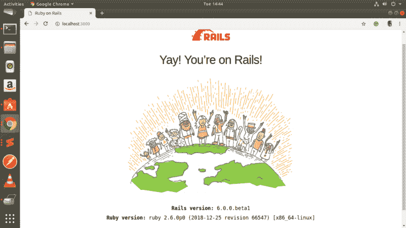
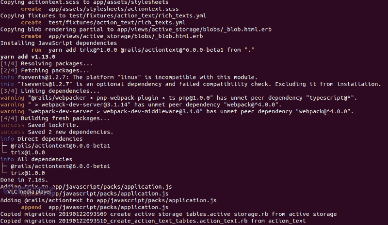
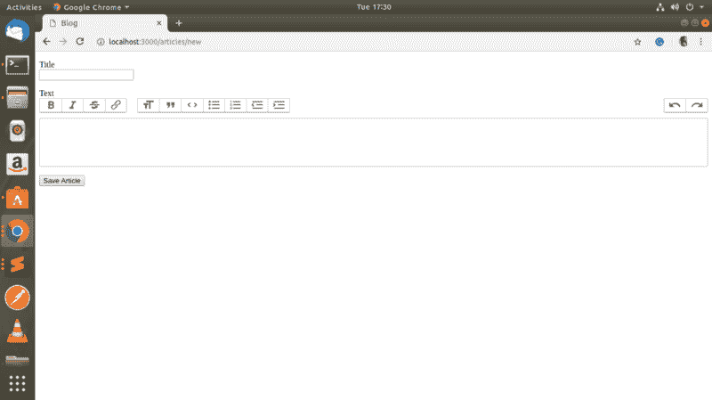
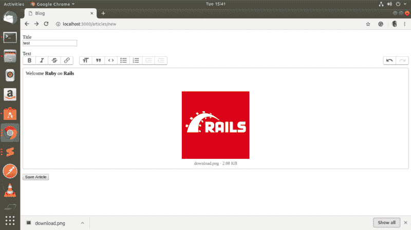
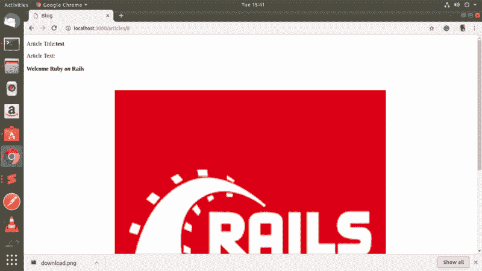

# 快速浏览 Rails 6.0 的操作文本

> 原文：<https://www.freecodecamp.org/news/quick-look-at-action-text-in-rails-6-0-12a8f9f7597f/>

阿伦·马修·库里安

# 快速浏览 Rails 6.0 的操作文本

[Rails 6.0](https://weblog.rubyonrails.org/) 快到了。稳定版将于 4 月 30 日发布。Rails 6.0 beta1 于 1 月 15 日发布。和 Rails 版本一样，Rails 6.0 也是一个动作包。新推出两大框架，[动作邮箱](https://weblog.rubyonrails.org/2018/12/13/introducing-action-mailbox-for-rails-6/)和[动作文本](https://weblog.rubyonrails.org/2018/10/3/introducing-action-text-for-rails-6/)。在这篇文章中，让我们通过在一个小应用程序中使用动作文本来快速浏览一下。


courtesy:wikipedia

#### 行动文本

动作文本允许我们为 Rails 带来丰富的文本内容和编辑。这意味着我们可以执行像格式化文本，嵌入图像，格式化链接，添加列表和其他类似编辑器的功能。

这是通过将 [Trix 编辑器](https://github.com/basecamp/trix)包含到框架中来实现的。Trix 编辑器生成的 RichText 内容保存在它自己的 RichText 模型中，该模型与应用程序中任何现有的活动记录模型相关联。所有嵌入的图像或其他附件都将使用[活动存储自动存储。](https://edgeguides.rubyonrails.org/active_storage_overview.html)

让我们开始构建我们的 Rails 应用程序，这将是一个博客应用程序。该应用程序是在 Rails 6.0 中创建的，因此 ruby 版本必须大于 2.5。

在终端类型中

```
rails new blog --edge
```

- edge 标志获取最新的 rails 版本或 rails 的 edge 版本。

操作文本要求安装 web packer 和 ActiveStorage。Rails 应用程序中已经存在活动存储。所以我们需要

```
gem “image_processing”, “~> 1.2” #uncomment from Gemfilegem ‘webpacker’
```

在宝石档案里。

现在快跑

```
bundle install.
```

接下来，我们需要创建一个 config/webpacker.yml:

```
bundle exec rails webpacker:install
```

现在让我们启动我们的 Rails 服务器。



太好了，让我们快速构建我们的应用程序。该应用程序将只有一个模型文章。

让我们为商品创建一个控制器:

```
rails g controller Articles index new create show edit update destroy — no-helper — no-test-frameworks
```

然后配置我们的路线:

```
Rails.application.routes.draw do resources :articlesend
```

接下来，我们需要创建我们的模型。我们的文章模型将有两个字段:它们是**标题**和**文本**。文本必须是接受 rtf 格式的字段。所以在迁移中，我们只需要添加标题字段。文本字段将由 ActionText 处理。

让我们生成模型

```
rails g model Articles title:string — no-test-framework
```

并运行迁移:

```
rails db:migrate
```

现在让我们添加 ActionText 部分。对于第一次运行

```
rails action_text:install
```

这将添加操作文本所需的所有依赖项。最值得注意的是，这将添加一个新文件**JavaScript/packs/application . js**和两个动作存储迁移。



使用再次运行迁移

```
rails db:migrate
```


现在我们可以添加模型的文本部分。转到 **app/models/article.rb** 并添加以下行

`has_rich_text **:text**`

文本是我们提供的字段名称。它可以是任何东西，如正文或内容等。

现在我们的模型变成了

```
class Article < ApplicationRecord has_rich_text :textend
```

在构建表单之前，让我们为创建文章创建控制器逻辑:

```
class ArticlesController < ApplicationController  def create   @article = Article.new(article_params)   @article.save   redirect_to @article end
```

```
 private def article_params   params.require(:article).permit(:title, :text) end
```

```
end
```

我们现在可以为博客创建表单了。在**app/views/articles/new . Rb**中添加以下表单代码:

```
<%= form_with scope: :article, url: articles_path, local: true do |form| %>
```

```
<p>    <%= form.label :title %><br>    <%= form.text_field :title %>  </p>   <p>    <%= form.label :text %><br>    <%= form.rich_text_area :text %>  </p>   <p>    <%= form.submit %>  </p><% end %>
```

请注意，对于文本字段，我们使用的是由操作文本提供的 **form.rich_text_area** 和。

让我们呈现我们的页面:



厉害！！

我们现在有一个很棒的文本编辑器来创建我们的文章。

在我们开始使用编辑器之前，让我们快速实现博客的 **show** 功能，这样我们就可以看到我们创建的文章。

在**app/controllers/articles _ controller . Rb**中增加以下功能:

```
 def show   @article = Article.find(params[:id]) end
```

此外，我们需要为此创建一个视图。

创建文件**app/views/articles/show . html . erb**并添加以下代码:

```
<p>Article Title:<strong><%= @article.title %></strong></p><p>Article Text:<strong><%= @article.text %></strong></p>
```

```
<%= link_to ‘Create new’,new_article_path %>
```

就是这样。我们的应用程序完成了。现在让我们检查 ActionText 提供的文本编辑器中的各种可用特性。



我们可以看到，ActionText 提供了普通富文本编辑器的几乎所有功能，比如将文本格式化为粗体、斜体、添加删除线、引号、链接、拖放图像等。

保存后，我们可以在显示页面看到保存的文章。



太好了！

这是一个非常小的例子，展示了 ActionText 的潜力。希望对你有帮助。一定要试一试。

绝大多数网络应用都以某种方式处理丰富的内容。所以我相信 Rails 的这个新特性可以让很多开发者的生活变得更轻松。

向 DHH 和所有幕后的牛人致敬。

[https://github.com/amkurian/Rails-6.0_action_text_demo](https://github.com/amkurian/Rails-6.0_action_text_demo)

一些有用的链接:

[**动作文本概述- Ruby on Rails 指南**](https://edgeguides.rubyonrails.org/action_text_overview.html)
[*动作文本概述本指南为您提供了开始处理丰富文本内容所需的一切。之后…*edgeguides.rubyonrails.org](https://edgeguides.rubyonrails.org/action_text_overview.html)