# 如何用 Node.js 和 AWS 快速创建无服务器 RESTful API

> 原文：<https://www.freecodecamp.org/news/quickly-create-a-serverless-restful-api-with-nodejs-and-aws-lambda-api-gateway-and-a6be891cc16a/>

马克·霍普森

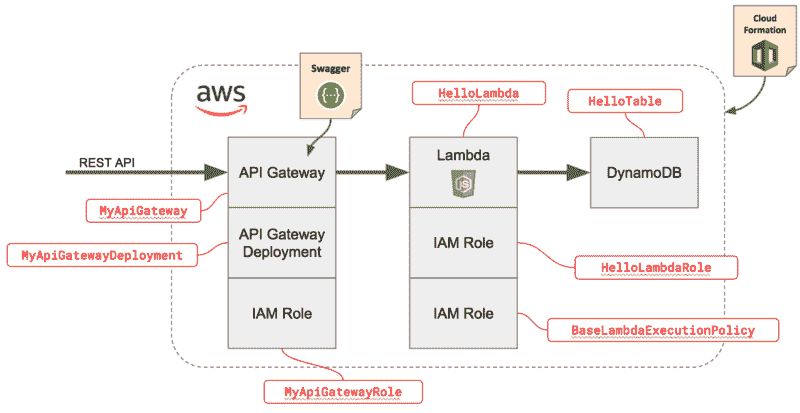

# 如何用 Node.js 和 AWS 快速创建无服务器 RESTful API

在这篇初学者指南中，我们将简要描述“无服务器”软件架构，然后在几分钟内使用 AWS、Node.js 和 Swagger 创建一个 RESTful API。

### 那么什么是无服务器呢？

术语无服务器(也称为功能即服务)描述了一种允许代码部署到第三方供应商(如 Azure 或 AWS)的短暂无状态容器并在其上运行的架构。

#### 无服务器优势

*   **运营管理减少。**无服务器架构允许开发人员专注于编写代码，而不必担心配置和管理代码运行的基础设施。
*   **简单、灵活的扩展。**由于无服务器“函数”(您的无服务器应用程序)是无状态的，并且总是由事件(如 HTTP 请求)调用，因此您可以根据需要运行任意多或任意少的函数。更多的调用意味着更多的容器。根据流量的规模和形状，这可能非常划算，因为无服务器功能通常是按调用计费的。

#### 无服务器缺点

*   初始请求的延迟(称为“冷启动”)。如果无服务器功能处于非活动状态(已经有一段时间没有运行了)，那么处理第一次调用可能需要额外的时间来完成，因为容器必须进行初始化(即分配主机、加载代码等等)。
*   **缺乏系统控制**。由于您的代码运行在由供应商管理的环境中，您将无法控制系统升级，或者您的代码库之外的依赖性。

### 什么是云的形成？

CloudFormation 是 Amazon 提供的一项服务，允许您使用模板构建 AWS 资源。模板是一个配置文件(YML 或 JSON ),用于提供所有 AWS 资源，如 EC2 实例、DynamoDB 表、IAM 角色和权限或任何其他资源。

### 开始编码吧！

在本教程中，我们将使用以下两个端点制作一个简单的 RESTful API:

#### POST /users/${userId}/hello

请求体将保存在 DynamoDB 表中。在本教程中，请求体必须具有以下结构:`{ "email": "any@email.com" }`

#### GET /users/${userId}/hello

响应将包含 POST 请求中设置的`"email"`的值。

A simplified system architecture for what we’re going to build.

#### 第一步:克隆回购协议

本教程需要两个文件:`index.js`(Lambda 函数的 NodeJS 代码)和`stack.yml`(cloud formation 堆栈模板)。要获得这些文件，请访问[这个](https://github.com/markhopson/cloudformation-serverless-api) Github 链接。

#### 步骤 2:检查 stack.yml 文件

请注意回购中的`stack.yml`，因为 CloudFormation 将使用它来创建我们的应用程序所需的一切。

下面是我们的`stack.yml`将需要创建的所有 AWS 资源的详细图表。YML 中使用的名称在红框中。

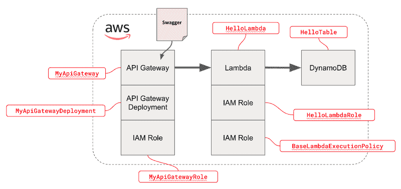

All the AWS resources (grey boxes) that will be provisioned by our `stack.yml` CloudFormation file.

#### 步骤 3:上传你的云模板

检查完 YML 后，前往[该链接](https://console.aws.amazon.com/cloudformation)，点击**创建堆栈**按钮。选择**上传模板到亚马逊 S3** 并上传`stack.yml`文件。

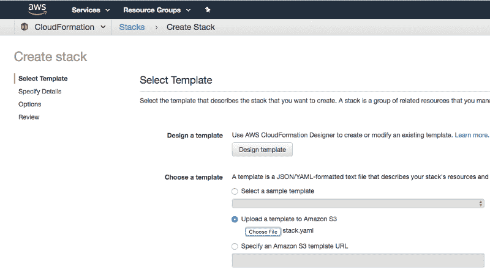

Create your CloudFormation stack by first uploading our `stack.yml` template.

在下一个屏幕上，您将被要求选择一个名为的**堆栈(可以是任何名称)。之后，点击下一步，选择**我承认 AWS CloudFormation 可能会创建 IAM 资源**，再次点击下一步**。****

此时，您的堆栈已经创建完毕。在堆栈页面上等待一分钟，直到您的堆栈状态变为 **CREATE_COMPLETE** 。

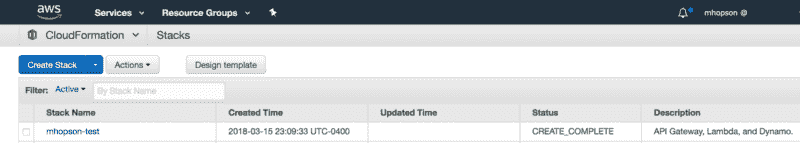

The CloudFormation Stacks listing page with status.

#### 第四步:找到你的由云生成的 Lambda

一旦你的栈完成，去这里找到你栈的新 Lambda [。你的 Lambda 函数名应该类似于**$ { stack name }-hello Lambda-XXXX**。](https://console.aws.amazon.com/lambda)

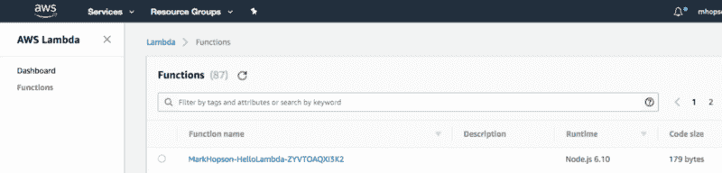

Lambda listing page

#### 步骤 5:将代码部署(复制并粘贴)到 Lambda 中

一旦你找到你的 Lambda，点击它了解更多详情。然后滚动到**功能代码**部分，将**代码输入类型**更改为**编辑内联代码**，然后打开`index.js`(来自 repo)并复制到代码编辑器中。点击**保存**。

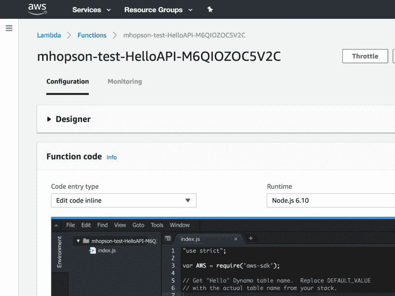

My Lambda details page with in-line code editor

此时，您的代码已经“部署”到 Lambda，剩下的就是部署我们的 API 网关，这样我们就可以向它发送 HTTP 请求。

#### 步骤 6:找到由 CloudFormation 创建的 API 网关

在这里找到由你的 CloudFormation 模板[创建的 API 网关。您的 API 网关的名称应该类似于**$ { stack name }-my apgateway**。](https://console.aws.amazon.com/apigateway)

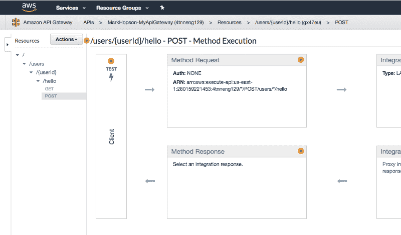

The details page for the /hello POST endpoint

#### 步骤 7:测试你的 API 网关是否连接到 Lambda

在你找到你的 API 网关后，我们可以通过选择**/用户**下的 **POST** 选项，然后点击**测试，来测试是否一切正常。**

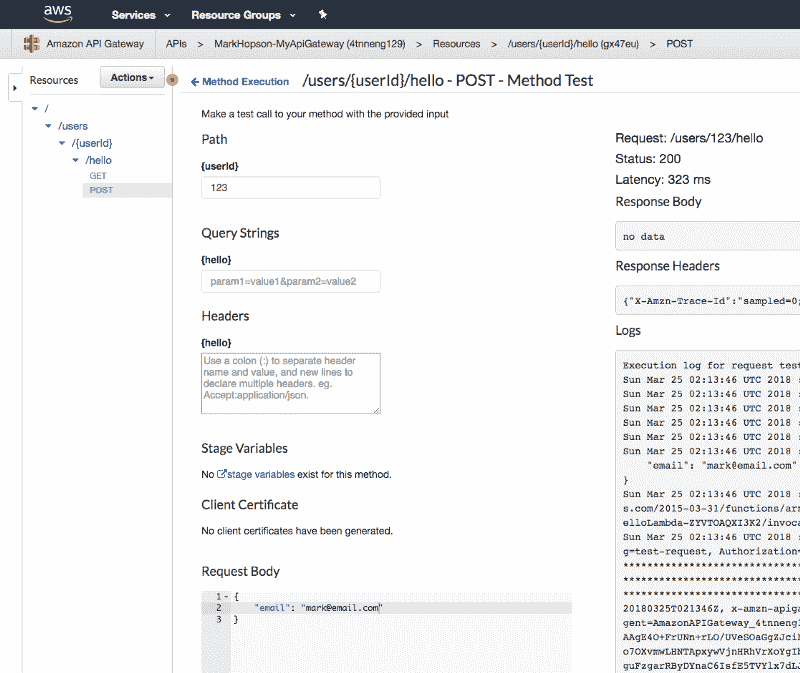

The Test page for the /hello POST endpoint after a successful test request.

在测试页面上，将 **userId** 设置为 123，将**请求体**设置为如下，点击**测试**。如果一切正常，**状态**应该是 **200** 没有数据。

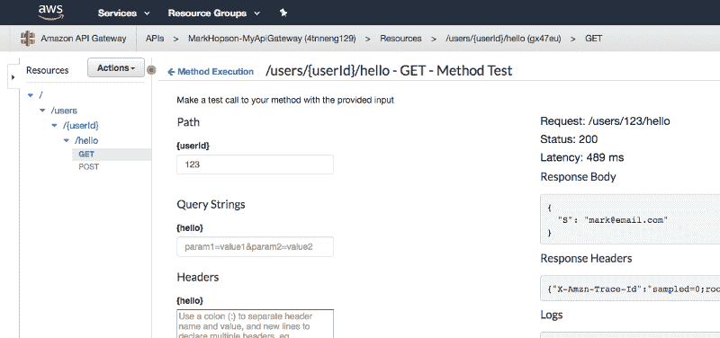

The Test page for the /hello GET endpoint after a successful test request.

在测试完 POST 端点之后，您可以通过转到/hello GET 测试页面并尝试一个请求来检查您的数据是否被保存(记住将 **userId** 设置为 123)。响应正文应该包含 POST 测试的请求正文(见上文)。

现在，您已经验证了您的 API Gateway、Lambda 和 DynamoDB 是连接在一起的，您可以部署您的 API Gateway，这样您就可以从互联网上访问它。

#### 步骤 8:部署您的 API 网关

要部署您的 API，请单击 Actions 菜单并选择 Deploy API。一旦出现确认弹出窗口，将**部署阶段**设置为**生产**，然后点击**部署**。

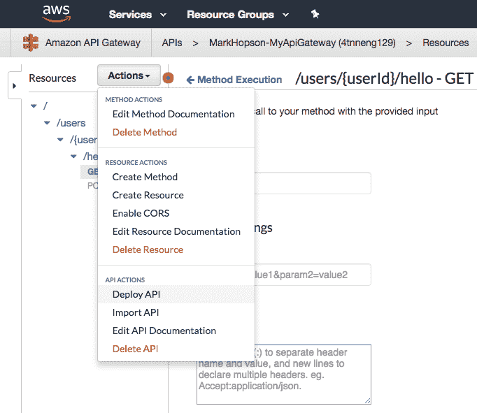

The Deploy API option un the Actions dropdown.

一旦你部署了你的 API，你将被转到**产品**的**阶段**页面。在这里，您将在**调用 URL** 旁边的蓝色突出显示区域中找到 API 网关的域。

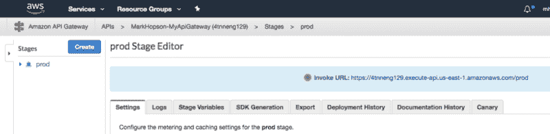

Find the public URL (Invoke URL) for your API Gateway in the big blue box.

使用上面截图中的 URL，我应该能够在我的 web 浏览器中发送一个 **GET /users/123/hello** 请求，如下所示。

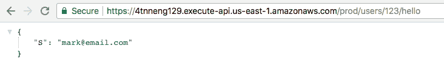

A successful request to my Serverless API from the outside world

就是这样！您现在有了一个无服务器的 RESTful API，它是可伸缩的、可靠的，不需要打补丁或供应，空闲时也不需要花钱。我希望你喜欢这个教程，如果你有任何反馈，请在下面的评论中留下。谢谢！

### 其他注释和标注

*   API Gateway 的路由配置被嵌入到`stack.yml`中的 API Gateway (MyApiGateway)配置中，这使得 YML 变得更加庞大。
*   HelloLambda 配置页面中的环境变量包含连接到 HelloTable DynamoDB 表所需的信息。
*   AWS-SDK 与每个 Lambda 函数捆绑在一起，所以我们可以在没有`package.json`的情况下使用`require('aws-sdk')`。非常得心应手！
*   您可以通过 AWS CLI 部署代码，而不是将 NodeJS 代码复制并粘贴到 Lambda 细节页面内的嵌入式编辑器中。为了简单起见，我们复制和粘贴。
*   请注意，CloudFormation 堆栈模板本质上极其冗长。我保证不只是我和我的`stack.yml`。
*   HelloTable DynamoDB 表的主分区键是 **userId**
*   来自 u/[**SalamiJack**](https://www.reddit.com/user/SalamiJack)**::**值得叫出来的是，API Gateway + Lambda 的性能，即使对于一个预热过的，简单的 Lambda 来说，也是相当糟糕的。预计任何时候都有 80-150 毫秒的响应时间。”

*最初发布于 2018 年 3 月 26 日[medium.com](https://medium.com/@markhopson/how-to-create-a-serverless-restful-api-with-nodejs-and-aws-9aab63c636db)。*