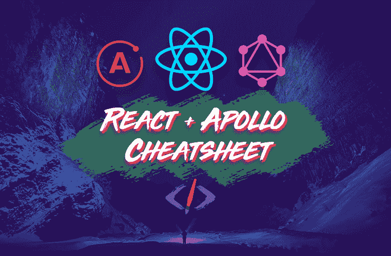

# 2020 年 React + Apollo 教程(真实世界示例)

> 原文：<https://www.freecodecamp.org/news/react-apollo-client-2020-tutorial/>

如果你想用 React 和 GraphQL 构建应用，Apollo 是你应该使用的库。

我已经整理了一个全面的备忘单，它涵盖了 Apollo 库中的所有核心概念，向您展示了如何从前到后使用 React。

### 想要你自己的副本吗？？

您可以在这里 获取 PDF 备忘单 **[(耗时 5 秒)。](https://reedbarger.com/resources/react-apollo-2020/)**

以下是获取可下载版本的一些快速制胜之道:

*   快速查阅，以便随时查阅
*   基于真实项目的大量有用的代码片段
*   您可以随时随地离线阅读本指南。在火车上，在你的办公桌前，排队时——任何地方。

### 更喜欢视频课？？

这份备忘单的很大一部分是基于 React + GraphQL 2020 速成班中内置的应用程序。

如果你想要更多的实践视频课程，以及了解如何用 React、GraphQL 和 Apollo 构建应用，你可以在这里观看课程。

> 注意:本备忘单假设您熟悉 React 和 GraphQL。如果你需要快速复习 GraphQL 以及如何编写它，一个很好的资源是 GraphQL 官方网站。

## 目录

### 入门指南

*   什么是阿波罗，我们为什么需要它？
*   [阿波罗客户端设置](#apolloclientbasicsetup)
*   [创建新的 Apollo 客户端](#creatinganewapolloclientbasicsetup)
*   [提供客户端反应组件](#providingtheclienttoreactcomponents)
*   [直接使用客户端](#usingtheclientdirectly)
*   将 GraphQL 写入。带有 gql 的 js 文件

### 核心阿波罗反应钩

*   [使用查询挂钩](#usequeryhook)
*   [无用查询挂钩](#uselazyqueryhook)
*   [使用变异挂钩](#usemutationhook)
*   [使用订阅挂钩](#usesubscriptionhook)

### 基本食谱

*   [手动设置获取策略](#manuallysettingthefetchpolicy)
*   [发生突变时更新缓存](#updatingthecacheuponamutation)
*   [用 useQuery 重新提取查询](#refetchingquerieswithusequery)
*   [使用 useMutation 重新提取查询](#refetchingquerieswithusemutation)
*   [使用 useApolloClient 访问客户端](#usingtheclientwithuseapolloclient)

### 阿波罗是什么，我们为什么需要它？

Apollo 是一个库，它汇集了两种非常有用的技术，用于构建 web 和移动应用程序:React 和 GraphQL。

React 是为用 JavaScript 创造伟大的用户体验而设计的。GraphQL 是一种非常简单明了的声明性新语言，可以更容易、更高效地获取和更改数据，无论是来自数据库还是静态文件。

阿波罗是将这两种工具结合在一起的粘合剂。此外，它为我们提供了许多自定义的 React 挂钩和功能，使我们能够编写 GraphQL 操作并使用 JavaScript 代码执行它们，从而使 React 和 GraphQL 的工作变得更加容易。

我们将在本指南的整个课程中深入介绍这些功能。

### Apollo 客户端基本设置

如果您使用 React 模板(如 Create React App)开始一个项目，您需要安装以下组件作为您的基础依赖项，以启动并运行 Apollo 客户端:

```
// with npm:
npm i @apollo/react-hooks apollo-boost graphql

// with yarn:
yarn add @apollo/react-hooks apollo-boost graphql 
```

给我们提供了 React 挂钩，使我们能够更好地执行操作和与 Apollo 客户端合作

帮助我们设置客户端并解析我们的 GraphQL 操作

`graphql`还负责解析 GraphQL 操作(和 gql 一起)

### Apollo 客户端+订阅设置

为了使用所有方式的 GraphQL 操作(查询、变异和订阅)，我们需要安装比仅仅`apollo-boost`更具体的依赖项:

```
// with npm:
npm i @apollo/react-hooks apollo-client graphql graphql-tag apollo-cache-inmemory apollo-link-ws

// with yarn:
yarn add @apollo/react-hooks apollo-client graphql graphql-tag apollo-cache-inmemory apollo-link-ws 
```

`apollo-client`直接给我们客户端，而不是从`apollo-boost`

`graphql-tag`并入`apollo-boost`，但不包含在`apollo-client`中

需要`apollo-cache-inmemory`来设置我们自己的缓存(相比之下，`apollo-boost`会自动设置)

`apollo-link-ws`是通过 websockets 进行通信所必需的，这是订阅所需要的

### 创建新的 Apollo 客户端(基本设置)

创建 Apollo 客户机最简单的设置是实例化一个新的客户机，并提供`uri`属性，这将是您的 GraphQL 端点:

```
import ApolloClient from "apollo-boost";

const client = new ApolloClient({
  uri: "https://your-graphql-endpoint.com/api/graphql",
}); 
```

开发它是为了让创建 Apollo 客户端这样的事情变得尽可能简单。然而，它目前缺少的是对基于 websocket 连接的 GraphQL 订阅的支持。

默认情况下，它通过 http 连接执行操作(正如您可以通过上面提供的 uri 看到的)。

简而言之，如果你只需要在你的应用程序中执行查询和突变，使用`apollo-boost`来创建你的客户端。

默认情况下，它设置了一个内存缓存，这有助于在本地存储我们的应用程序数据。我们可以从缓存中读写数据，以避免在数据更新后执行查询。稍后我们将介绍如何做到这一点。

### 创建新的 Apollo 客户端(+订阅设置)

订阅有助于在我们的应用程序中更容易地显示数据更改(通过突变)的结果。

一般来说，我们使用订阅作为一种改进的查询。订阅使用 websocket 连接来“订阅”更新和数据，使新的或更新的数据能够立即显示给我们的用户，而不必重新执行查询或更新缓存。

```
import ApolloClient from "apollo-client";
import { WebSocketLink } from "apollo-link-ws";
import { InMemoryCache } from "apollo-cache-inmemory";

const client = new ApolloClient({
  link: new WebSocketLink({
    uri: "wss://your-graphql-endpoint.com/v1/graphql",
    options: {
      reconnect: true,
      connectionParams: {
        headers: {
          Authorization: "Bearer yourauthtoken",
        },
      },
    },
  }),
  cache: new InMemoryCache(),
}); 
```

### 为客户端提供反应组件

在创建一个新的客户端之后，为了能够在我们的组件中使用它来执行所有可用的 GraphQL 操作，将它传递给所有组件是非常重要的。

使用 React Context 向整个组件树提供客户端，但是我们没有创建自己的上下文，而是从`@apollo/react-hooks`导入一个名为`ApolloProvider`的特殊上下文提供者。我们可以看到它与常规 React 上下文的不同之处，因为它有一个特殊的属性`client`，专门用来接受创建的客户端。

请注意，所有这些设置都应该在 index.js 或 App.js 文件中完成(无论您的路由声明在哪里),以便提供者可以包装您的所有组件。

```
import { ApolloProvider } from "@apollo/react-hooks";

const rootElement = document.getElementById("root");
ReactDOM.render(
  <React.StrictMode>
    <ApolloProvider client={client}>
      <BrowserRouter>
        <Switch>
          <Route exact path="/" component={App} />
          <Route exact path="/new" component={NewPost} />
          <Route exact path="/edit/:id" component={EditPost} />
        </Switch>
      </BrowserRouter>
    </ApolloProvider>
  </React.StrictMode>,
  rootElement
); 
```

### 直接使用客户端

Apollo 客户机是这个库最重要的部分，因为它负责执行我们想用 React 执行的所有 GraphQL 操作。

我们可以直接使用创建的客户端来执行我们喜欢的任何操作。它有对应于查询(`client.query()`)、突变(`client.mutate()`)和订阅(`client.subscribe()`)的方法。

每种方法都接受一个对象及其相应的属性:

```
// executing queries
client
  .query({
    query: GET_POSTS,
    variables: { limit: 5 },
  })
  .then((response) => console.log(response.data))
  .catch((err) => console.error(err));

// executing mutations
client
  .mutate({
    mutation: CREATE_POST,
    variables: { title: "Hello", body: "World" },
  })
  .then((response) => console.log(response.data))
  .catch((err) => console.error(err));

// executing subscriptions
client
  .subscribe({
    subscription: GET_POST,
    variables: { id: "8883346c-6dc3-4753-95da-0cc0df750721" },
  })
  .then((response) => console.log(response.data))
  .catch((err) => console.error(err)); 
```

然而，直接使用客户端可能有点棘手，因为在发出请求时，它会返回一个承诺。为了解析每个承诺，我们或者需要如上所述的`.then()`和`.catch()`回调，或者在用`async`关键字声明的函数中`await`每个承诺。

### 在中编写 GraphQL 操作。js 文件

注意上面我没有指定变量`GET_POSTS`、`CREATE_POST`和`GET_POST`的内容。

它们是用 GraphQL 语法编写的操作，分别指定如何执行查询、变异和订阅。它们是我们在任何 GraphiQL 控制台中用来获取和更改数据的内容。

然而，这里的问题是我们不能用 JavaScript 编写和执行 GraphQL 指令。js)文件，就像我们的 React 代码必须放在其中一样。

为了解析 GraphQL 操作，我们使用一个称为标记模板文字的特殊函数来将它们表示为 JavaScript 字符串。这个函数被命名为`gql`。

```
 // if using apollo-boost
import { gql } from "apollo-boost";
// else, you can use a dedicated package graphql-tag
import gql from "graphql-tag";

// query
const GET_POSTS = gql`
  query GetPosts($limit: Int) {
    posts(limit: $limit) {
      id
      body
      title
      createdAt
    }
  }
`;

// mutation
const CREATE_POST = gql`
  mutation CreatePost($title: String!, $body: String!) {
    insert_posts(objects: { title: $title, body: $body }) {
      affected_rows
    }
  }
`;

// subscription
const GET_POST = gql`
  subscription GetPost($id: uuid!) {
    posts(where: { id: { _eq: $id } }) {
      id
      body
      title
      createdAt
    }
  }
`; 
```

### 使用查询挂钩

考虑到它不返回需要解决的承诺，`useQuery`钩子可以说是执行 GraphQL 查询最方便的方式。

它在任何函数组件的顶部被调用(所有钩子都应该如此)，并作为第一个必需的参数接收——一个用`gql`解析的查询。

当呈现一个组件时，如果有需要立即执行的查询，例如用户希望在页面加载时立即看到的数据列表，那么最好使用它。

返回一个对象，从中我们可以很容易地析构我们需要的值。在执行查询时，我们在获取数据的每个组件中都需要使用三个主要值。他们是`loading`、`error`和`data`。

```
const GET_POSTS = gql`
  query GetPosts($limit: Int) {
    posts(limit: $limit) {
      id
      body
      title
      createdAt
    }
  }
`;

function App() {
  const { loading, error, data } = useQuery(GET_POSTS, {
    variables: { limit: 5 },
  });

  if (loading) return <div>Loading...</div>;
  if (error) return <div>Error!</div>;

  return data.posts.map((post) => <Post key={post.id} post={post} />);
} 
```

在我们能够显示我们正在获取的数据之前，我们需要处理我们正在加载的时候(当`loading`被设置为 true)以及我们正在尝试获取数据的时候。

此时，我们显示一个带有文本“Loading”或加载微调器的 div。我们还需要处理获取查询时出现错误的可能性，例如是否存在网络错误，或者我们是否在编写查询时出错(语法错误)。

一旦我们完成加载并且没有错误，我们就可以在我们的组件中使用我们的数据，通常显示给我们的用户(就像我们在上面的例子中一样)。

我们可以从`useQuery`返回的对象中析构其他值，但是在执行`useQuery`的几乎每个组件中都需要`loading`、`error`和`data`。你可以在这里看到我们从 useQuery [得到的所有数据的完整列表。](https://www.apollographql.com/docs/react/api/react-hooks/#result)

### use laszy 查询挂钩

`useLazyQuery`钩子提供了另一种执行查询的方法，这种方法旨在组件呈现后的某个时间执行，或者响应给定的数据更改。

`useLazyQuery`对于在任何未知时间点发生的事情非常有用，比如响应用户的搜索操作。

```
function Search() {
  const [query, setQuery] = React.useState("");
  const [searchPosts, { data }] = useLazyQuery(SEARCH_POSTS, {
    variables: { query: `%${query}%` },
  });
  const [results, setResults] = React.useState([]);

  React.useEffect(() => {
    if (!query) return;
    // function for executing query doesn't return a promise
    searchPosts();
    if (data) {
      setResults(data.posts);
    }
  }, [query, data, searchPosts]);

  if (called && loading) return <div>Loading...</div>;

  return results.map((result) => (
    <SearchResult key={result.id} result={result} />
  ));
} 
```

`useLazyQuery`不同于`useQuery`，首先在于从钩子返回的是什么。它返回一个我们可以析构的数组，而不是一个对象。

因为我们希望在组件安装后的某个时候执行这个查询，所以我们可以析构的第一个元素是一个函数，当您选择执行这个查询时，可以调用这个函数。在上面的例子中，这个查询函数被命名为`searchPosts`。

数组中第二个被析构的值是一个对象，我们可以在其上使用对象析构，并从中获得所有与从`useQuery`中获得的相同的
属性，比如`loading`、`error`和`data`。

我们还得到一个名为`called`，
的重要属性，它告诉我们是否实际调用了这个函数来执行我们的查询。
在这种情况下，如果`called`为真，`loading`为真，我们要
返回“正在加载……”而不是我们的实际数据，因为正在等待数据返回。这就是`useLazyQuery`如何在没有任何承诺的情况下以同步方式处理获取数据。

注意，我们再次将查询操作所需的变量作为属性 variables 传递给第二个参数。但是，如果需要，我们可以将这些变量传递给提供给查询函数本身的对象。

### 使用变异挂钩

既然我们知道了如何执行懒惰查询，我们就知道如何使用`useMutation`钩子。

像`useLazyQuery`钩子一样，它返回一个数组，我们可以把它析构成两个元素。在第一个元素中，我们获得了一个函数，在本例中，我们可以调用它来执行我们的变异操作。对于下一个元素，我们可以再次析构一个返回给我们的对象`loading`、`error`和`data`。

```
import { useMutation } from "@apollo/react-hooks";
import { gql } from "apollo-boost";

const CREATE_POST = gql`
  mutation CreatePost($title: String!, $body: String!) {
    insert_posts(objects: { body: $body, title: $title }) {
      affected_rows
    }
  }
`;

function NewPost() {
  const [title, setTitle] = React.useState("");
  const [body, setBody] = React.useState("");
  const [createPost, { loading, error }] = useMutation(CREATE_POST);

  function handleCreatePost(event) {
    event.preventDefault();
    // the mutate function also doesn't return a promise
    createPost({ variables: { title, body } });
  }

  return (
    <div>
      <h1>New Post</h2>
      <form onSubmit={handleCreatePost}>
        <input onChange={(event) => setTitle(event.target.value)} />
        <textarea onChange={(event) => setBody(event.target.value)} />
        <button disabled={loading} type="submit">
          Submit
        </button>
        {error && <p>{error.message}</p>}
      </form>
    </div>
  );
} 
```

然而，与查询不同，我们不使用`loading`或`error`来有条件地呈现某些内容。我们通常在这样的情况下使用`loading`,比如当我们提交一个表单以防止它被多次提交，以避免不必要的执行相同的变异(正如你在上面的例子中看到的)。

我们使用`error`向用户展示我们的突变出了什么问题。例如，如果我们的变异没有提供一些必需的值，我们可以很容易地使用错误数据在页面中有条件地呈现一条错误消息，这样用户就有希望修复错误。

与将变量传递给第二个参数`useMutation`相比，当某些事情发生时，我们可以访问几个有用的回调函数，比如突变完成时和出现错误时。这些回调被命名为`onCompleted`和`onError`。

`onCompleted`回调让我们能够访问返回的变异数据，并且在变异完成时做一些事情非常有帮助，比如转到不同的页面。当变异有问题时，`onError`回调给我们返回错误，并给我们其他处理错误的模式。

```
const [createPost, { loading, error }] = useMutation(CREATE_POST, {
  onCompleted: (data) => console.log("Data from mutation", data),
  onError: (error) => console.error("Error creating a post", error),
}); 
```

### 使用订阅挂钩

useSubscription 挂钩的工作方式与 useQuery 挂钩类似。

useSubscription 返回一个我们可以析构的对象，它包含相同的属性、加载、数据和错误。

当组件呈现时，它立即执行我们的订阅。这意味着我们需要处理加载和错误状态，然后才显示/使用我们的数据。

```
import { useSubscription } from "@apollo/react-hooks";
import gql from "graphql-tag";

const GET_POST = gql`
  subscription GetPost($id: uuid!) {
    posts(where: { id: { _eq: $id } }) {
      id
      body
      title
      createdAt
    }
  }
`;

// where id comes from route params -> /post/:id
function PostPage({ id }) {
  const { loading, error, data } = useSubscription(GET_POST, {
    variables: { id },
    // shouldResubscribe: true (default: false)
    // onSubscriptionData: data => console.log('new data', data)
    // fetchPolicy: 'network-only' (default: 'cache-first')
  });

  if (loading) return <div>Loading...</div>;
  if (error) return <div>Error!</div>;

  const post = data.posts[0];

  return (
    <div>
      <h1>{post.title}</h1>
      <p>{post.body}</p>
    </div>
  );
} 
```

就像 useQuery、useLazyQuery 和 useMutation 一样，useSubscription 接受`variables`作为第二个参数上提供的属性。

然而，它也接受一些有用的属性，比如`shouldResubscribe`。这是一个布尔值，当我们的道具改变时，它将允许我们的订阅自动重新订阅。这在我们将变量传递给我们的 you subscription hub props 时非常有用，因为我们知道这些变量会发生变化。

此外，我们有一个名为`onSubscriptionData`的回调函数，它使我们能够在订阅挂钩接收到新数据时调用函数。最后，我们可以设置`fetchPolicy`，默认为‘缓存优先’。

### 手动设置获取策略

Apollo 非常有用的一点是它自带缓存，用来管理我们从 GraphQL 端点查询的数据。

然而，有时我们发现由于这种缓存，UI 中的内容并没有按照我们想要的方式更新。

在许多情况下，我们不会这样做，例如在下面的例子中，我们在编辑页面上编辑帖子，然后在编辑完帖子后，我们导航到主页，在所有帖子的列表中查看它，但我们看到的是旧数据:

```
// route: /edit/:postId
function EditPost({ id }) {
  const { loading, data } = useQuery(GET_POST, { variables: { id } });
  const [title, setTitle] = React.useState(loading ? data?.posts[0].title : "");
  const [body, setBody] = React.useState(loading ? data?.posts[0].body : "");
  const [updatePost] = useMutation(UPDATE_POST, {
    // after updating the post, we go to the home page
    onCompleted: () => history.push("/"),
  });

  function handleUpdatePost(event) {
    event.preventDefault();
    updatePost({ variables: { title, body, id } });
  }

  return (
    <form onSubmit={handleUpdatePost}>
      <input
        onChange={(event) => setTitle(event.target.value)}
        defaultValue={title}
      />
      <input
        onChange={(event) => setBody(event.target.value)}
        defaultValue={body}
      />
      <button type="submit">Submit</button>
    </form>
  );
}

// route: / (homepage)
function App() {
  const { loading, error, data } = useQuery(GET_POSTS, {
    variables: { limit: 5 },
  });

  if (loading) return <div>Loading...</div>;
  if (error) return <div>Error!</div>;

  // updated post not displayed, still see old data
  return data.posts.map((post) => <Post key={post.id} post={post} />);
} 
```

这不仅是因为 Apollo 缓存，还因为查询应该获取什么数据的指令。我们可以通过使用`fetchPolicy`属性来改变获取查询的方式。

默认情况下，`fetchPolicy`设置为“缓存优先”。它将尝试查看缓存来获取我们的数据，而不是从网络获取。

解决看不到新数据这一问题的简单方法是更改获取策略。但是，从性能的角度来看，这种方法并不理想，因为它需要发出一个额外的请求(直接使用缓存并不需要，因为它是本地数据)。

下面列出了许多不同的回迁策略选项:

```
{
  fetchPolicy: "cache-first"; // default
  /* 
    cache-and-network
    cache-first
    cache-only
    network-only
    no-cache
    standby
  */
} 
```

我不会详细讨论每个策略具体做什么，但是为了解决我们眼前的问题，如果您总是希望通过从网络请求查询来获得最新的数据，我们将`fetchPolicy`设置为‘网络优先’。

```
const { loading, error, data } = useQuery(GET_POSTS, {
  variables: { limit: 5 },
  fetchPolicy: "network-first"
}); 
```

### 发生突变时更新缓存

让我们尝试通过手动更新缓存来解决这个问题，而不是通过更改`useQuery`的获取策略来绕过缓存。

用`useMutation`进行变异时。我们可以访问另一个回调函数，称为`update`。

`update`让我们可以直接访问缓存以及成功变异返回的数据。这使我们能够从缓存中读取给定的查询，获取新数据并将新数据写入查询，然后查询将更新用户看到的内容。

手动使用缓存是一个棘手的过程，许多人都倾向于避免，但它非常有帮助，因为它不必多次执行相同的请求来手动更新缓存，从而节省了一些时间和资源。

```
function EditPost({ id }) {
  const [updatePost] = useMutation(UPDATE_POST, {
    update: (cache, data) => {
      const { posts } = cache.readQuery(GET_POSTS);
      const newPost = data.update_posts.returning;
      const updatedPosts = posts.map((post) =>
        post.id === id ? newPost : post
      );
      cache.writeQuery({ query: GET_POSTS, data: { posts: updatedPosts } });
    },
    onCompleted: () => history.push("/"),
  });

  // ...
} 
```

我们首先要读取查询并从中获取以前的数据。然后我们需要获取新的数据。在这种情况下，找到具有给定 id 的文章并用`newPost`数据替换它，否则让它成为以前的数据，然后将该数据写回到同一个查询，确保它具有与以前相同的数据结构。

做完这些之后，每当我们编辑一篇文章并被导航回主页时，我们应该会看到新的文章数据。

### 使用 useQuery 重新提取查询

假设我们使用一个`GET_POSTS`查询显示了一个帖子列表，并删除了其中一个带有`DELETE_POST`突变的帖子。

当用户删除一个帖子时，我们希望发生什么？

自然，我们希望它从列表中删除，包括数据和显示给用户的内容。然而，当执行变异时，查询并不知道数据发生了变化。

有几种方法可以更新我们看到的内容，但一种方法是重新执行查询。

我们可以通过抓取`refetch`函数来做到这一点，我们可以从`useQuery`钩子返回的对象中析构这个函数，并使用`onCompleted`回调函数将它传递给完成时要执行的变异:

```
function Posts() {
  const { loading, data, refetch } = useQuery(GET_POSTS);

  if (loading) return <div>Loading...</div>;

  return data.posts.map((post) => (
    <Post key={post.id} post={post} refetch={refetch} />
  ));
}

function Post({ post, refetch }) {
  const [deletePost] = useMutation(DELETE_POST, {
    onCompleted: () => refetch(),
  });

  function handleDeletePost(id) {
    if (window.confirm("Are you sure you want to delete this post?")) {
      deletePost({ variables: { id } });
    }
  }

  return (
    <div>
      <h1>{post.title}</h1>
      <p>{post.body}</p>
      <button onClick={() => handleDeletePost(post.id)}>Delete</button>
    </div>
  );
} 
```

### 使用 useMutation 重新提取查询

注意，我们还可以利用`useMutation`钩子，通过提供给 mutate 函数的参数`refetchQueries`来重新执行我们的查询。

它接受一组查询，我们希望在执行变异后重新提取这些查询。每个查询都在一个对象中提供，就像我们将它提供给 client.query()一样，由一个查询属性和一个变量属性组成。

下面是一个在创建新帖子后重新提取我们的`GET_POSTS`查询的简单示例:

```
function NewPost() {
  const [createPost] = useMutation(CREATE_POST, {
    refetchQueries: [
      { 
        query: GET_POSTS, 
        variables: { limit: 5 } 
      }
    ],
  });

  // ...
} 
```

### 使用带有 useApolloClient 的客户端

借助一个叫做使用 Apollo 客户端的特殊钩子，我们可以跨组件访问客户端。这执行了函数组件顶部的钩子，我们得到了客户端本身。

```
function Logout() {
  const client = useApolloClient();
  // client is the same as what we created with new ApolloClient()

  function handleLogout() {
    // handle logging out user, then clear stored data
    logoutUser();
    client.resetStore().then(() => console.log("logged out!"));
    /* Be aware that .resetStore() is async */
  }

  return <button onClick={handleLogout}>Logout</button>;
} 
```

从那里我们可以执行所有相同的查询、变异和订阅。

请注意，客户端附带的方法有更多的特性。使用客户端，我们还可以在 Apollo 设置的缓存中写入和读取数据(使用`client.readData()`和`client.writeData()`)。

使用阿波罗缓存本身就应该有一个速成班。使用 Apollo 的一个很大的好处是，我们还可以将它作为一个状态管理系统来使用，以取代像 Redux 这样的全局状态解决方案。如果你想了解更多关于使用 Apollo 管理全球应用状态的信息，你可以[点击下面的链接](https://www.apollographql.com/docs/react/data/local-state/)。

我试图使这个备忘单尽可能全面，尽管它仍然遗漏了许多值得研究的 Apollo 特性。

如果你想了解更多关于阿波罗的信息，一定要查看官方的阿波罗文档。

### 下载备忘单

想要快速参考所有这些概念吗？

[ ](https://reedbarger.com/resources/react-apollo-2020/) *点击抓取完整 PDF 备忘单*