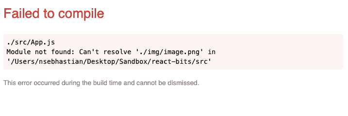
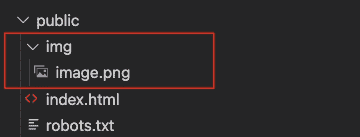
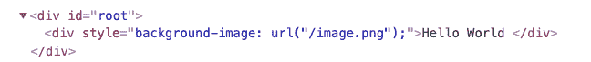

# React 背景图像教程——如何用内联 CSS 样式设置 Background Image

> 原文：<https://www.freecodecamp.org/news/react-background-image-tutorial-how-to-set-backgroundimage-with-inline-css-style/>

使用 React 的内联 CSS 有四种方法来设置`backgroundImage`样式属性。

本教程将向您展示所有四种方法，每种方法都有代码示例。

## 如何使用外部 URL 在 React 中设置背景图像

如果您的图像位于某个在线位置，您可以通过放置如下 URL 来设置元素的背景图像:

```
function App() {
  return (
    <div style={{ 
      backgroundImage: `url("https://via.placeholder.com/500")` 
    }}>
      Hello World
    </div>
  );
}
```

Setting React background image with external URL

上面的代码将呈现一个应用了样式`background-image: url([https://via.placeholder.com/500](https://via.placeholder.com/500))`的单个`<div>`元素。

## 如何从/src 文件夹中设置 React 中的背景图像

如果您使用 Create React App 引导您的应用程序，并将您的图像放在`src/`文件夹中，您可以先`import`该图像，然后将其作为元素的背景:

```
import React from "react";
import background from "./img/placeholder.png";

function App() {
  return (
    <div style={{ backgroundImage: `url(${background})` }}>
      Hello World
    </div>
  );
}

export default App;
```

Setting background image using imported image

当您运行`npm start`命令时，React 将显示“编译失败”错误，并在找不到映像时停止构建:



React failed to compile. The image is not found.

这样，您就不会在 web 应用程序上显示任何损坏的图像链接。在上面的代码中，`backgroundImage`的值是使用模板字符串设置的，这允许您嵌入 JavaScript 表达式。

## 如何使用相对 URL 方法在 React 中设置背景图像

Create React 应用程序中的`public/`文件夹可用于将静态资产添加到 React 应用程序中。您放入该文件夹的任何文件都可以在线访问。

如果你把一个`image.png`文件放在`public/`文件夹中，你可以在`<your host address>/image.png`访问它。在本地计算机上运行 React 时，图像应该在`http://localhost:3000/image.png`。

然后，您可以分配相对于您的主机地址的 URL 来设置背景图像。这里有一个例子:

```
<div style={{ backgroundImage: "url(/image.png)" }}>
  Hello World
</div>
```

Setting the background image with relative URL

通过像上面的例子一样将 URL 路径设置为`/image.png`，浏览器将在`<your host address>/image.png`寻找背景图像。

如果您想将图像组织成文件夹，也可以在`public/`中创建另一个文件夹。例如:



Creating an img/ folder inside public/ folder

如果您决定创建文件夹，不要忘记将`backgroundImage`值调整为`url(/img/image.png)`。

## 如何使用绝对 URL 方法在 React 中设置背景图像

您还可以通过使用 Create React App 的`PUBLIC_URL`环境变量来包含绝对 URL，如下所示:

```
<div style={{ 
  backgroundImage: `url(${process.env.PUBLIC_URL + '/image.png'})` 
}}>
  Hello World
</div>
```

Setting background image with absolute URL

当您在本地计算机上运行时，React 脚本将处理`PUBLIC_URL`值的值。当您在本地运行它时，它看起来像一个相对 URL，而不是绝对 URL:



Absolute URL of the image is not shown in local computer

只有当您稍后将 React 部署到生产应用程序中时，才能看到绝对 URL。

## 如何设置带有附加属性的背景图像

如果您想进一步定制背景图像，可以通过在`backgroundImage`之后添加附加属性来实现。这里有一个例子:

```
 <div style={{ 
  backgroundImage: `url(${process.env.PUBLIC_URL + '/image.png'})`,
  backgroundRepeat: 'no-repeat',
  width:'250px' 
}}>
  Hello World
</div>
```

Setting background-image with additional properties

上面设置的属性将把`background-repeat: no-repeat`和`width: 250px`以及`background-image`样式添加到`<div>`元素中。

## 使用 React 设置背景图像的视频说明

[https://scrimba.com/scrim/co9b0447ba3a6a610fe96f96b?embed=freecodecamp,mini-header,no-sidebar](https://scrimba.com/scrim/co9b0447ba3a6a610fe96f96b?embed=freecodecamp,mini-header,no-sidebar)

谢谢你的阅读，我希望你觉得这篇文章有用。如果你有任何问题，可以在 Twitter 上找到我。我也会时不时地分享一些简短的开发者提示。🙂