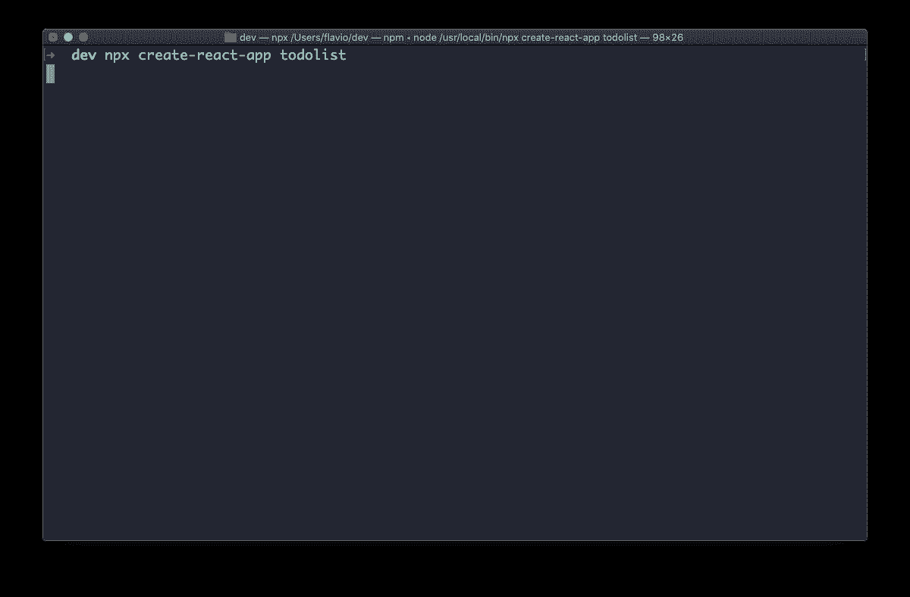
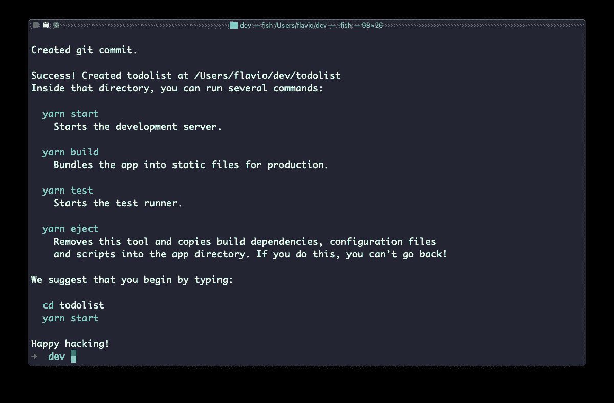
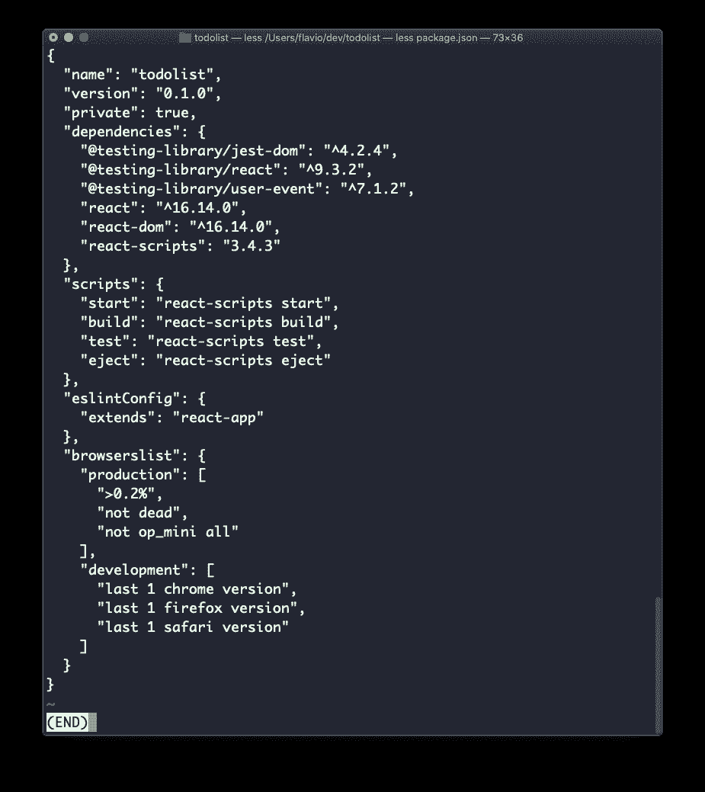
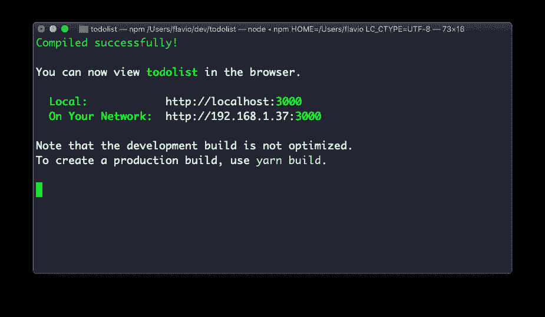
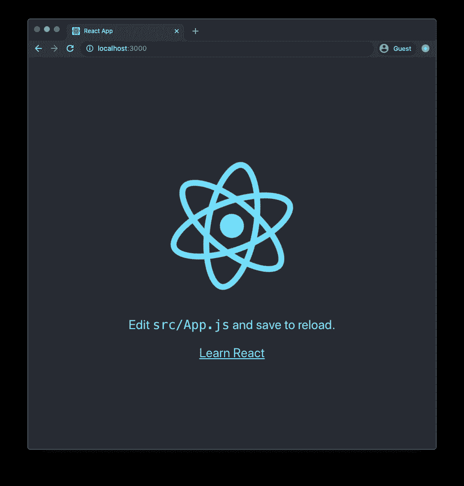
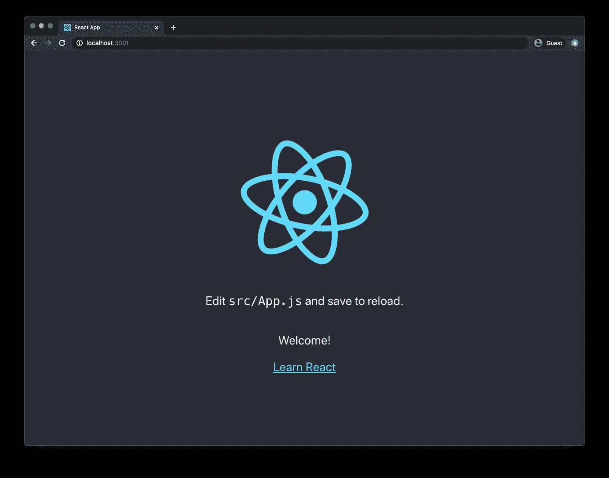
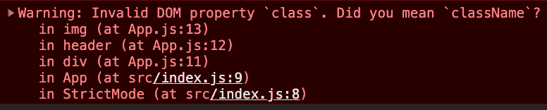

# React for 初学者——react . js 前端开发人员手册

> 原文：<https://www.freecodecamp.org/news/react-beginner-handbook/>

React 是有史以来最受欢迎的 JavaScript 框架之一，我相信它是最好的工具之一。

本手册的目标是为学习 React 提供入门指南。

在本书结束时，你将对以下内容有一个基本的了解:

*   React 是什么，为什么它如此受欢迎
*   如何安装 React
*   反应组分
*   反应状态
*   反应道具
*   在 React 中处理用户事件
*   React 组件中的生命周期事件

这些主题将是您在其他更高级的 React 教程中构建的基础。

这本书是专门为刚接触 React 的 JavaScript 程序员编写的。所以让我们开始吧。

## 什么是反应？

React 是一个 JavaScript 库，旨在简化可视化界面的开发。

它由脸书开发，于 2013 年向全世界发布，驱动着一些最广泛使用的应用程序，为脸书和 Instagram 以及无数其他应用程序提供动力。

它的主要目标是使推理一个接口及其在任何时间点的状态变得容易。它通过将 UI 划分为组件集合来实现这一点。

学习 React 时，您可能会经历一些最初的困难。但是一旦它“点击”,我保证这将是你有过的最好的经历之一。React 使许多事情变得更容易，它的生态系统充满了伟大的库和工具。

React 本身有一个非常小的 API，你基本上需要理解 4 个概念来开始:

*   成分
*   JSX
*   状态
*   小道具

我们将在本书中探索所有这些，我们将把更高级的概念留给其他教程。在最后一节，我会给你一些关于如何前进的建议。

并且可以[免费下载 PDF / ePub / Mobi 格式的这本手册](https://flaviocopes.com/page/react-handbook/)。

## 手册摘要

*   [使用 React 需要了解多少 JavaScript 知识](#howmuchjavascriptyouneedtoknowtousereact)
*   [为什么要学 React？](#whyshouldyoulearnreact)
*   [如何安装 React](#howtoinstallreact)
*   [反应成分](#reactcomponents)
*   [JSX 简介](#introductiontojsx)
*   [使用 JSX 编写用户界面](#usingjsxtocomposeaui)
*   [JSX 和 HTML 的区别](#thedifferencebetweenjsxandhtml)
*   [在 JSX 嵌入 JavaScript](#embeddingjavascriptinjsx)
*   [反应中的管理状态](#managingstateinreact)
*   [反应中的组件道具](#componentpropsinreact)
*   [React 应用程序中的数据流](#dataflowinareactapplication)
*   [在 React 中处理用户事件](#handlingusereventsinreact)
*   [React 组件中的生命周期事件](#lifecycleeventsinareactcomponent)
*   [何去何从](#wheretogofromhere)

## 使用 React 需要了解多少 JavaScript

在直接进入 React 之前，您应该对一些核心 JavaScript 概念有很好的理解。

您不必成为 JavaScript 专家，但我认为您需要对以下方面有一个很好的了解:

*   [变量](https://flaviocopes.com/javascript-variables/)
*   [箭头功能](https://flaviocopes.com/javascript-arrow-functions/)
*   [使用 Rest 和 Spread 处理对象和数组](https://flaviocopes.com/javascript-rest-spread/)
*   [对象和数组析构](https://flaviocopes.com/javascript-destructuring/)
*   [模板文字](https://flaviocopes.com/javascript-template-literals/)
*   [回调](https://flaviocopes.com/javascript-callbacks/)
*   [ES 模块](https://flaviocopes.com/es-modules/)

如果这些概念听起来不熟悉，我已经为您提供了一些链接来找到关于这些主题的更多信息。

## 你为什么要学反应？

我强烈建议任何 Web 开发人员至少对 React 有一个基本的了解。

那是因为几个原因。

1.  React 很受欢迎。作为一名开发人员，将来很可能会从事 React 项目。也许是一个现有的项目，或者你的团队希望你开发一个基于 React 的全新应用。
2.  今天的许多工具都是使用 React 作为核心构建的。流行的框架和工具，如 Next.js、Gatsby 和许多其他使用 React 的软件。
3.  作为一名前端工程师，React 很可能会出现在求职面试中。

这些都是很好的理由，但我希望你学习 React 的一个主要原因是它很棒。

它促进了一些好的开发实践，包括代码可重用性和组件驱动的开发。它速度快、重量轻，而且它让您思考应用程序中数据流的方式非常适合许多常见的场景。

## 如何安装 React

安装 React 有几种不同的方法。

首先，我强烈推荐一种方法，那就是使用官方推荐的工具`create-react-app`。

`create-react-app`是一个命令行应用程序，旨在让您快速使用 React。

从使用`npx`开始，这是一种下载和执行 Node.js 命令的简单方法，无需安装它们。

> 在这里看我的 npx 指南:[https://flaviocopes.com/npx/](https://flaviocopes.com/npx/)

`npx`自带`npm`(5.2 版本起)。如果你还没有安装 npm，现在就从 https://nodejs.org 的[安装(npm 和 Node 一起安装)。](https://nodejs.org)

如果您不确定您使用的是哪个版本的 npm，运行`npm -v`来检查您是否需要更新。

> 提示:如果你不熟悉使用终端，可以在 https://flaviocopes.com/macos-terminal/查看我的 OSX 终端教程。它适用于 Mac 和 Linux。

当你运行`npx create-react-app <app-name>`，`npx`将会*下载*最新的`create-react-app`版本，运行它，然后从你的系统中移除它。

这很好，因为您的系统上永远不会有过时的版本，并且每次运行它时，您都可以获得最新最棒的代码。

那么让我们开始吧:

```
npx create-react-app todolist 
```



这是它完成运行的时间:



`create-react-app`在您指定的文件夹中创建了一个文件结构(本例中为`todolist`，并初始化了一个 [Git](https://flaviocopes.com/git/) 存储库。

它还在`package.json`文件中添加了一些命令:



因此，您可以立即进入新创建的应用程序文件夹并运行`npm start`来启动应用程序。



默认情况下，此命令会在您的本地端口 3000 上启动应用程序，并打开您的浏览器，向您显示欢迎屏幕:



现在您已经准备好处理这个应用程序了！

## 反应组分

在上一节中，您看到了如何创建您的第一个 React 应用程序。

这个应用程序附带了一系列做各种事情的文件，大多数都与配置有关，但是有一个文件非常突出:`App.js`。

`App.js`是你遇到的第一个反应过来的**组件**。

它的代码是这样的:

```
import React from 'react'
import logo from './logo.svg'
import './App.css'

function App() {
  return (
    <div className="App">
      <header className="App-header">
        
        <p>
          Edit <code>src/App.js</code> and save to reload.
        </p>
        <a
          className="App-link"
          href="https://reactjs.org"
          target="_blank"
          rel="noopener noreferrer"
        >
          Learn React
        </a>
      </header>
    </div>
  )
}

export default App 
```

使用 React 或其他流行的前端框架(例如 Vue 和 Svelte)构建的应用程序是使用许多组件构建的。

但是让我们从分析第一个组件开始。我将把这个组件代码简化成这样:

```
import React from 'react'
import logo from './logo.svg'
import './App.css'

function App() {
  return /* something */
}

export default App 
```

你可以在这里看到一些东西。我们*导入*一些东西，我们*导出*一个叫做`App`的函数。

在这种情况下，我们导入的东西是一个 JavaScript 库(`react` npm 包)、一个 SVG 图像和一个 CSS 文件。

> `create-react-app`的设置方式允许我们导入图像和 CSS 以在我们的 JavaScript 中使用，但这不是你现在需要关心的事情。你需要关心的是一个**组件**的概念

`App`是一个函数，在最初的例子中，它返回乍一看很奇怪的东西。

它看起来像是 HTML，但是嵌入了一些 JavaScript。

那就是 **JSX** ，一种我们用来构建组件输出的特殊语言。我们将在下一节详细讨论 JSX。

除了定义一些要返回的 JSX，组件还有其他一些特征。

一个组件可以有自己的**状态**，这意味着它封装了一些其他组件无法访问的变量，除非这个组件向应用程序的其余部分公开这个状态。

一个组件也可以从其他组件接收数据。在这种情况下，我们谈论的是**道具**。

别担心，我们很快就会详细了解所有这些术语(JSX、状态和道具)。

## JSX 简介

我们不能在不解释 JSX 的情况下谈论反应。

在上一节中，您遇到了第一个 React 组件，即由`create-react-app`构建的默认应用程序中定义的`App`组件。

它的代码是这样的:

```
import React from 'react'
import logo from './logo.svg'
import './App.css'

function App() {
  return (
    <div className="App">
      <header className="App-header">
        
        <p>
          Edit <code>src/App.js</code> and save to reload.
        </p>
        <a
          className="App-link"
          href="https://reactjs.org"
          target="_blank"
          rel="noopener noreferrer"
        >
          Learn React
        </a>
      </header>
    </div>
  )
}

export default App 
```

我们之前忽略了`return`语句中的所有内容，但是在这一节中我们将讨论它。

我们将组件返回的括号内的所有内容都称为 JSX:

```
<div className="App">
  <header className="App-header">
    
    <p>
      Edit <code>src/App.js</code> and save to reload.
    </p>
    <a
      className="App-link"
      href="https://reactjs.org"
      target="_blank"
      rel="noopener noreferrer"
    >
      Learn React
    </a>
  </header>
</div> 
```

这个*看起来*像 HTML，但其实不是 HTML。有点不一样。

将这段代码放在 JavaScript 文件中有点奇怪。这看起来一点也不像 JavaScript！

在引擎盖下，React 将处理 JSX，并将其转换为浏览器能够解释的 JavaScript。

所以我们正在编写 JSX，但是最后有一个翻译步骤，使得它可以被 JavaScript 解释器理解。

React 给了我们这个接口，原因只有一个:**使用 JSX** 更容易构建 UI 接口。

当然，一旦你熟悉了它。

在下一节中，我们将讨论 JSX 如何让你轻松地编写 UI，然后我们将看看你需要知道的与“普通 HTML”的区别。

## 使用 JSX 编写用户界面

正如上一节所介绍的，JSX 的主要好处之一是它使得构建 UI 变得非常容易。

特别是，在 React 组件中，您可以导入其他 React 组件，并且可以嵌入和显示它们。

React 组件通常是在自己的文件中创建的，因为这样我们就可以很容易地在其他组件中重用它(通过导入)。

但是 React 组件也可以在另一个组件的同一个文件中创建，如果您计划只在那个组件中使用它的话。这里没有“规则”，你可以做你觉得最好的事。

当一个文件中的行数增长过多时，我通常使用单独的文件。

为了简单起见，让我们在同一个`App.js`文件中创建一个组件。

我们将创建一个`WelcomeMessage`组件:

```
function WelcomeMessage() {
  return <p>Welcome!</p>
} 
```

看到了吗？这是一个简单的函数，它返回一行代表一个 HTML 元素的 JSX。

我们将把它添加到`App.js`文件中。

现在，在`App`组件 JSX 中，我们可以添加`<WelcomeMessage />`来在用户界面中显示该组件:

```
import React from 'react'
import logo from './logo.svg'
import './App.css'

function WelcomeMessage() {
  return <p>Welcome!</p>
}

function App() {
  return (
    <div className="App">
      <header className="App-header">
        
        <p>
          Edit <code>src/App.js</code> and save to reload.
        </p>
        <WelcomeMessage />
        <a
          className="App-link"
          href="https://reactjs.org"
          target="_blank"
          rel="noopener noreferrer"
        >
          Learn React
        </a>
      </header>
    </div>
  )
}

export default App 
```

这是结果。你能看到“欢迎光临！”屏幕中的消息？



我们说`WelcomeMessage`是 App 的**子组件**，而`App`是它的父组件。

我们添加了`<WelcomeMessage />`组件，就好像它是 HTML 语言的一部分。

这就是 React 组件和 JSX 的美妙之处:我们可以编写一个应用程序界面，并像编写 HTML 一样使用它。

有一些不同，我们将在下一节看到。

## JSX 和 HTML 的区别

JSX 看起来有点像 HTML，但它不是。

在这一部分，我想向你介绍一些使用 JSX 时需要记住的最重要的事情。

如果您查看`App`组件 JSX，其中一个差异可能会非常明显:有一个奇怪的属性叫做`className`。

在 HTML 中，我们使用`class`属性。出于各种原因，它可能是使用最广泛的属性。其中一个原因是 CSS。`class`属性允许我们轻松地设计 HTML 元素的样式，像 Tailwind 这样的 CSS 框架将该属性置于 CSS 用户界面设计过程的中心。

但是有一个问题。我们在 JavaScript 文件中编写这个 UI 代码，JavaScript 编程语言中的`class`是一个保留字。这意味着我们不能随心所欲地使用这个保留字。它有特定的用途(定义 JavaScript 类), React 创建者必须为它选择不同的名称。

这就是为什么我们最后用了`className`而不是`class`。

你需要记住这一点，尤其是当你复制/粘贴一些现有的 HTML。

React 会尽最大努力确保东西不会坏掉，但是会在开发者工具中引发很多警告:



这不是唯一有这个问题的 HTML 特性，但却是最常见的一个。

JSX 和 HTML 的另一个很大的区别是，我们可以说 HTML 是非常宽松的。即使你有一个语法错误，或者你关闭了错误的标签，或者你有一个不匹配，浏览器将尽最大努力解释 HTML 而不中断。

这是网络的核心特征之一。它非常宽容。

JSX 不会宽恕。如果您忘记关闭标签，您将会看到一条清晰的错误消息:


> React 通常会给出非常好的、信息丰富的错误消息，为您指出解决问题的正确方向。

JSX 和 HTML 的另一大区别是，在 JSX 我们可以嵌入 JavaScript。

让我们在下一节讨论这个问题。

## 在 JSX 嵌入 JavaScript

React 最好的特性之一是我们可以轻松地将 JavaScript 嵌入到 JSX 中。

其他前端框架，例如 Angular 和 Vue，有自己特定的方式在模板中打印 JavaScript 值，或者执行类似循环的操作。

React 不添加新的东西。相反，它让我们通过使用花括号在 JSX 中使用 JavaScript。

我将向您展示的第一个例子直接来自我们到目前为止学习过的`App`组件。

我们使用以下方法导入`logo` SVG 文件

```
import logo from './logo.svg' 
```

然后在 JSX 中，我们将这个 SVG 文件分配给一个`img`标签的`src`属性:

```
 
```

再来做一个例子。假设`App`组件有一个名为`message`的变量:

```
function App() {
  const message = 'Hello!'
  //...
} 
```

我们可以通过在 JSX 的任何地方添加`{message}`来在 JSX 打印这个值。

在花括号内`{ }`我们可以添加任何 JavaScript 语句，但是*每个花括号块只能有一个*语句。

语句必须返回一些东西。

例如，这是一个在 JSX 常见的说法。我们有一个三元运算符，其中定义了一个条件(`message === 'Hello!'`)，如果条件为真，则打印一个值，如果条件为假，则打印另一个值(本例中为`message`的内容):

```
{
  message === 'Hello!' ? 'The message was "Hello!"' : message
} 
```

## 管理 React 中的状态

每个 React 组件都可以有自己的状态。

我们所说的*状态*是什么意思？状态是由组件管理的**数据集。**

例如，考虑一个表单。表单的每个单独的输入元素负责管理它的状态:在里面写了什么。

按钮负责知道它是否被点击。如果是专注的话。

一个链接负责知道鼠标是否悬停在它上面。

在 React 或任何其他基于组件的框架/库中，我们所有的应用程序都基于并大量使用组件的状态。

我们使用 React 提供的`useState`实用程序来管理状态。从技术上来说，这是一个**钩子**(你现在不需要知道钩子的细节，但事实就是如此)。

您以这种方式从 React 导入`useState`:

```
import React, { useState } from 'react' 
```

调用`useState()`，你将得到一个新的状态变量，以及一个我们可以调用来改变它的值的函数。

`useState()`接受状态项的初始值，并返回一个包含状态变量的数组，以及您调用来改变状态的函数。

示例:

```
const [count, setCount] = useState(0) 
```

这很重要。我们不能直接改变状态变量的值。我们必须调用它的修饰符函数。否则，React 组件不会更新其 UI 来反映数据的变化。

调用修饰符是我们告诉 React 组件状态已经改变的方法。

语法有点怪，对吧？因为`useState()`返回一个数组，所以我们使用数组析构来访问每个单独的项，就像这样:`const [count, setCount] = useState(0)`

这里有一个实际的例子:

```
import { useState } from 'react'

const Counter = () => {
  const [count, setCount] = useState(0)

  return (
    <div>
      <p>You clicked {count} times</p>
      <button onClick={() => setCount(count + 1)}>Click me</button>
    </div>
  )
}

ReactDOM.render(<Counter />, document.getElementById('app')) 
```

您可以添加任意数量的`useState()`调用，创建任意数量的状态变量:

```
const [count, setCount] = useState(0)
const [anotherCounter, setAnotherCounter] = useState(0) 
```

## React 中的组件道具

我们称之为`props`传递给一个组件的初始值。

我们之前创建了一个`WelcomeMessage`组件

```
function WelcomeMessage() {
  return <p>Welcome!</p>
} 
```

我们这样使用它:

```
<WelcomeMessage /> 
```

该组件没有任何初始值。它没有道具。

属性可以作为属性传递给 JSX 中的组件:

```
<WelcomeMessage myprop={'somevalue'} /> 
```

在组件内部，我们接收道具作为参数:

```
function WelcomeMessage(props) {
  return <p>Welcome!</p>
} 
```

通常使用对象析构来按名称获取属性:

```
function WelcomeMessage({ myprop }) {
  return <p>Welcome!</p>
} 
```

现在我们有了道具，我们可以在组件内部使用它。例如，我们可以在 JSX 中打印它的值:

```
function WelcomeMessage({ myprop }) {
  return <p>{myprop}</p>
} 
```

这里的花括号有多种含义。在函数参数的情况下，花括号被用作对象析构语法的一部分。

然后我们用它们来定义函数代码块，最后在 JSX 中打印 JavaScript 值。

将属性传递给组件是在应用程序中传递值的一种很好的方式。

一个组件要么保存数据(有状态)，要么通过它的 props 接收数据。

我们还可以将函数作为道具发送，这样子组件就可以调用父组件中的函数。

一种特殊的道具叫做`children`。它包含在组件的开始和结束标记之间传递的任何内容的值，例如:

```
<WelcomeMessage> Here is some message </WelcomeMessage> 
```

在这种情况下，在`WelcomeMessage`中，我们可以通过使用`children`属性来访问值`Here is some message`:

```
function WelcomeMessage({ children }) {
  return <p>{children}</p>
} 
```

## React 应用程序中的数据流

在 React 应用程序中，数据通常使用我们在上一节中看到的 props 从父组件流向子组件:

```
<WelcomeMessage myprop={'somevalue'} /> 
```

如果您将函数传递给子组件，您可以从子组件更改父组件的状态:

```
const [count, setCount] = useState(0)

<Counter setCount={setCount} /> 
```

在计数器组件中，我们现在可以获取`setCount`属性并调用它来更新父组件中的`count`状态，当有事情发生时:

```
function Counter({ setCount }) {
  //...

  setCount(1)

  //...
} 
```

您需要知道有更高级的方法来管理数据，包括上下文 API 和像 Redux 这样的库。但是这些会带来更多的复杂性，而 90%的情况下使用我刚才解释的那两种方法是完美的解决方案。

## 在 React 中处理用户事件

React 提供了一种简单的方法来管理由 DOM 事件触发的事件，如点击、表单事件等等。

让我们来谈谈点击事件，它非常容易理解。

您可以在任何 JSX 元素上使用`onClick`属性:

```
<button
  onClick={(event) => {
    /* handle the event */
  }}
>
  Click here
</button> 
```

当单击元素时，传递给`onClick`属性的函数被触发。

您可以在 JSX 之外定义此函数:

```
const handleClickEvent = (event) => {
  /* handle the event */
}

function App() {
  return <button onClick={handleClickEvent}>Click here</button>
} 
```

当按钮上的`click`事件被触发时，React 调用事件处理函数。

React 支持大量类型的事件，比如`onKeyUp`、`onFocus`、`onChange`、`onMouseDown`、`onSubmit`等等。

## React 组件中的生命周期事件

到目前为止，我们已经看到了如何用`useState`钩子管理状态。

本书还有一个我要介绍的钩子:`useEffect`。

`useEffect`钩子允许组件访问组件的生命周期事件。

当你调用钩子时，你传递给它一个函数。该函数将在组件第一次渲染时由 React 运行，并在随后的每次重新渲染/更新时运行。

React 首先更新 DOM，然后调用传递给`useEffect()`的任何函数。

所有这些都不会阻塞 UI 呈现，甚至是阻塞代码。

这里有一个例子:

```
const { useEffect, useState } = React

const CounterWithNameAndSideEffect = () => {
  const [count, setCount] = useState(0)

  useEffect(() => {
    console.log(`You clicked ${count} times`)
  })

  return (
    <div>
      <p>You clicked {count} times</p>
      <button onClick={() => setCount(count + 1)}>Click me</button>
    </div>
  )
} 
```

由于 useEffect()函数在组件的每次后续重新渲染/更新时运行，为了提高性能，我们可以告诉 React 跳过它。我们通过添加第二个参数来做到这一点，该参数是一个数组，其中包含要监视的状态变量列表。

React 只会在这个数组中的一个项目改变时重新运行副作用。

```
useEffect(() => {
  console.log(`Hi ${name} you clicked ${count} times`)
}, [name, count]) 
```

类似地，您可以通过传递一个空数组来告诉 React 只执行一次副作用(在挂载时):

```
useEffect(() => {
  console.log(`Component mounted`)
}, []) 
```

你会发现自己经常使用这个选项。

useEffect()非常适合添加日志、访问第三方 API 等等。

## 从这里去哪里

掌握本文中解释的主题是朝着学习 React 的目标迈出的一大步。

我现在想给你一些指点，因为很容易迷失在关于 React 的教程和课程的海洋中。

接下来应该学什么？

了解更多关于[虚拟 DOM](https://flaviocopes.com/react-virtual-dom/) 、[编写声明性代码](https://flaviocopes.com/react-declarative/)、[单向数据流](https://flaviocopes.com/react-unidirectional-data-flow/)、[不变性](https://flaviocopes.com/react-immutability/)、[合成](https://flaviocopes.com/react-composition/)的理论。

开始构建一些简单的 React 应用程序。例如[构建一个简单的计数器](https://flaviocopes.com/react-example-counter/)或者一个与公共 API 交互的[。](https://flaviocopes.com/react-example-githubusers/)

学习如何执行[条件渲染](https://flaviocopes.com/react-conditional-rendering/)，如何在 JSX 执行[循环](https://flaviocopes.com/react-how-to-loop/)，如何使用 [React 开发者工具](https://flaviocopes.com/react-developer-tools/)。

学习如何在 React 应用程序中应用 CSS，使用[普通 CSS](https://flaviocopes.com/react-css/) 或[风格的组件](https://flaviocopes.com/styled-components/)。

了解如何使用[上下文 API](https://flaviocopes.com/react-context-api/) ，useContext 和 [Redux](https://flaviocopes.com/redux/) 来管理状态。

学习如何与[表单](https://flaviocopes.com/react-forms/)交互。

了解如何使用 [React 路由器](https://flaviocopes.com/react-router/)。

了解如何测试 React 应用程序。

学习一个建立在 React 之上的应用框架，比如[盖茨比](https://flaviocopes.com/gatsby/)或者 [Next.js](https://flaviocopes.com/nextjs/) 。

最重要的是，确保您通过构建示例应用程序来实践您所学的一切。

## 结论

非常感谢您阅读本手册。

我希望它能激励你学习更多关于 React 的知识，以及你能用它做的一切！

记住，如果你愿意，你可以[免费下载 PDF / ePub / Mobi 格式的手册](https://flaviocopes.com/page/react-handbook/)。

我每天都在我的网站[flaviocopes.com](https://flaviocopes.com)上发布编程教程，如果你想查看更多类似的精彩内容。

你可以在推特上找到我。