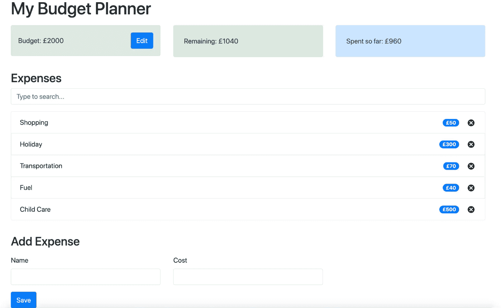
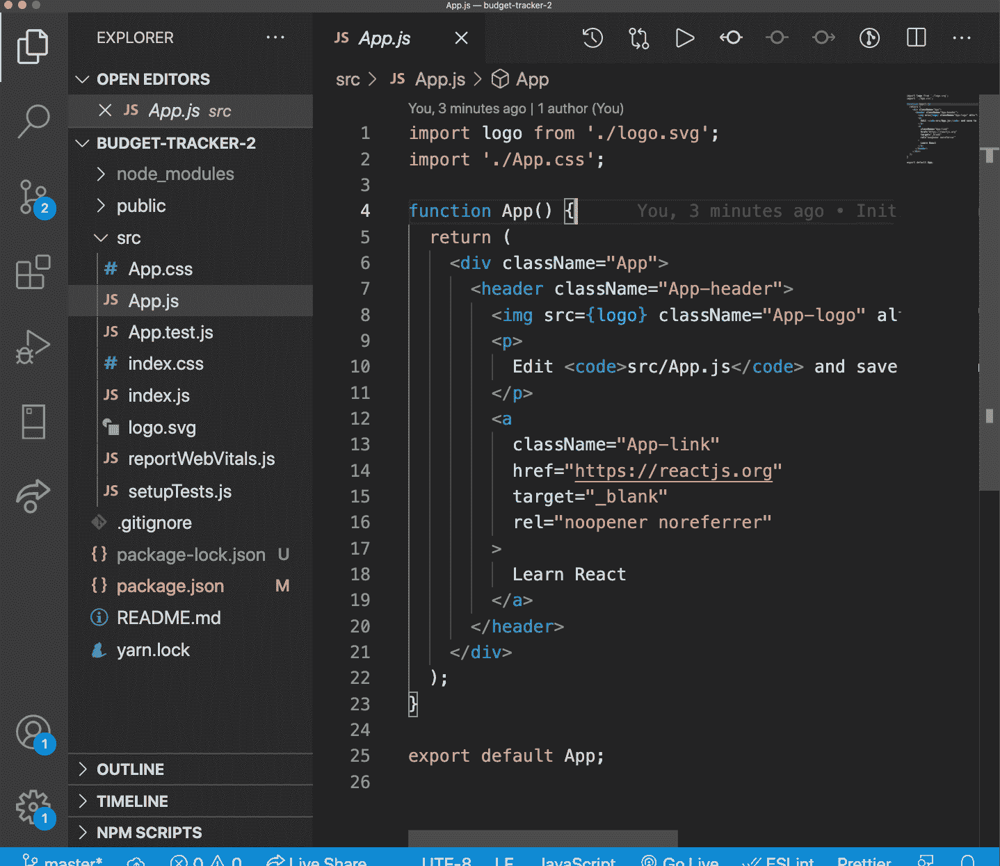
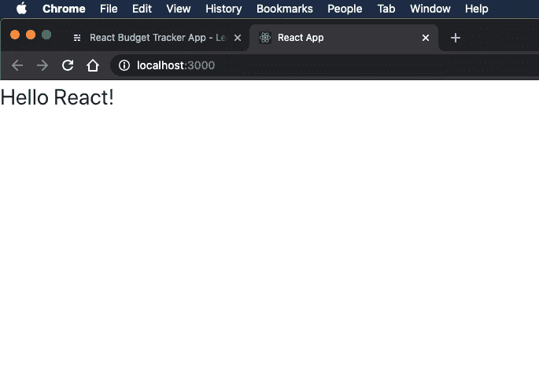
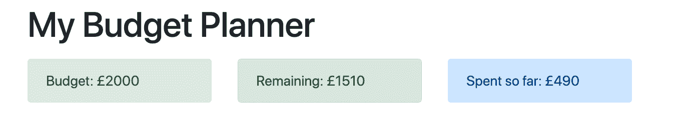
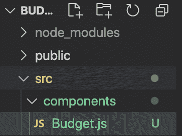
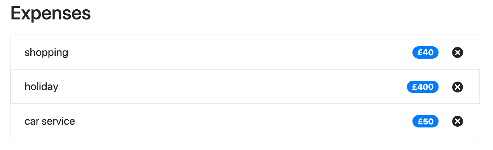
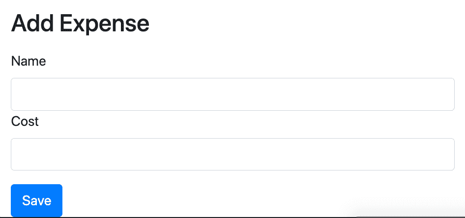

# 构建一个 React 预算跟踪应用程序——通过这个有趣的项目学习 React 和上下文 API

> 原文：<https://www.freecodecamp.org/news/react-budget-tracker-app/>

在 React 预算跟踪应用教程中，我们将:

*   我们将学习如何将 UI 分解成 React 组件
*   了解如何使用上下文 API 处理状态
*   了解操作、缩减器和分派功能

我会给你一些挑战，你可以在最后尝试！

## 这是我们要建造的:



用户可以:

*   添加有名称和成本的费用
*   移除费用
*   查看他们的预算还剩多少
*   查看他们到目前为止已经花了多少钱
*   (挑战)编辑预算
*   (挑战)搜索费用

## 视频漫游

[如果你想补充你的阅读(在 YouTube 上)，这里有一个视频演示](https://youtu.be/aeYxBd1it7I)

## 源代码

最后，如果您在跟随过程中迷路了，[您可以在这里(在 GitHub 上)](https://github.com/chrisblakely01/react-budget-app)获得完整的代码。

我们走吧！

## 如何设置 React 项目

我们需要做的第一件事是设置一个 React 项目。为此我们将使用`create-react-app`。

启动终端并键入:

`npx create-react-app budget-tracker`

当它完成它的工作后，我们将安装 Bootstrap。这将给我们现成的样式，我们可以使用，而不是必须在 CSS 中创建自己的样式。

在同一个终端中，切换到您的工作目录，并安装引导程序:

```
cd budget-tracker
npm i bootstrap 
```

接下来，我们将安装一个允许我们生成 id 的包。我们将使用 id 来标识列表中的每笔费用，因此这一点很重要。

在项目目录中运行以下命令:

```
npm i uuid 
```

我们需要安装的最后一个包给了我们一些图标，这样我们就不用自己创建图标了。

在项目目录中运行以下命令:

```
npm i react-icons 
```

现在用 VS 代码(或者你使用的任何 IDE)打开这个项目。您应该看到一些东西出现在项目树中(这是我们的空 React 项目)。



您可以忽略大部分内容，因为我们将创建自己的组件。打开 App.js，删除所有内容，并添加以下内容:

```
import React from 'react';
import 'bootstrap/dist/css/bootstrap.min.css';

const App = () => {
	return <p>Hello React!</p>;
};

export default App; 
```

这有什么作用:

*   将引导 CSS 导入我们的项目
*   创建一个显示“Hello React！”带段落标签
*   导出此组件，以便其他组件可以使用它

接下来，我们将启动应用程序，并确保一切正常工作。打开一个终端(以 VS 代码或其他方式)并通过键入以下命令启动应用程序:

```
npm start
```

一切正常，应用程序应该启动并在浏览器中打开:



The text "Hello React" should appear on the page. This means your app is working!

成功！现在我们准备开始构建我们的 React 组件。

## 如何将 UI 组件放置到位

构建应用程序的一种方法是从用一些虚拟数据放置 UI 组件开始。这通常有助于可视化需要什么状态对象，并且通常意味着以后较少的返工。

考虑到这一点，我们将把我们的 UI 组件放在适当的位置，从顶部开始，向下工作。



We'll add a title, then add a new component for each of the "boxes" shown. We'll add some dummy data just to get things displaying correctly

### 如何创建预算组件

跳转到代码中，在 **src** 文件夹中，创建一个名为**组件的新文件夹。**在其中，创建一个名为 **Budget.js.** 的文件。您的项目结构应该如下所示:



打开 **Budget.js** 并添加以下内容:

```
import React from 'react';

const Budget = () => {
	return (
		<div className='alert alert-secondary'>
			<span>Budget: £2000</span>
		</div>
	);
};

export default Budget; 
```

我们正在做的事情:

*   创建一个名为**预算**的新组件(第 3 行)
*   使用 **Bootstrap Alert** 类给我们一个漂亮的灰色背景(第 5 行)
*   添加一些文本并硬编码一个值(第 6 行)

### 如何创建`Remaining`组件

接下来我们将创建 **`Remaining`** 组件，它显示用户还剩多少预算。

在 **src/components** 下新建一个名为 **Remaining.js** 的文件。打开它并添加以下内容:

```
import React from 'react';

const Remaining = () => {
	return (
		<div className='alert alert-success'>
			<span>Remaining: £1000</span>
		</div>
	);
};

export default Remaining; 
```

我们正在做的事情:

*   创建一个名为**的新组件剩余的**(第 3 行)
*   使用**引导警告**类给我们一个绿色背景(第 5 行)
*   添加一些文本并硬编码一个值(第 6 行)
*   添加到目前为止花费的时间

最后，我们将创建**到目前为止花费的**组件，它显示用户到目前为止已经花费了多少。

在 **src/components** 下新建一个名为 **ExpenseTotal.js** 的文件。打开它并添加以下内容:

```
import React from 'react';

const ExpenseTotal = () => {
	return (
		<div className='alert alert-primary'>
			<span>Spent so far: £1000</span>
		</div>
	);
};

export default ExpenseTotal; 
```

我们正在做的事情:

*   创建一个名为 **ExpenseTotal** 的新组件(第 3 行)
*   使用**引导警告**类给我们一个蓝色背景(第 5 行)
*   添加一些文本并硬编码一个值(第 6 行)

### 如何添加标题并呈现我们的组件

此时，您可能会想，“这些组件看起来都一样，这是为什么呢？!"。这是真的，尽管记住我们现在只是添加一些硬编码的数据。稍后，每个组件将做不同的事情来动态显示数据。

现在我们已经创建了我们的组件，我们需要在 **App.js 中呈现它们。**打开 App.js 并添加以下内容:

```
import React from 'react';
import 'bootstrap/dist/css/bootstrap.min.css';
import Budget from './components/Budget';
import Remaining from './components/Remaining';
import ExpenseTotal from './components/ExpenseTotal';

const App = () => {
	return (
			<div className='container'>
				<h1 className='mt-3'>My Budget Planner</h1>
				<div className='row mt-3'>
					<div className='col-sm'>
						<Budget />
					</div>
					<div className='col-sm'>
						<Remaining />
					</div>
					<div className='col-sm'>
						<ExpenseTotal />
					</div>
				</div>
			</div>
	);
};

export default App; 
```

我们正在做的事情:

*   导入我们的不同组件(第 3-5 行)
*   添加一个引导容器，帮助我们将应用程序放在页面中央(第 9 行)
*   添加标题(第 9 行)
*   添加引导行(第 10 行)
*   为到目前为止的每个组件在行中添加一列(第 12-20 行)

现在，如果你运行应用程序，你应该看到标题，我们的组件呈现在页面上！

### 如何创建费用列表组件



The expenses list shows the expenses the user has added so far, displaying the Name, cost, and a delete button for each

接下来，我们将构建 **ExpenseList** 组件。该组件将负责获取费用列表，并为每一项呈现一个 **ExpenseItem** 组件。

我们将添加一些虚拟数据，以确保我们的用户界面看起来很好，事情按预期进行。后面这个东西就要脱离语境了。

首先在 **src/components** 下创建一个名为 **ExpenseList.js** 的新文件。打开 ExpenseList.js 并添加以下内容:

```
import React from 'react'
import ExpenseItem from './ExpenseItem';

const ExpenseList = () => {
    const expenses = [
		{ id: 12, name: 'shopping', cost: 40 },
		{ id: 13, name: 'holiday', cost: 400 },
		{ id: 14, name: 'car service', cost: 50 },
	];

    return (
		<ul className='list-group'>
			{expenses.map((expense) => (
				<ExpenseItem id={expense.id} name={expense.name} cost={expense.cost} />
			))}
		</ul>
    )
}

export default ExpenseList 
```

我们正在做的事情:

*   添加虚拟费用列表。对于每笔费用，我们需要一个 ID、一个名称和一笔费用。稍后，我们将从上下文中提取这个列表(第 4 行)
*   创建一个列表(第 11 行)
*   使用 map 函数迭代费用并显示 ExpenseItem 组件(我们还没有创建它！第 12 行)
*   将 ID、名称和成本作为道具传递给 ExpenseItem 组件

### 如何创建费用项组件

现在我们已经创建了一个组件来保存我们的列表，我们需要一个组件来呈现每个项目。在 **src/components** 文件夹中创建一个名为 **ExpenseItem.js.** 的新文件，打开它并添加以下内容:

```
import React from 'react';
import { TiDelete } from 'react-icons/ti';

const ExpenseItem = (props) => {
	return (
		<li className='list-group-item d-flex justify-content-between align-items-center'>
			{props.name}
			<div>
				<span className='badge badge-primary badge-pill mr-3'>
					£{props.cost}
				</span>
				<TiDelete size='1.5em'></TiDelete>
			</div>
		</li>
	);
};

export default ExpenseItem; 
```

我们正在做的事情:

*   创建列表项(第 6 行)
*   呈现从 props(第 7 行)获得的费用名称
*   渲染费用的成本，我们也从道具中得到
*   我们正在显示一个 DeleteIcon(第 12 行),它来自 react-icons 包(第 2 行)

### 如何呈现 ExpenseList 组件

现在我们已经创建了我们的组件，我们只需在 App.js 中呈现 ExpenseList。打开 App.js，用以下内容更新它:

```
import React from 'react';
import 'bootstrap/dist/css/bootstrap.min.css';
import Budget from './components/Budget';
import Remaining from './components/Remaining';
import ExpenseTotal from './components/ExpenseTotal';
import ExpenseList from './components/ExpenseList';

const App = () => {
	return (
		<div className='container'>
			<h1 className='mt-3'>My Budget Planner</h1>
			<div className='row mt-3'>
				<div className='col-sm'>
					<Budget />
				</div>
				<div className='col-sm'>
					<Remaining />
				</div>
				<div className='col-sm'>
					<ExpenseTotal />
				</div>
			</div>
			<h3 className='mt-3'>Expenses</h3>
			<div className='row mt-3'>
				<div className='col-sm'>
					<ExpenseList />
				</div>
			</div>
		</div>
	);
};

export default App; 
```

新功能:

*   我们导入了我们的 ExpenseList(第 6 行)
*   添加了一个新的引导行(第 24 行)
*   呈现我们的 ExpenseList(第 26 行)

现在，如果您保存/运行应用程序，您会看到费用列表已经出现！

### 如何创建“添加费用”表单组件



我们的 UI 组件即将完成！我们需要的最后一个组件是“添加费用”表单组件，它允许用户添加新的费用。我们将首先把表单的 UI 组件放在适当的位置，然后再回来添加漂亮的东西。

在 **src/components** 中创建一个名为 **AddExpenseForm.js** 的新文件。启动并添加以下内容:

```
import React from 'react';

const AddExpenseForm = () => {

	return (
		<form>
			<div className='row'>
				<div className='col-sm'>
					<label for='name'>Name</label>
					<input
						required='required'
						type='text'
						className='form-control'
						id='name'
					></input>
				</div>
				<div className='col-sm'>
					<label for='cost'>Cost</label>
					<input
						required='required'
						type='text'
						className='form-control'
						id='cost'
					></input>
				</div>

			</div>
            <div className='row'>
            	<div className='col-sm'>
					<button type='submit' className='btn btn-primary mt-3'>
						Save
					</button>
				</div>
            </div>
		</form>
	);
};

export default AddExpenseForm; 
```

我们正在做的事情:

*   添加表单标签(第 6 行)
*   为我们的**名称**字段添加标签/输入(第 9 行)
*   为我们的**成本**字段添加标签/输入(第 18 行)
*   添加一个按钮来提交表单(第 30 行)

### 如何呈现 AddExpenseForm 组件

最后，在 App.js 中，我们必须呈现我们的新组件。使用以下内容更新 App.js:

```
import React from 'react';
import 'bootstrap/dist/css/bootstrap.min.css';
import Budget from './components/Budget';
import Remaining from './components/Remaining';
import ExpenseTotal from './components/ExpenseTotal';
import ExpenseList from './components/ExpenseList';
import AddExpenseForm from './components/AddExpenseForm';

const App = () => {
	return (
		<div className='container'>
			<h1 className='mt-3'>My Budget Planner</h1>
			<div className='row mt-3'>
				<div className='col-sm'>
					<Budget />
				</div>
				<div className='col-sm'>
					<Remaining />
				</div>
				<div className='col-sm'>
					<ExpenseTotal />
				</div>
			</div>
			<h3 className='mt-3'>Expenses</h3>
			<div className='row mt-3'>
				<div className='col-sm'>
					<ExpenseList />
				</div>
			</div>
			<h3 className='mt-3'>Add Expense</h3>
			<div className='row mt-3'>
				<div className='col-sm'>
					<AddExpenseForm />
				</div>
			</div>
		</div>
	);
};

export default App; 
```

有什么变化:

*   导入了 AddExpenseForm(第 7 行)
*   呈现 AddExpenseForm(第 33 行)

## 如何添加上下文 API

上下文 API 是我们用来存储全局状态的东西。它已经是 React 库的一部分，所以不需要导入/安装任何其他东西。

首先在 **src** 文件夹中创建一个名为**上下文的新文件夹。**在这个文件夹中创建一个名为 **AppContext.js 的新文件**

### 如何创建初始状态

我们的上下文首先需要的是一个初始状态。这表明了我们状态的“形状”(换句话说，我们有什么属性和数据)，例如，可以用来自 API 调用的数据初始化应用程序。

现在我们只添加一些初始值。在 AppContext.js 中，添加以下内容:

```
const initialState = {
	budget: 2000,
	expenses: [
		{ id: 12, name: 'shopping', cost: 40 },
		{ id: 13, name: 'holiday', cost: 400 },
		{ id: 14, name: 'car service', cost: 50 },
	],
};
```

*   我们正在增加初始预算
*   我们正在添加一个虚拟的费用清单

> 注意:intialState 属性不需要有值，它们可以设置为空字符串、空数组等等。我们添加数据是为了可视化的目的

### 如何创建 AppContext

接下来，我们将创建 AppContext。这是我们的组件导入并用来获取状态的东西。

使用以下内容更新 AppContext.js:

```
const initialState = {
	budget: 2000,
	expenses: [
		{ id: 12, name: 'shopping', cost: 40 },
		{ id: 13, name: 'holiday', cost: 400 },
		{ id: 14, name: 'car service', cost: 50 },
	],
};

export const AppContext = createContext(); 
```

我们所做的就是在第 11 行添加一个对 createContext 的调用——这就是我们创建的上下文对象！

### 如何创建 AppProvider

提供者是一个组件，它包装了我们要向其传递状态的组件。我们将它与 useReducer 挂钩结合使用来实际存储全局状态。

像这样更新 AppContext.js 文件:

```
const initialState = {
	budget: 2000,
	expenses: [
		{ id: 12, name: 'shopping', cost: 40 },
		{ id: 13, name: 'holiday', cost: 400 },
		{ id: 14, name: 'car service', cost: 50 },
	],
};

export const AppContext = createContext();

export const AppProvider = (props) => {
	const [state, dispatch] = useReducer(AppReducer, initialState);

	return (
		<AppContext.Provider
			value={{
				budget: state.budget,
				expenses: state.expenses,
				dispatch,
			}}
		>
			{props.children}
		</AppContext.Provider>
	);
};
```

我们正在做的事情:

*   创建我们的提供者组件(第 12 行)
*   设置 useReducer 挂钩，它将保存我们的状态，并允许我们通过 dispatch 更新状态(注意，我们还没有创建 AppReducer！第 13 行)
*   我们正在返回 **AppContext.Provider.** 这有一个**值**属性，它包含我们允许组件看到和访问的数据，以及允许我们通过调度动作来更新状态的调度函数(第 16 行)

### 如何创建 AppReducer

接下来，我们将创建 AppReducer。reducer 负责根据动作类型和有效负载创建新的全局状态对象。

使用以下内容更新 AppContext.js:

```
const AppReducer = (state, action) => {
	switch (action.type) {
		default:
			return state;
	}
};

const initialState = {
	budget: 2000,
	expenses: [
		{ id: 12, name: 'shopping', cost: 40 },
		{ id: 13, name: 'holiday', cost: 400 },
		{ id: 14, name: 'car service', cost: 50 },
	],
};

export const AppContext = createContext();

export const AppProvider = (props) => {
	const [state, dispatch] = useReducer(AppReducer, initialState);

	return (
		<AppContext.Provider
			value={{
				budget: state.budget,
				expenses: state.expenses,
				dispatch,
			}}
		>
			{props.children}
		</AppContext.Provider>
	);
}; 
```

我们正在做的事情:

*   创建一个接受当前状态的函数和一个动作(第 1 行)
*   我们使用基于 action.type 的开关来决定如何更新状态(第 2 行)
*   现在，由于我们刚刚设置好，我们将返回默认状态，并在以后需要时添加动作(第 3 行)

就是这样！我们的全局状态现在已经设置好了，并准备就绪。

## 如何将 AppContext 链接到我们的应用程序

下一步是将我们的 AppContext 链接到我们的 App 组件。我们通过用 AppProvider 包装我们想要将状态传递给的组件来做到这一点。

跳回 App.js 并更新以下内容:

```
import React from 'react';
import 'bootstrap/dist/css/bootstrap.min.css';
import Budget from './components/Budget';
import Remaining from './components/Remaining';
import ExpenseTotal from './components/ExpenseTotal';
import ExpenseList from './components/ExpenseList';
import AddExpenseForm from './components/AddExpenseForm';
import { AppProvider } from './context/AppContext';

const App = () => {
	return (
		<AppProvider>
			<div className='container'>
				<h1 className='mt-3'>My Budget Planner</h1>
				<div className='row mt-3'>
					<div className='col-sm'>
						<Budget />
					</div>
					<div className='col-sm'>
						<Remaining />
					</div>
					<div className='col-sm'>
						<ExpenseTotal />
					</div>
				</div>
				<h3 className='mt-3'>Expenses</h3>
				<div className='row mt-3'>
					<div className='col-sm'>
						<ExpenseList />
					</div>
				</div>
				<h3 className='mt-3'>Add Expense</h3>
				<div className='row mt-3'>
					<div className='col-sm'>
						<AddExpenseForm />
					</div>
				</div>
			</div>
		</AppProvider>
	);
};

export default App; 
```

有什么变化:

*   导入我们的 **AppProvider** (第 8 行)
*   将组件嵌套在 AppProvider 元素中(第 12 行/第 39 行)

现在我们的组件嵌套在 AppProvider 中，它们可以访问 AppProvider 公开的 **value** 对象。

## 如何将我们的组件连接到 AppContext

### 如何根据上下文渲染预算

现在我们可以开始将全局状态值放入组件中。我们将从预算开始，因此跳转到 **Budget.js** 并添加以下内容:

```
import React, { useContext } from 'react';
import { AppContext } from '../context/AppContext';

const Budget = () => {
	const { budget } = useContext(AppContext);

	return (
		<div className='alert alert-secondary'>
			<span>Budget: £{budget}</span>
		</div>
	);
};

export default Budget; 
```

我们正在做的事情:

*   我们必须从我们的上下文(第 2 行)导入 **AppContext**
*   我们导入 **useContext** 钩子，并将我们的 AppContext 传递给它——这就是组件如何连接到上下文以便从全局状态获取值
*   我们使用**析构**从上下文中获得**预算**(第 5 行)
*   我们在 JSX 中渲染预算(第 9 行)

现在，如果您在 AppContext 中更改预算并重新加载浏览器，您将在 UI 上看到预算更新。这意味着我们的组件成功地从我们的上下文中提取数据。成功！

### 如何根据上下文渲染费用

现在我们可以对费用列表做类似的事情。打开 **ExpenseList.js** 并用以下内容更新它:

```
import React, { useContext } from 'react';
import ExpenseItem from './ExpenseItem';
import { AppContext } from '../context/AppContext';

const ExpenseList = () => {
	const { expenses } = useContext(AppContext);

	return (
		<ul className='list-group'>
			{expenses.map((expense) => (
				<ExpenseItem id={expense.id} name={expense.name} cost={expense.cost} />
			))}
		</ul>
	);
};

export default ExpenseList; 
```

我们正在做的事情:

*   像以前一样导入我们的 AppContext 和 useContext 挂钩
*   我们已经删除了虚列的费用清单
*   我们已经用存储在上下文中的费用列表替换了虚拟列表

因为我们已经完成了呈现费用列表的工作，所以我们不需要做任何其他事情！刷新浏览器，您将看到列表现在来自上下文，而不是虚拟列表。

请记住，我们在提供者中将费用作为值对象的一部分导出。包装在提供者中的任何组件都可以访问这个值对象，并使用析构来获得它需要的特定值。

### 如何添加新的费用-获取表单值

到目前为止，我们已经了解了如何从状态中获取值，接下来我们将了解如何调度操作和更新状态。

在此之前，我们需要知道用户输入的新费用的名称和成本。跳转到 AddExpenseForm.js 并添加以下内容:

```
import React, { useState } from 'react';

const AddExpenseForm = () => {
	const [name, setName] = useState('');
	const [cost, setCost] = useState('');

	const onSubmit = (event) => {

	};

	return (
		<form onSubmit={onSubmit}>
			<div className='row'>
				<div className='col-sm'>
					<label for='name'>Name</label>
					<input
						required='required'
						type='text'
						className='form-control'
						id='name'
						value={name}
						onChange={(event) => setName(event.target.value)}
					></input>
				</div>
				<div className='col-sm'>
					<label for='cost'>Cost</label>
					<input
						required='required'
						type='text'
						className='form-control'
						id='cost'
						value={cost}
						onChange={(event) => setCost(event.target.value)}
					></input>
				</div>
				<div className='col-sm'>
					<button type='submit' className='btn btn-primary mt-3'>
						Save
					</button>
				</div>
			</div>
		</form>
	);
};

export default AddExpenseForm; 
```

我们正在做的事情:

*   使用 React 控制**输入值**。对于每个输入字段，我们都有一个状态对象(第 7 行和第 8 行)
*   当用户键入输入时，相应的状态值将会更新(第 25 和 36 行)
*   当用户点击按钮时，它将调用一个 **onSubmit** 函数。这个函数现在不做任何事情，但是我们将从这里调度操作

现在我们已经将表单值存储在 state 中，我们可以分派一个动作来更新状态。

### 如何添加新的费用分派操作

使用以下内容更新 AddExpenseForm:

```
import React, { useContext, useState } from 'react';
import { AppContext } from '../context/AppContext';
import { v4 as uuidv4 } from 'uuid';

const AddExpenseForm = () => {
	const { dispatch } = useContext(AppContext);

	const [name, setName] = useState('');
	const [cost, setCost] = useState('');

	const onSubmit = (event) => {
		event.preventDefault();

		const expense = {
			id: uuidv4(),
			name: name,
			cost: parseInt(cost),
		};

		dispatch({
			type: 'ADD_EXPENSE',
			payload: expense,
		});
	};

	return (
		<form onSubmit={onSubmit}>
			<div className='row'>
				<div className='col-sm'>
					<label for='name'>Name</label>
					<input
						required='required'
						type='text'
						className='form-control'
						id='name'
						value={name}
						onChange={(event) => setName(event.target.value)}
					></input>
				</div>
				<div className='col-sm'>
					<label for='cost'>Cost</label>
					<input
						required='required'
						type='text'
						className='form-control'
						id='cost'
						value={cost}
						onChange={(event) => setCost(event.target.value)}
					></input>
				</div>
				<div className='col-sm'>
					<button type='submit' className='btn btn-primary mt-3'>
						Save
					</button>
				</div>
			</div>
		</form>
	);
};

export default AddExpenseForm; 
```

我们正在做的事情:

*   照常导入 AppContext 和 useContext
*   从全局状态获取**调度**(第 6 行)
*   创建一个**费用对象，**包含名称和费用。这是将作为有效负载发送的内容，我们将使用它来更新状态。我们还使用之前导入的 uuid 包来创建一个 id。这用于标识给定的费用(第 14 行)。
*   我们正在调度一个**动作**，带有一个类型和我们的有效负载。该类型告诉 reducer 如何更新状态，我们马上就会看到(第 20 行)

### 如何添加新费用-更新减少量

从元件方面来说就是这样。您会注意到，如果您在浏览器中运行这个程序，什么也不会发生。这是因为我们没有更新我们的 reducer 来处理动作和更新状态。

跳转到 **AppContext.js** ，用以下内容更新**减速器**功能:

```
const AppReducer = (state, action) => {
	switch (action.type) {
		case 'ADD_EXPENSE':
			return {
				...state,
				expenses: [...state.expenses, action.payload],
			};
		default:
			return state;
	}
};
```

我们正在做的事情:

*   我们正在检查动作的类型(从动作变量中获得)(第 2 行)
*   将名为“ADD_EXPENSE”的新案例添加到 switch 语句中(第 3 行)
*   返回一个新的状态对象，新的开销来自有效负载(从 action 变量中获得)(第 4 行)

> 当我们从 case 语句中返回一些东西时，reducer 会自动更新状态并重新呈现组件，就像变魔术一样。

现在，如果您运行代码，并添加一个新的费用，您可以看到它被添加到费用列表中！

### 如何计算`spent so far`

接下来我们要看的是计算用户到目前为止已经花了多少钱。为此，我们将获取用户花费的所有费用的总和，并将其显示在 UI 上。

打开 **ExpenseTotal.js** 并用以下内容更新它:

```
import React, { useContext } from 'react';
import { AppContext } from '../context/AppContext';

const ExpenseTotal = () => {
	const { expenses } = useContext(AppContext);

	const totalExpenses = expenses.reduce((total, item) => {
		return (total += item.cost);
	}, 0);

	return (
		<div className='alert alert-primary'>
			<span>Spent so far: £{totalExpenses}</span>
		</div>
	);
};

export default ExpenseTotal; 
```

我们正在做的事情:

*   照常导入我们的 useContext 和 AppContext
*   从州政府提取费用(第 5 行)
*   使用 reduce 函数获得所有成本的总和，并将其赋给一个变量(第 7 行)
*   在我们的 JSX 中显示变量(第 13 行)

现在，每当用户添加费用时，都会导致状态更新，这将导致连接到上下文的所有组件重新呈现并用新值更新它们自己。

继续，在浏览器中尝试一下。

### 如何计算`Remaining`

现在我们来看看计算用户还有多少预算可以花。

为此，我们将得到费用的总成本，并将其从预算中减去。如果用户超出预算，即费用超过预算，我们希望显示红色背景(而不是绿色背景)。幸运的是，Bootstrap 已经给了我们这些好东西。

打开 Remaining.js 并使用以下内容更新它:

```
import React, { useContext } from 'react';
import { AppContext } from '../context/AppContext';

const Remaining = () => {
	const { expenses, budget } = useContext(AppContext);

	const totalExpenses = expenses.reduce((total, item) => {
		return (total = total + item.cost);
	}, 0);

	const alertType = totalExpenses > budget ? 'alert-danger' : 'alert-success';

	return (
		<div className={`alert ${alertType}`}>
			<span>Remaining: £{budget - totalExpenses}</span>
		</div>
	);
};

export default Remaining; 
```

我们在做什么

*   从上下文中导入费用和预算(第 5 行)
*   使用 reduce 函数获得费用的总成本(第 7 行)
*   创建一个变量来存储我们想要显示的 CSS classname(取决于用户是否超出预算，第 11 行)
*   使用模板字符串创建我们的类(第 14 行)
*   使用减法呈现剩余的预算(第 15 行)

现在，如果您在浏览器中运行代码，并添加一堆费用，直到总数超过 2000，您将看到“剩余”组件背景变成红色！

### 如何删除费用

在开始挑战之前，我们要看的最后一件事是去除一项支出。

当用户单击费用旁边的小十字时，我们希望调度一个动作来将其从状态中删除。当这种情况发生时，我们的 ExpenseList 将使用删除的费用重新呈现。

跳转到 ExpenseItem.js 并使用以下内容更新它:

```
import React, { useContext } from 'react';
import { TiDelete } from 'react-icons/ti';
import { AppContext } from '../context/AppContext';

const ExpenseItem = (props) => {
	const { dispatch } = useContext(AppContext);

	const handleDeleteExpense = () => {
		dispatch({
			type: 'DELETE_EXPENSE',
			payload: props.id,
		});
	};

	return (
		<li className='list-group-item d-flex justify-content-between align-items-center'>
			{props.name}
			<div>
				<span className='badge badge-primary badge-pill mr-3'>
					£{props.cost}
				</span>
				<TiDelete size='1.5em' onClick={handleDeleteExpense}></TiDelete>
			</div>
		</li>
	);
};

export default ExpenseItem; 
```

我们正在做的事情:

*   从上下文中导入 dispatch，这允许我们调度一个删除操作(第 6 行)
*   创建一个在单击删除图标时被调用的函数(第 8 行)
*   分派动作。我们的动作包含类型(这样 reducer 就知道如何更新状态)和有效负载。在这种情况下，我们传递这个费用的 ID(当我们呈现 ExpenseList 时从 props 中获得)(第 9 行)

如果您在浏览器中尝试这样做，您将会看到什么也没有发生。尽管我们正在调度一个动作，但是我们还没有实现这个动作类型的 reducer 逻辑，所以它不知道如何更新状态。

跳转到 AppContext.js，用下面的代码更新 reducer 函数:

```
const AppReducer = (state, action) => {
	switch (action.type) {
		case 'ADD_EXPENSE':
			return {
				...state,
				expenses: [...state.expenses, action.payload],
			};
		case 'DELETE_EXPENSE':
			return {
				...state,
				expenses: state.expenses.filter(
					(expense) => expense.id !== action.payload
				),
			};
		default:
			return state;
	}
};
```

我们在这里真正做的是添加一个新的 case 语句，来处理我们的 **DELETE_EXPENSE** 操作。我们使用 filter array 方法来删除从有效负载中收到的 ID 为的费用。

现在，如果您尝试这样做，您可以通过单击删除图标来删除费用。注意所有其他组件也是如何更新的。不错！

## 要尝试的挑战

恭喜你走到这一步！现在是你尝试一些挑战的时候了。请记住，您可以在 GitHub 源代码中看到我是如何做到的。

### 允许用户编辑预算

你会注意到，到目前为止，我们一直使用硬编码的预算值。您的第一个任务是添加允许用户编辑预算的功能。一些入门技巧:

*   您需要添加一个文本输入，允许用户输入他们想要的预算值。
*   我们将预算存储在 state 中，因此您将需要调度一个具有新类型和有效负载的动作来更新状态

### 允许用户搜索费用

如果用户有很多费用，就很难找到自己要找的那个。为用户添加一种按名称搜索费用的方式。一些入门技巧:

*   您需要添加一个输入字段，让用户输入要搜索的值。
*   您必须向 ExpenseList 组件添加一些东西，以便根据这个搜索值从上下文中过滤列表。

### 感谢阅读！

[](https://reactbeginnerprojects.com)