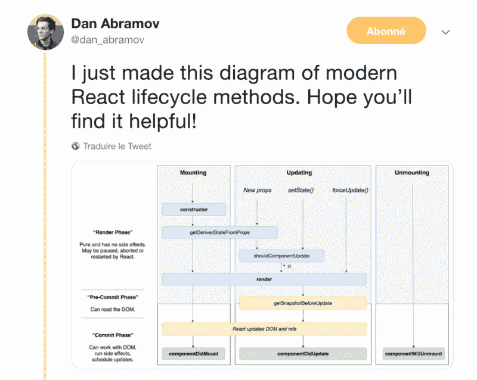

# react——缓存、时间片和用同步 API 获取

> 原文：<https://www.freecodecamp.org/news/react-cache-time-slicing-and-fetching-with-a-synchronous-api-2a57dc9c2e6d/>

作者马文·弗雷谢特

# react——缓存、时间片和用同步 API 获取

嗯，今年好像是 React 年。你可能听说过 16.7-alpha.0 的新杀手级特性——钩子。你可能也听说过其他一些很棒很酷的东西，比如时间切片或者悬疑。

这篇文章**并不**旨在描述如何使用一些新功能，而是证明它们可能是如何构建的。只是为了理解我们在玩什么。

它也是以我发现这个特性的方式写的。这可能不是我想出来的方法，但这就是我如何得到分数的。

阅读时你会发现:

*   异步 JavaScript 和事件循环
*   React 中的代数效应，带示例
*   纤维和反应相

### 我为什么写这个帖子？

让我想写这篇文章的是这个特殊的、实验性的特性，它允许使用**同步** API 来使用**异步**操作:

`const bulbasaur = ApiResource.read()`？…这是什么？**同步**？！

[react-cache](https://github.com/facebook/react/tree/master/packages/react-cache) 库创建了通过同步 API 使用异步操作的能力。这个特性让我想了解 React 是如何工作的。下面是由[丹·阿布拉莫夫](https://twitter.com/dan_abramov)和[安德鲁·克拉克](https://twitter.com/acdlite)对这个图书馆的介绍:

这怎么可能呢？如何使用同步调用获取一些远程数据？

让我们深入这个例子，尝试理解 [react-cache](https://github.com/facebook/react/tree/master/packages/react-cache) 如何实现这样的功能，并发现它是如何工作的。这个故事从[光纤架构](https://github.com/acdlite/react-fiber-architecture)开始。

### 控制 JavaScript 操作

纤程架构允许 React 控制任务的执行。它的建立是为了解决 React 遭受的多种问题。这里有两个引起了我的注意:

*   优先于特定事件，比如用户输入优先于数据获取
*   异步拆分 React 计算以保持主线程的可用性，并避免在长时间渲染过程中阻塞它

JavaScript 应用程序中触发状态变化的一切——不仅仅是 React——都是由于异步操作。这些包括`setTimeout`、`fetch`和事件的监听器。

异步操作通过多个 JavaScript 核心概念进行管理:

*   任务(微观、宏观、渲染等)
*   事件循环
*   调用堆栈

如果你不熟悉这些概念，我建议你看看杰克·阿奇博尔德的视频:

多亏了纤程，用户输入在其他异步操作(如 fetch 调用)之前被**解析**。

这怎么可能呢？

好吧，阿奇博尔德的上述讲话是我学习事件循环如何工作的第一块铺垫。他说微任务——例如通过 Promise API 生成的——在下一个宏任务之前**被执行和刷新。这个过程使用基于回调的方法，比如`setTimeout`。**

所以，如果你还记得我的“用户输入与获取数据”的比较，团队是如何在 `onChange`决议之后做出`fetch`决议**的？**

这些概念都不符合同一个规范，[WhatWG](https://fetch.spec.whatwg.org/)/[html 5](http://w3c.github.io/html/webappapis.html#dom-globaleventhandlers-onclick)/[Ecma-262](https://www.ecma-international.org/ecma-262/6.0/#sec-promise-objects)，并且是从不同的地方提供的，比如浏览器或 JS 引擎。

我的意思是，我们应该如何解决一个`setTimeout`之后的`Promise`？

这对我来说听起来绝对疯狂，而且真的很难想象它是如何工作的。事实是，它发生在一个更高的层次。

后来，我在 React 集会上看了 Brandon Dail 的精彩演讲。这展示了新的[时间片和悬念功能](https://www.youtube.com/watch?v=nLF0n9SACd4)，这些功能由于 React fiber 架构而已经发布:

根据 Dail 的说法，纤程就像通常的 JavaScript callstack，其中堆栈中的每个项目都被称为一个**纤程**。它不同于依赖于代表**函数(+元数据)的**帧**的调用堆栈。**相反，纤程代表一个**组件(+元数据)**。让我们把纤程看作一个巨大的盒子，包裹着一个了解它的所有信息的组件。

这两个概念之间有一个重要的区别。

一方面，调用堆栈是建立在驱动 **JavaScript 代码**的**原生部分之上的功能。它的目标是堆叠每一个 JavaScript 函数调用，并独立运行它们。每次我们调用一个函数，它都会被添加到堆栈中。如果没有调用堆栈，我们就不可能有清晰详细的错误堆栈跟踪。由于 JavaScript 代码无法访问调用堆栈，因此很难甚至不可能控制它。**

另一方面，纤程——像一堆纤程——代表相同的概念，但是内置于 **JavaScript 代码中。最小的单位不是功能，而是一个组件**。**它实际上运行在一个 JavaScript 世界中。**

事实上，fiber 架构完全是用 JavaScript 构建的，这意味着我们可以使用、访问和修改它。我们可以使用标准的 JavaScript 来处理它。

将我引向错误方向的是，我认为 React 是在使用一种变通方法来切断 JavaScript 的内部工作方式。**事实并非如此**。纤程是简单的 JavaScript 对象，拥有关于 React 组件的信息，并且可以与它们的生命周期进行交互。它只能作用于 React 内部功能。

这个想法是**而不是**重新定义 JavaScript 应该如何工作，就像告诉`fetch`微任务解析应该在回调任务之前执行。更多的是在特定的上下文中应该调用或不调用哪些 React 方法**，比如中断不同的生命周期方法调用。**

**嘿等等！你说纤维可以控制 React 应用中的所有东西？但是组件如何告诉 React 停止做任何事情呢？**

### **代数效果，是的，但是请用 JavaScript**

**得益于光纤架构，React 能够控制组件，并知道组件是否正在运行。现在缺少的是告诉 React 某个特定组件发生了变化的方法，因此它将处理这种变化。**

**这就是代数效应进入游戏的地方。**

**JavaScript 中不存在代数效应。我将尝试用更高层次的解释来解释它们是什么。**

**代数效应是一个允许将一些信息发送到某个地方的概念，有点像调度员。这个想法是调用一个特定的函数，这个函数会在一个精确的位置**中断**当前正在运行的函数，让父函数处理一个计算。当父计算完成时，它可以将程序恢复到发送信息的初始位置。**

**一些语言，如 OCaml 或 T2，从这些特性中获益匪浅。这是一个非常有趣的抽象，因为实现细节只依赖于父节点:**

**JavaScript 中有这样的特性岂不是很棒？**

**React 团队在 React 上下文中创建了一种类似的方法来处理 JavaScript `try/catch`块。根据 Dail 的说法，这是 JavaScript 中最接近的可用概念。**

**扔东西可以向某处的父母发送信息。第一个捕捉到信息的父母能够处理这些信息并进行计算。**

#### **一个例子胜过千言万语**

**想象下面的代码试图使用同步 API 获取妙蛙种子**:****

**这段代码可能很奇怪，因为使用同步 API 获取数据并不常见。让我们跳到`customFetch`函数实现的内部:**

**哦等等！这绝对不像是捡回来的！我完全不明白这个函数的目的是什么…**

**好吧，想象一下在组件周围有什么东西**，假设一根纤维看起来像:****

**花些时间阅读代码。**

**现在，让我们跳到`customFetch`实现:**

**前面代码片段中的重要部分是`try/catch`块。**

**让我们通过这些不同的代码段总结一下发生了什么:**

*   **`Pokemon`组件调用`customFetch`方法。**
*   **`customFetch`方法试图读取它的内部缓存，但是它是空的。所以它抛出了某个东西/某个地方——代数效应。**
*   **`fiber`父进程捕获信息，处理它，并获取数据。然后，它用数据填充`customFetch`缓存。**
*   **在`Component(args)`中发生重新渲染，现在`customFetch`缓存已满。现在，使用同步 API 可以在组件中获得数据。**

**[看一下`react-cache`的实现细节，检查不同的抛出。](https://github.com/facebook/react/blob/d14ba87b1bfed76900d6d25722f069003561e2e3/packages/react-cache/src/ReactCache.js#L158)**

**在这个过程中可能有什么东西引起了你的注意:`render`被调用了两次。一个用于抛出错误— **暂停**组件—一个用于获取数据— **恢复**组件。React 可以触发多个`render`调用，因为它只是一个纯函数——它本身没有任何副作用。**

**等等……什么？没有任何副作用？DOM 呢？**

### **反应阶段**

**如果您已经使用 React 很长时间了，您可能听说过多次重新渲染不是一个好的做法。在纤程架构出现之前，每次我们调用渲染函数 React 时，都会进行一些内部计算，然后相应地修改 DOM。比如通过`setState`调用渲染函数时就出现了这种情况。该进程是内联的:**

**`setState` → `render` →比较虚拟节点→更新 DOM 节点**

**处理纤维，过程有点不同。它引入了队列和批处理的概念，允许高性能的 DOM 修改。**

**这个想法很简单。我们假设屏幕每秒可以运行大约 60 帧。根据这一假设，并使用可用的 JavaScript 函数，每隔大约 16.7 毫秒就可能进行一些计算和 DOM 修改。**

**这种改进使得 React 可以分为三个阶段，各有优势和特点:**

**

[Dan Abramov concerning React phases](https://twitter.com/dan_abramov/status/981712092611989509/photo/1?ref_src=twsrc%5Etfw%7Ctwcamp%5Etweetembed%7Ctwterm%5E981712092611989509&ref_url=https%3A%2F%2Fmedium.com%2Fmedia%2Fbda1c34a16e9f8a8e3eb244716a1da72%3FpostId%3D2a57dc9c2e6d)** 

*   **渲染阶段是纯粹和确定的。它没有副作用，而且它所包含的不同功能可以被多次调用。**呈现阶段是可中断的**——不是`render`函数处于暂停模式，而是整个阶段**
*   **预提交短语的目的是在读取模式下提供对实际 DOM 状态的访问，比如滚动条位置。**
*   **提交阶段实际上修改了 DOM，并且**是不可中断的**。在此阶段，React 不能暂停。**

**这三个阶段引入了时间分片功能。React 能够在两个组件函数调用之间的渲染阶段暂停，并在必要时恢复该阶段。**

**在 fiber 中，`render`的唯一目标是**根据组件的内部状态获得组件的最新可用表示**，以进行一些比较，并知道 React 是否必须更改 DOM。如果需要提交修改，它会将修改添加到“工作进行中”队列中。**

**得益于 React Concurrent(时间片+悬念)和纤程架构，React 团队取得了巨大的性能提升。他们创造了解决不同浏览器问题的方法，如事件优先级和并发性。**

**如果我们退一步，这不就是他们表现出来的吗？优先级似乎是浏览器和前端框架的新挑战。**

**其他团队也在致力于改进现有技术，甚至提出未来的 API。这是谷歌的观点:**