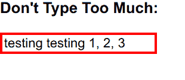

# 基于组件状态有条件地改变内联 CSS

> 原文：<https://www.freecodecamp.org/news/react-change-inline-css-conditionally-based-on-component-state/>

如果你对 freeCodeCamp 的[根据组件状态](https://www.freecodecamp.org/learn/front-end-libraries/react/change-inline-css-conditionally-based-on-component-state)挑战有条件地改变内联 CSS 有困难，你可能并不孤单。

在这个挑战中，您需要添加代码，根据 React 组件的状态有条件地更改一些内联 CSS。

当你第一次参加挑战时，你会看到下面的代码:

```
class GateKeeper extends React.Component {
  constructor(props) {
    super(props);
    this.state = {
      input: ''
    };
    this.handleChange = this.handleChange.bind(this);
  }
  handleChange(event) {
    this.setState({ input: event.target.value })
  }
  render() {
    let inputStyle = {
      border: '1px solid black'
    };
    // change code below this line

    // change code above this line
    return (
      <div>
        <h3>Don't Type Too Much:</h3>
        <input
          type="text"
          style={inputStyle}
          value={this.state.input}
          onChange={this.handleChange} />
      </div>
    );
  }
}; 
```

注意，内联样式对象`inputStyle`已经用一些默认样式声明了。

你在这个挑战中的目标是更新`inputStyle`，这样当输入中超过 15 个字符时，输入的边界就是`3px solid red`。注意，输入框中的文本以`input`的形式保存在组件状态中:

```
...
this.state = {
  input: ''
};
...
```

## 很接近，但不完全是

想象一下，在阅读了描述和说明之后，您会想到:

```
class GateKeeper extends React.Component {
  constructor(props) {
    super(props);
    this.state = {
      input: ''
    };
    this.handleChange = this.handleChange.bind(this);
  }
  handleChange(event) {
    this.setState({ input: event.target.value })
  }
  render() {
    let inputStyle = {
      border: '1px solid black'
    };
    // change code below this line
    const char = 15;
    if(this.state.input > char) {
      inputStyle = {
        border:'3px solid red'
      }
    }  
    // change code above this line
    return (
      <div>
        <h3>Don't Type Too Much:</h3>
        <input
          type="text"
          style={inputStyle}
          value={this.state.input}
          onChange={this.handleChange} />
      </div>
    );
  }
};
```

但是当你尝试提交这个的时候，它并没有通过所有的测试。让我们仔细看看这是怎么回事。

## 解决方法

### 使用`if`语句

声明`char`没问题，但是仔细看看`if`的条件:

```
if(this.state.input > char) {
  inputStyle = {
    border:'3px solid red'
  }
} 
```

记住`this.state.input`是输入框的值，是一个字符串。例如，它可以是“测试测试 1，2，3”。

如果在文本框中输入“测试测试 1、2、3 ”,并将批次`this.state.input`分配到控制台:

```
class GateKeeper extends React.Component {
  constructor(props) {
    super(props);
    this.state = {
      input: ''
    };
    this.handleChange = this.handleChange.bind(this);
  }
  handleChange(event) {
    this.setState({ input: event.target.value })
  }
  render() {
    let inputStyle = {
      border: '1px solid black'
    };
    // change code below this line
    const char = 15;
    console.log(this.state.input);
    if(this.state.input > char) {
      inputStyle = {
        border:'3px solid red'
      }
    }  
    // change code above this line
    return (
      <div>
        <h3>Don't Type Too Much:</h3>
        <input
          type="text"
          style={inputStyle}
          value={this.state.input}
          onChange={this.handleChange} />
      </div>
    );
  }
};
```

你会在控制台看到`testing testing 1, 2, 3`。

此外，如果您将`this.state.input > char`记录到控制台，您将会看到它评估为`false`:

```
class GateKeeper extends React.Component {
  constructor(props) {
    super(props);
    this.state = {
      input: ''
    };
    this.handleChange = this.handleChange.bind(this);
  }
  handleChange(event) {
    this.setState({ input: event.target.value })
  }
  render() {
    let inputStyle = {
      border: '1px solid black'
    };
    // change code below this line
    const char = 15;
    console.log(this.state.input > char);
    if(this.state.input > char) {
      inputStyle = {
        border:'3px solid red'
      }
    }  
    // change code above this line
    return (
      <div>
        <h3>Don't Type Too Much:</h3>
        <input
          type="text"
          style={inputStyle}
          value={this.state.input}
          onChange={this.handleChange} />
      </div>
    );
  }
};
```

简单来说，你不能把一个字符串(`this.state.input`)直接比作`char`，后者是一个数字。

相反，调用`this.state.input`上的`.length`来获得字符串的长度，并将其与`count`进行比较:

```
class GateKeeper extends React.Component {
  constructor(props) {
    super(props);
    this.state = {
      input: ''
    };
    this.handleChange = this.handleChange.bind(this);
  }
  handleChange(event) {
    this.setState({ input: event.target.value })
  }
  render() {
    let inputStyle = {
      border: '1px solid black'
    };
    // change code below this line
    const char = 15;
    if(this.state.input.length > char) {
      inputStyle = {
        border:'3px solid red'
      }
    }  
    // change code above this line
    return (
      <div>
        <h3>Don't Type Too Much:</h3>
        <input
          type="text"
          style={inputStyle}
          value={this.state.input}
          onChange={this.handleChange} />
      </div>
    );
  }
};
```

由于字符串“testing testing 1，2，3”的长度为 23 个字符(包括空格和逗号)，输入框的边框将变为红色:



### 使用三元运算符

一个[三元或条件操作符](https://developer.mozilla.org/en-US/docs/Web/JavaScript/Reference/Operators/Conditional_Operator)就像一行`if...else`语句，可以帮助显著缩短你的代码。

回到您的解决方案，删除除`char`变量之外的所有内容:

```
class GateKeeper extends React.Component {
  constructor(props) {
    super(props);
    this.state = {
      input: ''
    };
    this.handleChange = this.handleChange.bind(this);
  }
  handleChange(event) {
    this.setState({ input: event.target.value })
  }
  render() {
    let inputStyle = {
      border: '1px solid black'
    };
    // change code below this line

    // change code above this line
    return (
      <div>
        <h3>Don't Type Too Much:</h3>
        <input
          type="text"
          style={inputStyle}
          value={this.state.input}
          onChange={this.handleChange} />
      </div>
    );
  }
}; 
```

现在，将您在前面的`if`语句中使用的条件作为三元条件的第一部分:`this.state.input.length > char ?  :  ;`

`?`和`:`之间的一切表明如果前面的陈述为真会发生什么。你可以复制之前`if`语句中的代码:`this.state.input.length > char ? inputStyle = { border:'3px solid red' } :  ;`

现在你需要处理三元运算符的`else`部分，这是介于`:`和`;`之间的部分。

虽然您在第一个解决方案中没有使用`else`语句，但您实际上是按原样使用了`inputStyle`。所以只需使用前面代码中声明的`inputStyle`:`this.state.input.length > char ? inputStyle = { border:'3px solid red' } : inputStyle;`

您的整个解决方案应该是这样的:

```
class GateKeeper extends React.Component {
  constructor(props) {
    super(props);
    this.state = {
      input: ''
    };
    this.handleChange = this.handleChange.bind(this);
  }
  handleChange(event) {
    this.setState({ input: event.target.value })
  }
  render() {
    let inputStyle = {
      border: '1px solid black'
    };
    // change code below this line
    const char = 15;
    this.state.input.length > char ? inputStyle = { border:'3px solid red' } : inputStyle;
    // change code above this line
    return (
      <div>
        <h3>Don't Type Too Much:</h3>
        <input
          type="text"
          style={inputStyle}
          value={this.state.input}
          onChange={this.handleChange} />
      </div>
    );
  }
}; 
```

就是这样，你应该能够通过挑战！现在前进，有条件地让 React 组件符合您的心意。