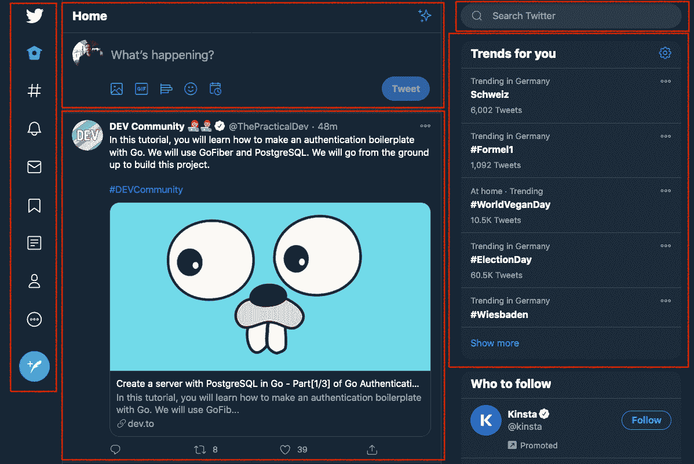

# React 功能组件、道具和 JSX–react . js 初学者教程

> 原文：<https://www.freecodecamp.org/news/react-components-jsx-props-for-beginners/>

React 是构建用户界面最流行的 JavaScript 库之一。

如果你想成为一名前端开发人员或者找一份 web 开发工作，深入学习 React 可能会让你受益匪浅。

在这篇文章中，你将学习 React 的一些基础知识，比如创建组件、JSX 语法和道具。如果你对 React 没有经验或者经验很少，这篇文章是为你准备的。

对于初学者来说，[下面是如何安装 React](https://www.freecodecamp.org/news/install-react-with-create-react-app/) 。

## 什么是 JSX？

安装第一个 React 项目后，您将意识到的第一件事是 JavaScript 函数会返回一些 HTML 代码:

```
function App() {
  return (
    <div className="App">
      <header className="App-header">
        
        <p>
          Edit <code>src/App.js</code> and save to reload.
        </p>
      </header>
    </div>
  );
}
```

这是 React 的一个特殊且有效的语法扩展，称为 JSX (JavaScript XML)。通常在前端相关的项目中，我们将 HTML、CSS 和 JavaScript 代码保存在单独的文件中。然而，在 React 中，这种方式有点不同。

在 React 项目中，我们不创建单独的 HTML 文件，因为 JSX 允许我们在同一个文件中编写 HTML 和 JavaScript，就像上面的例子一样。但是，您可以将 CSS 分离到另一个文件中。

一开始，JSX 可能看起来有点奇怪。不过别担心，你会习惯的。

JSX 非常实用，因为我们也可以通过使用花括号{ }，直接在 HTML 内部执行任何 JavaScript 代码(逻辑、函数、变量等等)，就像这样:

```
function App() {
  const text = 'Hello World';

  return (
    <div className="App">
      <p> {text} </p>
    </div>
  );
}
```

此外，您可以将 HTML 标签分配给 JavaScript 变量:

```
const message = <h1>React is cool!</h1>;
```

或者可以在 JavaScript 逻辑内部返回 HTML(比如 if-else 情况):

```
render() {
    if(true) {
        return <p>YES</p>;
    } else {
        return <p>NO</p>;
    }
}
```

我不会深入 JSX 的细节，但请确保您在写《JSX》时考虑以下规则:

*   HTML 和组件标签必须始终关闭< />
*   有些属性像 **"class"** 变成了 **"className"** (因为 class 指的是 JavaScript 类)， **"tabindex"** 变成了 **"tabIndex"** 应该写成 camelCase
*   我们不能一次返回多个 HTML 元素，所以请确保将它们包含在父标记中:

```
return (
  <div>
    <p>Hello</p>
    <p>World</p>
  </div>
);
```

*   或者，您可以用空标签将它们包装起来:

```
return (
  <>
    <p>Hello</p>
    <p>World</p>
  </>
);
```

你也可以观看我的 React 初学者教程以获得更多信息:

[https://www.youtube.com/embed/QJZ-xgt4SJo?feature=oembed](https://www.youtube.com/embed/QJZ-xgt4SJo?feature=oembed)

## 什么是功能和类别组件？

在习惯了 JSX 语法之后，接下来要理解的是 React 的基于组件的结构。

如果你重温这篇文章顶部的示例代码，你会看到 JSX 代码是由一个函数返回的。但是 App()函数不是一个普通的函数——它实际上是一个组件。那么什么是组件呢？

### 什么是组件？

组件是一个独立的、可重用的代码块，它将用户界面分成更小的部分。例如，如果我们用 React 构建 Twitter 的 UI:



The components of Twitter's News Feed

我们可以也应该将所有的部分(用红色标记的)分成更小的独立部分，而不是在一个文件下构建整个 UI。换句话说，这些是组件。

React 有两种类型的组件:功能性的和类。现在让我们更详细地看一看每一个。

### 功能组件

React 中第一个也是推荐的组件类型是功能组件。功能组件基本上是一个返回反应元素(JSX)的 JavaScript/ES6 函数。根据 React 的官方文档，以下功能是有效的功能组件:

```
function Welcome(props) {
  return <h1>Hello, {props.name}</h1>;
}
```

或者，您也可以使用箭头功能定义创建功能组件:

```
const Welcome = (props) => { 
  return <h1>Hello, {props.name}</h1>; 
}
```

> 这个函数是一个有效的 React 组件，因为它接受带有数据的单个“props”(代表属性)对象参数，并返回一个 React 元素。——[**reactjs.org**](https://reactjs.org/)

为了以后能够使用某个组件，您需要先将其导出，以便可以将其导入到其他地方:

```
function Welcome(props) {
  return <h1>Hello, {props.name}</h1>;
}

export default Welcome;
```

导入后，您可以像下面这样调用组件:

```
import Welcome from './Welcome';

function App() { 
  return (
    <div className="App">
      <Welcome />
    </div>
  );
}
```

所以反应中的一个功能成分:

*   是一个 JavaScript/ES6 函数
*   必须返回一个反应元素(JSX)
*   总是以大写字母开头(命名约定)
*   如果需要，将 props 作为参数

### 什么是类组件？

第二种类型的组件是类组件。类组件是返回 JSX 的 ES6 类。下面，您将看到我们相同的欢迎函数，这次是作为一个类组件:

```
class Welcome extends React.Component {
  render() {
    return <h1>Hello, {this.props.name}</h1>;
  }
}
```

与函数组件不同，类组件必须有一个额外的 render()方法来返回 JSX。

### 为什么要使用类组件？

我们以前用类组件是因为“状态”。在 React 的旧版本(版本< 16.8)中，不可能在功能组件中使用状态。

因此，我们只需要功能组件来呈现 UI，而我们会使用类组件来进行数据管理和一些额外的操作(比如生命周期方法)。

随着 React 钩子的引入，这种情况发生了变化，现在我们也可以在功能组件中使用状态。(我将在后面的文章中介绍状态和钩子，所以现在不要介意它们)。

一个类组件:

*   是一个 ES6 类，一旦它“扩展”了 React 组件，它将成为一个组件。
*   如果需要，接受道具(在构造函数中)
*   必须有一个 render( ) 方法用于返回 JSX

## React 里的道具是什么？

组件的另一个重要概念是它们如何通信。React 有一个称为 prop(代表 property)的特殊对象，我们用它将数据从一个组件传输到另一个组件。

但是要小心——props 仅单向传输数据(仅从父组件到子组件)。使用 props 无法将数据从子级传递到父级，或者传递到同一级别的组件。

我们再来重温一下上面的 App()函数，看看如何用道具传递数据。

首先，我们需要在 Welcome 组件上定义一个属性，并为其赋值:

```
import Welcome from './Welcome';

function App() { 
  return (
    <div className="App">
      <Welcome name="John"/>
      <Welcome name="Mary"/>
      <Welcome name="Alex"/>
    </div>
  );
}
```

道具是自定义值，它们也使组件更加动态。因为 Welcome 组件是这里的子组件，所以我们需要在它的父组件(App)上定义 props，这样我们就可以简单地通过访问 prop“name”来传递值并获得结果:

```
function Welcome(props) {
  return <h1>Hello, {props.name}</h1>;
}
```


### React 道具真的很有用

因此，React 开发人员使用 props 来传递数据，这对这项工作非常有用。但是管理数据呢？道具是用来传递数据的，不是用来操作数据的。我将在 freeCodeCamp 的未来文章中讨论用 React 管理数据。

与此同时，如果你想了解更多关于 React 和 Web 开发的知识，请随时[订阅我的 YouTube 频道](https://www.youtube.com/channel/UC1EgYPCvKCXFn8HlpoJwY3Q)。

感谢您的阅读！