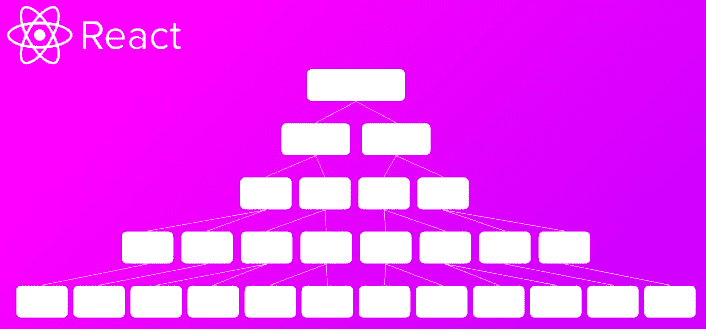
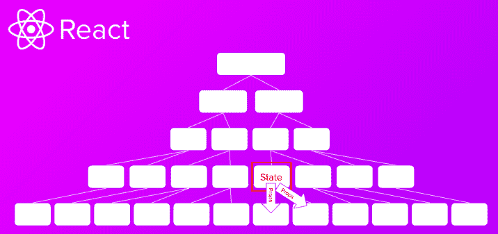
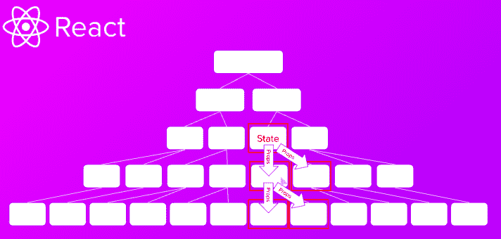
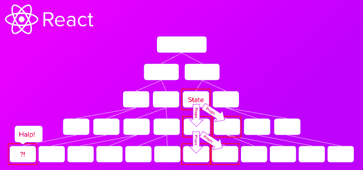
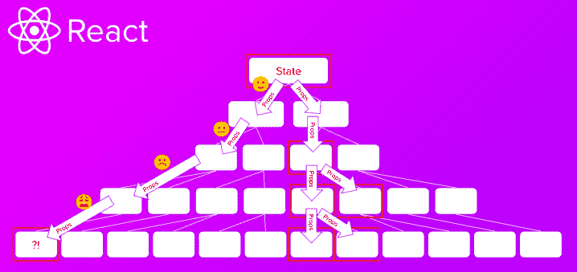
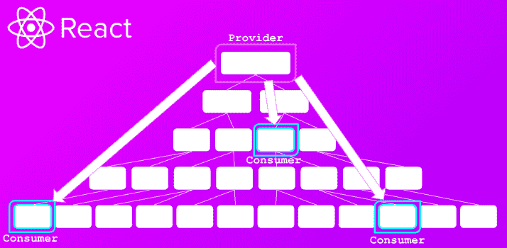
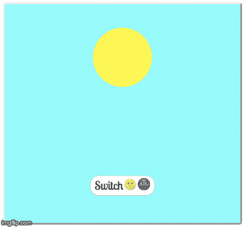

# 在 5 分钟内学会反应上下文——初学者教程

> 原文：<https://www.freecodecamp.org/news/react-context-in-5-minutes/>

React 的上下文 API 已经成为许多人选择的状态管理工具，经常完全取代 Redux。在这个 5 分钟的快速教程中，你将看到关于什么是上下文以及如何使用它的介绍！

如果你想对这个主题有一个适当的介绍，你可以加入我的[即将到来的高级 React 课程](https://scrimba.com/g/greact?utm_source=freecodecamp.org&utm_medium=referral&utm_campaign=context_article)的等候名单，或者如果你仍然是一个初学者，请查看我在 React 上的[免费介绍课程。](https://scrimba.com/g/glearnreact?utm_source=freecodecamp.org&utm_medium=referral&utm_campaign=context_article)

考虑这个树，其中底部的方框代表单独的组件:



我们可以很容易地将状态添加到底层组件，但是到目前为止，将数据传递到组件的兄弟组件的唯一方法是将状态移动到更高的组件，然后通过 props 将其传递回兄弟组件。



如果我们后来发现状态为的组件的兄弟组件也需要数据，我们必须再次提升状态，并将其向下传递:



虽然这种解决方案确实有效，但是如果不同分支上的组件需要数据，问题就出现了:



在这种情况下，我们需要将状态从应用程序的顶层通过所有中间组件传递给底层需要数据的组件，即使中间级别并不需要它。这个繁琐耗时的过程被称为*支柱钻孔*。



这就是上下文 API 的用武之地。它提供了一种通过提供者-消费者对在组件树中传递数据的方式，而不必通过每一层向下传递道具。可以把它想象成玩数据捕捉游戏的组件——中间组件甚至可能“不知道”正在发生什么:



为了证明这一点，我们将创建这个时髦的(和超级有用的)日夜转换图像。

[](https://imgflip.com/gif/3evdww)

如果你想看完整的代码，一定要看看这篇文章的 Scrimba 操场。

# 创建上下文

首先，我们创建一个新的上下文。因为我们希望整个应用程序都可以访问它，所以我们转到`index.js`并将应用程序包装在`ThemeContext.Provider`中。

我们还将`value` prop 传递给我们的提供者。它保存了我们想要保存的数据。现在，我们只是硬编码在`'Day'`中。

```
import React from "react";
import ReactDOM from "react-dom";
import ThemeContext from "./themeContext";

import App from "./App";

ReactDOM.render(
  <ThemeContext.Provider value={"Day"}>
    <App />
  </ThemeContext.Provider>,
  document.getElementById("root")
); 
```

# 使用 contextType 的上下文

目前，在`App.js`中，我们只是简单地返回了`<Image />`组件。

```
import React from "react";
import Image from "./Image";

class App extends React.Component {
  render() {
    return (
      <div className="app">
        <Image />
      </div>
    );
  }
}

export default App; 
```

我们的目标是使用上下文将`Image.js`中的类名从`Day`切换到`Night`，这取决于我们想要呈现的图像。为此，我们向名为`ContextType`的组件添加一个静态属性，然后使用字符串插值将其添加到`<Image />`组件的类名中。

现在，类名包含了来自`value`属性的字符串。**注意:**我已经把`ThemeContext`移到了它自己的文件中以防止一个 bug。

```
import React from "react";
import Button from "./Button";
import ThemeContext from "./themeContext";

class Image extends React.Component {
  render() {
    const theme = this.context;
    return (
      <div className={`${theme}-image image`}>
        <div className={`${theme}-ball ball`} />
        <Button />
      </div>
    );
  }
}

Image.contextType = ThemeContext;

export default Image; 
```

# 语境。消费者

不幸的是，这种方法只适用于基于类的组件。如果你已经了解了 React 中的[钩子，你就会知道如今我们可以用功能组件做任何事情。因此，为了更好地衡量，我们应该将我们的组件转换成功能组件，然后使用`ThemeContext.Consumer`组件通过应用程序传递信息。](https://www.freecodecamp.org/news/react-hooks-in-5-minutes/)

这是通过将我们的元素包装在一个`<ThemeContext.Consumer>`实例中并在其中(`children`所在的位置)，提供一个返回元素的函数来实现的。这使用了“render prop”模式，其中我们提供了一个常规函数作为子函数，返回一些 JSX 进行渲染。

```
import React from "react";
import Button from "./Button";
import ThemeContext from "./themeContext";

function Image(props) {
  // We don't need this anymore
  // const theme = this.context

  return (
    <ThemeContext.Consumer>
      {theme => (
        <div className={`${theme}-image image`}>
          <div className={`${theme}-ball ball`} />
          <Button />
        </div>
      )}
    </ThemeContext.Consumer>
  );
}

// We don't need this anymore
// Image.contextType = ThemeContext;

export default Image; 
```

**注意:**我们还需要将`<Button />`组件包装在`<ThemeContext.Consumer>`中——这允许我们稍后向按钮添加功能。

```
import React from "react";
import ThemeContext from "./themeContext";

function Button(props) {
  return (
    <ThemeContext.Consumer>
      {context => (
        <button className="button">
          Switch
          <span role="img" aria-label="sun">
            ?
          </span>
          <span role="img" aria-label="moon">
            ?
          </span>
        </button>
      )}
    </ThemeContext.Consumer>
  );
}

export default Button; 
```

# 提取上下文提供程序

我们目前正在通过提供者向下传递一个硬编码的值，但是，我们的目标是用我们的按钮在白天和黑夜之间切换。

这需要将我们的提供者移动到一个单独的文件中，并将其放入自己的组件中，在本例中，这个组件称为`ThemeContextProvider`。

```
import React, { Component } from "react";
const { Provider, Consumer } = React.createContext();

class ThemeContextProvider extends Component {
  render() {
    return <Provider value={"Day"}>{this.props.children}</Provider>;
  }
}

export { ThemeContextProvider, Consumer as ThemeContextConsumer }; 
```

**注意:**value 属性现在在新文件 ThemeContext.js 中处理，因此应该从 index.js 中删除。

**改变上下文**
为了连接按钮，我们首先向`ThemeContextProvider`添加状态:

```
import React, { Component } from "react";
const { Provider, Consumer } = React.createContext();

// Note: You could also use hooks to provide state and convert this into a functional component.
class ThemeContextProvider extends Component {
  state = {
    theme: "Day"
  };
  render() {
    return <Provider value={"Day"}>{this.props.children}</Provider>;
  }
}

export { ThemeContextProvider, Consumer as ThemeContextConsumer }; 
```

接下来，我们添加一个在白天和夜晚之间切换的方法:

```
toggleTheme = () => {
  this.setState(prevState => {
    return {
      theme: prevState.theme === "Day" ? "Night" : "Day"
    };
  });
}; 
```

现在我们将我们的`value`属性更改为`this.state.theme`,以便它从 state 返回信息。

```
 render() {
    return <Provider value={this.state.theme}>{this.props.children}</Provider>;
  }
} 
```

接下来，我们将`value`更改为包含`{theme: this.state.theme, toggleTheme: this.toggleTheme}`的对象，并更新我们使用单个值在对象中查找`theme`的所有地方。这意味着每一个`theme`都变成了`context`，并且每一个引用`theme`作为值都变成了`context.theme`。

最后，我们告诉按钮监听`onClick`事件，然后触发`context.toggleTheme`——这更新了使用来自提供者的状态的消费者。该按钮的代码如下所示:

```
import React from "react";
import { ThemeContextConsumer } from "./themeContext";

function Button(props) {
  return (
    <ThemeContextConsumer>
      {context => (
        <button onClick={context.toggleTheme} className="button">
          Switch
          <span role="img" aria-label="sun">
            ?
          </span>
          <span role="img" aria-label="moon">
            ?
          </span>
        </button>
      )}
    </ThemeContextConsumer>
  );
}

export default Button; 
```

我们的按钮现在只需一次点击就可以在白天和黑夜之间切换图像！

[](https://imgflip.com/gif/3evdww)

# 上下文警告

像代码中所有好的东西一样，使用上下文也有一些注意事项:

*   不要使用上下文来避免只深入一两层。上下文对于管理大部分应用程序所需的状态非常有用。然而，如果你只是将信息向下传递几层的话，prop drilling 会更快。

*   避免使用上下文来保存应该保存在本地的状态。例如，如果你需要保存用户的表单输入，使用本地状态而不是上下文。

*   始终将提供者放在树中尽可能低的公共父节点周围——而不是应用程序的最高层组件。无需矫枉过正。

*   最后，如果你传递一个对象作为你的值属性，监控性能并根据需要重构。除非性能明显下降，否则可能不需要这样做。

# 包裹

这个例子非常简单，在应用程序中放置状态并通过 props 传递可能更容易。然而，它有望展示拥有消费者的力量，消费者可以独立于树中位于他们之上的组件来访问数据。

要了解更多关于 React 上下文和 React 的其他强大功能，您可以加入我的[即将到来的高级 React 课程的等候名单。或者如果你正在寻找一个更友好的初学者，你可以看看我在 React 上的免费介绍课程](https://scrimba.com/g/greact?utm_source=freecodecamp.org&utm_medium=referral&utm_campaign=context_article)[。](https://scrimba.com/g/greact?utm_source=freecodecamp.org&utm_medium=referral&utm_campaign=context_article)

快乐编码:)