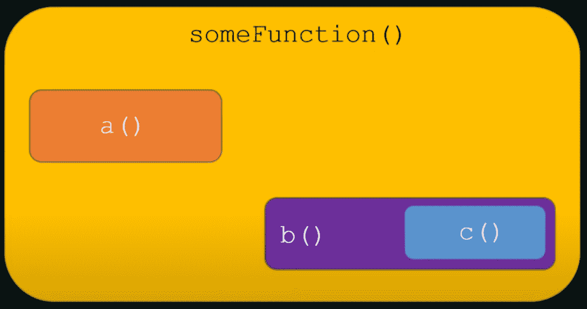
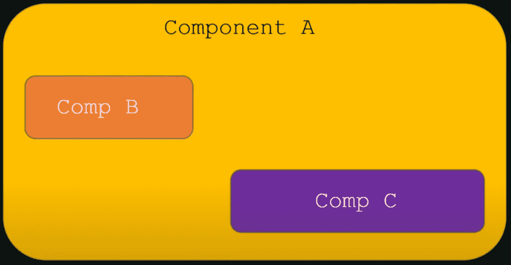
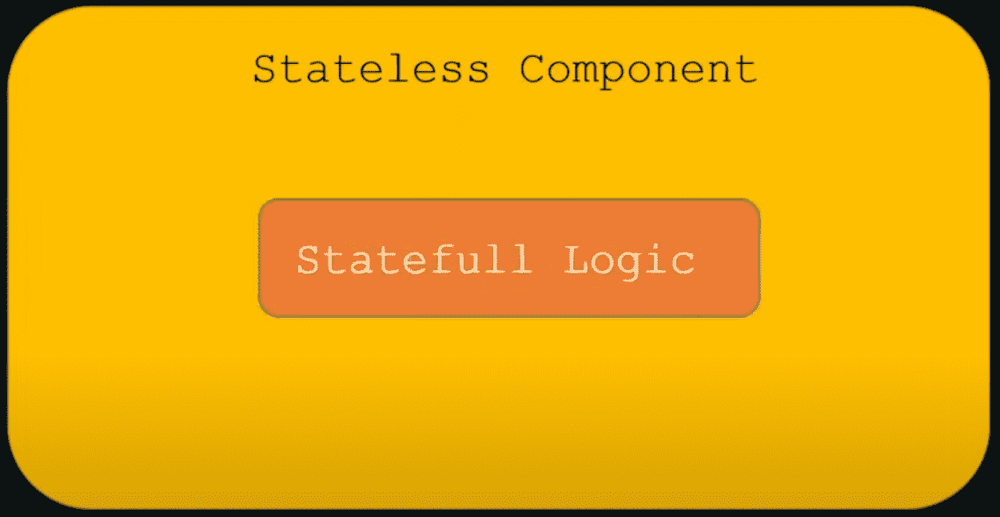
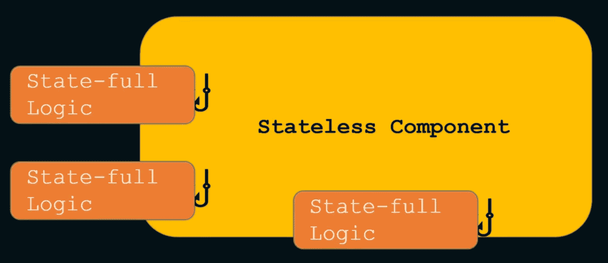
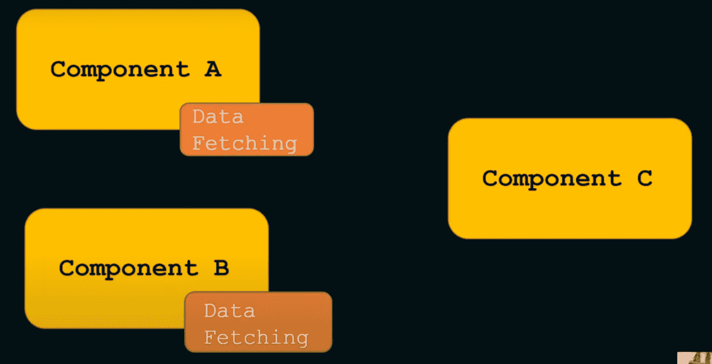

# React Hooks 初学者基础

> 原文：<https://www.freecodecamp.org/news/react-hooks-fundamentals/>

React.js 是一个开源的基于 JavaScript 的用户界面库。它在 web 和移动应用程序开发中非常受欢迎。

React 遵循`component-based`架构的原则。React 中的`component`是一段隔离的可重用代码。组件可以有两种类型——类组件和功能组件。

在 React 16.8 版本之前，开发人员只能使用类组件来处理状态和其他 React 功能。但是到了 16.8 版本，React 引入了一个叫做`Hooks`的新模式。

有了 React 钩子，我们可以在功能组件中使用状态和其他 React 特性。它使开发人员能够在 React 中进行函数式编程。

在本文中，我们将学习`React Hooks`的基本原理。写这篇文章的动机是鼓励初学者认为“React 钩子容易学习、创建和使用”。是的，只要你从根本上理解它们，确实如此。

如果您也喜欢从视频内容中学习，本文也可以作为视频教程在此处获得:🙂

[https://www.youtube.com/embed/CvNvRaS3u60?feature=oembed](https://www.youtube.com/embed/CvNvRaS3u60?feature=oembed)

## 在你学习钩子之前...

在你想到钩子之前，先想想普通的(又名香草)。

在 JavaScript 编程语言中，函数是执行重复任务的可重用代码逻辑。函数是可组合的。这意味着您可以在另一个函数中调用一个函数，并使用它的输出。

在下图中，`someFunction()`函数由`a()`和`b()`函数组成。`b()`功能使用了`c()`功能。



Function Composability

如果我们用代码来写，它会是这样的:

```
function a() {
    // some code
}

function c() {
    // some code
}

function b() {
    // some code

    c();

    // some code
}

function someFunction() {
    // some code

	a();
    b();

    // some code
}
```

React 中的功能组件只是普通的旧 JavaScript 函数，这不是什么秘密！因此，如果函数具有可组合性，那么 React 组件也可以具有可组合性。这意味着我们可以将一个或多个组件组合成另一个组件，如下图所示:



Components Composability

## 有状态组件与无状态组件

React 中的组件可以是有状态的，也可以是无状态的。

*   有状态组件声明并管理其中的本地状态。
*   无状态组件是一个不需要管理本地状态和副作用的纯函数。

一个[纯函数](https://blog.greenroots.info/what-are-pure-functions-and-side-effects-in-javascript)是一个没有任何副作用的函数。这意味着一个函数总是为相同的输入返回相同的输出。

如果我们从一个功能组件中去掉有状态和副作用的逻辑，我们就有了一个无状态的组件。此外，有状态和副作用逻辑可以在应用程序的其他地方重用。因此，尽可能将它们与组件隔离是有意义的。



Stateful Component as the component has Stateful Logic

## React 挂钩和有状态逻辑

使用 React 钩子，我们可以将有状态逻辑和副作用从功能组件中分离出来。钩子是 JavaScript 函数，它通过将状态与组件隔离来管理状态的行为和副作用。

因此，我们现在可以隔离钩子中的所有有状态逻辑，并将其用于(组合它们，因为钩子也是函数)组件中。



Isolated Stateful Logic into Hooks

问题是，这个有状态逻辑是什么？它可以是任何需要在本地声明和管理状态变量的东西。

例如，获取数据和管理局部变量中的数据的逻辑是有状态的。我们可能还想在多个组件中重用获取逻辑。



## 那么，React 钩子到底是什么？

那么，我们如何用简单的英语来定义 React 钩子呢？现在我们已经理解了函数、可组合性、组件、状态和副作用，下面是 React 挂钩的定义:

> React 挂钩是简单的 JavaScript 函数，我们可以用它将可重用部分与功能组件隔离开来。钩子可以是有状态的，并且可以管理副作用。

React 提供了一系列标准的内置挂钩:

*   `useState`:管理状态。返回一个有状态值和一个更新函数来更新它。
*   管理副作用，比如 API 调用、订阅、定时器、突变等等。
*   `useContext`:返回上下文的当前值。
*   `useReducer`:帮助复杂状态管理的一种`useState`替代方案。
*   `useCallback`:返回一个回调的记忆版本，帮助子组件避免不必要的重新渲染。
*   `useMemo`:它返回一个有助于性能优化的记忆值。
*   `useRef`:返回一个带有`.current`属性的 ref 对象。ref 对象是可变的。它主要用于强制访问子组件。
*   它在所有 DOM 突变结束时触发。最好在这个上面尽可能多地使用`useEffect`，因为`useLayoutEffect`会同步开火。
*   `useDebugValue`:帮助在 React DevTools 中显示定制钩子的标签。

你可以从这里了解更多关于这些钩子的细节[。请注意，这些钩子名称都是以`use`开头的。是的，这是在 React 代码库中快速识别钩子的标准做法。](https://reactjs.org/docs/hooks-reference.html)

我们还可以为我们独特的用例创建定制挂钩，比如数据获取、磁盘日志、定时器等等。

所以下一次，如果你在代码库中遇到 React 钩子或者被要求写一个，放轻松点。它只是另一个处理功能组件之外的状态和副作用的 JavaScript 函数。

如果你正在寻找一个设计和创建定制钩子的分步指南，你可能会发现[这篇文章很有帮助](https://blog.greenroots.info/how-to-create-a-countdown-timer-using-react-hooks)。

## 在结束之前...

我希望 React Hooks 的介绍对您有所帮助。在 React 上呆了很多年后，我在 YouTube 上制作了一个视频系列,旨在涵盖 React 的方方面面。如果你觉得有帮助，请[订阅](https://www.youtube.com/tapasadhikary?sub_confirmation=1)。

我们来连线。我也在这些平台上分享我在 JavaScript、Web 开发和博客方面的学习:

*   [在 Twitter 上关注我](https://twitter.com/tapasadhikary)
*   [GitHub 上的侧项目](https://github.com/atapas)
*   [做出反应。Showwcase 上的 JS 社区](https://www.showwcase.com/community/react.js)

我的下一篇文章再见。在那之前，请照顾好自己，保持快乐。