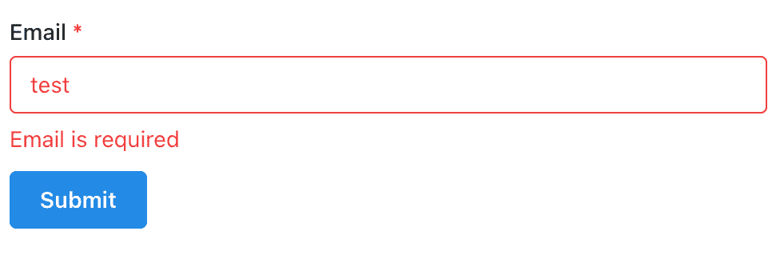

# 你下一个项目需要的 3 个 React 挂钩

> 原文：<https://www.freecodecamp.org/news/react-hooks-your-next-project-needs/>

这里有三个自定义挂钩，它们将在一行代码中为您的 React 项目添加必要的功能。

React 钩子非常强大，因为它们能够为我们提供独立于组件的可重用的有状态特性。

我已经列出了三个定制的 React 钩子，几乎可以在你做的每个项目中使用。

## 1.使用提取挂钩

实际上，在您创建的每个应用程序中，您都将从外部 API 获取数据。

标准方法是在`useEffect`中进行 API 调用，并使用浏览器内置的 fetch API 来执行它。

```
function BlogPosts() {
  const [data, setData] = useState([]);

  useEffect(() => {
    fetch("http://jsonplaceholder.typicode.com/posts")
      .then((response) => response.json())
      .then((data) => setData(data));
  }, []);
}
```

这段代码不仅仅是执行 GET 请求、将其转换为 JSON 并设置为 state 的样板文件，而且是不可重用的。

如果想要重用它，还需要在该组件中声明 useState 和 useEffect。

最后，我们的代码不处理任何错误或加载状态，这在运行时在 React 客户机中获取数据时是必要的。

幸运的是，`useFetch`钩子是一个更好的抽象，它在一行代码中解决了所有这些问题。

我们必须添加的唯一额外代码是一些处理加载和错误状态的条件:

```
import useFetch from "react-fetch-hook";

function BlogPosts() {
  const { isLoading, error, data } = useFetch('http://jsonplaceholder.typicode.com/posts');

  if (isLoading) return <div>Loading...</div>;
  if (error) return <div>Error! {error.status}</div>;

  // return data here...
} 
```

您会得到相同的结果，但是代码更少，增加了错误处理和更好的用户体验(如果您使用一个好的加载微调器)。

您可以通过运行以下命令来安装`useFetch`:

```
npm install react-fetch-hook 
```

如果你想要一个更高级的第三方钩子来做你的数据抓取(它可以负责抓取和缓存你的查询),看看 SWR 和 React Query。

## 2.使用表单挂钩

在 React 中编写表单可能是一件痛苦的事情，因为它是重复的，并且通常需要大量代码来添加验证等常见功能。

这是 React 中一个非常基本的表单，我们有一个电子邮件输入，并用`handleSubmit`处理表单提交。

```
import isEmail from "validator/lib/isEmail";

function EmailForm() {
  function handleSubmit(event) {
    event.preventDefault();
    const email = event.target.elements.email.value;
    if (isEmail(email)) {
      console.log("form submitted: ", email);
    }
  }

  return (
    <form onSubmit={handleSubmit}>
      <label htmlFor="email">Email Address</label>
      <input id="email" type="email" required />
      <button type="submit">Submit</button>
    </form>
  );
}
```

但是请注意，我们有一些更强制性的代码，我们必须使用`event.preventDefault()`告诉页面不要重新加载，从目标元素(表单本身)上的`elements`对象获取电子邮件值，然后使用库`validator`验证电子邮件。

是的，我们正在验证输入的电子邮件值，但是如果有验证错误，我们需要告诉用户。

使用来自`@mantine/hooks`的钩子`useForm`给了我们一个定制的、可重用的钩子来管理我们所有的表单状态，并容易地显示我们的用户错误。

```
import { TextInput, Button } from "@mantine/core";
import { useForm } from "@mantine/hooks";
import isEmail from "validator/lib/isEmail";

export default function EmailForm() {
  const form = useForm({
    initialValues: { email: "" },
    errorMessages: { email: "Email is required" },
    validationRules: {
      email: (value) => isEmail(value),
    },
  });

  function handleSubmit(values) {
    console.log("form submitted: ", values);
  }

  return (
    <form onSubmit={form.onSubmit(handleSubmit)}>
      <TextInput
        required
        label="Email"
        placeholder="Email Address"
        {...form.getInputProps("email")}
      />
      <Button style={{ marginTop: 10 }} type="submit">
        Submit
      </Button>
    </form>
  );
}
```

只需调用`useForm`钩子并指定每个字段的错误消息和验证，`form`值通过`getInputProps`和`onSubmit`之类的帮助函数为我们提供表单中所需的所有功能。

现在，当用户没有提供有效的电子邮件时，我们的表单状态是这样的:



> 请注意，在许多情况下，HTML 输入只需添加`required`属性，就可以提供电子邮件等常见值所需的所有验证。

您可以通过运行以下命令来安装`useForm`:

```
npm install @mantine/hooks 
```

## 3.使用本地存储挂钩

在 React 应用中，能够在浏览器中本地存储用户状态是很有帮助的。

如果我们有一个像 YouTube 这样的视频流应用程序，我们可以将用户的视频偏好(例如自动播放的打开或关闭)或他们的视频进度保存在他们浏览器的本地存储中。

然而，使用本地存储的困难在于，所有的 JavaScript 数据类型都必须转换成普通的字符串。

我们经常用`JSON.stringify`来做这件事。但是，如果我们想从本地存储中取出项目并使用数据，就必须将其转换回原始数据类型。我们使用`JSON.parse`来实现。

这可能非常棘手，特别是如果我们正在构建一个像 Next.js 这样的服务器渲染的 React 应用程序，它不能总是访问浏览器，因此不能访问像本地存储这样的窗口 API。

我们能做什么？

一个非常有用的钩子来自`@mantine/hooks`，叫做`useLocalStorageValue`。

让我们想象一下，我们正在创建一个为用户的视频存储自动播放设置的开关，可以设置为“开”或“关”。

我们需要为`useLocalStorageValue`提供的只是我们希望在本地存储中为其赋值的键及其默认值。

它就像`useState`一样工作，给我们一个状态变量和一个 setter 函数来更新。

```
import { useLocalStorageValue } from "@mantine/hooks";

export default function ToggleAutoplay() {
  const [autoplay, setAutoplay] = useLocalStorageValue({
    key: "autoplay",
    defaultValue: "on",
  });

  function toggleAutoplay() {
    setAutoplay((current) => (current === "on" ? "off" : "on"));
  }

  return (
    <button
      onClick={toggleAutoplay}
      style={{ backgroundColor: autoplay === "on" ? "green" : "red" }}
    >
      Autoplay {autoplay === "on" ? "On" : "Off"}
    </button>
  );
}
```

在我们的例子中，点击按钮将自动播放切换到相反的值，如果“开”，背景色变为绿色，否则变为红色。

但最重要的是，该值保存在我们用户的浏览器中，所以当他们刷新时，他们最近保存的选择会被记住。

您可以通过运行以下命令来安装`useLocalStorageValue`:

```
npm install @mantine/hooks 
```

## 想真正学习 React？

如果你喜欢这篇文章，并且正在寻找学习 React 的终极资源，请查看 React 训练营 。

它将为您提供所需的所有培训:

*   每天只需 30 分钟，就能从完全的初学者变成专业的反应者
*   从零开始到部署，构建 4 个全栈 React 项目
*   了解构建您喜欢的任何应用程序的强大技术堆栈

[](https://reactbootcamp.com) 
*点击加入 React 训练营*